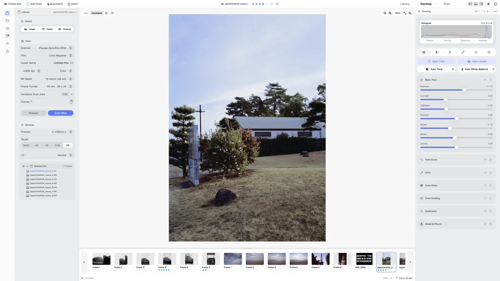
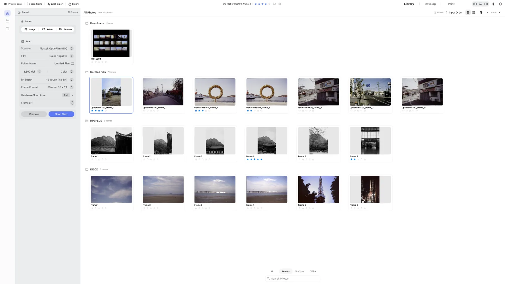
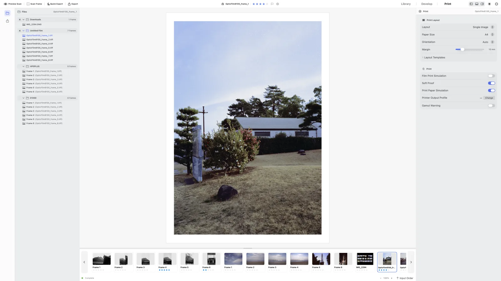

  

<h1 align="center">negaflow</h1>

From film to finished photograph. Runs natively on macOS and Windows.

  
  
  
  
  

  <strong>English</strong> ·
  <a href="README_ko.md">한국어</a> ·
  <a href="README_ja.md">日本語</a> ·
  <a href="README_zh-Hans.md">简体中文</a> ·
  <a href="README_fr.md">Français</a> ·
  <a href="README_de.md">Deutsch</a>

  <a href="https://habinsong.github.io/negaflow-site/">Website</a> ·
  <a href="https://habinsong.github.io/negaflow-site/camera-scanning/">Camera scanning guide</a> ·
  <a href="https://habinsong.github.io/negaflow-site/faq/">FAQ</a>

---

  <picture>
    <source media="(prefers-color-scheme: dark)" srcset="docs/images/en/develop-dark.webp">
    
  </picture>

**negaflow** is an app that takes in film you scanned or copied with a camera and develops it. Color or black and white, negative or positive, all of it works. From the library through developing to printing, it all finishes inside one app. Edit values are stored separately from the original, so the original file stays as it is.

The develop engine is called **Chroma Engine**, and dust and scratch repair is called **GrainMend**. It's fine if you don't have a scanner. Import image files and you can still develop and export. Scanner connection only opens up once you install a separate plugin.

> Unlike the way the analog revival keeps growing, the analog photography process itself is at a standstill. Unless you print it the analog way, film has to go through a conversion into digital before it finally reaches our eyes.
>
> But that whole process is grinding to a halt. Film labs and processing shops keep disappearing, and support from manufacturers and for their products keeps shrinking.
>
> This project started from the inconveniences I felt working this way and that, and from thinking it would be nice if such a feature existed. Building on what I learned and came to know while using 35mm and medium format film, I developed every last bit of it myself. At first it was a toy project I made things on while using it alone, but by now negaflow has become something more than that.
>
> In the end, what matters most is that it works well, that it's comfortable to use, that it has to be fast, and that it produces results made properly on its own. Independently developed, **negaflow** runs natively on both macOS and Windows, and I folded in the workflows of film labs and of individuals alike.
>
>
> **Celebrating this summer, the bicentennial of Niépce's first-ever photograph.** 25 July 2026.
## negaflow for macOS and Windows

| | macOS | Windows |
|---|---|---|
| Interface | SwiftUI | WinUI 3 |
| Engine | Swift + Core Image | C++ + Direct3D |
| Color management | ColorSync | Windows ICM |

The two apps are native apps developed in different languages and in different ways, and even so the features and the results are the same.

The engine code lives in the `Chromabase` module on macOS and the `Native` module on Windows.

There is a way to build both at once (cross-platform), but doing that makes both of them slow and they don't work properly. So I wrote the code again from scratch, in the way that is native to each OS. What is the same and what is not is written [here](docs/platform/PLATFORM_DIFFERENCES.md).

## Download

Get it from [GitHub Releases](https://github.com/habinsong/negaflow/releases).

| File | Runs on |
|---|---|
| `negaflow-1.1.2-mac-universal.pkg` | macOS 14 or later, Apple Silicon and Intel |
| `negaflow-1.1.2-mac-arm64.pkg` | macOS 14 or later, Apple Silicon only |
| `negaflow-1.1.1-win-x64.exe` | Windows 11 24H2 or later, x64 |

Most Macs are fine with the Universal PKG. Of course, the Silicon build and a DMG and a ZIP are up on the same page too. On the first launch you have to open System Settings, go to Privacy and Security, and click Open Anyway once.

The Windows install finishes inside your user folder and never asks for administrator rights. It isn't signed, so SmartScreen blocks it once. Click More info, then run it. You can uninstall it from Control Panel.

Attaching a real scanner needs a separate plugin, and for SANE scanners there is [`negaflow-scanner-sane`](https://github.com/habinsong/negaflow-scanner-sane). Naturally, it works on both macOS and Windows.

## Features
> Everything for turning analog film into a finished photograph is in here.
- Starting from measuring the film base and developing color and black-and-white negatives and positives
- Everything adjustment needs, such as exposure, contrast, curves, HSL, and color grading
- Extra options like sharpening, noise reduction, grain, vignette, and halation
- GrainMend, which restores photos by removing dust and scratches.
- A library with rolls, folders, collections, ratings, stacks, virtual copies, and search by camera, lens, or film
- Presets and copy-paste that carry the develop process, target, tone, color, detail, crop, and orientation together
- JPEG and 16-bit TIFF export, ICC profiles, and records such as camera, lens, and film saved into EXIF
- Seven print layouts, paper previews, photo and ISO paper sizes, and C-print features on top of that.

## Chroma Engine

**Chroma Engine** takes on film inversion and development.

Before developing a negative it measures the film base first. It reads the value from an area the light never once reached. Where the automatic measurement is off, use the eyedropper or adjust the RGB values.

The default is `MAIN` with manual adjustments. Auto tone, auto white balance, auto levels, and auto color only run when you press them.

The rest of the targets are these. `PRINT` for output through a printer ICC profile, `HS` and `SP` in the minilab family, `F135` and `HR` in the lab-equipment family, and `EXPIRED` for bringing back old film. For output you can pick sRGB, Display P3, Adobe RGB, or an RGB ICC profile of your own.

The order of inversion and color processing is in the [Chroma Engine doc](docs/product/CHROMA_ENGINE.md).

## GrainMend

> **GrainMend** repairs dust, pinholes, scratches, and emulsion damage.

**GrainMend RGB** is a software approach, so it differs from hardware IR.    
`Auto` sweeps the whole photo. Simple, but there will be false detections.  
`Guided` looks only inside the area you mark. It works best on dust picked up during scanning.  
`Brush` is the tool for painting over spots Auto missed, and clone stamp copies pixels from a position you choose. 
`Clone stamp` is a stamping feature where you pick the texture you want and paint it on yourself.  

Auto and Guided fill defects by looking at the surrounding texture. Before filling, they look at direction and the surrounding structure first. Mistake a railing or a tile joint in the photo for a scratch and erase it, and that is damage rather than repair.

Edits stay as layers. You can change the strength, check the mask, and switch each one off or delete it. 
**GrainMend IR** adds detection results from the infrared channel a scanner plugin hands over into the same record.

**GrainMend IR** uses the scanner's infrared channel (IR), but it is neither an implementation of nor a compatibility mode for Digital ICE, iSRD, or SRDx. How it works and the quality and performance standards are in the [GrainMend doc](docs/product/GRAINMEND.md).

## From import to print

1. Import image files, or scan with an installed plugin.
2. Choose the develop process and set the scan target.
3. Adjust color and tone in Chroma Engine.
4. Apply GrainMend to the photos that need it.
5. Check with the before-and-after view and the histogram, then print or export.

Importing alone does not develop anything. It starts when you pick a process and target for a folder and press **Apply**, or when you enter the Develop view. There is a separate setting to make it automatic, and the default is off.

What each action does to your original files is laid out as a table in [From library to print](docs/product/WORKFLOW.md).

  <picture>
    <source media="(prefers-color-scheme: dark)" srcset="docs/images/en/library-dark.webp">
    
  </picture>

  <picture>
    <source media="(prefers-color-scheme: dark)" srcset="docs/images/en/print-dark.webp">
    
  </picture>

## Scanners and film profiles

negaflow itself does not open features off a scanner model name.  It only uses the resolution, bit depth, scan area, exposure, and IR support the plugin reports. Guess from the name and features the device does not have get switched on.

SANE devices are handled by [`negaflow-scanner-sane`](https://github.com/habinsong/negaflow-scanner-sane), a separate GPL project. The plugin runs as its own process and the exchange format is JSON. **negaflow** contains no SANE code and links none.

The bundle ships 15 scanner profiles. They were built from film I shot myself, and the number of recorded data points is 928.

All of them are `realOnly`. It means they were built from real scans, but they have not reached the stage of having their accuracy verified against an independent reference. I did not want to write up something unverified as verified. Profiles do not attach automatically from a scanner name, so you have to pick them yourself.

The details are in [the film profiles doc](docs/product/FILM_PROFILES.md).

## Documentation

- [Chroma Engine](docs/product/CHROMA_ENGINE.md) | film base, inversion, color processing and develop order
- [GrainMend](docs/product/GRAINMEND.md) | defect detection and repair, IR, edit history
- [Film profiles](docs/product/FILM_PROFILES.md) | source material analysis and profile generation
- [From library to print](docs/product/WORKFLOW.md) | import, folder sync, batch develop, print
- [Product architecture](docs/architecture/PRODUCT_ARCHITECTURE.md) | app, engine, storage and export structure
- [All documentation](docs/README.md) | six languages

## Building

The tools and commands differ per platform. The full procedure is in each doc. [macOS](negaflow-mac/docs/README.md) needs macOS 14 or later and Xcode 26, [Windows](negaflow-windows/docs/README.md) needs Windows 11 24H2, Visual Studio 2022, and the .NET 10 SDK. The working rules for the repository are in [`CONTRIBUTING.md`](CONTRIBUTING.md).

## License

**negaflow** is released under the [Apache License 2.0](LICENSE). It is not affiliated with or sponsored by Kodak, Fujifilm, Noritsu, LaserSoft Imaging, or any other trademark holder. Product names are used only to point to what something is compatible with or measured against. The [trademark notice](TRADEMARKS.md) has the detail.
