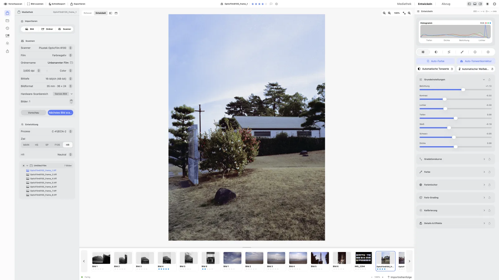
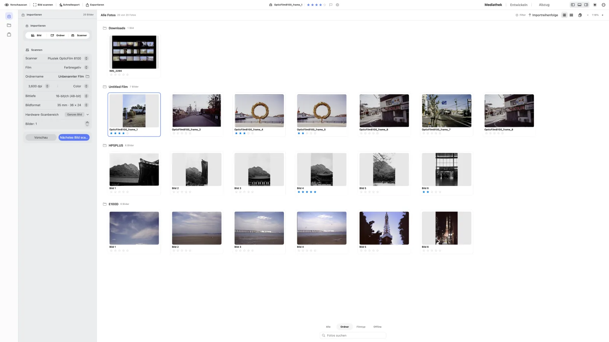
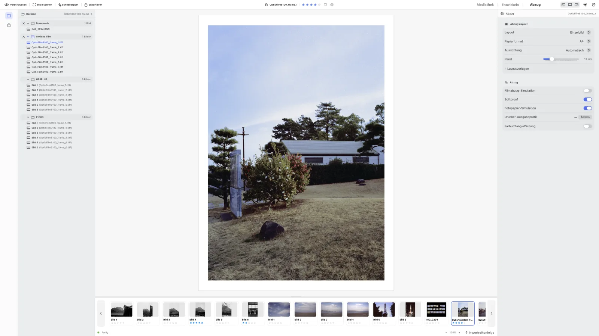

<p align="center">
  
</p>

<h1 align="center">negaflow</h1>

<p align="center">Eine macOS-App für den gesamten Scan- und Entwicklungsprozess analoger Filme</p>

<p align="center">
  <a href="https://habinsong.github.io/negaflow-site/de/"></a>
  <a href="docs/de/product/PROJECT_STATUS.md"></a>
  <a href="#voraussetzungen"></a>
  <a href="negaflow-mac/Package.swift"></a>
  <a href="LICENSE"></a>
</p>

<p align="center">
  <a href="README.md">English</a> ·
  <a href="README_ko.md">한국어</a> ·
  <a href="README_ja.md">日本語</a> ·
  <a href="README_zh-Hans.md">简体中文</a> ·
  <a href="README_fr.md">Français</a> ·
  <strong>Deutsch</strong>
</p>

<p align="center">
  <a href="https://habinsong.github.io/negaflow-site/de/">Website</a> ·
  <a href="https://habinsong.github.io/negaflow-site/de/camera-scanning/">Anleitung zum Abfotografieren</a> ·
  <a href="https://habinsong.github.io/negaflow-site/de/faq/">FAQ</a>
</p>

---

<p align="center">
  <picture>
    <source media="(prefers-color-scheme: dark)" srcset="docs/images/de/develop-dark.webp">
    
  </picture>
</p>

negaflow ist eine macOS-App zum Importieren, Invertieren und Entwickeln von Filmscans und Kamera-Reproduktionen.<br>
Sie verarbeitet Farb- und Schwarzweißfilm, Negative und Positive.<br>
Bearbeitungen werden getrennt von der Originaldatei gespeichert.<br>
Die App begleitet den digitalen Film-Workflow von der Bibliothek über die Entwicklung bis zum Druck.

Die Entwicklungs-Engine heißt **Chroma Engine**.<br>
Die Staub- und Kratzerreparatur heißt **GrainMend**.<br>
Für Entwicklung und Export reicht eine importierte Bilddatei.<br>
Scanner-Funktionen erscheinen nur, wenn ein separates Plug-in installiert ist.

> Die Technik entwickelt sich weiter, doch der Ablauf rund um die analoge Fotografie ist stehen geblieben, obwohl Film wieder beliebter wird.<br>
> Ohne einen klassischen Dunkelkammerabzug muss Film erst digitalisiert werden, bevor die meisten von uns das Bild sehen und teilen können.<br>
> Genau dieser Teil wird kleiner, weil Labore und Entwicklungsdienste verschwinden und damit auch die Auswahl.
> <br>
> Das Projekt entstand aus Problemen, die mir in verschiedenen Arbeitsabläufen begegnet sind, und aus Funktionen, die ich dort vermisst habe.<br>
> Meine Erfahrungen mit Kleinbild- und Mittelformatfilm bilden die Grundlage; jeden Teil habe ich selbst von Grund auf entwickelt.<br>
> Anfangs war es ein kleines Projekt nur für mich.<br>
> Inzwischen ist **negaflow** mehr daraus geworden.<br>
> So ein Werkzeug muss vor allem zuverlässig sein, leicht von der Hand gehen, schnell reagieren und Routinearbeit ordentlich erledigen.<br>
> **negaflow** wird unabhängig als native macOS-App entwickelt und verbindet Abläufe aus Filmlaboren mit der Arbeit zu Hause.
>
> **Diesem Sommer gewidmet — zweihundert Jahre seit Niépces erster Fotografie.**

---

## Installation

Laden Sie die aktuelle Version unter [GitHub Releases](https://github.com/habinsong/negaflow/releases) herunter.<br>
Für die meisten Macs ist das Universal-PKG vorgesehen.

| Download | Unterstützte Macs |
|---|---|
| `negaflow-1.0.6-1-macOS-universal.pkg` | Apple Silicon und Intel |
| `negaflow-1.0.6-1-macOS-arm64.pkg` | Nur Apple Silicon |

1. Laden Sie das passende PKG herunter.
2. Öffnen Sie es und folgen Sie Installer.
3. Starten Sie **negaflow** aus `/Applications`.

Das PKG installiert `negaflow.app` direkt unter `/Applications`.<br>
DMG- und ZIP-Dateien für die manuelle Installation stehen auf derselben Release-Seite bereit.<br>
Die derzeit auf GitHub veröffentlichten Dateien sind ad-hoc signiert und nicht von Apple notarisiert.<br>
macOS kann den ersten Start deshalb blockieren. Versuchen Sie zunächst, negaflow zu öffnen, prüfen Sie
dann den Hinweis unter **Systemeinstellungen → Datenschutz & Sicherheit** und wählen Sie
**Trotzdem öffnen** nur dann, wenn die SHA-256-Prüfsumme der geladenen Datei mit der
bei der Version veröffentlichten übereinstimmt.

> Für einen echten Scanner ist ein separates Scanner-Plug-in erforderlich.<br>
> SANE-Scanner verwenden [`negaflow-scanner-sane`](https://github.com/habinsong/negaflow-scanner-sane).

## Funktionen

- Messung der Filmbasis und Invertierung von Farb- oder Schwarzweißfilm
- Belichtung, Kontrast, Kurven, HSL, Farbkorrektur und Schwarzweiß-Tonung
- Schärfung, Rauschminderung, Korn, Vignette und Halation
- Staub- und Kratzerreparatur mit GrainMend, samt GrainMend IR über einen Infrarotdurchgang des Scanners
- Filme, Ordner, Sammlungen, Bewertungen, Stapel und virtuelle Kopien
- Zoom, Zuschnitt, Drehung, Vergleichsansichten, Histogramm und Beschnittwarnung
- Kamera, Objektiv, Film und Belichtung als Notiz, geschrieben in die EXIF der Exportdatei
- Aufnahmedaten je Rolle und Suche in der Bibliothek nach Kamera, Objektiv oder Film
- JPEG- und 16-Bit-TIFF-Export, ICC-Profile und Drucklayouts
- Layoutbezogene Bögen in Schwarz/Grau/Weiß, gemeinsame Vorschau für Matt/Glänzend/Lustre/Seide,
  Foto-/ISO-Formate und optionale in/cm-Lineale
- C-Print-Angaben zu Labor und Papier mit ICC-Softproof
- Importfortschritt, Entwicklung pro Ordner mit Prozess, Ziel und Fortschrittsanzeige
- Gespeicherte Ordnerzustände, Verschieben per Drag-and-drop und Finder-Synchronisierung
- Vorgaben und Kopieren/Einfügen einschließlich Prozess, Ziel, Korrekturen, Beschnitt und Ausrichtung
- Sieben Abzugslayouts: Einzelbild, Kontaktbogen, Bildpaket, Benutzerpaket, Cyanotypie,
  Glasplatte und Silbergelatine
- Seitenbezogener Abzugs- und Schnellexport: Ein 6 × 7-Kontaktbogen mit 39 Fotos wird zu einer
  zusammengesetzten Datei, Einzelbildlayouts zu 39 Dateien, mit linearem Fortschritt und Prozent

> Abgeschlossene Prüfungen stehen im [Projektstatus](docs/de/product/PROJECT_STATUS.md). <br>

## Chroma Engine

Chroma Engine ist die Film-Invertierungs- und Entwicklungs-Engine im Modul `Chromabase`.<br>
Vor der Invertierung eines Negativs misst sie die unbelichtete Filmbasis.<br>
Falls die automatische Messung nicht passt, kann ein Bereich mit der Pipette gewählt oder ein RGB-Wert eingegeben werden.

Der Ausgangszustand ist `MAIN` mit manuellen Korrekturen.<br>
Automatischer Tonwert, automatischer Weißabgleich, automatische Tonwertspreizung und automatische Farbe werden nur auf ausdrücklichen Aufruf angewendet.

Entwicklungsziele:

- `MAIN`: normale Entwicklung
- `PRINT`: Ausgabe über ein Drucker-ICC-Profil
- `HS`, `SP`: Entwicklung im Minilab-Stil
- `F135`, `HR`: Stile der entsprechenden Gerätefamilien
- `EXPIRED`: Rettung alten Films

Die Ausgabe unterstützt sRGB, Display P3, Adobe RGB und eigene RGB-ICC-Profile.<br>
Die Reihenfolge von Invertierung und Farbverarbeitung steht unter [Chroma Engine](docs/de/product/CHROMA_ENGINE.md).

## GrainMend

**GrainMend repariert Filmfehler: Staub, Pinholes, Kratzer und Emulsionsschäden.** <br>


| GrainMend RGB | Aufgabe |
|---|---|
| Auto | Findet und repariert Fehler im ganzen Bild. |
| Geführt | Sucht Fehler in einem markierten Bereich. |
| Pinsel | Lässt die zu reparierende Stelle direkt übermalen. |
| Kopierstempel | Kopiert Pixel von einem gewählten Quellpunkt. |


Auto und Geführt in **GrainMend RGB** füllen einen Fehler mit Textur aus der Umgebung und <br>
prüfen dabei Richtung und benachbarte Strukturen, damit Linien oder Gitter im Motiv nicht als Kratzer verschwinden. <br>
Jedes Ergebnis bleibt als GrainMend-Ebene erhalten. <br><br>
> Auto beseitigt die üblichen Fehler eines Bildes. Werden die Kandidaten zu dicht, um sie sicher anzuwenden, stoppt es ohne Bildänderung und verweist auf Geführt. <br>
> Geführt ist für die unterschiedlichen Staubspuren gedacht, die beim Scannen entstehen. Der Pinsel repariert, was die automatischen Durchgänge übersehen haben, und der Kopierstempel überträgt die selbst gewählten Quellpixel. <br>
Bei jeder **GrainMend RGB**-Ebene lassen sich Stärke ändern, Maske ansehen sowie einzeln deaktivieren oder löschen.


Liefert das Scanner-Plug-in einen Infrarotkanal, ergänzt **GrainMend IR** seine Erkennung in derselben Bearbeitungshistorie.<br><br>

**GrainMend RGB** ist ein eigenständiges Softwareverfahren und unterscheidet sich von hardwarebasierter Infrarotreinigung; <br>
**GrainMend IR** nutzt den Infrarotkanal des Scanners und ist keine Implementierung oder Kompatibilitätsfunktion für Digital ICE, iSRD oder SRDx.

Umsetzung sowie Qualitäts- und Leistungskontrollen stehen unter [GrainMend](docs/de/product/GRAINMEND.md).

## Filmprofile

Die App enthält 15 Scannerprofile aus Filmmaterial, das der Projektentwickler selbst aufgenommen hat.<br>
Zusammen enthalten sie 928 Bildbeobachtungen.<br>
Alle Profile haben derzeit den Stand `realOnly`: Sie beruhen auf echten Scans, haben aber noch keine unabhängige Genauigkeitsprüfung mit Referenzpaaren bestanden.

Ein Profil wird nicht allein anhand des Scanner-Namens angewendet.<br>
Es muss manuell gewählt werden.<br>
Die App prüft außerdem die SHA-256-Werte jedes Profils und des Manifests.

`928` ist die Summe der Beobachtungen aller Profilgruppen, nicht die Zahl unterschiedlicher Fotos.<br>
Derselbe Film kann in mehreren Scannergruppen gezählt sein.<br>
Ich habe alle 928 Ausgangsscans selbst geprüft und Dateien mit Fehl- oder Nichterkennungen vor der Messung ausgeschlossen.<br>
Daten und Erzeugung sind unter [Filmprofile](docs/de/product/FILM_PROFILES.md) beschrieben.

## Grundlegender Ablauf

1. Bilddatei importieren oder mit einem installierten Plug-in scannen.
2. Filmtyp wählen und Filmbasis messen.
3. Farbe und Ton in Chroma Engine einstellen.
4. GrainMend auf die benötigten Bilder anwenden.
5. Ergebnis in Vergleichsansichten und Histogramm prüfen und anschließend drucken oder exportieren.

<p align="center">
  <picture>
    <source media="(prefers-color-scheme: dark)" srcset="docs/images/de/library-dark.webp">
    
  </picture>
</p>

<p align="center">
  <picture>
    <source media="(prefers-color-scheme: dark)" srcset="docs/images/de/print-dark.webp">
    
  </picture>
</p>

Die Oberfläche ist für Menschen gebaut, die wirklich mit Fotos arbeiten, nicht als beliebiger KI-generierter Entwurf.<br>
Wer Fotografie als Hobby betreibt, soll sich darin ohne Umwege zurechtfinden.

## Von der Bibliothek zum Druck

Ein Import startet standardmäßig keine Entwicklung. negaflow legt zuerst das Quellvorschaubild und
den Ordner an. Die Entwicklung beginnt, wenn Prozess und Ziel auf einen Ordner angewendet werden
oder wenn Entwickeln geöffnet wird. Die automatische Entwicklung lässt sich in den
Arbeitsablauf-Einstellungen einschalten und ist standardmäßig aus.

Eingeklappte Ordner bleiben nach einem Neustart eingeklappt. Fotos können zwischen Ordnern
verschoben werden. Existiert der Dateiname bereits, ergänzt negaflow eine Nummer, statt die Datei
zu überschreiben. Verschieben oder Umbenennen im Finder aktualisiert die Bibliothek, wobei nur der
geänderte Ordner neu gelesen wird.

Kopieren/Einfügen von Entwicklungseinstellungen und Benutzervorgaben umfassen Prozess, Ziel,
Filmbasis, Ton, Farbe, Details, Beschnitt, Drehung, Spiegelung und Ausrichtung. Bei einer
Mehrfachauswahl gilt das Einfügen für alle ausgewählten Fotos.

Das Drucker-Ausgabeprofil im Druckbereich wird auf die zusammengesetzte Seite angewendet. Dadurch
erhalten wiederholte Platzierungen und Pakete mit mehreren Fotos dieselbe Ausgabeumwandlung. Die
Vorschau in Entwickeln bleibt davon unberührt.

Einzelheiten stehen unter [Von der Bibliothek zum Druck](docs/de/product/WORKFLOW.md).

## Aus dem Quellcode bauen

### Voraussetzungen

- macOS 14.0 oder neuer
- GUI-App: Xcode 26
- Engine und CLI: Swift 5.9 oder neuer
- Hardware-Scan: separates Scanner-Plug-in

```bash
git clone https://github.com/habinsong/negaflow.git
cd negaflow

# Release-App bauen und starten
bash scripts/run-app.sh

# Nur bauen, nicht starten
bash scripts/run-app.sh build
```

Die GUI-App wird mit `xcodebuild` gebaut.<br>
`scripts/run-app.sh` baut den Code, erstellt das App-Bundle und signiert es lokal.<br>
Für Engine und CLI allein genügt `swift build`.

## CLI

```bash
swift build

# Scanner finden
.build/debug/negaflow detect
.build/debug/negaflow capabilities <scannerID>

# Entwickeln
.build/debug/negaflow develop in.tiff out.jpg --look rich-neutral --target main

# GrainMend
.build/debug/negaflow develop scan.tif out.jpg --defects 1
.build/debug/negaflow defect-bench ./scans --out ./report

# Profile auflisten und Engine prüfen
.build/debug/negaflow list-scanner-profiles
.build/debug/negaflow selftest
```

Alle Optionen erscheinen, wenn `negaflow` ohne Argumente ausgeführt wird.

## Scanner

negaflow leitet Funktionen nicht aus einem Scanner-Modellnamen ab.<br>
Es verwendet nur Auflösungen, Bittiefen, Scanbereiche, Belichtungssteuerung und IR-Unterstützung, die das Plug-in meldet.

SANE-Geräte betreut das separate GPL-Projekt [`negaflow-scanner-sane`](https://github.com/habinsong/negaflow-scanner-sane).<br>
Das Plug-in läuft in einem eigenen Prozess und spricht über JSON mit der App.<br>
Die Haupt-App enthält und verlinkt keinen SANE-Code.

## Repository

| Modul | Aufgabe |
|---|---|
| `Chromabase` | Chroma Engine, GrainMend, Profile und Export |
| `ScannerKit` | Scanner-Funktionen und Verbindung externer Plug-ins |
| `negaflowApp` | Oberfläche für Bibliothek, Entwicklung, Scan und Export |
| `negaflowCLI` | Befehle für Entwicklung, Scan, Benchmarks und Selbsttest |

Der Datenfluss zwischen den Modulen steht in der [Produktarchitektur](docs/de/architecture/PRODUCT_ARCHITECTURE.md).

## Entwicklungsprüfungen

```bash
# Swift-Tests
DEVELOPER_DIR=/Applications/Xcode.app/Contents/Developer swift test

# GUI-Release-Build
bash scripts/run-app.sh build

# Vollständige Repository-Prüfung
bash scripts/ci-gate.sh
```

Automatisierte Tests prüfen Codeverhalten und Regressionen.<br>
Scanner-spezifisches Verhalten, endgültige Bildqualität, Signatur und Notarisierung werden getrennt geprüft.

## Dokumentation

| Dokument | Inhalt |
|---|---|
| [Chroma Engine](docs/de/product/CHROMA_ENGINE.md) | Filmbasis, Invertierung, Farbe und Entwicklungsfolge |
| [GrainMend](docs/de/product/GRAINMEND.md) | Erkennung, Reparatur, IR, Historie, Leistung und Qualität |
| [Filmprofile](docs/de/product/FILM_PROFILES.md) | Analyse der Quelldaten und Profilerzeugung |
| [Von der Bibliothek zum Print](docs/de/product/WORKFLOW.md) | Import, Ordnersynchronisierung, Stapelentwicklung, Einstellungsübertragung und Printprofile |
| [Produktarchitektur](docs/de/architecture/PRODUCT_ARCHITECTURE.md) | App, Engine, Scanner, Speicher und Export |
| [Projektstatus](docs/de/product/PROJECT_STATUS.md) | Implementierung, Messwerte und offene Prüfungen |
| [Checkliste für reale QA](docs/de/validation/REAL_QA_CHECKLIST.md) | Prüfungen an echter Hardware und am Bildschirm |

## Lizenz

Das negaflow-Hauptprojekt wird unter der [Apache License 2.0](LICENSE) veröffentlicht.

negaflow ist weder mit Kodak, Fujifilm, Noritsu, LaserSoft Imaging noch mit anderen Markeninhabern verbunden oder von ihnen unterstützt.<br>
Produktnamen dienen nur zur Benennung eines Mess- oder Kompatibilitätsziels.<br>
Siehe [Markenhinweis](TRADEMARKS.md).
