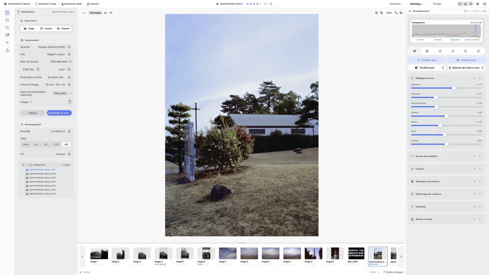
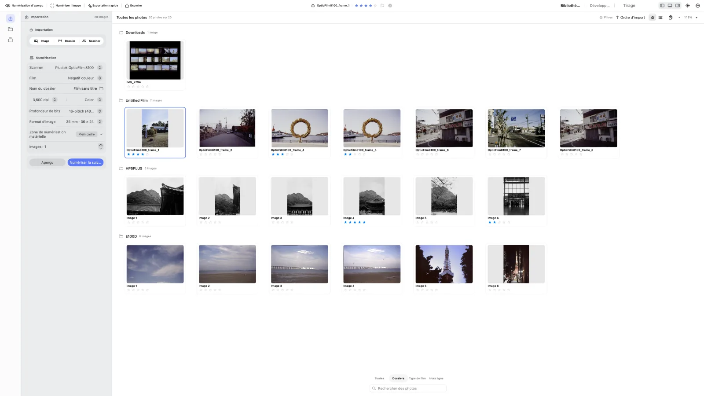
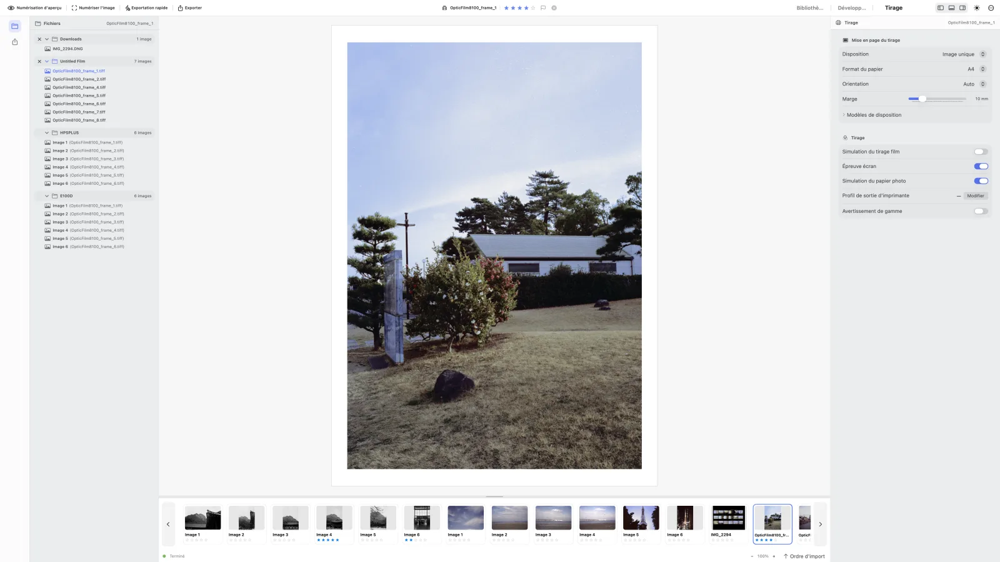

<p align="center">
  
</p>

<h1 align="center">negaflow</h1>

<p align="center">Une application macOS pour numériser et développer les films, au scanner ou à l’appareil photo</p>

<p align="center">
  <a href="https://habinsong.github.io/negaflow-site/fr/"></a>
  <a href="docs/fr/product/PROJECT_STATUS.md"></a>
  <a href="#prérequis"></a>
  <a href="negaflow-mac/Package.swift"></a>
  <a href="LICENSE"></a>
</p>

<p align="center">
  <a href="README.md">English</a> ·
  <a href="README_ko.md">한국어</a> ·
  <a href="README_ja.md">日本語</a> ·
  <a href="README_zh-Hans.md">简体中文</a> ·
  <strong>Français</strong> ·
  <a href="README_de.md">Deutsch</a>
</p>

<p align="center">
  <a href="https://habinsong.github.io/negaflow-site/fr/">Site web</a> ·
  <a href="https://habinsong.github.io/negaflow-site/fr/camera-scanning/">Guide de numérisation à l'appareil</a> ·
  <a href="https://habinsong.github.io/negaflow-site/fr/faq/">FAQ</a>
</p>

---

<p align="center">
  <picture>
    <source media="(prefers-color-scheme: dark)" srcset="docs/images/fr/develop-dark.webp">
    
  </picture>
</p>

negaflow est une application macOS qui importe, inverse et développe les films numérisés ou reproduits avec un appareil photo numérique.<br>
Elle traite les films couleur ou noir et blanc, négatifs ou positifs.<br>
Les corrections sont enregistrées séparément du fichier d’origine.<br>
Elle couvre tout le parcours numérique du film, de la photothèque au développement et à l’impression.

Le moteur de développement s’appelle **Chroma Engine**.<br>
La réparation des poussières et rayures s’appelle **GrainMend**.<br>
Il suffit d’importer une image pour la développer et l’exporter.<br>
Les commandes du scanner n’apparaissent que si un module externe est installé.

> La technique avance, mais le travail autour de la photographie argentique s’est figé alors même que le film revient en force.<br>
> Sans tirage traditionnel, il faut passer par le numérique avant de pouvoir voir et partager une image.<br>
> Or cette étape se réduit à mesure que les laboratoires ferment et que les solutions disponibles disparaissent.
> <br>
> Ce projet est né des difficultés rencontrées dans plusieurs façons de travailler et des fonctions que j’aurais aimé trouver ailleurs.<br>
> Mon expérience du 35 mm et du moyen format en est la base, et j’ai tout développé moi-même depuis le début.<br>
> Au départ, c’était un petit projet pour mon usage personnel.<br>
> Depuis, **negaflow** est devenu autre chose.<br>
> Un outil de ce genre doit avant tout bien fonctionner, rester simple, aller vite et s’occuper correctement du travail répétitif.<br>
> Développé de façon indépendante comme une application macOS native, **negaflow** rassemble des habitudes de laboratoire et des pratiques personnelles.
>
> **Célébrons cet été le bicentenaire de la toute première photographie de Niépce.**

---

## Installation

Téléchargez la version actuelle depuis [GitHub Releases](https://github.com/habinsong/negaflow/releases).<br>
Le PKG Universal convient à la plupart des Mac.

| Téléchargement | Mac compatibles |
|---|---|
| `negaflow-1.0.5-1-macOS-universal.pkg` | Apple Silicon et Intel |
| `negaflow-1.0.5-1-macOS-arm64.pkg` | Apple Silicon uniquement |

1. Téléchargez le PKG adapté au Mac.
2. Ouvrez-le et suivez les instructions d’Installer.
3. Lancez **negaflow** depuis `/Applications`.

Le PKG installe directement `negaflow.app` dans `/Applications`.<br>
Des versions DMG et ZIP destinées à l’installation manuelle sont proposées sur la même page.<br>
Les fichiers actuellement publiés sur GitHub sont signés en ad-hoc et ne sont pas notariés par Apple.<br>
macOS peut donc bloquer le premier lancement. Après avoir tenté d’ouvrir negaflow, consultez
l’avertissement dans **Réglages Système → Confidentialité et sécurité**, puis choisissez
**Ouvrir quand même** uniquement si la somme de contrôle SHA-256 du fichier téléchargé
correspond à celle publiée avec la version.

> L’utilisation d’un scanner physique demande un module scanner séparé.<br>
> Les scanners SANE utilisent [`negaflow-scanner-sane`](https://github.com/habinsong/negaflow-scanner-sane).

## Fonctions

- Mesure de la base du film et inversion des films couleur ou noir et blanc
- Exposition, contraste, courbes, HSL, étalonnage couleur et virage noir et blanc
- Netteté, réduction du bruit, grain, vignettage et halo
- Réparation des poussières et rayures avec GrainMend
- Pellicules, dossiers, collections, notes, piles et copies virtuelles
- Zoom, recadrage, rotation, comparaisons, histogramme et affichage de l’écrêtage
- Appareil, objectif, film et exposition notés puis écrits dans l’EXIF du fichier exporté
- Notes de prise de vue au rouleau, et recherche dans la bibliothèque par appareil, objectif ou film
- Export JPEG et TIFF 16 bits, profils ICC et mises en page d’impression
- Feuilles noir/gris/blanc par mise en page, aperçu commun mat/brillant/lustre/soie, formats
  photo/ISO et règles in/cm facultatives
- Réglages de laboratoire et papier C-print avec aperçu d’épreuvage ICC
- Progression de l’import, développement par dossier avec procédé, cible et avancement
- État des dossiers mémorisé, déplacement par glisser-déposer et synchronisation avec le Finder
- Préréglages et copier-coller incluant procédé, cible, réglages, recadrage et orientation
- Sept mises en page : image unique, planche-contact, package d’images, package personnalisé,
  cyanotype, plaque de verre et gélatino-argentique
- Export du tirage et exportation rapide comptés par page : une planche 6 × 7 de 39 photos produit
  un fichier composé, les dispositions individuelles un lot borné de 39 fichiers, avec barre et pourcentage
- Fenêtre À propos multilingue plaçant le message du bicentenaire de Niépce entre le nom de
  l’application et sa version

> Les vérifications terminées sont notées dans [État du projet](docs/fr/product/PROJECT_STATUS.md). <br>

## Chroma Engine

Chroma Engine est le moteur d’inversion et de développement du module `Chromabase`.<br>
Avant d’inverser un négatif, il mesure la base dans une zone non exposée du film.<br>
Si la mesure automatique est mauvaise, vous pouvez choisir une zone avec la pipette ou saisir les valeurs RGB.

Le réglage initial utilise la cible `MAIN` et des corrections manuelles.<br>
Tonalité auto, Balance des blancs auto, Niveaux auto et Couleur auto ne s’appliquent que lorsque vous les lancez.

Cibles de développement :

- `MAIN` : développement standard
- `PRINT` : sortie utilisant un profil ICC d’imprimante
- `HS`, `SP` : développement de style minilab
- `F135`, `HR` : styles des familles de machines correspondantes
- `EXPIRED` : récupération de films anciens

La sortie accepte sRGB, Display P3, Adobe RGB ou un profil ICC RGB personnalisé.<br>
L’ordre de l’inversion et du traitement couleur est décrit dans [Chroma Engine](docs/fr/product/CHROMA_ENGINE.md).

## GrainMend

**GrainMend répare les défauts du film : poussières, trous d’épingle, rayures et dégâts d’émulsion.** <br>


| GrainMend RGB | Usage |
|---|---|
| Auto | Cherche et répare les défauts dans toute la photo. |
| Guidé | Cherche les défauts dans la zone que vous indiquez. |
| Pinceau | Permet de peindre directement l’endroit à réparer. |
| Tampon de duplication | Copie les pixels depuis un point source choisi. |


Les outils Auto et Guidé de **GrainMend RGB** comblent un défaut à partir de la texture voisine et <br>
examinent aussi la direction et les structures alentour, pour ne pas effacer comme rayure une ligne ou une grille de l’image. <br>
Chaque résultat est conservé dans un calque GrainMend. <br><br>
> Auto retire les défauts courants d’une photo. Si les candidats deviennent trop denses pour être appliqués sans risque, il s’arrête sans modifier l’image et vous oriente vers Guidé. <br>
> Guidé vise les poussières variées apparues au moment de la numérisation. Le Pinceau répare ce que les passes automatiques ont manqué, et le Tampon copie les pixels source que vous choisissez. <br>
Chaque calque **GrainMend RGB** peut voir son intensité modifiée, son masque affiché, et peut être désactivé ou supprimé séparément.


Si le module scanner fournit un canal infrarouge, **GrainMend IR** ajoute sa détection au même historique d’édition.<br><br>

**GrainMend RGB** est une méthode logicielle indépendante, distincte du nettoyage infrarouge matériel, et <br>
**GrainMend IR** utilise le canal infrarouge du scanner : ce n’est ni une implémentation ni un mode de compatibilité de Digital ICE, iSRD ou SRDx.

L’implémentation et les critères de qualité et de performance sont dans [GrainMend](docs/fr/product/GRAINMEND.md).

## Profils de film

L’application contient 15 profils de scanner construits à partir de films photographiés par l’auteur du projet.<br>
Ils regroupent 928 observations d’images.<br>
Tous sont actuellement `realOnly` : ils reposent sur de vrais scans, mais n’ont pas encore passé une vérification indépendante avec des paires de référence.

Un profil n’est jamais appliqué à partir du seul nom du scanner.<br>
Vous devez le choisir.<br>
L’application vérifie aussi le SHA-256 de chaque profil et du manifeste.

`928` est la somme des observations de tous les groupes de profils, et non 928 photos différentes.<br>
Le même film peut compter dans plusieurs groupes de scanners.<br>
J’ai examiné moi-même les 928 scans sources et écarté avant mesure les fichiers présentant de fausses détections ou des défauts manqués.<br>
Les données et leur fabrication sont décrites dans [Profils de film](docs/fr/product/FILM_PROFILES.md).

## Parcours de base

1. Importez une image ou numérisez-la avec un module installé.
2. Choisissez le type de film et mesurez sa base.
3. Réglez la couleur et la tonalité dans Chroma Engine.
4. Appliquez GrainMend aux images qui en ont besoin.
5. Contrôlez le résultat avec les comparaisons et l’histogramme, puis imprimez-le ou exportez-le.

<p align="center">
  <picture>
    <source media="(prefers-color-scheme: dark)" srcset="docs/images/fr/library-dark.webp">
    
  </picture>
</p>

<p align="center">
  <picture>
    <source media="(prefers-color-scheme: dark)" srcset="docs/images/fr/print-dark.webp">
    
  </picture>
</p>

L’interface a été faite pour les personnes qui travaillent vraiment avec des photos, pas comme une maquette générique produite par une IA.<br>
Une personne qui pratique la photographie doit pouvoir s’y retrouver facilement.

## De la photothèque à l’impression

Par défaut, l’import d’une image ne lance pas son développement. negaflow crée d’abord la vignette
de la source et son dossier. Le développement commence lorsque vous appliquez un procédé et une
cible au dossier, ou lorsque vous ouvrez Développement. Le développement automatique peut être
activé dans les réglages du flux de travail ; il est désactivé par défaut.

Les dossiers repliés le restent après redémarrage. Une photo peut être glissée vers un autre
dossier. Si le nom existe déjà, negaflow ajoute un numéro au lieu d’écraser le fichier. Un
déplacement ou un renommage dans le Finder met à jour la photothèque en ne relisant que le dossier
modifié.

Le copier-coller des réglages et les préréglages utilisateur comprennent le procédé, la cible, la
base du film, la tonalité, la couleur, les détails, le recadrage, la rotation, les retournements et
le redressement. Avec plusieurs photos sélectionnées, le collage s’applique à toute la sélection.

Dans Impression, le profil de sortie de l’imprimante est appliqué à la page composée. Les
placements répétés et les paquets mélangeant plusieurs photos reçoivent donc tous la même
conversion. Ce profil ne modifie pas l’aperçu de Développement.

Voir [De la photothèque à l’impression](docs/fr/product/WORKFLOW.md) pour le comportement détaillé.

## Compilation depuis les sources

### Prérequis

- macOS 14.0 ou version ultérieure
- Application graphique : Xcode 26
- Moteur et CLI : Swift 5.9 ou version ultérieure
- Numérisation matérielle : module de scanner séparé

```bash
git clone https://github.com/habinsong/negaflow.git
cd negaflow

# Compiler la version Release et la lancer
bash scripts/run-app.sh

# Compiler sans lancer
bash scripts/run-app.sh build
```

L’application graphique se compile avec `xcodebuild`.<br>
`scripts/run-app.sh` compile le code, assemble l’application et la signe localement.<br>
Utilisez `swift build` pour ne compiler que le moteur et la CLI.

## CLI

```bash
swift build

# Rechercher les scanners
.build/debug/negaflow detect
.build/debug/negaflow capabilities <scannerID>

# Développer
.build/debug/negaflow develop in.tiff out.jpg --look rich-neutral --target main

# GrainMend
.build/debug/negaflow develop scan.tif out.jpg --defects 1
.build/debug/negaflow defect-bench ./scans --out ./report

# Lister les profils et vérifier le moteur
.build/debug/negaflow list-scanner-profiles
.build/debug/negaflow selftest
```

Lancez `negaflow` sans argument pour voir toutes les options.

## Scanners

negaflow ne devine pas les fonctions à partir du nom du scanner.<br>
Il utilise uniquement les résolutions, profondeurs, zones, réglages d’exposition et fonctions IR déclarés par le module.

Les appareils SANE sont pris en charge par le projet GPL séparé [`negaflow-scanner-sane`](https://github.com/habinsong/negaflow-scanner-sane).<br>
Le module s’exécute dans un autre processus et communique avec l’application par JSON.<br>
L’application negaflow ne contient ni ne lie le code SANE.

## Dépôt

| Module | Rôle |
|---|---|
| `Chromabase` | Chroma Engine, GrainMend, profils et export |
| `ScannerKit` | Capacités des scanners et connexion aux modules externes |
| `negaflowApp` | Interface de bibliothèque, développement, scan et export |
| `negaflowCLI` | Commandes de développement, scan, banc d’essai et autotest |

Le flux de données entre les modules est décrit dans [Architecture du produit](docs/fr/architecture/PRODUCT_ARCHITECTURE.md).

## Vérifications de développement

```bash
# Tests Swift
DEVELOPER_DIR=/Applications/Xcode.app/Contents/Developer swift test

# Build GUI Release
bash scripts/run-app.sh build

# Vérification complète du dépôt
bash scripts/ci-gate.sh
```

Les tests automatiques vérifient le comportement du code et les régressions.<br>
Le matériel, la qualité d’image finale, la signature et la notarisation demandent des vérifications séparées.

## Documentation

| Document | Contenu |
|---|---|
| [Chroma Engine](docs/fr/product/CHROMA_ENGINE.md) | Base du film, inversion, couleur et ordre du développement |
| [GrainMend](docs/fr/product/GRAINMEND.md) | Détection, réparation, IR, historique, performance et qualité |
| [Profils de film](docs/fr/product/FILM_PROFILES.md) | Analyse des sources et création des profils |
| [De la bibliothèque au tirage](docs/fr/product/WORKFLOW.md) | Import, synchronisation des dossiers, développement groupé, copie des réglages et profils de tirage |
| [Architecture du produit](docs/fr/architecture/PRODUCT_ARCHITECTURE.md) | Application, moteur, scanner, stockage et export |
| [État du projet](docs/fr/product/PROJECT_STATUS.md) | État de l’implémentation, mesures et vérifications restantes |
| [Liste de QA réelle](docs/fr/validation/REAL_QA_CHECKLIST.md) | Points à vérifier sur le matériel et à l’écran |

## Licence

Le projet principal negaflow est distribué sous [licence Apache 2.0](LICENSE).

negaflow n’est ni affilié ni parrainé par Kodak, Fujifilm, Noritsu, LaserSoft Imaging ou d’autres titulaires de marques.<br>
Les noms de produits servent seulement à identifier une mesure ou une cible compatible.<br>
Voir [Avis sur les marques](TRADEMARKS.md).
