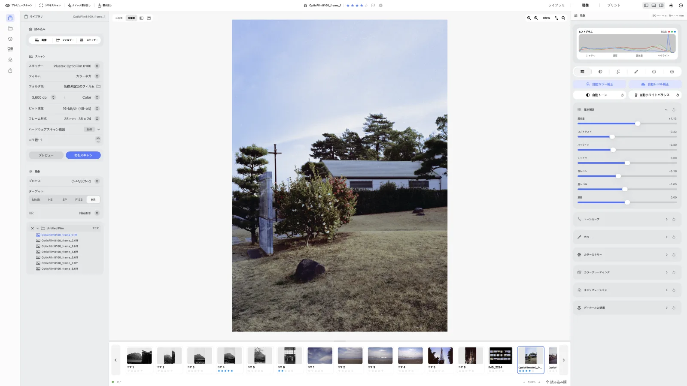
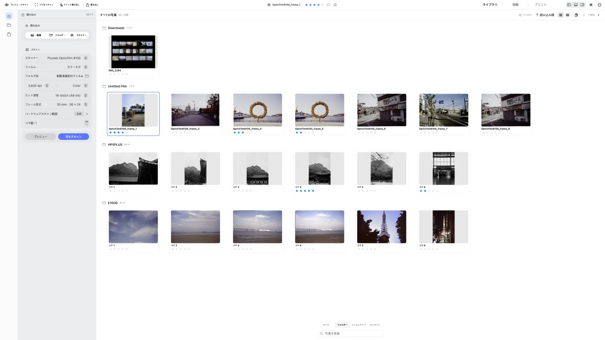
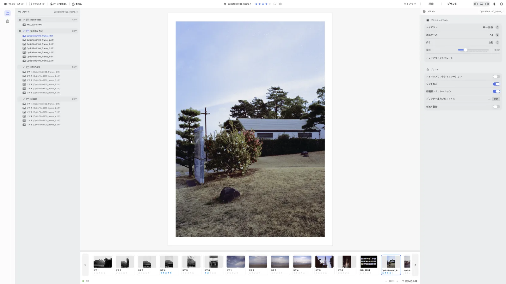

  

<h1 align="center">negaflow</h1>

フィルムから完成した写真まで。macOS と Windows でそれぞれネイティブに動きます。

  
  
  
  
  

  <a href="README.md">English</a> ·
  <a href="README_ko.md">한국어</a> ·
  <strong>日本語</strong> ·
  <a href="README_zh-Hans.md">简体中文</a> ·
  <a href="README_fr.md">Français</a> ·
  <a href="README_de.md">Deutsch</a>

  <a href="https://habinsong.github.io/negaflow-site/ja/">ウェブサイト</a> ·
  <a href="https://habinsong.github.io/negaflow-site/ja/camera-scanning/">カメラスキャンガイド</a> ·
  <a href="https://habinsong.github.io/negaflow-site/ja/faq/">FAQ</a>

---

  <picture>
    <source media="(prefers-color-scheme: dark)" srcset="docs/images/ja/develop-dark.webp">
    
  </picture>

**negaflow** は、スキャンしたフィルムやカメラで複写したフィルムを読み込んで現像するアプリです。カラーも白黒も、ネガもポジも全部いけます。ライブラリから現像、プリントまでアプリひとつの中で終わります。補正の値は元と分けて保存するので、元のファイルはそのまま残ります。

現像エンジンの名前は **Chroma Engine**、ゴミやキズの修復は **GrainMend** です。スキャナーがなくても大丈夫です。画像ファイルを読み込むだけでも現像も書き出しもできます。スキャナー接続は、プラグインを別に入れたときだけ開きます。

> 最近のアナログ流行の伸びとは違って、今のアナログ写真のプロセスは停滞期と言えます。フィルムをアナログでプリントする方法でない限り、アナログをデジタルに変換する過程を経てはじめて私たちの目に見えます。
>
> ところが、その過程のすべてが止まりかけています。フィルムラボや現像所はどんどんなくなり、メーカーと製品への支えが減っているからです。
>
> 本プロジェクトは、あれこれのやり方で作業しながら感じた不便と、こんな機能があればいいという考えから始まりました。35mm フィルムと中判フィルムを使いながら知った経験と知識をもとに、一から十まで全部自分で開発しました。最初は自分ひとりで使いながらいろいろ作ってみたトイプロジェクトでしたが、今の negaflow はそれ以上の何かになりました。
>
> 結局のところ何よりも「ちゃんと」動いて楽に使えて、速くなければならず、何でも勝手にきちんと作った結果物が大事ですから。独自開発した **negaflow** は macOS と Windows でそれぞれネイティブに動き、フィルムラボと個人のワークフローを全部溶かし込んでみました。
>
>
> **ニエプスが撮った最初の写真から200周年になる今年の夏を記念して。** 2026年7月25日。
## negaflow for macOS and Windows

| | macOS | Windows |
|---|---|---|
| 画面 | SwiftUI | WinUI 3 |
| エンジン | Swift + Core Image | C++ + Direct3D |
| カラーマネジメント | ColorSync | Windows ICM |

二つのアプリはネイティブアプリとして違う言語で違うやり方で開発されましたが、それでも機能と結果は同じです。

エンジンのコードは macOS では `Chromabase`、Windows では `Native` モジュールにあります。

二つを同時に作る方法(クロスプラットフォーム)もありますが、そうすると両方とも遅くなり、まともに動きません。だから OS ごとに固有のやり方で最初からコードを書き直しました。何が同じで何が違うかは[こちら](docs/ja/platform/PLATFORM_DIFFERENCES.md)に書いてあります。

## ダウンロード

[GitHub Releases](https://github.com/habinsong/negaflow/releases) から入手できます。

| インストーラー | 対象 |
|---|---|
| `negaflow-1.1.3-mac-universal.pkg` | macOS 14 以降、Apple Silicon と Intel |
| `negaflow-1.1.3-mac-arm64.pkg` | macOS 14 以降、Apple Silicon のみ |
| `negaflow-1.1.1-win-x64.exe` | Windows 11 24H2 以降、x64 |

たいていの Mac は Universal PKG で大丈夫です。もちろん、Silicon 用のファイルと DMG と ZIP も同じページに上げてあります。初回起動のときはシステム設定のプライバシーとセキュリティで「このまま開く」を一度押す必要があります。

Windows のインストールはユーザーフォルダーの中で終わり、管理者権限を聞いてきません。署名がないので SmartScreen が一度止めます。詳細情報を押して実行すれば大丈夫です。削除はコントロールパネルからできます。

実機のスキャナーをつなぐにはプラグインが別に必要で、SANE スキャナーには [`negaflow-scanner-sane`](https://github.com/habinsong/negaflow-scanner-sane) があります。当然、macOS と Windows の両方で動きます。

## 機能
> アナログフィルムを完成した写真にするための機能が全部入っています。
- フィルムベースを測ってカラー・白黒のネガとポジを現像する機能から
- 露出、コントラスト、カーブ、HSL、カラーグレーディングなど補正に必要なすべて
- シャープネス、ノイズ除去、粒子、周辺光量、ハレーションのような付加オプション
- ゴミとキズを取り除いて写真を復元する GrainMend。
- ロール、フォルダー、コレクション、レーティング、スタック、仮想コピー、カメラ・レンズ・フィルム検索ができるライブラリ
- 現像プロセス、ターゲット、トーン・色・ディテール、切り抜きと向きをまとめて運ぶプリセットとコピー・ペースト
- JPEG と 16bit TIFF の書き出し、ICC プロファイル、カメラ・レンズ・フィルムなどの記録を EXIF に保存
- 7種類のプリントレイアウトと用紙プレビュー、写真用・ISO 用紙、C-print 機能まで全部あります。

## Chroma Engine

**Chroma Engine** はフィルムの反転と現像を受け持ちます。

ネガを現像する前にフィルムベースを先に測ります。光が一度も当たっていない領域から値を読みます。自動測定がずれた場所はスポイトで取るか RGB 値を調整すれば大丈夫です。

初期値は `MAIN` と手動補正です。自動トーン、自動ホワイトバランス、自動レベル、自動カラーは押したときだけ動きます。

残りのターゲットはこうです。プリンターの ICC で出す `PRINT`、ミニラボ系の `HS` と `SP`、ラボ機材系の `F135` と `HR`、古いフィルムを起こしてみる `EXPIRED`。出力は sRGB、Display P3、Adobe RGB、それに自分で使う RGB ICC から選べます。

反転と色処理の順序は[クロマエンジンのドキュメント](docs/ja/product/CHROMA_ENGINE.md)にあります。

## GrainMend

> **GrainMend** はゴミ、ピンホール、キズ、乳剤の傷みを復元します。

**GrainMend RGB** はソフトウェアの方式なのでハードウェアの IR とは違います。    
`自動` は写真全体を見ます。手軽ですが誤検出はあります。  
`ガイド` は指定した領域だけを見ます。スキャン中に付いたゴミにいちばんよく効きます。  
`ブラシ` は自動が取りこぼした場所を自分で塗る道具で、クローンスタンプは選んだ位置の画素をそのまま移してくれます。 
`クローンスタンプ` はユーザーが望む質感を選んで自分で塗るスタンプ機能です。  

自動とガイドは周りの質感を見て欠陥を埋めます。埋める前に向きと周辺の構造を先に見ます。写真の中の手すりや目地をキズと間違えて消してしまったら、それは復元ではなく破損ですから。

修正結果はレイヤーとして残ります。強さを変えて、マスクを確かめて、ひとつずつ切ったり消したりできます。 
**GrainMend IR** はスキャナープラグインが渡してくれた赤外チャンネルの検出結果を同じ記録に足します。

**GrainMend IR** はスキャナーの赤外チャンネル(IR)を使いますが、Digital ICE、iSRD、SRDx の実装でも互換モードでもありません。動作の仕組みと品質・性能の基準は [GrainMend のドキュメント](docs/ja/product/GRAINMEND.md)にまとめてあります。

## 読み込みからプリントまで

1. 画像ファイルを読み込むか、導入済みのプラグインでスキャンします。
2. 現像プロセスの種類を選んでスキャンターゲットを指定します。
3. クロマエンジンで色とトーンを調節します。
4. 必要な写真に GrainMend を適用します。
5. 比較表示とヒストグラムで確認してからプリントするか書き出します。

読み込んだだけでは現像しません。フォルダーのプロセスとターゲットを選んで**適用**を押したとき、または現像画面に入ったときに始まります。自動で回す設定も別にありますが、初期値はオフです。

それぞれの操作が元のファイルに何をするかは[ライブラリからプリントまで](docs/ja/product/WORKFLOW.md)に表でまとめてあります。

  <picture>
    <source media="(prefers-color-scheme: dark)" srcset="docs/images/ja/library-dark.webp">
    
  </picture>

  <picture>
    <source media="(prefers-color-scheme: dark)" srcset="docs/images/ja/print-dark.webp">
    
  </picture>

## スキャナーとフィルムプロファイル

negaflow 本体はスキャナーの機種名を見て機能を開けたりしません。  プラグインが知らせた解像度、ビット深度、スキャン領域、露出、IR 対応だけを使います。名前から推測すると装置にない機能が点きます。

SANE 機器は別の GPL プロジェクトである [`negaflow-scanner-sane`](https://github.com/habinsong/negaflow-scanner-sane) が担当します。プラグインは別プロセスで動き、やり取りの形式は JSON です。**negaflow** に SANE のコードは入っていませんし、リンクもしていません。

同梱にはスキャナープロファイルが15個入っています。自分で撮ったフィルムで作り、記録したデータの数は928個です。

状態は全部 `realOnly` です。実際のスキャンで作りはしましたが、独立した基準で精度を検証した段階ではないという意味です。検証していないものを検証したとは書きたくありませんでした。プロファイルはスキャナー名を見て自動で当たることはないので、自分で選ぶ必要があります。

詳しくは[フィルムプロファイルのドキュメント](docs/ja/product/FILM_PROFILES.md)に書きました。

## ドキュメント

- [クロマエンジン](docs/ja/product/CHROMA_ENGINE.md) | フィルムベース、反転、色処理と現像の順序
- [GrainMend](docs/ja/product/GRAINMEND.md) | 欠陥の検出と復元、IR、編集記録
- [フィルムプロファイル](docs/ja/product/FILM_PROFILES.md) | 撮影資料の分析とプロファイル生成
- [ライブラリからプリントまで](docs/ja/product/WORKFLOW.md) | 読み込み、フォルダー同期、一括現像、プリント
- [製品の構造](docs/ja/architecture/PRODUCT_ARCHITECTURE.md) | アプリ、エンジン、保存と書き出しの構造
- [ドキュメント全体](docs/ja/README.md) | 多言語(6言語)

## 自分でビルドする

プラットフォームごとに必要な道具とコマンドが違います。全体の手順は各ドキュメントにあります。[macOS](negaflow-mac/docs/README_ja.md) は macOS 14 以降と Xcode 26、[Windows](negaflow-windows/docs/README_ja.md) は Windows 11 24H2 と Visual Studio 2022、.NET 10 SDK が必要です。リポジトリでの作業のきまりは [`CONTRIBUTING.md`](CONTRIBUTING.md) にまとめてあります。

## ライセンス

**negaflow** は [Apache License 2.0](LICENSE) で配布します。Kodak、Fujifilm、Noritsu、LaserSoft Imaging をはじめ、どの商標権者とも提携や後援を受けていません。製品名は互換の対象や測定の対象を指すときだけ使います。[商標について](TRADEMARKS.md)に詳しく書いてあります。
