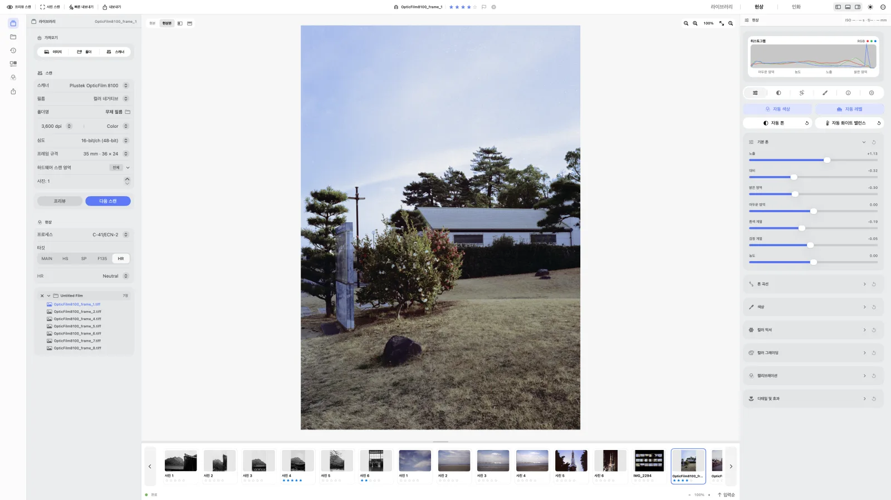
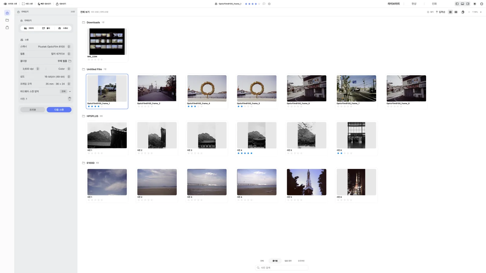
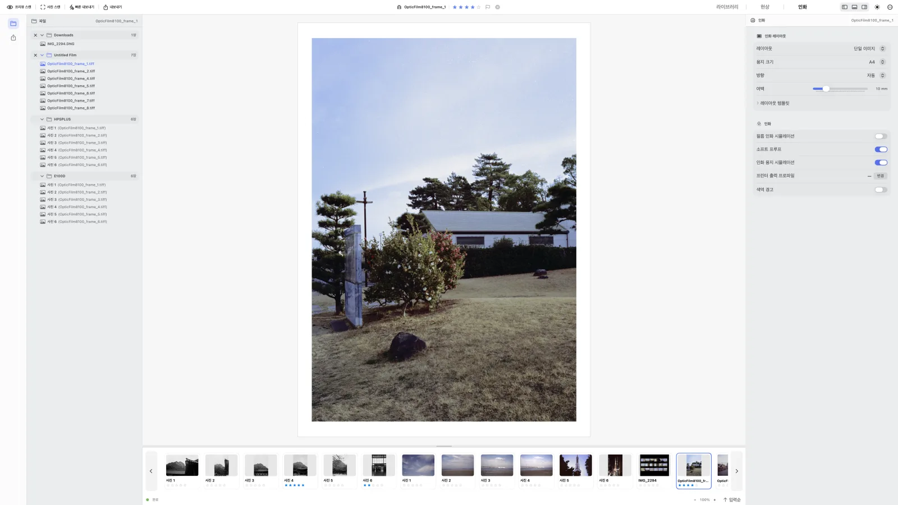

<p align="center">
  
</p>

<h1 align="center">negaflow</h1>

<p align="center">아날로그 필름을 위한 카메라/스캐너 스캔과 현상과 출력까지 전과정을 지원하는 macOS 앱</p>

<p align="center">
  <a href="https://habinsong.github.io/negaflow-site/ko/"></a>
  <a href="docs/ko/product/PROJECT_STATUS.md"></a>
  <a href="#요구-사항"></a>
  <a href="negaflow-mac/Package.swift"></a>
  <a href="LICENSE"></a>
</p>

<p align="center">
  <a href="README.md">English</a> ·
  <strong>한국어</strong> ·
  <a href="README_ja.md">日本語</a> ·
  <a href="README_zh-Hans.md">简体中文</a> ·
  <a href="README_fr.md">Français</a> ·
  <a href="README_de.md">Deutsch</a>
</p>

<p align="center">
  <a href="https://habinsong.github.io/negaflow-site/ko/">웹사이트</a> ·
  <a href="https://habinsong.github.io/negaflow-site/ko/camera-scanning/">카메라 스캔 가이드</a> ·
  <a href="https://habinsong.github.io/negaflow-site/ko/faq/">FAQ</a>
</p>

---

<p align="center">
  <picture>
    <source media="(prefers-color-scheme: dark)" srcset="docs/images/ko/develop-dark.webp">
    
  </picture>
</p>

**negaflow**는 스캐너로 스캔한 필름이나 디지털 카메라로 촬영한 필름을 불러와서 현상하는 **MacOS** 앱입니다. <br>
현상 엔진은 **Chroma Engine**, 먼지와 스크래치 복원 기능은 **GrainMend**라는 이름을 사용하며<br>
독자 개발한 프로세스 전 과정을 담았습니다. 이처럼 손쉽게 필름을 현상/보정/출력하는 과정을 하나의 앱에서 지원합니다.<br> <br>
간단히 요약하면, 아날로그 필름을 디지털로 변환하는 전과정을 손쉽게 지원하는 프로세스입니다.<br>
이미지 파일만 가져와도 현상과 내보내기를 사용할 수 있으며 **스캐너 연결은 별도 플러그인이 있을 때만 활성화**됩니다.<br><br>


> 요즘의 아날로그 유행의 성장과 다르게 지금의 아날로그 사진 프로세스는 정체기라고 할수 있죠.<br>
> 필름을 아날로그 인화하는 방식이 아닌 이상, 아날로그를 디지털로 변환하는 과정을 거쳐야 비로소 우리 눈에 보여집니다. <br>
> <br>
> 그러나 그 모든 과정이 멈춰가고 있습니다. <br>
> 필름랩, 현상소는 점점 없어져 제조사와 제품에 대한 지원이 줄어들고 있기 때문이죠.

> <br>
> 본 프로젝트는 다양한 경험을 통해 느낀 불편함과 새로운 기능이 있었으며 좋겠다라는 생각에서 시작했습니다. <br>
> 35mm 필름과 중형 필름을 사용하면서 알게된 경험과 지식을 바탕으로 하나부터 열까지 모두 직접 개발했습니다.<br>
> 처음에는 내가 혼자 사용하며 이것저젓 만들어본 토이 프로젝트였지만 이제 negaflow는 그 이상의 어떤 무언가가 되었습니다.<br>
>
>
> <br>결국 무엇보다 '잘' 되며 편하게 사용하고, 빨라야하고 뭐든지 알아서 제대로 만든 결과물이 중요하니까요. <br>
> 독자 개발한 **negaflow**는 네이티브로 지원되며, 필름랩과 개인의 워크플로우를 다 녹여봤습니다.
>
> <br>
>
> **니엡스가 찍은 최초의 사진으로부터 200주년인 올해 여름을 기념하며.**

---

## 설치

[GitHub Releases](https://github.com/habinsong/negaflow/releases)에서 현재 버전을 내려받습니다.<br>
대부분의 Mac에서는 Universal pkg를 사용하면 됩니다.
실리콘 맥(M 시리즈) 는 arm64 pkg를 사용하면 됩니다.

| 설치 파일 | 지원하는 Mac |
|---|---|
| `negaflow-1.0.7-1-macOS-universal.pkg` | Apple Silicon, Intel |
| `negaflow-1.0.7-1-macOS-arm64.pkg` | Apple Silicon 전용 |

1. 사용하는 Mac에 맞는 PKG를 내려받습니다.
2. PKG를 열고 설치 프로그램의 안내에 따라 진행합니다.
3. `/Applications`에서 **negaflow**를 실행합니다.

PKG는 `negaflow.app`을 `/Applications`에 바로 설치합니다.<br>
직접 설치할 때 사용할 수 있는 DMG와 ZIP도 같은 릴리스 페이지에서 제공합니다.<br>
애플 개발자 인증이 없기 때문에 설정 - 개인정보 보호 및 보안에서  '그래도 열기' 를 눌러야만 앱이 실행됩니다.


> 실제 스캐너를 연결하려면 별도 스캐너 플러그인이 필요합니다.<br>
> SANE 스캐너는 [`negaflow-scanner-sane`](https://github.com/habinsong/negaflow-scanner-sane)을 사용합니다.

---

## 기능

- 필름 베이스 측정과 컬러·흑백 필름 반전
- 노출, 대비, 커브, HSL, 컬러 그레이딩, 흑백 토닝
- 선명도, 노이즈 제거, 그레인, 비네팅, 할레이션
- 먼지와 스크래치를 복원하는 GrainMend, 스캐너 적외선 패스를 쓰는 GrainMend IR 포함, 스캐너 적외선 패스를 쓰는 GrainMend IR 포함
- 롤, 폴더, 컬렉션, 별점, 스택과 가상 사본
- 확대, 자르기, 회전, 비교 보기, 히스토그램과 잘림 표시
- 카메라, 렌즈, 필름, 노출 기록을 내보낸 파일의 EXIF에 기록
- 롤 단위 촬영 기록과 카메라·렌즈·필름으로 찾는 라이브러리 검색
- JPEG와 16-bit TIFF 내보내기, ICC 프로파일과 인화 레이아웃
- 레이아웃별 검정·회색·흰색 시트, 공통 무광·유광·러스터·실크 미리보기, 사진용·ISO 용지와
  선택형 in/cm 눈금자
- C-print 인화소·인화지 설정과 인화소 ICC 소프트 프루프 미리보기
- 가져오기 진행률, 폴더별 현상 프로세스·타깃 일괄 적용과 처리 진행률
- 접은 상태를 기억하는 폴더 목록, 사진 드래그 이동과 Finder 변경 자동 반영
- 현상 프로세스, 타깃, 톤·색·디테일, 크롭과 방향을 함께 옮기는 프리셋과 복사·붙여넣기
- 단일 이미지, 콘택트 시트, 사진 패키지, 사용자 패키지, 시아노타입, 유리건판, 젤라틴의
  7가지 인화 레이아웃
- 39장 6 × 7 콘택트 시트는 합성된 한 파일로, 한 장씩 보는 레이아웃은 제한된 39파일
  배치로 처리하며 막대와 퍼센트를 표시하는 페이지 기준 인화 내보내기·빠른 내보내기


컬러와 흑백, 네거티브와 포지티브 모두 다루며 보정 내용은 원본과 따로 저장합니다.<br>


> 확인을 마친 범위는 [프로젝트 상태](docs/ko/product/PROJECT_STATUS.md)에 기록합니다.


---
## Chroma Engine

**Chroma Engine**은 `Chromabase` 모듈에 들어 있는 필름 반전·현상 엔진입니다.<br>
네거티브를 반전하기 전에 미노광 영역에서 필름 베이스를 측정합니다.<br>
자동 측정이 맞지 않으면 스포이드로 영역을 고르거나 RGB 값을 직접 입력할 수 있습니다.<br>
기본 현상은 `MAIN`과 수동 보정이며, 자동 톤, 자동 화이트 밸런스, 자동 레벨과 자동 색상은 직접 실행했을 때만 적용됩니다.
<br><br>
현상 대상은 다음과 같습니다.

- `MAIN`: 일반 현상
- `PRINT`: 프린터 ICC를 사용하는 출력
- `HS`, `SP`: 미니랩 계열 현상
- `F135`, `HR`: 랩 장비 계열 현상
- `EXPIRED`: 오래된 필름 복구

출력에는 sRGB, Display P3, Adobe RGB나 사용자 RGB ICC를 쓸 수 있습니다.<br>
반전과 색 처리 순서는 [크로마 엔진 문서](docs/ko/product/CHROMA_ENGINE.md)에서 볼 수 있습니다.


---

## GrainMend

**GrainMend는 필름의 먼지, 핀홀, 스크래치와 유제 손상 등 결함을 복원합니다.** <br>


| GrainMend RGB    | 사용 과정                        |
| ----- | ------------------------- |
| 자동    | 사진 전체에서 결함을 찾고 복원합니다.     |
| 가이드   | 사용자가 지정한 영역 안에서 결함을 찾습니다. |
| 브러시   | 복원할 자리를 직접 칠합니다.          |
| 복제 도장 | 지정한 위치의 픽셀을 다른 곳에 복제합니다.  |


**GrainMend RGB**의 자동과 가이드 도구는 주변 질감을 참고해 결함을 메우고 <br>
사진 속 선이나 격자를 스크래치로 지우지 않도록 방향과 주변 구조도 함께 검사합니다. <br>
수정 결과는 GrainMend 레이어로 남습니다. <br><br>
> 자동 기능은 보편적인 결함을 제거합니다. 안전하게 적용하기 어려울 만큼 후보가 몰리면 사진을 바꾸지 않고 중지한 뒤 가이드 사용을 안내합니다. <br>
> 가이드는 스캔 과정에서 생긴 다양한 먼지 제거에 특화되어 있습니다. 브러시는 자동으로 발견하지 못한 결함을 직접 복원하며, 복제 도장은 사용자가 고른 원본 픽셀을 복사합니다. <br>
각 **GrainMend RGB** 레이어는 강도를 바꾸거나 마스크를 확인하고, 따로 끄거나 지울 수 있습니다.


**GrainMend IR**은 스캐너 플러그인이 적외선 채널을 제공하면 IR 검출 결과도 같은 편집 기록에 추가합니다.<br><br>

**GrainMend RGB**는 하드웨어 적외선 클리닝과 다른 소프트웨어 방식의 독자적 방식이며, <br>
**GrainMend IR**은 스캐너의 적외선 채널을 사용하며 Digital ICE, iSRD, SRDx의 구현이나 호환 모드가 아닙니다.

구현 방식과 품질·성능 기준은 [GrainMend 문서](docs/ko/product/GRAINMEND.md)에 있습니다.

---

## 필름 프로파일

번들에는 직접 촬영한 필름 자료에서 만든 스캐너 프로파일 15개가 들어 있습니다. <br>
프로파일에 기록된 이미지 관측값은 모두 928개이며, 현재 상태는 전부 `realOnly`상태 입니다.
<br>

`realOnly`는 실제 스캔 자료로 만들었지만 독립된 기준 스캔 쌍으로 정확도를 검증한 단계는 아니라는 뜻입니다. <br>
프로파일은 스캐너 이름만 보고 자동으로 적용하지 않습니다. 사용자가 직접 선택해야 합니다. 파일과 목록의 SHA-256도 함께 제공합니다.

<br>

`928`장은 각 프로파일의 관측값을 더한 수치입니다. 같은 필름이 여러 장비에 중복 집계될 수 있으므로 서로 다른 사진 928장을 뜻하지는 않습니다. 그러나 실제 928장의 스캔본을 직접 확인하며 오탐지/오검출 문제 파일은 제외한 수치이며 각종 데이터 실측을 바탕으로 프로파일을 만들었습니다.<br><br>
자료 구성과 관련 개발 과정은 [필름 프로파일 문서](docs/ko/product/FILM_PROFILES.md)에 적었습니다.

---

## 기본 사용 순서

1. 이미지 파일을 가져오거나 설치된 플러그인으로 스캔합니다.
2. 필름 종류를 고르고 필름 베이스를 측정합니다.
3. 크로마 엔진에서 색과 톤을 조절합니다.
4. 필요한 사진에 GrainMend를 적용합니다.
5. 비교 보기와 히스토그램으로 결과를 확인한 뒤 인화 또는 내보냅니다.

<p align="center">
  <picture>
    <source media="(prefers-color-scheme: dark)" srcset="docs/images/ko/library-dark.webp">
    
  </picture>
</p>

<p align="center">
  <picture>
    <source media="(prefers-color-scheme: dark)" srcset="docs/images/ko/print-dark.webp">
    
  </picture>
</p>

<br><br>
**사람이 사용하기 쉽게 만들었습니다. 단축키,폴더 경로, 프리셋, 보정 등.. 모든 것을 커스텀해서 사용할 수 있습니다. <br>
AI가 만든 어떤 이상한 UI/UX 로 구성된 앱이 아닌, 사람이 사용하기 편하게 만든 앱이기에 사진을 취미로 한다면 쉽게 사용할 겁니다.**

## 라이브러리에서 인화까지

이미지를 불러오기만 했을 때는 현상하지 않습니다. 원본 썸네일과 폴더를 먼저 만들고, 현상은
폴더의 프로세스와 타깃을 고른 뒤 **적용**을 누르거나 현상 화면으로 들어갔을 때 시작합니다.
자동 현상이 필요한 경우에는 설정의 작업 흐름에서 기본값을 켤 수 있으며 기본값은 꺼짐입니다.

폴더를 접거나 펼친 상태는 앱을 다시 열어도 남습니다. 사진은 폴더 사이로 끌어 옮길 수 있고,
같은 이름의 파일이 있으면 번호를 붙여 원본을 덮어쓰지 않습니다. Finder에서 원본이나 폴더를
옮기거나 이름을 바꾸면 라이브러리도 해당 폴더만 다시 읽어 위치를 맞춥니다.

현상 설정 복사·붙여넣기와 사용자 프리셋에는 프로세스, 타깃, 필름 베이스, 톤, 색, 디테일,
크롭, 회전, 뒤집기와 기울기 보정이 들어갑니다. 여러 사진을 선택하면 선택한 사진 모두에
한꺼번에 적용합니다.

인화 화면의 프린터 출력 프로파일은 페이지 배치를 마친 전체 결과에 적용됩니다. 사진 패키지에
같은 사진을 여러 번 넣거나 여러 사진을 섞어도 빠지는 항목이 없습니다. 이 프로파일은 현상
화면의 미리보기에는 들어가지 않습니다.

자세한 사용 방법과 각 동작이 원본 파일에 미치는 영향은
[라이브러리에서 인화까지](docs/ko/product/WORKFLOW.md)에 적었습니다.

## 빌드

### 요구 사항

- macOS 14.0 이상
- GUI 앱: Xcode 26
- 엔진과 CLI: Swift 5.9 이상
- 하드웨어 스캔: 별도 스캐너 플러그인

```bash
git clone https://github.com/habinsong/negaflow.git
cd negaflow

# Release 빌드 후 실행
bash scripts/run-app.sh

# 실행하지 않고 빌드만
bash scripts/run-app.sh build
```

GUI 앱은 `xcodebuild`로 빌드합니다. `scripts/run-app.sh`가 빌드, 앱 번들 조립과 로컬
서명을 처리합니다. 엔진과 CLI만 빌드할 때는 `swift build`를 사용합니다.

## CLI

```bash
swift build

# 스캐너 찾기
.build/debug/negaflow detect
.build/debug/negaflow capabilities <scannerID>

# 현상
.build/debug/negaflow develop in.tiff out.jpg --look rich-neutral --target main

# GrainMend
.build/debug/negaflow develop scan.tif out.jpg --defects 1
.build/debug/negaflow defect-bench ./scans --out ./report

# 프로파일 목록과 엔진 자체 점검
.build/debug/negaflow list-scanner-profiles
.build/debug/negaflow selftest
```

전체 옵션은 `negaflow`를 인자 없이 실행하면 볼 수 있습니다.

## 스캐너

negaflow 본체는 스캐너 모델을 추측해 기능을 열지 않습니다. <br>
플러그인이 보고한 해상도,비트 심도, 스캔 영역, 노출과 IR 기능만 사용합니다.

SANE 장치는 별도 GPL 프로젝트인
[`negaflow-scanner-sane`](https://github.com/habinsong/negaflow-scanner-sane)이 담당합니다.<br>
플러그인은 별도 프로세스로 실행되며 JSON으로 통신합니다. <br>
**negaflow**에는 SANE코드를 포함하거나 링크하지 않습니다.

## 저장소 구성

| 모듈            | 역할                            |
| ------------- | ----------------------------- |
| `Chromabase`  | 크로마 엔진, GrainMend, 프로파일과 내보내기 |
| `ScannerKit`  | 스캐너 기능 확인과 외부 플러그인 연결         |
| `negaflowApp` | 라이브러리, 현상, 스캔과 내보내기 화면        |
| `negaflowCLI` | 현상, 스캔, 벤치마크와 자체 점검 명령        |

모듈 사이의 데이터 흐름은 [제품 구조 문서](docs/ko/architecture/PRODUCT_ARCHITECTURE.md)에 있습니다.

## 개발 확인

```bash
# Swift 테스트
DEVELOPER_DIR=/Applications/Xcode.app/Contents/Developer swift test

# GUI Release 빌드
bash scripts/run-app.sh build

# 저장소 전체 점검
bash scripts/ci-gate.sh
```

자동 테스트는 코드의 동작과 회귀를 확인합니다. 스캐너마다 달라지는 동작, 최종 화질,
서명과 공증은 별도 점검 항목입니다.

## 문서

| 문서                                                 | 내용                              |
| -------------------------------------------------- | ------------------------------- |
| [크로마 엔진](docs/ko/product/CHROMA_ENGINE.md)            | 필름 베이스, 반전, 색 처리와 현상 순서         |
| [GrainMend](docs/ko/product/GRAINMEND.md)             | 결함 검출과 복원, IR, 편집 기록, 성능과 품질 기준 |
| [필름 프로파일](docs/ko/product/FILM_PROFILES.md)           | 촬영 자료 분석과 프로파일 생성               |
| [라이브러리에서 인화까지](docs/ko/product/WORKFLOW.md)       | 가져오기, 폴더 동기화, 일괄 현상, 설정 복사와 인화 프로파일 |
| [제품 구조](docs/ko/architecture/PRODUCT_ARCHITECTURE.md) | 앱, 엔진, 스캐너, 저장과 내보내기 구조         |
| [프로젝트 상태](docs/ko/product/PROJECT_STATUS.md)          | 구현 상태, 측정 결과와 남은 검증             |
| [실기기·화질 점검표](docs/ko/validation/REAL_QA_CHECKLIST.md) | 실제 장비와 화면에서 확인할 항목              |

---
## 라이선스

**negaflow**는 [Apache License 2.0](LICENSE)으로 배포됩니다.

**negaflow**는 Kodak, Fujifilm, Noritsu, LaserSoft Imaging 또는 다른 상표권자와 제휴하거나 후원받지 않습니다. <br>
제품명은 호환 대상이나 측정 대상을 식별할 때만 사용합니다. 자세한 내용은 [상표 고지](TRADEMARKS.md)에 있습니다.
