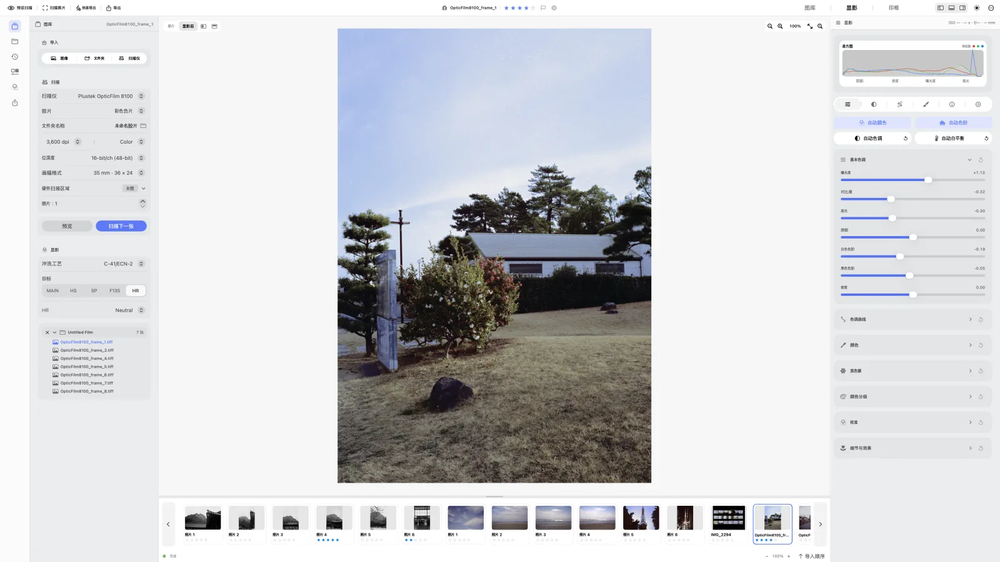
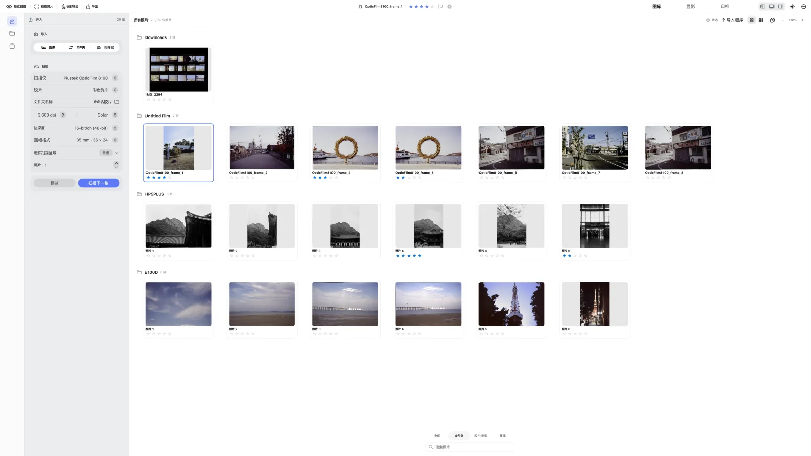
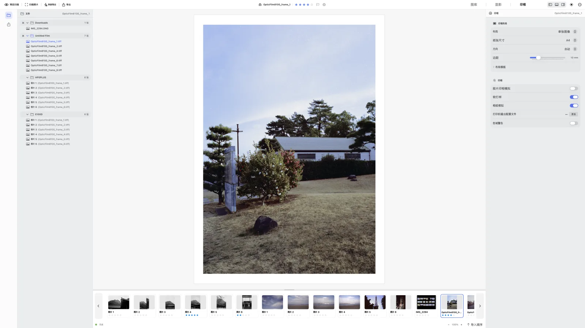

  

<h1 align="center">negaflow</h1>

从胶片到完成的照片。在 macOS 和 Windows 上各自原生运行。

  
  
  
  
  

  <a href="README.md">English</a> ·
  <a href="README_ko.md">한국어</a> ·
  <a href="README_ja.md">日本語</a> ·
  <strong>简体中文</strong> ·
  <a href="README_fr.md">Français</a> ·
  <a href="README_de.md">Deutsch</a>

  <a href="https://habinsong.github.io/negaflow-site/zh-Hans/">网站</a> ·
  <a href="https://habinsong.github.io/negaflow-site/zh-Hans/camera-scanning/">相机翻拍指南</a> ·
  <a href="https://habinsong.github.io/negaflow-site/zh-Hans/faq/">FAQ</a>

---

  <picture>
    <source media="(prefers-color-scheme: dark)" srcset="docs/images/zh-Hans/develop-dark.webp">
    
  </picture>

**negaflow** 是一款把扫描的胶片或者用相机翻拍的胶片读进来显影的应用。彩色黑白、负片正片全都可以。从图库到显影，再到印相，都在一个应用里完成。调整值和原始文件分开保存，所以原始文件保持原样。

显影引擎的名字是 **Chroma Engine**，灰尘和划痕的修复是 **GrainMend**。没有扫描仪也没关系。只导入图像文件也能显影和导出。扫描仪连接只有在另外装了插件之后才会打开。

> 和最近模拟热潮的增长不同，如今模拟摄影的流程可以说停滞了。除非用模拟的方式印相，否则胶片要经过转成数字的过程，才终于能被我们看见。
>
> 可是那整个过程都在停下来。冲扫店和实验室越来越少，厂商与产品的支持也在减少。
>
> 本项目起于我用这样那样的方式工作时感到的不便，以及觉得要是有这个功能就好了的想法。以使用 35mm 胶片和中画幅胶片时得到的经验和知识为基础，从一到十全都由我自己开发。一开始只是我一个人边用边做出来的小玩具项目，如今的 negaflow 已经成了不止于此的某种东西。
>
> 说到底最重要的是它「好」用、用着舒服、要够快，还有什么都自己妥当做出来的结果。独立开发的 **negaflow** 在 macOS 和 Windows 上各自原生运行，把冲扫店和个人的工作流都揉了进去。
>
>
> **谨以此夏，纪念尼埃普斯拍下第一张照片二百周年。** 2026年7月25日。
## negaflow for macOS and Windows

| | macOS | Windows |
|---|---|---|
| 界面 | SwiftUI | WinUI 3 |
| 引擎 | Swift + Core Image | C++ + Direct3D |
| 色彩管理 | ColorSync | Windows ICM |

两个应用作为原生应用，用不同的语言、不同的方式开发，即便如此功能和结果是一样的。

引擎代码在 macOS 上位于 `Chromabase` 模块，在 Windows 上位于 `Native` 模块。

也有同时做两套的方法(跨平台)，可那样两边都会变慢，而且没法好好运行。所以我按每个 OS 各自的方式，从头重新写了代码。哪些相同、哪些不同，[写在这里](docs/zh-Hans/platform/PLATFORM_DIFFERENCES.md)。

## 下载

在 [GitHub Releases](https://github.com/habinsong/negaflow/releases) 拿就行。

| 安装文件 | 适用环境 |
|---|---|
| `negaflow-1.1.4-mac-universal.pkg` | macOS 14 及以上，Apple Silicon 和 Intel |
| `negaflow-1.1.4-mac-arm64.pkg` | macOS 14 及以上，仅 Apple Silicon |
| `negaflow-1.1.4-win-x64.exe` | Windows 11 24H2 或更高，x64 |

大多数 Mac 用 Universal PKG 就行。当然，Silicon 用的文件和 DMG、ZIP 也都放在同一个页面上。第一次运行时要在系统设置的隐私与安全性里点一次「仍要打开」。

Windows 的安装在用户文件夹里就结束了，不会要管理员权限。没有签名，所以 SmartScreen 会拦一次。点更多信息再运行就行。卸载可以在控制面板里做。

接真的扫描仪需要另外的插件，SANE 扫描仪有 [`negaflow-scanner-sane`](https://github.com/habinsong/negaflow-scanner-sane)。当然，macOS 和 Windows 两边都能用。

## 功能
> 把模拟胶片变成完成照片的所有功能都在里面。
- 从测量片基、显影彩色与黑白的负片和正片开始
- 曝光、对比度、曲线、HSL、调色等调整需要的一切
- 锐化、降噪、颗粒、暗角、光晕这类附加选项
- 去掉灰尘和划痕来修复照片的 GrainMend。
- 有卷、文件夹、收藏集、星级、堆叠、虚拟副本，还能按相机、镜头、胶片搜索的图库
- 把显影流程、目标、影调、色彩、细节、裁剪和方向一起带走的预设与复制粘贴
- JPEG 和 16 位 TIFF 导出、ICC 配置文件，相机、镜头、胶片等记录保存进 EXIF
- 七种印相版式和纸张预览、照片用与 ISO 纸张，连 C-print 功能都有。

## Chroma Engine

**Chroma Engine** 负责胶片的反相和显影。

显影负片之前先测片基。从光一次都没照到的区域读值。自动测量偏掉的地方，用吸管点一下或者调 RGB 值就行。

默认是 `MAIN` 加手动调整。自动影调、自动白平衡、自动色阶、自动色彩只在按下去的时候才动。

其余的目标是这些。走打印机 ICC 的 `PRINT`，迷你冲扫系的 `HS` 和 `SP`，专业冲扫机系的 `F135` 和 `HR`，试着救回老胶片的 `EXPIRED`。输出可以从 sRGB、Display P3、Adobe RGB，还有自己用的 RGB ICC 里选。

反相和色彩处理的顺序在[Chroma Engine 文档](docs/zh-Hans/product/CHROMA_ENGINE.md)里。

## GrainMend

> **GrainMend** 修复灰尘、针孔、划痕和乳剂损伤。

**GrainMend RGB** 是软件方式，和硬件 IR 不一样。    
`自动` 扫过整张照片。省事，但会有误检。  
`引导` 只看指定的范围。对扫描时沾上的灰尘最管用。  
`画笔` 是自己涂掉自动漏掉的地方的工具，仿制图章把选中位置的像素原样搬过来。 
`仿制图章` 是让你选好想要的质感再自己涂上去的图章功能。  

自动和引导看着周围的纹理来填补缺陷。填之前先看方向和周边结构。要是把照片里的栏杆或者砖缝当成划痕擦掉了，那就不是修复而是破坏了。

修改结果以图层留下。可以改强度、看蒙版，也可以一个个关掉或删掉。 
**GrainMend IR** 把扫描仪插件传过来的红外通道检测结果加进同一份记录。

**GrainMend IR** 用扫描仪的红外通道(IR)，但它既不是 Digital ICE、iSRD、SRDx 的实现，也不是它们的兼容模式。工作方式和质量、性能标准整理在 [GrainMend 文档](docs/zh-Hans/product/GRAINMEND.md)里。

## 从导入到印相

1. 导入图像文件，或者用装好的插件扫描。
2. 选好显影流程的种类，指定扫描目标。
3. 在 Chroma Engine 里调色彩和影调。
4. 给需要的照片用 GrainMend。
5. 用对比视图和直方图确认之后印相或者导出。

只导入是不会显影的。要在给文件夹选好流程和目标后点**应用**，或者进到显影界面时才开始。也有单独一个自动跑的设置，默认是关的。

每个操作对原始文件做了什么，在[从图库到印相](docs/zh-Hans/product/WORKFLOW.md)里用表格整理好了。

  <picture>
    <source media="(prefers-color-scheme: dark)" srcset="docs/images/zh-Hans/library-dark.webp">
    
  </picture>

  <picture>
    <source media="(prefers-color-scheme: dark)" srcset="docs/images/zh-Hans/print-dark.webp">
    
  </picture>

## 扫描仪与胶片配置文件

negaflow 本体不会看扫描仪型号名就开功能。  只用插件报上来的分辨率、位深、扫描范围、曝光、IR 支持。按名字猜的话，设备上没有的功能会被点亮。

SANE 设备由独立的 GPL 项目 [`negaflow-scanner-sane`](https://github.com/habinsong/negaflow-scanner-sane) 负责。插件跑在自己的进程里，来往的格式是 JSON。**negaflow** 里没有 SANE 代码，也没有链接它。

内置里放了 15 个扫描仪配置文件。用我自己拍的胶片做的，记录的数据个数是 928 个。

状态全都是 `realOnly`。意思是确实用真实扫描做出来的，但还没到用独立基准验证过精度的阶段。没验证过的东西，我不想写成验证过了。配置文件不会看扫描仪名字自动挂上，得自己选。

详细内容写在[胶片配置文件文档](docs/zh-Hans/product/FILM_PROFILES.md)里。

## 文档

- [Chroma Engine](docs/zh-Hans/product/CHROMA_ENGINE.md) | 片基、反相、色彩处理与显影顺序
- [GrainMend](docs/zh-Hans/product/GRAINMEND.md) | 缺陷检测与修复、IR、编辑记录
- [胶片配置文件](docs/zh-Hans/product/FILM_PROFILES.md) | 素材分析与配置文件生成
- [从图库到印相](docs/zh-Hans/product/WORKFLOW.md) | 导入、文件夹同步、批量显影、印相
- [产品结构](docs/zh-Hans/architecture/PRODUCT_ARCHITECTURE.md) | 应用、引擎、存储与导出结构
- [全部文档](docs/zh-Hans/README.md) | 多语言(6 种语言)

## 自己构建

每个平台需要的工具和命令不一样。完整步骤在各自的文档里。[macOS](negaflow-mac/docs/README_zh-Hans.md) 需要 macOS 14 及以上和 Xcode 26，[Windows](negaflow-windows/docs/README_zh-Hans.md) 需要 Windows 11 24H2、Visual Studio 2022 和 .NET 10 SDK。仓库的工作规则整理在 [`CONTRIBUTING.md`](CONTRIBUTING.md)。

## 许可证

**negaflow** 以 [Apache License 2.0](LICENSE) 发布。与 Kodak、Fujifilm、Noritsu、LaserSoft Imaging 以及任何其他商标持有者都没有关联，也未获其赞助。产品名称只在指明兼容对象或测量对象时使用。[商标声明](TRADEMARKS.md)里写得更详细。
