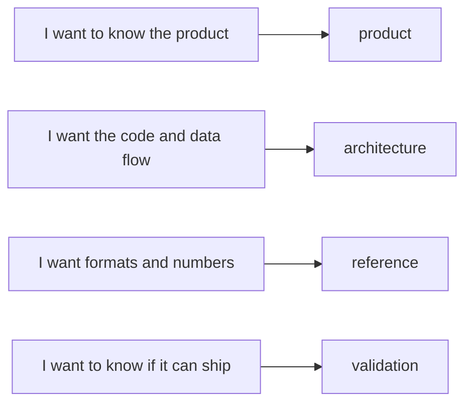

# negaflow documentation

Split by subject so you can open the one you need first.

English · [한국어](ko/README.md) · [日本語](ja/README.md) · [简体中文](zh-Hans/README.md) ·
[Français](fr/README.md) · [Deutsch](de/README.md)

> [!NOTE]
> The current version is `1.0.3`. What is built and what was actually checked
> is tracked in [Project status](product/PROJECT_STATUS.md).

## Product

| Document | Read it when |
|---|---|
| [Chroma Engine](product/CHROMA_ENGINE.md) | You want the film inversion and develop order |
| [GrainMend](product/GRAINMEND.md) | You want to see how dust and scratch repair works |
| [Film profiles](product/FILM_PROFILES.md) | You want where the bundled profiles came from, and their limits |
| [Project status](product/PROJECT_STATUS.md) | You want the implementation, measurement, and release state |

## Architecture

| Document | What it covers |
|---|---|
| [Product architecture](architecture/PRODUCT_ARCHITECTURE.md) | Data flow between app, engine, storage, and export |
| [Catalog storage](architecture/CATALOG_STORAGE.md) | Why SQLite, the old format, and the measurements |
| [Scanner plugin architecture](architecture/SCANNER_PLUGINS.md) | External process, approval, scan file disclosure |
| [Library archive](architecture/LIBRARY_ARCHIVE.md) | How originals and edit history are stored together |

## Reference

| Document | What it covers |
|---|---|
| [Scanner CLI JSON](reference/CLI_JSON.md) | Output shape of `detect --json` and `capabilities --json` |
| [Render manifest](reference/RENDER_MANIFEST.md) | SHA-256 links between source, edit values, and output file |
| [Fixed print response](reference/PRINT_RESPONSE.md) | The formula and anchors of `shoulder-print-response-v4` |
| [Scanner profile quality gate](reference/PROFILE_QUALITY_GATE.md) | Release rules for REAL/TARGET pair material |
| [Scanner noise profiles](reference/SCANNER_NOISE_PROFILES.md) | Repeat-scan measurement and when it applies automatically |
| [Film GrainMend IR should avoid](reference/INFRARED_LIMITS.md) | Black and white, Kodachrome, RGB/IR alignment limits |
| [IT8 color validation](reference/IT8_COLOR_VALIDATION.md) | Patch measurement, evidence grades, synthetic regression |

## Validation

| Document | Use it when |
|---|---|
| [Real-device QA checklist](validation/REAL_QA_CHECKLIST.md) | You check a real Mac, display, scanner, and film |
| [GrainMend real scan comparison](validation/GRAINMEND_CORPUS.md) | You measure the 44 FILM-R v2 pairs again |

## Provenance and distribution

| Document | Use it when |
|---|---|
| [Code and resource provenance](legal/PROVENANCE.md) | You check the Apache/GPL boundary and bundled resource hashes |
| [`TRADEMARKS.md`](../TRADEMARKS.md) | You check how film, scanner, and product names are used |

## How these are written

- Product documents describe only what a user sees today.
- Architecture documents describe responsibilities and how data moves.
- Code values, field names, and hashes in reference documents stay as they are.
- Validation documents separate what passed from what is not checked yet.
