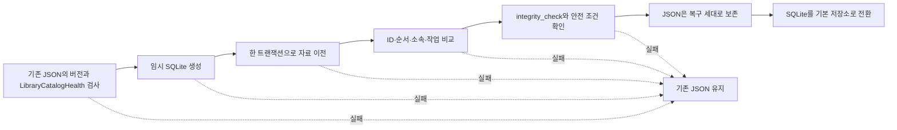

# 카탈로그 저장 구조

[문서 홈](../README.md)

현재 기본 저장소는 `library.sqlite`입니다. 기존 `library.json`은 이전 자료를 옮기거나 진단용
파일을 만들 때만 씁니다. 두 파일을 동시에 갱신하는 `dual-write` 방식은 쓰지 않습니다.

백업과 보존 아카이브에는 기기 사이에서 옮길 수 있는 JSON 표현을 넣습니다. 실행 중인 SQLite
파일 자체는 넣지 않습니다.

| 구분 | 형식 | 용도 |
|---|---|---|
| 기본 카탈로그 | SQLite | 앱 실행, 검색, 저장, 복구 |
| 이전 자료 | JSON | 기존 카탈로그 가져오기 |
| 백업·보존 아카이브 | JSON 표현 | 다른 기기로 이동하거나 복원 |

> [!IMPORTANT]
> 카탈로그가 없거나 손상됐을 때 빈 라이브러리로 시작하지 않습니다. 복구할 수 있는 정상 세대가
> 확인될 때까지 원본 카탈로그와 사진 파일을 그대로 둡니다.

## 실측 결과

다음 명령으로 같은 Mac에서 JSON과 SQLite를 비교했습니다.

<details>
<summary>측정 명령</summary>

```bash
DEVELOPER_DIR=/Applications/Xcode.app/Contents/Developer \
  NEGAFLOW_CATALOG_PERF_REPORT="$PWD/build/performance/catalog.json" \
  bash scripts/performance/run-catalog.sh

DEVELOPER_DIR=/Applications/Xcode.app/Contents/Developer \
  NEGAFLOW_LIBRARY_QUERY_PERF_REPORT="$PWD/build/performance/library-query.json" \
  bash scripts/run-library-query-performance.sh

DEVELOPER_DIR=/Applications/Xcode.app/Contents/Developer \
  NEGAFLOW_SQLITE_CATALOG_PERF_REPORT="$PWD/build/performance/catalog-sqlite.json" \
  bash scripts/performance/run-sqlite-catalog.sh
```

</details>

측정 환경은 2026-07-12, Mac14,3, arm64, 8코어, 메모리 24 GiB, macOS 26.5, Swift Release
빌드입니다. 다른 Mac의 속도를 보장하는 수치는 아닙니다. 같은 환경에서 회귀를 찾기 위한
기준값입니다.

| 프레임 | JSON 크기 | 인코딩 p50 | 디코딩 p50 | 파일 읽기 p50 |
|---:|---:|---:|---:|---:|
| 1,000 | 2,192,671바이트 | 98 ms | 241 ms | 231 ms |
| 10,000 | 21,934,841바이트 | 811 ms | 2,301 ms | 2,299 ms |
| 50,000 | 109,721,335바이트 | 2,746 ms | 7,353 ms | 7,397 ms |

50,000프레임 JSON 인코딩 때 resident memory는 약 191 MiB, max RSS는 약 107 MiB 늘었습니다.
같은 자료의 메모리 검색 준비는 32.86 ms, 전체 이름 정렬은 86.01 ms, 필터 후 이름 정렬은
158.37 ms였습니다. 필터 투영을 네 번 연속 실행한 p50은 512.80 ms였습니다.

현재 SQLite 행 저장소의 50,000프레임 Release p95:

| 작업 | p95 |
|---|---:|
| 새 커밋 | 3,714 ms |
| 기본 파일 읽기 | 7,446 ms |
| 변경 없는 커밋 | 3,856 ms |
| 프레임당 크기 | 약 4,211바이트 |

백업은 데이터베이스 전체를 `Data`로 올리지 않습니다. 복제를 지원하는 임시 사본을 만든 뒤
원자적으로 바꿉니다. 백업 전 검사도 모든 프레임을 디코딩하지 않고 SQLite 무결성과 스키마만
확인합니다. 이 변경으로 변경 없는 커밋 p95가 11,245 ms에서 3,856 ms로 줄었습니다.

## SQLite를 고른 이유

- 여러 행의 변경을 한 트랜잭션으로 묶을 수 있습니다.
- 행과 인덱스로 필요한 프레임만 읽을 수 있습니다.
- macOS의 SQLite C API를 써서 새 패키지를 추가하지 않아도 됩니다.
- 손상된 저장소를 빈 라이브러리로 취급하지 않는 현재 복구 원칙을 유지할 수 있습니다.

현재는 `journal_mode=DELETE`, `synchronous=FULL`을 씁니다. WAL은 데이터베이스와 `-wal` 파일을
한 묶음으로 다뤄야 하기 때문입니다. 실행 중인 데이터베이스를 임의로 복사하지 않고, 연결을
닫은 뒤 확인한 기본 파일만 복구 사본으로 만듭니다.

## 코드의 책임

- `CatalogStore`: 연결, 트랜잭션, 스키마 버전, 무결성 검사
- `CatalogMigration`: 읽기 전용 JSON 가져오기와 버전별 변환
- 엔티티 테이블: 프레임, 원본, 순서, 롤, 폴더, 컬렉션, 검색, 스캔 작업
- `LibraryBackupStore`: 이동 가능한 JSON 백업, 복원 사전 검사, 복구 정보

현상 값과 버전별 편집 기록은 엔티티마다 JSON BLOB으로 저장합니다. 원본 픽셀, 썸네일,
GrainMend 캐시는 데이터베이스에 넣지 않습니다.

아직 검색·정렬용 열과 인덱스가 충분하지 않아 시작할 때 전체 카탈로그를 메모리에 올립니다.
그래서 현재 SQLite 읽기 시간은 JSON과 비슷합니다. 다음 단계는 필요한 열과 프레임만 읽는
인덱스 조회입니다.

## 이전 JSON을 옮기는 순서



하나라도 실패하면 기존 JSON을 그대로 둡니다. 빈 카탈로그로 시작하지 않습니다. 중간 파일과
표식이 남았을 때도 원본 SHA-256과 두 카탈로그가 맞아야 이어서 진행합니다.

SQLite로 옮긴 뒤에는 JSON으로 자동 복귀하지 않습니다. 이전 앱이 JSON을 수정해 저장소가 둘로
갈라지는 일을 막기 위해 최소 읽기 버전과 이전 완료 표식을 확인합니다.

## 고르지 않은 방식

- **카탈로그 전체를 JSON 하나에 저장:** 단순하지만 50,000프레임 읽기에 약 7.4초가 걸리고,
  저장할 때마다 전체 파일을 다시 씁니다.
- **프레임마다 JSON 파일을 나눔:** 일부 쓰기는 줄지만 여러 엔티티를 한 번에 저장하고 관계를
  검증하는 코드를 직접 만들어야 합니다.
- **Core Data로 즉시 교체:** 가능한 선택이지만 현재의 Codable 변환과 복구 계약을 한꺼번에
  다시 만들어야 합니다. 실제 시제품이 raw SQLite보다 낫다는 측정이 나오면 다시 검토합니다.

## 참고 자료

- [Apple: Tuning for Performance and Responsiveness](https://developer.apple.com/library/archive/documentation/General/Conceptual/MOSXAppProgrammingGuide/Performance/Performance.html)
- [Apple: Reducing disk writes](https://developer.apple.com/documentation/xcode/reducing-disk-writes)
- [SQLite: Atomic Commit](https://sqlite.org/atomiccommit.html)
- [SQLite: Write-Ahead Logging](https://sqlite.org/wal.html)
