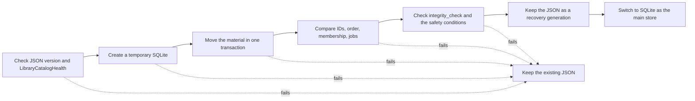

# Catalog storage

[Docs home](../README.md)

The main store is `library.sqlite`.
The old `library.json` is used only to bring older material across or to write a diagnostic file.
Nothing updates both files at once, so there is no `dual-write`.

Backups and preservation archives carry a JSON form that moves between machines.
The running SQLite file does not go in.

| Kind | Format | Used for |
|---|---|---|
| Main catalog | SQLite | Running the app, search, save, recovery |
| Older material | JSON | Importing an existing catalog |
| Backup and preservation archive | JSON form | Moving to another machine, or restoring |

> [!IMPORTANT]
> A missing or damaged catalog does not start an empty library. The original catalog and the
> photo files stay untouched until a healthy generation is found.

## Measurements

JSON and SQLite were compared on the same Mac with these commands.

<details>
<summary>Measurement commands</summary>

```bash
DEVELOPER_DIR=/Applications/Xcode.app/Contents/Developer \
  NEGAFLOW_CATALOG_PERF_REPORT="$PWD/build/performance/catalog.json" \
  bash scripts/performance/run-catalog.sh

DEVELOPER_DIR=/Applications/Xcode.app/Contents/Developer \
  NEGAFLOW_LIBRARY_QUERY_PERF_REPORT="$PWD/build/performance/library-query.json" \
  bash scripts/run-library-query-performance.sh

DEVELOPER_DIR=/Applications/Xcode.app/Contents/Developer \
  NEGAFLOW_SQLITE_CATALOG_PERF_REPORT="$PWD/build/performance/catalog-sqlite.json" \
  bash scripts/performance/run-sqlite-catalog.sh
```

</details>

Measured on 2026-07-12: Mac14,3, arm64, 8 cores, 24 GiB memory, macOS 26.5, Swift Release build.
These numbers say nothing about another Mac.
They are a baseline for catching regressions in the same setup.

| Frames | JSON size | Encode p50 | Decode p50 | File read p50 |
|---:|---:|---:|---:|---:|
| 1,000 | 2,192,671 bytes | 98 ms | 241 ms | 231 ms |
| 10,000 | 21,934,841 bytes | 811 ms | 2,301 ms | 2,299 ms |
| 50,000 | 109,721,335 bytes | 2,746 ms | 7,353 ms | 7,397 ms |

Encoding 50,000 frames to JSON grew resident memory by about 191 MiB and max RSS by about 107 MiB.
On the same material, preparing the in-memory search took 32.86 ms, sorting all names took 86.01 ms,
and sorting names after a filter took 158.37 ms.
Four filter projections in a row had a p50 of 512.80 ms.

The SQLite row store at 50,000 frames, Release p95:

| Operation | p95 |
|---|---:|
| New commit | 3,714 ms |
| Reading the main file | 7,446 ms |
| Commit with no changes | 3,856 ms |
| Size per frame | about 4,211 bytes |

A backup does not pull the whole database into `Data`.
It makes a temporary copy that supports replication, then swaps it atomically.
The pre-backup check does not decode every frame either: it checks SQLite integrity and the schema.
That took the p95 for a commit with no changes from 11,245 ms down to 3,856 ms.

## Why SQLite

- Many row changes fit in one transaction.
- Rows and indexes let it read only the frames it needs.
- The SQLite C API on macOS means no new package.
- The current recovery rule survives: a damaged store is never treated as an empty library.

Right now it runs `journal_mode=DELETE` and `synchronous=FULL`.
WAL would mean handling the database and the `-wal` file as one unit.
The running database is never copied on a whim.
Only the main file, checked after the connection closes, becomes a recovery copy.

## Who does what in the code

- `CatalogStore`: connection, transactions, schema version, integrity checks
- `CatalogMigration`: read-only JSON import and per-version conversion
- Entity tables: frames, originals, ordering, rolls, folders, collections, search, scan jobs
- `LibraryBackupStore`: portable JSON backup, restore pre-checks, recovery information

Develop values and versioned edit history are stored as a JSON BLOB per entity.
Source pixels, thumbnails, and GrainMend caches stay out of the database.

There are still not enough columns and indexes for search and sorting,
so the whole catalog loads into memory at startup.
That is why SQLite read time looks like JSON today.
Next comes index lookups that read only the columns and frames in use.

## Moving older JSON across



If any step fails, the existing JSON stays as it is. It never starts with an empty catalog.
Even when intermediate files and markers are left behind,
work continues only when the source SHA-256 and both catalogs agree.

After the move there is no automatic fall back to JSON.
To stop an older app from editing the JSON and splitting the store in two,
the minimum read version and the migration marker are checked.

## What was not chosen

- **The whole catalog in one JSON file:** simple, but reading 50,000 frames takes about
7.4 seconds, and every save rewrites the file.
- **One JSON file per frame:** some writes shrink, but saving several entities at once and
validating their relationships means writing that code by hand.
- **Switching to Core Data now:** possible, but it means rebuilding the Codable conversion and
the recovery contract in one move.
Worth revisiting if a real prototype measures better than raw SQLite.

## Sources

- [Apple: Tuning for Performance and Responsiveness](https://developer.apple.com/library/archive/documentation/General/Conceptual/MOSXAppProgrammingGuide/Performance/Performance.html)
- [Apple: Reducing disk writes](https://developer.apple.com/documentation/xcode/reducing-disk-writes)
- [SQLite: Atomic Commit](https://sqlite.org/atomiccommit.html)
- [SQLite: Write-Ahead Logging](https://sqlite.org/wal.html)
