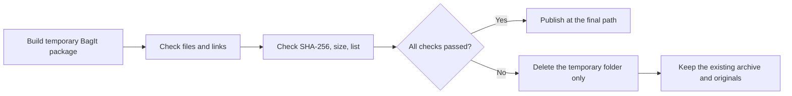

# Library archive

[Docs home](../README.md)

A catalog backup is there to get the app running again, so it does not hold the original photos.
The `.negaflowarchive` archive keeps the following material in one package.

| Included | Left out |
|---|---|
| Portable catalog JSON | The running SQLite file |
| Referenced originals and remaining IR originals | Thumbnails and previews |
| The GrainMend edit history that is still needed | GrainMend caches that can be rebuilt |
| The link between virtual copies and shared originals | Exported files |

The running SQLite file is not included.
Anything that can be rebuilt is also left out: thumbnails, previews, GrainMend caches, exported
files.

> [!WARNING]
> If the archive fails to build, the existing archive is not overwritten. Originals,
> third-party XMP, and the running catalog are not touched either.

## Package layout and checks

The package follows the [RFC 8493 BagIt](https://www.rfc-editor.org/rfc/rfc8493.html) folder layout.
SHA-256 lists are written separately for content files and for administrative files.
`negaflow-archive.json` connects frame IDs to stored file IDs.
When several virtual copies use the same original, the original bytes are stored once.

The temporary folder moves to its final location only after all of these pass.

1. The current app can read the catalog safely.
2. Originals and IR inputs are regular files, and their size and modification time do not change while copying.
3. Every GrainMend record that is needed can be read.
4. SHA-256, byte counts, the file list, and `Payload-Oxum` match.
5. The links from frames to originals, IR files, and GrainMend records match the catalog.

On failure the existing archive stays. Only the half-built temporary folder is deleted.
Originals, third-party XMP, and the running catalog are left alone.

## Limits

Original formats are kept as they are. Nothing is converted for the sake of long-term compatibility.
PREMIS preservation events and agent records, and migration to recommended formats, are outside v1.

One archive is not a preservation plan.
Keep copies on other media and in another place, and check the hashes again on a schedule.

Sources:

- [RFC 8493: The BagIt File Packaging Format](https://www.rfc-editor.org/rfc/rfc8493.html)
- [Library of Congress PREMIS](https://www.loc.gov/standards/premis/)
- [Library of Congress Recommended Formats Statement](https://www.loc.gov/preservation/resources/rfs/)
