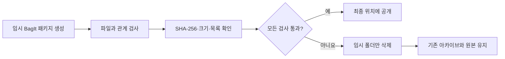

# 라이브러리 보존 아카이브

[문서 홈](../README.md)

카탈로그 백업은 앱을 빠르게 복구하기 위한 파일이라 원본 사진을 넣지 않습니다.
`.negaflowarchive` 보존 아카이브는 다음 자료를 한데 묶습니다.

| 포함 | 제외 |
|---|---|
| 이동 가능한 카탈로그 JSON | 실행 중인 SQLite 파일 |
| 참조 중인 원본과 남아 있는 IR 원본 | 썸네일과 미리보기 |
| 필요한 GrainMend 편집 기록 | 다시 만들 수 있는 GrainMend 캐시 |
| 가상 사본과 공유 원본의 관계 | 내보낸 파일 |

실행 중인 SQLite 파일은 넣지 않습니다. 썸네일, 미리보기, GrainMend 캐시, 내보낸 파일처럼
다시 만들 수 있는 자료도 빼둡니다.

> [!WARNING]
> 아카이브 생성에 실패하면 기존 아카이브를 덮어쓰지 않습니다. 원본, 제3자 XMP, 실행 중인
> 카탈로그도 수정하지 않습니다.

## 파일 구성과 검사

패키지는 [RFC 8493 BagIt](https://www.rfc-editor.org/rfc/rfc8493.html) 폴더 구조를 따릅니다.
내용 파일과 관리 파일의 SHA-256 목록을 각각 기록합니다. `negaflow-archive.json`은 프레임 ID와
보관 파일 ID의 관계를 잇습니다. 여러 가상 사본이 같은 원본을 쓰면 원본 바이트는 한 번만
저장합니다.

다음 검사를 모두 통과해야 임시 폴더를 최종 위치로 옮깁니다.

1. 현재 앱이 카탈로그를 안전하게 읽을 수 있습니다.
2. 원본과 IR 입력은 일반 파일이며 복사 중 크기와 수정 시간이 바뀌지 않습니다.
3. 필요한 GrainMend 기록을 모두 읽을 수 있습니다.
4. SHA-256, 바이트 수, 파일 목록, `Payload-Oxum`이 맞습니다.
5. 프레임과 원본, IR, GrainMend 기록의 연결이 카탈로그와 같습니다.

실패하면 기존 아카이브를 덮어쓰지 않습니다. 덜 만들어진 임시 폴더만 지웁니다. 원본,
제3자 XMP, 실행 중인 카탈로그는 건드리지 않습니다.

## 한계

원본 형식은 그대로 보존합니다. 장기 호환성을 이유로 파일 형식을 임의로 바꾸지 않습니다.
PREMIS의 보존 사건·담당자 기록과 권장 형식으로의 이전은 v1 범위가 아닙니다.

이 아카이브 하나로 장기 보존이 끝나는 것도 아닙니다. 다른 저장 매체와 외부 장소에 사본을
두고, 정기적으로 해시를 다시 확인해야 합니다.

참고 자료:

- [RFC 8493: The BagIt File Packaging Format](https://www.rfc-editor.org/rfc/rfc8493.html)
- [Library of Congress PREMIS](https://www.loc.gov/standards/premis/)
- [Library of Congress Recommended Formats Statement](https://www.loc.gov/preservation/resources/rfs/)
