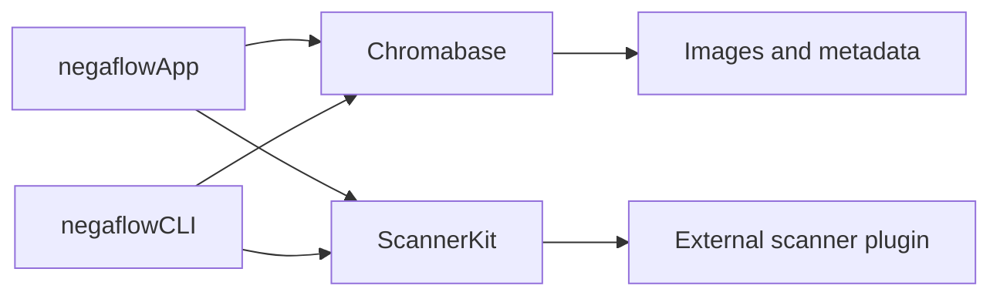
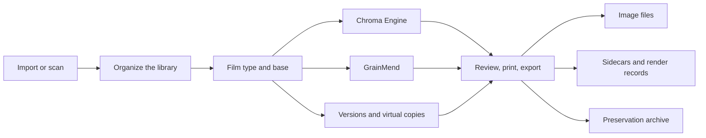

# Product architecture

[Docs home](../README.md)

negaflow is a macOS app.
You import or scan film images, then go through inversion, develop, GrainMend, output, and
preservation.
Every edit is kept apart from the original.

> [!IMPORTANT]
> Originals, edit history, caches, and output files are different material. Losing a cache must
> not lose the original or the edit history, and an export fails rather than ship a result it
> cannot rebuild.

## Safety rules that do not change

1. Original images and third-party sidecars are never overwritten automatically.
2. Removing something from the library and moving the original to the Trash are separate actions.
3. The scanner screen shows only what the plugin reported.
4. A fake scanner never stands in unless you pick the demo yourself.
5. If an edited result cannot be rebuilt, the original is not exported in its place.
6. A long job re-checks the frame, edit version, and session right before it applies its result.
7. A cache has to be rebuildable from the original and the edit history.
8. Under-verified profiles, output bundles, and archives are not published as a finished result.

## Modules



### `Chromabase`

The Chroma Engine and the image processing core.

- Reading images and handling orientation
- Film base measurement
- Negative and positive develop
- Tone, color, and local adjustments
- Film, look, and scanner profiles
- GrainMend RGB and IR
- Histogram and color measurement
- Output encoding and metadata

More detail:

- [Chroma Engine](../product/CHROMA_ENGINE.md)
- [GrainMend](../product/GRAINMEND.md)

### `ScannerKit`

Not a scanner driver. It owns the contract that connects an external plugin.

- Scanner ID and capabilities
- Request and response JSON
- Running the external process, timeouts, cancellation
- Plugin owner, permissions, approval, hash
- Checking temporary output, then publishing the final file
- Scan sessions and job history
- The demo scanner you have to turn on yourself

The SANE implementation lives in a separate GPL project,
[`negaflow-scanner-sane`](https://github.com/habinsong/negaflow-scanner-sane).
The app and the plugin talk over JSON and the CLI only.

### `negaflowCLI`

Uses the same engine and `ScannerKit` as the GUI.

- Finding scanners, checking capabilities, scanning
- Developing several images
- Listing scanner profiles
- GrainMend `defect-bench`
- IT8 and scanner-relative comparison
- Self-checks and JSON automation

### `negaflowApp`

The app people use, built with SwiftUI and AppKit.

- Library, develop, print, canvas
- Scan, GrainMend, export
- Versions, settings, shortcuts
- Catalog, cache, backup, preservation archive
- A localized About window whose product version comes from the shared version resource

## User flow



Each step adds to the catalog and the edit history instead of changing the original.

## Input and originals

### Importing files

The default way in. It handles TIFF, JPEG, PNG, and the camera RAW that macOS Image I/O can read.
The embedded ICC and orientation are read, and the original ID goes into the catalog.

### Scanning

An installed plugin can report these capabilities.

- Resolution and bit depth
- Scan area and preview
- Exposure
- IR
- Batch and holder behavior

The app never invents a capability from a table of model names.
When a scan finishes, the settings the plugin actually applied and the output file are checked
again.

### Original ID

A file path alone does not identify an original.
The values the current contract needs are kept: file observations, byte count, modification time,
SHA-256, and a persistent bookmark.

If a file moved, the path changes only when you relink it yourself or bookmark recovery succeeds.

## Catalog

The main store is `library.sqlite`.
The old `library.json` is used to bring confirmed older material across, or to write a backup that
can move between machines.
The two stores are never updated at once.

What goes into SQLite:

- Frames and originals
- Rolls, folders, collections, searches
- Ordering and scan jobs
- Develop values and per-version edit history

What does not:

- Original pixels
- Thumbnails and previews
- GrainMend caches

### Migrating from JSON

1. Check the schema and health of the existing JSON.
2. Keep a recovery copy.
3. Write it into a temporary SQLite in one transaction.
4. Compare the catalog before and after.
5. Check SQLite integrity and the app's safety conditions.
6. Switch the main store over only when all of it lines up.

A JSON file that failed is not treated as an empty catalog.
The numbers and the decision behind them are in [Catalog storage](CATALOG_STORAGE.md).

## Library

Organizing:

- Folders, rolls, manual collections, smart collections, saved searches, stacks
- Star ratings, pick and reject, color labels
- Grid, compare, survey
- Reviewing duplicate candidates

Several virtual copies can share one original.
Before an original is deleted, its references are checked first.
Removing something from the library only changes catalog references.
Moving to the Trash is a separate action.

Edits survive an external disk going away.
The original is marked offline and you relink it by file or by folder.
If the ID is not the one expected, nothing is swapped automatically.

Each registered physical source folder has one file-system watcher. Events are coalesced briefly,
then only the changed folder is rescanned. Bookmark-based relinking preserves the catalog folder ID
when Finder moves or renames a source, and newly added direct-child images are imported without
polling or rescanning the whole library.

## Develop and GrainMend

Each frame carries:

- Original ID and film type
- Film base
- Develop values
- GrainMend edit history
- Version history
- Export state

While you adjust, a lower-resolution preview is used.
A finished result reaches the screen only when its frame ID and edit version still match the current
selection.

Export does not save the preview bitmap on screen.
It rebuilds the full-resolution image from the original and the edit values it pinned.

GrainMend keeps automatic, guided, brush, clone stamp, and IR in an ordered list.
Caches are derived files.
If a result cannot be rebuilt from the original and the edit history, the export fails.

More detail is in [GrainMend](../product/GRAINMEND.md).

## Versions

- **History and Snapshot:** record a develop state yourself, then compare it or go back to it.
- **Virtual Copy:** another branch of edits without duplicating the original file.
- **Copy/Paste:** paste a chosen range such as tone, color, detail, or geometry. Masks that need
original coordinates get their safety conditions checked.

## Export

At the start, these values are pinned as one bundle.

- Original ID
- Develop and GrainMend edit history
- Scanner profile bytes and SHA-256
- Output settings and metadata policy
- File name and destination

Stopping and resuming an export uses the same bundle.

### Several output files

One export can produce a JPEG/TIFF, a sidecar, XMP, and `-main-flat` together.

1. Check the destination and name conflicts up front.
2. Write every file to a temporary folder.
3. Reopen the image and check its pixel size.
4. Compute byte counts and SHA-256.
5. Write the sidecar and the render record.
6. Leave a commit record.
7. Move the whole bundle to its final location.
8. On failure, roll back or clean up on the next run.

A partial set of files is never marked as success.

### Render record v3

Instead of paths, it records the SHA-256 relationships between:

- Original bytes
- The actual render input
- Develop and GrainMend history
- Scanner profile
- Decoder and renderer versions
- Output bytes, pixel size, format

There is no digital signature and no certificate, so this is not called C2PA Content Credentials.
More detail is in [Render manifest](../reference/RENDER_MANIFEST.md).

## Print and soft proof

Supported layouts:

- Single image
- Contact sheet
- Picture package
- Custom package
- Cyanotype
- Glass plate
- Gelatin silver

Single image and the three historical layouts make one vertically stacked page per selected photo.
Contact sheet, picture package, and custom package instead report and export their finished page
count. For 39 photos that means one 6 × 7 contact-sheet page, 10 four-up picture-package pages, one
default custom-package page, or 39 individual files.

Package preview reuses available thumbnails and developed images, and only materializes a small
fast preview when one is missing. Final export calculates placement from metadata, develops only
the pixels needed for each cell, prepares two to four unique sources at once, keeps the Core Image
graph connected until the page write, and enforces a 512 MiB per-page source-raster budget.

Every package placement observes the frame assigned to it. The printer output ICC is applied once,
to the complete final page, after layout is done, so repeated and mixed-source packages use the
same output contract. It never changes the Library or Develop preview.
Neither the original scan TIFF nor `-main-flat` gets a printer profile.

Without a valid RGB printer ICC, no other profile is substituted.
The bytes and SHA-256 of the profile you chose go into the output record.

## Preservation archive

What goes into `.negaflowarchive`:

- The portable catalog JSON
- Original files
- IR originals
- The GrainMend history that is needed
- The relationship between virtual copies and the original they share

Thumbnails, previews, GrainMend caches, and exported files can be rebuilt, so they stay out.
It uses the RFC 8493 BagIt structure with a SHA-256 list, and every file and relationship is checked
before the bundle moves to its final location.

- [Library archive](LIBRARY_ARCHIVE.md)
- [RFC 8493](https://www.rfc-editor.org/info/rfc8493/)
- [PREMIS](https://www.loc.gov/standards/premis/)

Long-term preservation also needs other media, an off-site copy, and regular hash checks.

## Scanner plugin safety

When a plugin is found, these are checked.

- Whether the current user owns it
- Whether a group or another user can write it
- Whether it is a symbolic link
- The ID and SHA-256 of the listing and of the executable
- Whether the ID you approved is still the ID in front of you

If the file changed, the earlier approval is not reused.

Protocol v2 uses a request ID and a sequence number, and requires exactly one final result.
Output size has a ceiling, and after a timeout or a cancel the process and its pipes are cleaned up.

A plugin never publishes a file to the final location itself.
The app hands it a temporary location, checks format, size, ID, and the settings actually applied,
then moves the file into the app's storage.

The full contract is in [Scanner plugin architecture](SCANNER_PLUGINS.md).

## Performance boundaries

Images:

- One shared `CIContext`
- An image graph computed when it is needed
- Low-resolution adjustment kept separate from full-resolution output
- Cancellation, and stale results refused
- GrainMend processed by region, tile, and patch
- Caches dropped under memory pressure

Catalog:

- SQLite transactions and per-entity rows
- Backup through replication
- Integrity checks
- Measured at 50,000 frames

Today the whole catalog is loaded into memory at startup.
On the same Mac, reading SQLite took about 7.4 seconds, close to JSON.
Reading only the rows needed, through an index, is the next step.

The performance limits in the repository are wide ceilings meant to catch a large regression.
They are not a promise that every supported Mac feels comfortable.

## What is verified

```bash
DEVELOPER_DIR=/Applications/Xcode.app/Contents/Developer swift test
bash scripts/run-app.sh build
```

What automated checks do not settle:

- Real scanners and plugins
- Real RGB/IR alignment and film compatibility
- GrainMend quality at 100%
- The UI, including display size and accessibility
- Developer ID, notarization, Gatekeeper
- Installing on a clean Mac
- Performance on another Mac

## Document guide

| What you want | Document |
|---|---|
| Current implementation and verification state | [Project status](../product/PROJECT_STATUS.md) |
| Inversion and develop | [Chroma Engine](../product/CHROMA_ENGINE.md) |
| Defect repair | [GrainMend](../product/GRAINMEND.md) |
| Film profiles | [Film profiles](../product/FILM_PROFILES.md) |
| Connecting a scanner | [Scanner plugin architecture](SCANNER_PLUGINS.md) |
| Release criteria for profiles | [Scanner profile quality gate](../reference/PROFILE_QUALITY_GATE.md) |
| Checking real hardware and displays | [Real-device QA checklist](../validation/REAL_QA_CHECKLIST.md) |
| Preservation archive | [Library archive](LIBRARY_ARCHIVE.md) |
| Hash relationships of output files | [Render manifest](../reference/RENDER_MANIFEST.md) |
