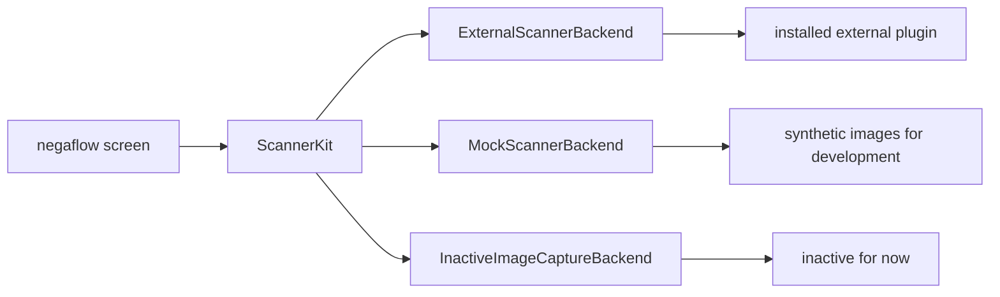
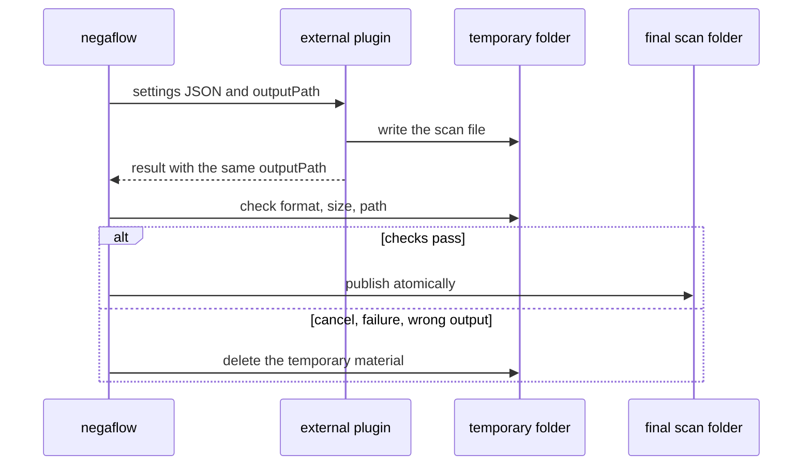

# Scanner plugin architecture

[Docs home](../README.md)

The default input for negaflow is importing images.
A real scanner is connected only when an external plugin is present.

> [!IMPORTANT]
> The app does not guess capabilities from a scanner model name. Only what the plugin reports
> goes into the screen and the requests, and the demo device shows up only when you pick demo
> mode yourself.

## Parts

| Part | Role |
|---|---|
| Image import | Sends RAW, DNG, TIFF, PNG, and JPEG into the develop path. |
| External plugin | Runs as its own process, drives the real device, talks JSON. |
| Demo scanner | Provides `negaflow Scanner` and `negaflow Flatbed Scanner` for development. You have to select demo to use it. |
| ImageCaptureCore link | Inactive compatibility code for macOS Image Capture devices. |

There is no SANE implementation in this repository. That code sits in a separate GPL project.

- <https://github.com/habinsong/negaflow-scanner-sane>

## How it connects

The screen sees only `ScannerBackend`.
A plugin device ID appears in the app as `plugin:<pluginId>:<deviceId>`.

When the plugin runs, `plugin:<pluginId>:` is stripped and only the plugin's own device ID is sent.

## Finding plugins

The default folder is `~/Library/Application Support/negaflow/Plugins/<id>/manifest.json`.

For tests and local development, `NEGAFLOW_PLUGINS_DIR` points at another folder.

| Field | Rule |
|---|---|
| `schemaVersion` | Exactly `1` today |
| `protocolVersion` | `1` if omitted, `1` and `2` supported |
| `id` | Unique plugin ID |
| `name` | Name shown on screen |
| `kind` | Plugin kind |
| `license` | Distribution license |
| `homepage` | Project address |
| `executable` | Path to the executable |

`id` is 1 to 64 ASCII characters.
The first is a letter or digit; the rest are letters, digits, `.`, `_`, or `-`.
`:` is the device ID separator, so it is not allowed.

A plugin opens only when the manifest and the executable both check out.
Older or future schemas and unknown protocols are not read by guesswork.

### File safety checks

> [!WARNING]
> If the bytes of the manifest or the executable change, the earlier approval is discarded.
> Ownership, permissions, symlink status, and SHA-256 are checked again right before running.

- The plugin folder, manifest, and executable have to be owned by the current user.
- Writable by group or others is refused.
- Symlinks are refused.
- The SHA-256 of the manifest and the executable is recorded.
- The user approves it the first time it is used.
- Changed file bytes void the approval.
- The IDs are recomputed right before running.

## Commands

The plugin runs as its own process.

| Command | Result |
|---|---|
| `detect` | JSON device list |
| `capabilities <deviceId>` | JSON capability list. Can take the device ID, vendor, and model JSON reported by `detect` on stdin |
| `scan` | Settings JSON on stdin; progress NDJSON and a final result on stdout |

## Scan protocol

### Version 1

The older compatibility spec.
Requests and NDJSON have no `protocolVersion`, `requestID`, or `sequence`.
It cannot report the settings that were actually applied, so the result is recorded as
`.unknownLegacy(protocolVersion: 1)`.
Request values are not copied over as if they had been verified.

### Version 2

Used only when the manifest carries `"protocolVersion": 2`.

What goes into a request:

- `protocolVersion: 2`
- A `requestID` UUID created by the app

A `capabilities` response may return the optional field `capabilityToken`.
The app does not interpret it.
It passes the value through to the next v2 `scan` request for the same device, and nowhere else.
It is left out of v1 requests, and tokens are never mixed between devices.
The plugin has to check the token's format and validity itself.

To stop a wrong reconnection to another model on the same backend, the app passes the `deviceID`,
`vendor`, and `model` from the last `detect` back in as optional stdin JSON for `capabilities`.
Existing plugins can ignore this input.
A plugin whose device address can change should tie that identity into the capability snapshot and
check it again on the next `scan`.

Every NDJSON event repeats the same version and request ID, and carries a `sequence` of zero or more
that is larger than the one before.
Only `progress`, `result`, and `error` are allowed.

`result` and `error` are final events. Anything after them fails.
A scan that did not end in an error has exactly one `result`.

All of these fail closed.

- An event that cannot be read
- A missing or different version or request ID
- A repeated or out-of-order sequence
- An unknown event
- A duplicate result
- Extra output after the final event
- Invalid UTF-8

A v2 spec violation ends the plugin immediately instead of waiting for the usual time limit.

### Settings that were actually applied

A v2 `result` must carry `appliedOptions`.

- `deviceID`, `resolutionDPI`, `bitDepth`, `colorMode`, `filmType`
- `scanArea`: `originXMM`, `originYMM`, `widthMM`, `heightMM`
- `infrared`, `multiExposure`
- `hardwareExposureTime`, `brightnessAdjustment`, `contrastAdjustment`
- `outputRawTIFF`

Those last three adjustments need their keys present even when the value is `null`.

`resolutionDPI: 0` means preview. A preview that is not 0, or a full scan that is 0, is refused.
Unknown values, a different device, and a resolution, bit depth, or IR state that disagrees between
the result header and `appliedOptions` are refused as well.

Once the checks pass, the app records its own scanner ID and request ID instead of the plugin ID,
and keeps the final output path.
Only then is it marked `.verified(options)`.

`ScanResult.resolution` and `bitDepth` may fall back to the requested values in v1.
The fields that show the origin, `reportedResolution` and `reportedBitDepth`, take only correct
values the result reported itself.

## Positioned flatbed scan area

A flatbed scan with a chosen position turns on only when the plugin reports all of these.

- Preview
- `supportsPositionedScanArea`
- `scanOriginXRange` and `scanOriginYRange` in mm
- `scanWidthRange` and `scanHeightRange` in mm

The app expands the chosen area outward to the plugin's step size and makes one full scan job per
area.
It never guesses this from a model name.
Older plugins without the optional fields keep the fixed frame flow.

## Process limits and cancellation

- stdout cap: 4 MiB
- stderr cap: 1 MiB

Going over the cap ends the process and fails.
During cleanup, only the bytes that already arrived are read.
Even if a child process inherited the pipe, nothing waits for EOF.

`cancelScan()` returns after the plugin has ended, the pipe handlers are closed, and the slot for
the next job is free.

## Publishing the scan file

The plugin writes the source image to exactly the `outputPath` the app gave it, and returns the same
path in the result.
That path is a temporary location on the same disk as the final folder.

The app confirms:

- A regular file that is not empty
- An image ImageIO can read
- The expected format and pixel size
- The same path in the request and the result

Only then does it move to the final location.
On cancel, timeout, wrong output, or plugin failure, the temporary folder is deleted and no partial
scan is published.

A v2 IR file also has to sit inside the temporary folder the app gave.
File type, readability, and pixel size are checked. v1 can take an external IR path, for
compatibility with plugins already in the field.

## The SANE boundary

The SANE implementation, its dependencies, configuration, device-specific processing, tests, and
release documentation all live in the separate
[`negaflow-scanner-sane`](https://github.com/habinsong/negaflow-scanner-sane) repository.

That project publishes a standard macOS 14+ installer using Homebrew's stock SANE and a separate
macOS 26+ Coolscan installer that builds official SANE 1.4.0 with the minimal upstream
`coolscan2`/`coolscan3` allocation fix. The standard path does not proactively block Coolscan, but
it does not contain that fix.

This repository documents and checks the device-independent external process spec only.
Anyone who just imports image files does not need a scanner plugin.

The negaflow app does not link the SANE implementation or put it in the app distribution.
The plugin has its own repository, executable, source distribution, and GPL license.
This document records the structure; it does not settle whether something is a derivative work.
Before an actual release, the files in both artifacts and the communication contract are checked
again.

## Checks

The app tests run a fake external plugin as a real process and confirm:

- Finding plugins
- Finding devices
- Capability wiring
- Progress events
- The final result
- Cleanup after cancel and failure

The SANE implementation is checked separately, in the plugin repository's SwiftPM tests and Release
build.
