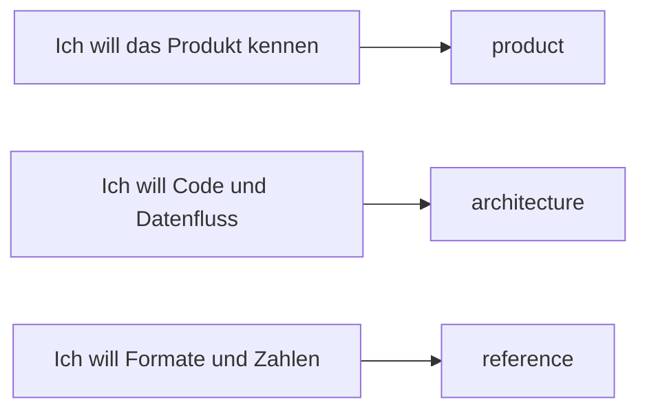

# negaflow-Dokumentation

Nach Themen getrennt, damit Sie direkt das passende Dokument öffnen.

[English](../README.md) · [한국어](../ko/README.md) · [日本語](../ja/README.md) · [简体中文](../zh-Hans/README.md) · [Français](../fr/README.md) · Deutsch

> [!NOTE]
> negaflow 1.1.4 läuft auf macOS und auf Windows. Beide Apps sind getrennt für ihre Plattform geschrieben und liefern aus derselben Datei dasselbe Bild.

## Plattform

| Dokument | Wann lesen |
|---|---|
| [Wo sich macOS und Windows unterscheiden](platform/PLATFORM_DIFFERENCES.md) | Sie wollen wissen, was gleich ist und was nicht |
| [macOS-Dokumentation](../../negaflow-mac/docs/README_de.md) | Sie installieren, bauen oder nutzen die CLI unter macOS |
| [Windows-Dokumentation](../../negaflow-windows/docs/README_de.md) | Sie installieren, bauen oder prüfen die Engine unter Windows |

## Produkt

| Dokument | Wann lesen |
|---|---|
| [Von der Bibliothek zum Druck](product/WORKFLOW.md) | Für Import, Ordnerentwicklung, Kopieren/Einfügen und Druckablauf |
| [Chroma Engine](product/CHROMA_ENGINE.md) | Sie wollen Filmumkehr und Entwicklungsreihenfolge |
| [GrainMend](product/GRAINMEND.md) | Sie wollen sehen, wie Staub- und Kratzerreparatur arbeitet |
| [Filmprofile](product/FILM_PROFILES.md) | Sie wollen Herkunft und Grenzen der mitgelieferten Profile |

## Struktur

| Dokument | Inhalt |
|---|---|
| [Produktstruktur](architecture/PRODUCT_ARCHITECTURE.md) | Datenfluss zwischen App, Engine, Speicher und Export |
| [Katalogspeicherung](architecture/CATALOG_STORAGE.md) | Warum SQLite, das alte Format, die Messwerte |
| [Scanner-Plugin-Struktur](architecture/SCANNER_PLUGINS.md) | Externer Prozess, Freigabe, Offenlegung der Scandateien |
| [Bibliotheksarchiv](architecture/LIBRARY_ARCHIVE.md) | Wie Originale und Bearbeitungsverlauf zusammen abgelegt werden |

## Referenz

| Dokument | Inhalt |
|---|---|
| [Scanner-CLI-JSON](reference/CLI_JSON.md) | Ausgabeform von `detect --json` und `capabilities --json` |
| [Render-Protokoll](reference/RENDER_MANIFEST.md) | SHA-256-Verbindung von Quelle, Bearbeitungswerten und Ausgabedatei |
| [Abzugslayouts und C-Print-Vorschau](reference/C_PRINT.md) | Sieben Layouts, Export fertiger Seiten, optimiertes Rendering, Softproof-ICC und Genauigkeitsgrenzen |
| [Feste Printantwort](reference/PRINT_RESPONSE.md) | Formel und Ankerpunkte von `shoulder-print-response-v4` |
| [Qualitätsprüfung der Scannerprofile](reference/PROFILE_QUALITY_GATE.md) | Freigaberegeln für REAL/TARGET-Paarmaterial |
| [Scanner-Rauschprofile](reference/SCANNER_NOISE_PROFILES.md) | Messung über Wiederholungsscans und automatische Anwendung |
| [Filme, die GrainMend IR meidet](reference/INFRARED_LIMITS.md) | Schwarzweiß, Kodachrome, Grenzen der RGB/IR-Ausrichtung |
| [Bilderkennung am Flachbettscanner](reference/FRAME_DETECTION.md) | Wie Film von einem leeren Halter unterschieden und wo die Bildgrenzen gemessen werden |
| [IT8-Farbprüfung](reference/IT8_COLOR_VALIDATION.md) | Patchmessung, Nachweisstufen, synthetische Regression |

## Herkunft und Auslieferung

| Dokument | Wann verwenden |
|---|---|
| [Code- und Ressourcenherkunft](legal/PROVENANCE.md) | Sie prüfen die Apache/GPL-Grenze und die Hashes der Ressourcen |
| [`TRADEMARKS.md`](../../TRADEMARKS.md) | Sie prüfen, wie Film-, Scanner- und Produktnamen verwendet werden |

## Wie das geschrieben ist

- Produktdokumente beschreiben nur, was ein Nutzer heute sieht.
- Strukturdokumente beschreiben Zuständigkeiten und den Weg der Daten.
- Codewerte, Feldnamen und Hashes bleiben unverändert.
- Prüfdokumente trennen Bestandenes von noch nicht Geprüftem.
- Schlichte Sätze. Keine Werbeadjektive, kein abschließender Zusammenfassungsabsatz, keine negative Parallelführung.
- Ein Abschnitt, den es in einer Sprache gibt, steht in allen sechs.
