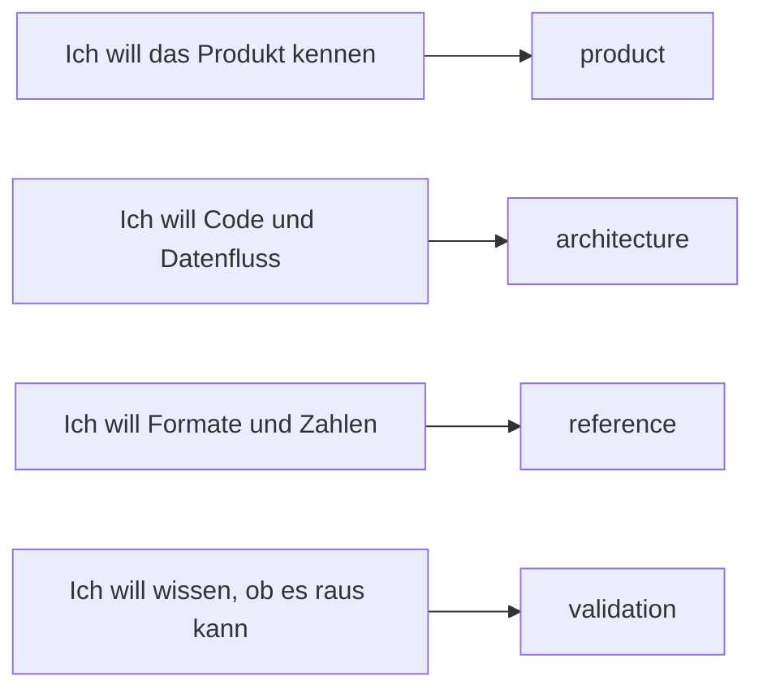

# negaflow-Dokumentation

Nach Themen getrennt, damit Sie direkt das passende Dokument öffnen.

[English](../README.md) · [한국어](../ko/README.md) · [日本語](../ja/README.md) ·
[简体中文](../zh-Hans/README.md) · [Français](../fr/README.md) · Deutsch

> [!NOTE]
> Die aktuelle Version ist `1.0.8`. Was gebaut und was tatsächlich geprüft wurde,
> steht im [Projektstand](product/PROJECT_STATUS.md).

## Produkt

| Dokument | Wann lesen |
|---|---|
| [Von der Bibliothek zum Druck](product/WORKFLOW.md) | Für Import, Ordnerentwicklung, Kopieren/Einfügen und Druckablauf |
| [Chroma Engine](product/CHROMA_ENGINE.md) | Sie wollen Filmumkehr und Entwicklungsreihenfolge |
| [GrainMend](product/GRAINMEND.md) | Sie wollen sehen, wie Staub- und Kratzerreparatur arbeitet |
| [Filmprofile](product/FILM_PROFILES.md) | Sie wollen Herkunft und Grenzen der mitgelieferten Profile |
| [Projektstand](product/PROJECT_STATUS.md) | Sie wollen Umsetzungs-, Mess- und Auslieferungsstand |

## Struktur

| Dokument | Inhalt |
|---|---|
| [Produktstruktur](architecture/PRODUCT_ARCHITECTURE.md) | Datenfluss zwischen App, Engine, Speicher und Export |
| [Katalogspeicherung](architecture/CATALOG_STORAGE.md) | Warum SQLite, das alte Format, die Messwerte |
| [Scanner-Plugin-Struktur](architecture/SCANNER_PLUGINS.md) | Externer Prozess, Freigabe, Offenlegung der Scandateien |
| [Bibliotheksarchiv](architecture/LIBRARY_ARCHIVE.md) | Wie Originale und Bearbeitungsverlauf zusammen abgelegt werden |

## Referenz

| Dokument | Inhalt |
|---|---|
| [Scanner-CLI-JSON](reference/CLI_JSON.md) | Ausgabeform von `detect --json` und `capabilities --json` |
| [Render-Protokoll](reference/RENDER_MANIFEST.md) | SHA-256-Verbindung von Quelle, Bearbeitungswerten und Ausgabedatei |
| [Abzugslayouts und C-Print-Vorschau](reference/C_PRINT.md) | Sieben Layouts, Export fertiger Seiten, optimiertes Rendering, Softproof-ICC und Genauigkeitsgrenzen |
| [Feste Printantwort](reference/PRINT_RESPONSE.md) | Formel und Ankerpunkte von `shoulder-print-response-v4` |
| [Qualitätsprüfung der Scannerprofile](reference/PROFILE_QUALITY_GATE.md) | Freigaberegeln für REAL/TARGET-Paarmaterial |
| [Scanner-Rauschprofile](reference/SCANNER_NOISE_PROFILES.md) | Messung über Wiederholungsscans und automatische Anwendung |
| [Filme, die GrainMend IR meidet](reference/INFRARED_LIMITS.md) | Schwarzweiß, Kodachrome, Grenzen der RGB/IR-Ausrichtung |
| [Bilderkennung am Flachbettscanner](reference/FRAME_DETECTION.md) | Wie Film von einem leeren Halter unterschieden und wo die Bildgrenzen gemessen werden |
| [IT8-Farbprüfung](reference/IT8_COLOR_VALIDATION.md) | Patchmessung, Nachweisstufen, synthetische Regression |

## Prüfung

| Dokument | Wann verwenden |
|---|---|
| [Checkliste für echte Geräte](validation/REAL_QA_CHECKLIST.md) | Sie prüfen echten Mac, Display, Scanner und Film |
| [GrainMend-Vergleich an echten Scans](validation/GRAINMEND_CORPUS.md) | Sie messen die 44 FILM-R-v2-Paare erneut |
| [GrainMend-IR-Messung an echten Scans](validation/GRAINMEND_IR.md) | Sie messen, wie viel GrainMend IR entfernt |

## Forschung zur Filmsimulation

| Dokument | Wann lesen |
|---|---|
| [컬러 네거티브 스틸 필름 조사](research/film-simulation/01-color-negative-still.md) | Für die C-41-Forschungsnotizen |
| [컬러 리버설 필름 조사](research/film-simulation/02-color-slide.md) | Für die E-6- und K-14-Forschungsnotizen |
| [컬러 영화용 필름 조사](research/film-simulation/03-color-motion-picture.md) | Für die ECN-2-Forschungsnotizen |
| [Digital B&W 분기 설계](research/film-simulation/08-digital-bw-branch-plan.md) | Für die Übergabe des Schwarzweiß-Designs |
| [다음 세션 시작 프롬프트](research/film-simulation/09-handoff-prompt.md) | Wenn Sie die Filmsimulation fortsetzen |
| [필름 시뮬레이션 확장 인수인계](research/film-simulation/09-handoff.md) | Für den aktuellen Implementierungsstand |

## Herkunft und Auslieferung

| Dokument | Wann verwenden |
|---|---|
| [Code- und Ressourcenherkunft](legal/PROVENANCE.md) | Sie prüfen die Apache/GPL-Grenze und die Hashes der Ressourcen |
| [`TRADEMARKS.md`](../../TRADEMARKS.md) | Sie prüfen, wie Film-, Scanner- und Produktnamen verwendet werden |

## Wie das geschrieben ist

- Produktdokumente beschreiben nur, was ein Nutzer heute sieht.
- Strukturdokumente beschreiben Zuständigkeiten und den Weg der Daten.
- Codewerte, Feldnamen und Hashes bleiben unverändert.
- Prüfdokumente trennen Bestandenes von noch nicht Geprüftem.
