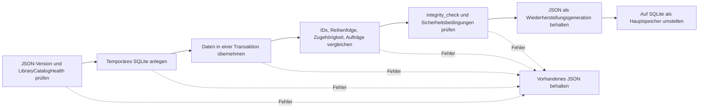

# Katalogspeicherung

[Dokumentationsstart](../README.md)

Der Hauptspeicher ist `library.sqlite`. Das alte `library.json` dient nur noch dazu, ältere
Bestände zu übernehmen oder eine Diagnosedatei zu schreiben. Nichts aktualisiert beide Dateien
gleichzeitig, also gibt es kein `dual-write`.

Sicherungen und Erhaltungsarchive enthalten eine JSON-Form, die sich zwischen Geräten bewegen
lässt. Die laufende SQLite-Datei kommt nicht hinein.

| Art | Format | Wofür |
|---|---|---|
| Hauptkatalog | SQLite | App-Betrieb, Suche, Speichern, Wiederherstellung |
| Ältere Bestände | JSON | Import eines vorhandenen Katalogs |
| Sicherung und Erhaltungsarchiv | JSON-Form | Umzug auf ein anderes Gerät, Wiederherstellung |

> [!IMPORTANT]
> Ein fehlender oder beschädigter Katalog startet keine leere Bibliothek. Ursprünglicher Katalog
> und Fotodateien bleiben unangetastet, bis eine intakte Generation gefunden ist.

## Messungen

JSON und SQLite wurden auf demselben Mac mit diesen Befehlen verglichen.

<details>
<summary>Messbefehle</summary>

```bash
DEVELOPER_DIR=/Applications/Xcode.app/Contents/Developer \
  NEGAFLOW_CATALOG_PERF_REPORT="$PWD/build/performance/catalog.json" \
  bash scripts/performance/run-catalog.sh

DEVELOPER_DIR=/Applications/Xcode.app/Contents/Developer \
  NEGAFLOW_LIBRARY_QUERY_PERF_REPORT="$PWD/build/performance/library-query.json" \
  bash scripts/run-library-query-performance.sh

DEVELOPER_DIR=/Applications/Xcode.app/Contents/Developer \
  NEGAFLOW_SQLITE_CATALOG_PERF_REPORT="$PWD/build/performance/catalog-sqlite.json" \
  bash scripts/performance/run-sqlite-catalog.sh
```

</details>

Gemessen am 2026-07-12: Mac14,3, arm64, 8 Kerne, 24 GiB Speicher, macOS 26.5,
Swift-Release-Build. Die Zahlen sagen nichts über einen anderen Mac. Sie sind eine Basis, um
Rückschritte in derselben Umgebung zu finden.

| Bilder | JSON-Größe | Kodieren p50 | Dekodieren p50 | Datei lesen p50 |
|---:|---:|---:|---:|---:|
| 1.000 | 2.192.671 Byte | 98 ms | 241 ms | 231 ms |
| 10.000 | 21.934.841 Byte | 811 ms | 2.301 ms | 2.299 ms |
| 50.000 | 109.721.335 Byte | 2.746 ms | 7.353 ms | 7.397 ms |

Beim JSON-Kodieren von 50.000 Bildern stieg der Resident Memory um rund 191 MiB, der Max RSS um
rund 107 MiB. Beim selben Material dauerte das Vorbereiten der Suche im Speicher 32,86 ms, das
Sortieren aller Namen 86,01 ms und das Sortieren nach Filter 158,37 ms. Vier Filterprojektionen
hintereinander: p50 von 512,80 ms.

SQLite-Zeilenspeicher, 50.000 Bilder, Release-p95:

| Vorgang | p95 |
|---|---:|
| Neuer Commit | 3.714 ms |
| Hauptdatei lesen | 7.446 ms |
| Commit ohne Änderungen | 3.856 ms |
| Größe je Bild | etwa 4.211 Byte |

Eine Sicherung zieht nicht die ganze Datenbank in `Data`. Sie legt eine replizierbare temporäre
Kopie an und tauscht sie atomar aus. Auch die Prüfung davor dekodiert nicht jedes Bild, sondern
sieht sich SQLite-Integrität und Schema an. Damit fiel der p95 eines Commits ohne Änderungen von
11.245 ms auf 3.856 ms.

## Warum SQLite

- Änderungen an vielen Zeilen passen in eine Transaktion.
- Zeilen und Indizes lassen nur die nötigen Bilder lesen.
- Die SQLite-C-API von macOS spart ein neues Paket.
- Die aktuelle Wiederherstellungsregel bleibt: ein beschädigter Speicher gilt nie als leere Bibliothek.

Derzeit laufen `journal_mode=DELETE` und `synchronous=FULL`. WAL hieße, Datenbank und
`-wal`-Datei als Einheit zu behandeln. Die laufende Datenbank wird nicht einfach kopiert. Nur die
Hauptdatei, geprüft nach dem Schließen der Verbindung, wird zur Wiederherstellungskopie.

## Wer im Code was macht

- `CatalogStore`: Verbindung, Transaktionen, Schemaversion, Integritätsprüfungen
- `CatalogMigration`: nur lesender JSON-Import und Umwandlung je Version
- Entitätstabellen: Bilder, Originale, Reihenfolge, Filme, Ordner, Sammlungen, Suche, Scanaufträge
- `LibraryBackupStore`: übertragbare JSON-Sicherung, Prüfungen vor der Wiederherstellung, Wiederherstellungsangaben

Entwicklungswerte und versionierter Bearbeitungsverlauf liegen je Entität als JSON-BLOB.
Quellpixel, Miniaturen und GrainMend-Caches bleiben außerhalb der Datenbank.

Für Suche und Sortierung fehlen noch Spalten und Indizes, daher lädt beim Start der ganze Katalog
in den Speicher. Deshalb sieht die SQLite-Lesezeit heute aus wie bei JSON. Als Nächstes kommen
Indexabfragen, die nur die genutzten Spalten und Bilder lesen.

## Älteres JSON übernehmen



Scheitert ein Schritt, bleibt das vorhandene JSON, wie es ist. Es startet nie mit leerem Katalog.
Auch wenn Zwischendateien und Markierungen liegen bleiben, geht es nur weiter, wenn der
Quell-SHA-256 und beide Kataloge übereinstimmen.

Nach dem Umzug gibt es keinen automatischen Rückweg zu JSON. Damit eine ältere App das JSON nicht
verändert und den Speicher teilt, werden Mindestleseversion und Migrationsmarkierung geprüft.

## Was nicht gewählt wurde

- **Den ganzen Katalog in einer JSON-Datei:** einfach, aber 50.000 Bilder zu lesen dauert rund
  7,4 Sekunden, und jedes Speichern schreibt die Datei neu.
- **Eine JSON-Datei je Bild:** einige Schreibvorgänge schrumpfen, aber der Code zum Speichern
  mehrerer Entitäten auf einmal und zum Prüfen ihrer Beziehungen müsste von Hand entstehen.
- **Jetzt zu Core Data wechseln:** möglich, bedeutet aber, Codable-Umwandlung und
  Wiederherstellungsvertrag in einem Zug neu zu bauen. Wieder ein Thema, wenn ein echter Prototyp
  besser misst als reines SQLite.

## Quellen

- [Apple: Tuning for Performance and Responsiveness](https://developer.apple.com/library/archive/documentation/General/Conceptual/MOSXAppProgrammingGuide/Performance/Performance.html)
- [Apple: Reducing disk writes](https://developer.apple.com/documentation/xcode/reducing-disk-writes)
- [SQLite: Atomic Commit](https://sqlite.org/atomiccommit.html)
- [SQLite: Write-Ahead Logging](https://sqlite.org/wal.html)
