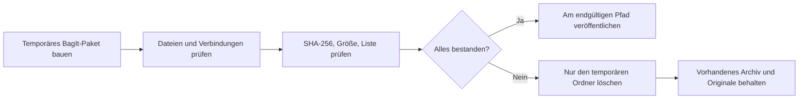

# Bibliotheksarchiv

[Dokumentationsstart](../README.md)

Eine Katalogsicherung soll die App schnell wieder zum Laufen bringen und enthält deshalb keine Originalfotos. Das Archiv `.negaflowarchive` fasst folgendes Material in einem Paket zusammen.

| Enthalten | Weggelassen |
|---|---|
| Übertragbares Katalog-JSON | Die laufende SQLite-Datei |
| Referenzierte Originale und verbliebene IR-Originale | Miniaturen und Vorschauen |
| Der noch benötigte GrainMend-Bearbeitungsverlauf | Neu erzeugbare GrainMend-Caches |
| Die Verbindung von virtuellen Kopien und geteilten Originalen | Exportierte Dateien |

Die laufende SQLite-Datei kommt nicht hinein. Alles, was sich neu erzeugen lässt, bleibt ebenfalls draußen: Miniaturen, Vorschauen, GrainMend-Caches, exportierte Dateien.

> [!WARNING]
> Scheitert der Archivlauf, wird das vorhandene Archiv nicht überschrieben. Originale, fremde XMP-Dateien und der laufende Katalog bleiben ebenfalls unangetastet.

## Paketaufbau und Prüfungen

Das Paket folgt dem Ordneraufbau von [RFC 8493 BagIt](https://www.rfc-editor.org/rfc/rfc8493.html). SHA-256-Listen werden für Inhalts- und Verwaltungsdateien getrennt geschrieben. `negaflow-archive.json` verbindet Bild-IDs mit den IDs der gespeicherten Dateien. Nutzen mehrere virtuelle Kopien dasselbe Original, werden dessen Bytes einmal gespeichert.

Der temporäre Ordner wandert erst an seinen endgültigen Platz, wenn alles Folgende passt.

1. Die aktuelle App kann den Katalog sicher lesen.
2. Originale und IR-Eingaben sind reguläre Dateien, deren Größe und Änderungszeit sich beim Kopieren nicht ändern.
3. Alle benötigten GrainMend-Einträge sind lesbar.
4. SHA-256, Bytezahl, Dateiliste und `Payload-Oxum` stimmen.
5. Die Verbindungen von Bildern zu Originalen, IR-Dateien und GrainMend-Einträgen stimmen mit dem Katalog überein.

Bei einem Fehlschlag bleibt das vorhandene Archiv liegen. Gelöscht wird nur der unfertige temporäre Ordner. Originale, fremde XMP-Dateien und der laufende Katalog bleiben unberührt.

## Grenzen

Originalformate bleiben, wie sie sind. Nichts wird der Langzeitkompatibilität zuliebe umgewandelt. PREMIS-Erhaltungsereignisse und -Akteure sowie die Migration in empfohlene Formate liegen außerhalb von v1.

Ein Archiv ist noch keine Langzeitsicherung. Legen Sie Kopien auf andere Medien und an einen anderen Ort und prüfen Sie die Hashes regelmäßig erneut.

Quellen:

- [RFC 8493: The BagIt File Packaging Format](https://www.rfc-editor.org/rfc/rfc8493.html)
- [Library of Congress PREMIS](https://www.loc.gov/standards/premis/)
- [Library of Congress Recommended Formats Statement](https://www.loc.gov/preservation/resources/rfs/)
