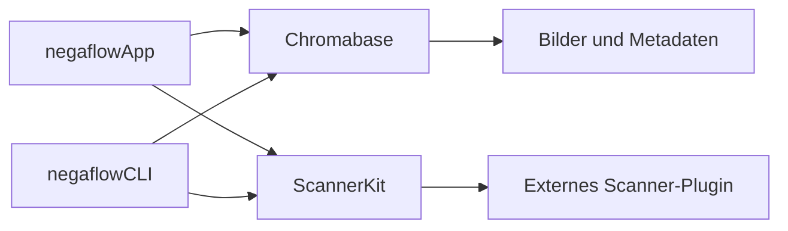
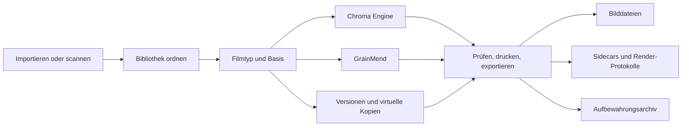

# Produktstruktur

[Dokumentationsstart](../README.md)

negaflow ist eine macOS-App.
Sie importieren oder scannen Filmbilder, danach folgen Umkehr, Entwicklung, GrainMend, Ausgabe und
Aufbewahrung.
Jede Bearbeitung wird getrennt vom Original abgelegt.

> [!IMPORTANT]
> Originale, Bearbeitungsverlauf, Caches und Ausgabedateien sind verschiedenes Material. Ein
> verlorener Cache darf weder das Original noch den Verlauf kosten, und ein Export scheitert
> lieber, als ein Ergebnis auszuliefern, das er nicht neu aufbauen kann.

## Sicherheitsregeln, die sich nicht ändern

1. Originalbilder und Sidecars Dritter werden nie automatisch überschrieben.
2. Aus der Bibliothek entfernen und das Original in den Papierkorb legen sind zwei Dinge.
3. Der Scanner-Bildschirm zeigt nur, was das Plugin gemeldet hat.
4. Kein falscher Scanner springt ein, solange Sie die Demo nicht selbst wählen.
5. Lässt sich ein bearbeitetes Ergebnis nicht neu aufbauen, wird nicht das Original an seiner Stelle
exportiert.
6. Ein langer Auftrag prüft Bild, Bearbeitungsversion und Sitzung erneut, kurz bevor er sein
Ergebnis anwendet.
7. Ein Cache muss sich aus Original und Bearbeitungsverlauf neu aufbauen lassen.
8. Ungenügend geprüfte Profile, Ausgabepakete und Archive werden nicht als fertiges Ergebnis
veröffentlicht.

## Module



### `Chromabase`

Die Chroma Engine und der Kern der Bildverarbeitung.

- Bilder lesen und Ausrichtung behandeln
- Filmbasis messen
- Negativ- und Positiventwicklung
- Tonwert, Farbe und lokale Korrekturen
- Film-, Look- und Scannerprofile
- GrainMend RGB und IR
- Histogramm und Farbmessung
- Ausgabecodierung und Metadaten

Mehr dazu:

- [Chroma Engine](../product/CHROMA_ENGINE.md)
- [GrainMend](../product/GRAINMEND.md)

### `ScannerKit`

Kein Scannertreiber. Es trägt den Vertrag, der ein externes Plugin anbindet.

- Scanner-ID und Funktionen
- Anfrage- und Antwort-JSON
- Externen Prozess ausführen, Zeitlimits, Abbruch
- Besitzer, Rechte, Freigabe und Hash des Plugins
- Temporäre Ausgabe prüfen, dann die endgültige Datei offenlegen
- Scan-Sitzungen und Auftragsverlauf
- Der Demo-Scanner, den Sie selbst einschalten müssen

Die SANE-Umsetzung liegt in einem eigenen GPL-Projekt,
[`negaflow-scanner-sane`](https://github.com/habinsong/negaflow-scanner-sane).
App und Plugin sprechen ausschließlich über JSON und die CLI miteinander.

### `negaflowCLI`

Nutzt dieselbe Engine und dasselbe `ScannerKit` wie die grafische Oberfläche.

- Scanner finden, Funktionen prüfen, scannen
- Mehrere Bilder entwickeln
- Scannerprofile auflisten
- GrainMends `defect-bench`
- IT8 und der relative Vergleich zwischen Scannern
- Selbstprüfungen und JSON-Automatisierung

### `negaflowApp`

Die App, die Menschen benutzen, gebaut mit SwiftUI und AppKit.

- Bibliothek, Entwicklung, Print, Leinwand
- Scan, GrainMend, Export
- Versionen, Einstellungen, Kurzbefehle
- Katalog, Cache, Sicherung, Aufbewahrungsarchiv
- Lokalisierter Info-Dialog, dessen Version aus der gemeinsamen Ressource stammt

## Ablauf für Benutzer



Jeder Schritt ergänzt Katalog und Bearbeitungsverlauf, statt das Original zu ändern.

## Eingabe und Originale

### Dateien importieren

Der übliche Weg hinein.
Verarbeitet werden TIFF, JPEG, PNG und die Kamera-RAWs, die macOS Image I/O lesen kann.
Eingebettetes ICC und Ausrichtung werden gelesen, und die Original-ID kommt in den Katalog.

### Scannen

Ein installiertes Plugin kann diese Funktionen melden.

- Auflösung und Bittiefe
- Scanbereich und Vorschau
- Belichtung
- IR
- Stapel- und Halterverhalten

Die App erfindet nie eine Funktion aus einer Tabelle von Modellnamen.
Nach einem Scan werden die tatsächlich angewandten Einstellungen des Plugins und die Ausgabedatei
erneut geprüft.

### Original-ID

Ein Dateipfad allein identifiziert kein Original.
Aufbewahrt werden die Werte, die der aktuelle Vertrag braucht: Dateibeobachtungen, Bytezahl,
Änderungszeit, SHA-256 und ein persistentes Bookmark.

Wurde eine Datei verschoben, ändert sich der Pfad nur, wenn Sie sie selbst neu verknüpfen oder die
Bookmark-Wiederherstellung gelingt.

## Katalog

Der Hauptspeicher ist `library.sqlite`.
Die alte `library.json` dient nur dazu, geprüftes älteres Material herüberzuholen oder eine
übertragbare Sicherung zu schreiben.
Die beiden Speicher werden nie gleichzeitig aktualisiert.

Was in SQLite kommt:

- Bilder und Originale
- Filme, Ordner, Sammlungen, Suchen
- Reihenfolge und Scan-Aufträge
- Entwicklungswerte und Bearbeitungsverlauf je Version

Was nicht:

- Originalpixel
- Miniaturen und Vorschauen
- GrainMend-Caches

### Umstieg von JSON

1. Schema und Zustand der vorhandenen JSON prüfen.
2. Eine Wiederherstellungskopie behalten.
3. In einer Transaktion in ein temporäres SQLite schreiben.
4. Den Katalog vorher und nachher vergleichen.
5. SQLite-Integrität und die Sicherheitsbedingungen der App prüfen.
6. Den Hauptspeicher erst umstellen, wenn alles zusammenpasst.

Eine gescheiterte JSON gilt nicht als leerer Katalog.
Zahlen und Entscheidung stehen in [Katalogspeicherung](CATALOG_STORAGE.md).

## Bibliothek

Zum Ordnen:

- Ordner, Filme, manuelle Sammlungen, intelligente Sammlungen, gespeicherte Suchen, Stapel
- Sterne, ausgewählt und abgelehnt, Farbmarkierungen
- Raster, Vergleich, Auswahl
- Doppelte Kandidaten durchsehen

In der Ordneransicht trägt jeder Ordner ein Band — Dreieck, Ordner, Name, Anzahl,
Entwicklungsprozess, Ziel, Anwenden. Das Dreieck klappt die Miniaturen darunter ein. Eingeklappte
Ordner bleiben es beim nächsten Start, getrennt vom Einklappen der Dateiliste in der Seitenleiste.

Die Ordneransicht ist **ein** Raster: jeder Ordner eine Sektion, sein Band deren Kopf. Diese
Struktur muss so bleiben. Jedem Ordner ein eigenes Raster zu geben und diese zu stapeln hebt die
Faulheit auf — der Stapel muss die Höhe eines Ordners als Ganzes kennen, also baut ein Ordner alle
seine Karten, sobald er ins Bild kommt. Mit einem Raster ist die Einheit der Faulheit eine Zeile,
und genau das hält das Scrollen bei mehreren hundert Fotos flüssig.

Mehrere virtuelle Kopien können ein Original teilen.
Bevor ein Original gelöscht wird, werden zuerst seine Verweise geprüft.
Aus der Bibliothek entfernen ändert nur Verweise im Katalog. Der Papierkorb ist eine eigene Aktion.

Bearbeitungen überleben eine getrennte externe Festplatte.
Das Original wird als offline markiert, und Sie verknüpfen es je Datei oder je Ordner neu.
Ist die ID nicht die erwartete, wird nichts automatisch getauscht.

Jeder registrierte physische Quellordner erhält genau einen Dateisystem-Watcher. Ereignisse werden
kurz zusammengefasst, danach wird nur der geänderte Ordner neu gelesen. Die erneute Verknüpfung über
Bookmarks behält die Katalogordner-ID bei, wenn Finder eine Quelle verschiebt oder umbenennt.
Direkt neu hinzugefügte Bilder werden ohne Polling und ohne erneuten Scan der ganzen Bibliothek
importiert.

## Entwicklung und GrainMend

Jedes Bild trägt:

- Original-ID und Filmtyp
- Filmbasis
- Entwicklungswerte
- GrainMend-Bearbeitungsverlauf
- Versionsverlauf
- Exportstatus

Während des Einstellens dient eine Vorschau in niedriger Auflösung.
Ein fertiges Ergebnis erreicht den Bildschirm nur, wenn Bild-ID und Bearbeitungsversion noch zur
aktuellen Auswahl passen.

Der Export speichert nicht die Vorschau-Bitmap vom Bildschirm.
Er baut das Bild in voller Auflösung aus dem Original und den festgehaltenen Bearbeitungswerten neu
auf.

GrainMend führt automatisch, geführt, Pinsel, Klonstempel und IR in einer geordneten Liste.
Caches sind abgeleitete Dateien.
Lässt sich ein Ergebnis nicht aus Original und Verlauf neu aufbauen, scheitert der Export.

Mehr dazu in [GrainMend](../product/GRAINMEND.md).

## Versionen

- **History und Snapshot:** Einen Entwicklungsstand selbst festhalten, dann vergleichen oder
dorthin zurück.
- **Virtual Copy:** Ein weiterer Bearbeitungszweig, ohne die Originaldatei zu verdoppeln.
- **Copy/Paste:** Einen gewählten Bereich einfügen, etwa Tonwert, Farbe, Detail oder Geometrie. Bei
Masken, die Originalkoordinaten brauchen, werden die Sicherheitsbedingungen geprüft.

## Export

Zu Beginn werden diese Werte als ein Paket festgehalten.

- Original-ID
- Bearbeitungsverlauf von Entwicklung und GrainMend
- Bytes und SHA-256 des Scannerprofils
- Ausgabeeinstellungen und Metadatenregeln
- Dateiname und Ziel

Wer einen Export anhält und fortsetzt, benutzt dasselbe Paket.

### Mehrere Ausgabedateien

Ein Export kann JPEG/TIFF, Sidecar, XMP und `-main-flat` zusammen erzeugen.

1. Ziel und Namenskonflikte vorab prüfen.
2. Alle Dateien in einen temporären Ordner schreiben.
3. Das Bild erneut öffnen und die Pixelgröße prüfen.
4. Bytezahl und SHA-256 berechnen.
5. Sidecar und Render-Protokoll schreiben.
6. Einen Commit-Eintrag hinterlassen.
7. Das ganze Paket an seinen endgültigen Ort verschieben.
8. Bei einem Fehler zurückrollen oder beim nächsten Lauf aufräumen.

Ein unvollständiger Satz Dateien wird nie als Erfolg vermerkt.

### Render-Protokoll v3

Statt Pfaden hält es die SHA-256-Beziehungen zwischen diesen Werten fest.

- Bytes des Originals
- Die tatsächliche Render-Eingabe
- Verlauf von Entwicklung und GrainMend
- Scannerprofil
- Versionen von Decoder und Renderer
- Ausgabebytes, Pixelgröße, Format

Es gibt weder digitale Signatur noch Zertifikat, deshalb heißt das nicht C2PA Content Credentials.
Mehr dazu in [Render-Protokoll](../reference/RENDER_MANIFEST.md).

## Print und Softproof

Unterstützte Anordnungen:

- Einzelbild
- Kontaktbogen
- Bildpaket
- Benutzerpaket
- Cyanotypie
- Glasplatte
- Gelatinesilber

Einzelbild und die drei historischen Layouts erzeugen für jedes ausgewählte Foto eine untereinander
angezeigte Seite. Kontaktbogen, Bildpaket und Benutzerpaket zeigen und exportieren ihre fertige
Seitenzahl. Bei 39 Fotos sind das eine 6 × 7-Kontaktbogenseite, 10 Seiten mit je vier Bildern, eine
Seite des voreingestellten Benutzerpakets oder 39 Einzeldateien.

Die Paketvorschau verwendet vorhandene Miniaturen und entwickelte Bilder und erzeugt nur bei Bedarf
eine kleine schnelle Vorschau. Der Export berechnet Platzierungen aus Metadaten, entwickelt nur die
benötigten Pixel, bereitet gleichzeitig zwei bis vier eindeutige Quellen vor, hält den Core-Image-
Graphen bis zur Seitenausgabe verbunden und begrenzt Quellraster auf 512 MiB pro Seite.

Jede Platzierung eines Bildpakets beobachtet das ihr zugewiesene Bild. Das Drucker-Ausgabe-ICC wird
nach dem Layout einmal auf die vollständige fertige Seite angewandt. Dadurch folgen Pakete mit
wiederholten und mit gemischten Bildern demselben Ausgabevertrag. Bibliothek und
Entwicklungsvorschau bleiben davon unberührt.
Weder das ursprüngliche Scan-TIFF noch `-main-flat` bekommt ein Druckerprofil.

Ohne gültiges RGB-Druckerprofil wird kein anderes Profil untergeschoben.
Bytes und SHA-256 des von Ihnen gewählten Profils kommen ins Ausgabeprotokoll.

## Aufbewahrungsarchiv

Was in `.negaflowarchive` kommt:

- Die übertragbare Katalog-JSON
- Originaldateien
- IR-Originale
- Der benötigte GrainMend-Verlauf
- Die Beziehung zwischen virtuellen Kopien und dem geteilten Original

Miniaturen, Vorschauen, GrainMend-Caches und exportierte Dateien lassen sich neu erzeugen, also
bleiben sie draußen.
Verwendet wird die BagIt-Struktur nach RFC 8493 mit einer SHA-256-Liste, und jede Datei und jede
Beziehung wird geprüft, bevor das Paket an seinen endgültigen Ort wandert.

- [Bibliotheksarchiv](LIBRARY_ARCHIVE.md)
- [RFC 8493](https://www.rfc-editor.org/info/rfc8493/)
- [PREMIS](https://www.loc.gov/standards/premis/)

Langfristige Aufbewahrung braucht zusätzlich ein anderes Medium, eine Kopie an einem anderen Ort und
regelmäßige Hash-Prüfungen.

## Sicherheit der Scanner-Plugins

Wird ein Plugin gefunden, wird dies geprüft.

- Ob es dem aktuellen Benutzer gehört
- Ob eine Gruppe oder ein anderer Benutzer darauf schreiben kann
- Ob es ein symbolischer Link ist
- ID und SHA-256 des Verzeichniseintrags und der ausführbaren Datei
- Ob die von Ihnen freigegebene ID noch die vorliegende ID ist

Hat sich die Datei geändert, wird die frühere Freigabe nicht weiterverwendet.

Protokoll v2 nutzt eine Anfrage-ID und eine Folgenummer und verlangt genau ein Endergebnis.
Die Ausgabegröße hat eine Obergrenze, und nach Zeitüberschreitung oder Abbruch werden Prozess und
Pipes aufgeräumt.

Ein Plugin legt nie selbst eine Datei am endgültigen Ort offen.
Die App gibt ihm einen temporären Ort, prüft Format, Größe, ID und die tatsächlich angewandten
Einstellungen und verschiebt die Datei dann in den Speicher der App.

Der vollständige Vertrag steht in [Scanner-Plugin-Struktur](SCANNER_PLUGINS.md).

## Leistungsgrenzen

Bilder:

- Ein gemeinsamer `CIContext`
- Ein Bildgraph, der berechnet wird, wenn er gebraucht wird
- Einstellen in niedriger Auflösung getrennt von der Ausgabe in voller Auflösung
- Abbruch, und veraltete Ergebnisse werden abgewiesen
- GrainMend nach Region, Kachel und Patch verarbeitet
- Caches werden bei Speicherdruck geleert

Katalog:

- SQLite-Transaktionen und Zeilen je Entität
- Sicherung über Replikation
- Integritätsprüfungen
- Bei 50.000 Bildern gemessen

Heute wird beim Start der gesamte Katalog in den Speicher geladen.
Auf demselben Mac dauerte das Lesen aus SQLite rund 7,4 Sekunden, nahe an JSON.
Nur die benötigten Zeilen über einen Index zu lesen, ist der nächste Schritt.

Die Leistungsgrenzen im Repository sind weite Obergrenzen, um große Rückschritte zu fangen.
Sie sind kein Versprechen, dass sich jeder unterstützte Mac angenehm anfühlt.

## Was geprüft ist

```bash
DEVELOPER_DIR=/Applications/Xcode.app/Contents/Developer swift test
bash scripts/run-app.sh build
```

Was automatische Prüfungen nicht klären:

- Echte Scanner und Plugins
- Echte RGB/IR-Ausrichtung und Filmverträglichkeit
- GrainMend-Qualität bei 100 %
- Die Oberfläche, samt Bildschirmgröße und Bedienungshilfen
- Developer ID, Notarisierung, Gatekeeper
- Installation auf einem frischen Mac
- Leistung auf einem anderen Mac

## Dokumentenwegweiser

| Was Sie suchen | Dokument |
|---|---|
| Aktueller Umsetzungs- und Prüfstand | [Projektstand](../product/PROJECT_STATUS.md) |
| Umkehr und Entwicklung | [Chroma Engine](../product/CHROMA_ENGINE.md) |
| Reparatur von Defekten | [GrainMend](../product/GRAINMEND.md) |
| Filmprofile | [Filmprofile](../product/FILM_PROFILES.md) |
| Einen Scanner anbinden | [Scanner-Plugin-Struktur](SCANNER_PLUGINS.md) |
| Freigabekriterien für Profile | [Qualitätsprüfung der Scannerprofile](../reference/PROFILE_QUALITY_GATE.md) |
| Echte Geräte und Bildschirme prüfen | [Checkliste für echte Geräte](../validation/REAL_QA_CHECKLIST.md) |
| Aufbewahrungsarchiv | [Bibliotheksarchiv](LIBRARY_ARCHIVE.md) |
| Hash-Beziehungen der Ausgabedateien | [Render-Protokoll](../reference/RENDER_MANIFEST.md) |
