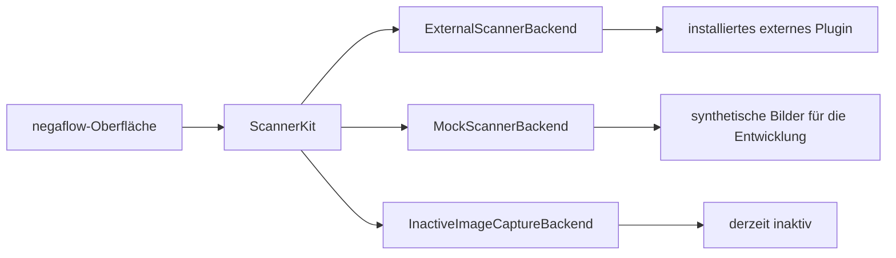
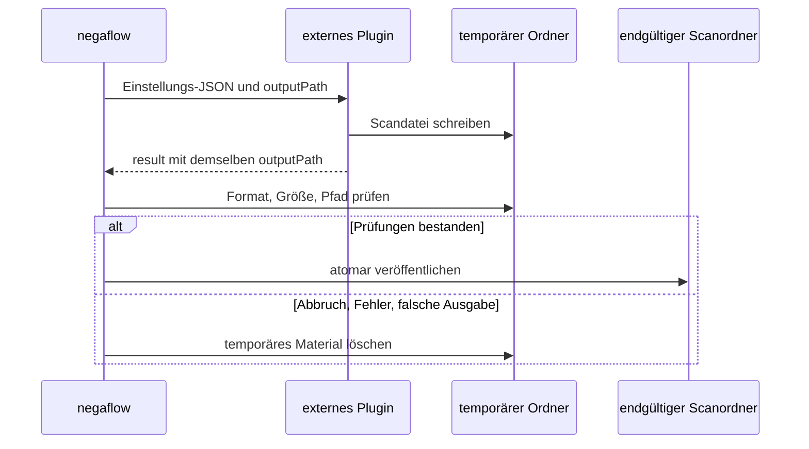

# Scanner-Plugin-Struktur

[Dokumentationsstart](../README.md)

Die Standardeingabe von negaflow ist der Bildimport.
Ein echter Scanner kommt nur dann dazu, wenn ein externes Plugin vorhanden ist.

> [!IMPORTANT]
> Die App leitet aus dem Modellnamen eines Scanners keine Fähigkeiten ab. In Oberfläche und
> Anfragen landet nur, was das Plugin meldet, und das Demo-Gerät erscheint erst, wenn Sie den
> Demomodus selbst wählen.

## Bestandteile

| Bestandteil | Aufgabe |
|---|---|
| Bildimport | Schickt RAW, DNG, TIFF, PNG und JPEG in den Entwicklungspfad. |
| Externes Plugin | Läuft als eigener Prozess, steuert das echte Gerät, spricht JSON. |
| Demo-Scanner | Stellt `negaflow Scanner` und `negaflow Flatbed Scanner` für die Entwicklung bereit. Nutzbar nur nach Auswahl der Demo. |
| ImageCaptureCore-Anbindung | Inaktiver Kompatibilitätscode für macOS-Image-Capture-Geräte. |

Eine SANE-Umsetzung gibt es in diesem Repository nicht.
Dieser Code liegt in einem separaten GPL-Projekt.

- <https://github.com/habinsong/negaflow-scanner-sane>

## Wie es zusammenhängt

Die Oberfläche sieht nur `ScannerBackend`.
Eine Geräte-ID des Plugins erscheint in der App als `plugin:<pluginId>:<deviceId>`.

Beim Start des Plugins fällt `plugin:<pluginId>:` weg, und es geht nur die plugin-eigene Geräte-ID
hinaus.

## Plugins finden

Der Standardordner ist `~/Library/Application Support/negaflow/Plugins/<id>/manifest.json`.

Für Tests und lokale Entwicklung zeigt `NEGAFLOW_PLUGINS_DIR` auf einen anderen Ordner.

| Feld | Regel |
|---|---|
| `schemaVersion` | Heute genau `1` |
| `protocolVersion` | Ohne Angabe `1`, unterstützt werden `1` und `2` |
| `id` | Eindeutige Plugin-ID |
| `name` | Name in der Oberfläche |
| `kind` | Art des Plugins |
| `license` | Lizenz der Auslieferung |
| `homepage` | Projektadresse |
| `executable` | Pfad zur ausführbaren Datei |

`id` hat 1 bis 64 ASCII-Zeichen.
Das erste ist ein Buchstabe oder eine Ziffer, danach sind Buchstaben, Ziffern, `.`, `_` und `-`
erlaubt.
`:` trennt Geräte-IDs und ist deshalb verboten.

Ein Plugin öffnet sich nur, wenn Manifest und ausführbare Datei beide durchgehen. Ältere oder
künftige Schemata und unbekannte Protokolle werden nicht auf Verdacht gelesen.

### Dateiprüfungen

> [!WARNING]
> Ändern sich die Bytes von Manifest oder ausführbarer Datei, verfällt die frühere Freigabe.
> Kurz vor dem Start werden Eigentümer, Rechte, Symlink-Status und SHA-256 erneut geprüft.

- Plugin-Ordner, Manifest und ausführbare Datei müssen dem aktuellen Benutzer gehören.
- Schreibrechte für Gruppe oder andere führen zur Ablehnung.
- Symlinks werden abgelehnt.
- Der SHA-256 von Manifest und ausführbarer Datei wird festgehalten.
- Bei der ersten Nutzung gibt der Nutzer die Freigabe.
- Geänderte Dateibytes machen die Freigabe ungültig.
- Kurz vor dem Start werden die IDs neu berechnet.

## Befehle

Das Plugin läuft als eigener Prozess.

| Befehl | Ergebnis |
|---|---|
| `detect` | Geräteliste als JSON |
| `capabilities <deviceId>` | Fähigkeitsliste als JSON. Kann über stdin das von `detect` gemeldete JSON mit Geräte-ID, Hersteller und Modell erhalten |
| `scan` | Einstellungs-JSON über stdin; Fortschritts-NDJSON und Endergebnis über stdout |

## Scan-Protokoll

### Version 1

Die ältere Kompatibilitätsfassung.
Anfragen und NDJSON haben weder `protocolVersion` noch `requestID` oder `sequence`.
Sie kann die tatsächlich angewandten Einstellungen nicht melden, deshalb wird das Ergebnis als
`.unknownLegacy(protocolVersion: 1)` festgehalten.
Angeforderte Werte werden nicht so übernommen, als wären sie geprüft.

### Version 2

Nur in Gebrauch, wenn das Manifest `"protocolVersion": 2` enthält.

Was in eine Anfrage gehört:

- `protocolVersion: 2`
- Eine von der App erzeugte UUID als `requestID`

Eine `capabilities`-Antwort darf das optionale Feld `capabilityToken` zurückgeben.
Die App legt es nicht aus.
Sie reicht den Wert unverändert an die nächste v2-`scan`-Anfrage desselben Geräts weiter, sonst
nirgendwohin.
In v1-Anfragen kommt er nicht vor, und Token verschiedener Geräte werden nie vermischt.
Format und Gültigkeit des Tokens prüft das Plugin selbst.

Damit nicht versehentlich ein anderes Modell desselben Backends verbunden wird, gibt die App
`deviceID`, `vendor` und `model` aus dem letzten `detect` als optionales stdin-JSON an
`capabilities` zurück.
Bestehende Plugins dürfen diese Eingabe ignorieren.
Ein Plugin, dessen Geräteadresse wechseln kann, sollte diese Identität an den Fähigkeits-Snapshot
binden und beim nächsten `scan` erneut prüfen.

Jedes NDJSON-Ereignis wiederholt dieselbe Version und Anfrage-ID und trägt eine `sequence` von null
oder mehr, größer als die davor.
Erlaubt sind nur `progress`, `result` und `error`.

`result` und `error` sind Schlussereignisse. Alles danach führt zum Fehlschlag.
Ein Scan, der nicht mit einem Fehler endete, hat genau ein `result`.

All das schlägt im geschlossenen Zustand fehl.

- Ein Ereignis, das nicht lesbar ist
- Fehlende oder abweichende Version oder Anfrage-ID
- Wiederholte oder verkehrte Reihenfolge
- Ein unbekanntes Ereignis
- Ein doppeltes Ergebnis
- Weitere Ausgabe nach dem Schlussereignis
- Ungültiges UTF-8

Ein Verstoß gegen die v2-Vorgaben beendet das Plugin sofort, ohne die übliche Zeitgrenze abzuwarten.

### Tatsächlich angewandte Einstellungen

Ein v2-`result` muss `appliedOptions` enthalten.

- `deviceID`, `resolutionDPI`, `bitDepth`, `colorMode`, `filmType`
- `scanArea`: `originXMM`, `originYMM`, `widthMM`, `heightMM` — der Bereich, den das Plug-in
  tatsächlich an das Backend gesendet hat, keine Kopie der Anfrage. Er kann um weniger als 1 mm
  angepasst werden, um ein Backend zu umgehen, das die Scangröße falsch berechnet. Die App
  prüft die zurückgegebene Pixelgröße gegen diesen Bereich; eine Kopie der Anfrage würde die
  Prüfung aushebeln.
- `infrared`, `multiExposure`
- `hardwareExposureTime`, `brightnessAdjustment`, `contrastAdjustment`
- `outputRawTIFF`

Bei den letzten drei Werten muss der Schlüssel auch dann vorhanden sein, wenn er `null` ist.

`resolutionDPI: 0` bedeutet Vorschau.
Eine Vorschau ungleich 0 oder ein vollständiger Scan mit 0 wird abgelehnt.
Ebenso unbekannte Werte, ein anderes Gerät sowie Auflösung, Bittiefe oder IR-Zustand, die zwischen
Ergebniskopf und `appliedOptions` auseinandergehen.

Sind die Prüfungen bestanden, hält die App statt der Plugin-ID ihre eigene Scanner-ID und die
Anfrage-ID fest und behält den endgültigen Ausgabepfad.
Erst dann wird `.verified(options)` gesetzt.

`ScanResult.resolution` und `bitDepth` dürfen in v1 auf die angeforderten Werte zurückfallen.
Die Felder zur Herkunft, `reportedResolution` und `reportedBitDepth`, nehmen nur korrekte Werte auf,
die das Ergebnis selbst gemeldet hat.

## Positionierter Flachbett-Scanbereich

Die Vorschau dieses Ablaufs fordert eine ausdrückliche Auflösung an — den unterstützten Wert, der 300 dpi am nächsten liegt — statt sie dem Gerät zu überlassen. Ein Gerätestandard kann bei 25 dpi liegen und ist damit viel zu grob, um Bilder darauf zu platzieren oder zu erkennen. Eine Vorschau mit Auflösung ist ein gewöhnlicher Scan und nutzt den Vorschaupfad des Plug-ins nicht.

Ein Flachbett-Scan mit gewählter Position schaltet sich nur ein, wenn das Plugin all das meldet.

- Vorschau
- `supportsPositionedScanArea`
- `scanOriginXRange` und `scanOriginYRange` in mm
- `scanWidthRange` und `scanHeightRange` in mm

Die App weitet den gewählten Bereich auf das Raster des Plugins nach außen und legt je Bereich einen
vollständigen Scanauftrag an.
Aus einem Modellnamen wird das nie abgeleitet. Ältere Plugins ohne die optionalen Felder behalten
den Ablauf mit festem Bildfeld.

## Prozessgrenzen und Abbruch

- Obergrenze stdout: 4 MiB
- Obergrenze stderr: 1 MiB

Über der Grenze endet der Prozess und der Vorgang schlägt fehl.
Beim Aufräumen werden nur die bereits eingetroffenen Bytes gelesen.
Selbst wenn ein Kindprozess die Pipe geerbt hat, wartet nichts auf EOF.

`cancelScan()` kehrt erst zurück, wenn das Plugin beendet ist, die Pipe-Handler geschlossen sind und
der Platz für den nächsten Auftrag frei ist.

## Die Scandatei veröffentlichen

Das Plugin schreibt das Quellbild genau an den `outputPath`, den die App vorgibt, und gibt denselben
Pfad im Ergebnis zurück.
Dieser Pfad liegt temporär auf derselben Platte wie der Zielordner.

Die App bestätigt:

- Eine reguläre Datei, die nicht leer ist
- Ein Bild, das ImageIO lesen kann
- Das erwartete Format und die erwartete Pixelgröße
- Denselben Pfad in Anfrage und Ergebnis

Erst danach wandert die Datei an den endgültigen Ort.
Bei Abbruch, Zeitüberschreitung, falscher Ausgabe oder Fehlschlag des Plugins wird der temporäre
Ordner gelöscht, und kein halber Scan erscheint.

Auch eine v2-IR-Datei muss im temporären Ordner der App liegen.
Dateityp, Lesbarkeit und Pixelgröße werden geprüft. v1 darf einen externen IR-Pfad annehmen, damit
bereits ausgelieferte Plugins weiter funktionieren.

## Die SANE-Grenze

SANE-Umsetzung, Abhängigkeiten, Konfiguration, gerätespezifische Verarbeitung, Tests und
Auslieferungsdokumentation liegen alle im separaten Repository
[`negaflow-scanner-sane`](https://github.com/habinsong/negaflow-scanner-sane).

Dieses Projekt veröffentlicht eine Standardvariante ab macOS 14 mit Homebrews normalem SANE sowie
eine getrennte Coolscan-Variante ab macOS 26, die offizielles SANE 1.4.0 nur mit dem upstream
`coolscan2`/`coolscan3`-Allokationsfix baut. Die Standardvariante blockiert Coolscan nicht, enthält
diesen Fix aber nicht.

Dieses Repository dokumentiert und prüft ausschließlich die geräteunabhängige Spezifikation für
externe Prozesse.
Wer nur Bilddateien importiert, braucht kein Scanner-Plugin.

Die negaflow-App bindet die SANE-Umsetzung nicht ein und legt sie nicht in die Auslieferung.
Das Plugin hat ein eigenes Repository, eine eigene ausführbare Datei, eine eigene Quellauslieferung
und die GPL-Lizenz.
Dieses Dokument hält die Struktur fest; über abgeleitete Werke entscheidet es nicht.
Vor einer echten Auslieferung werden die enthaltenen Dateien beider Artefakte und der
Kommunikationsvertrag erneut geprüft.

## Prüfungen

Die App-Tests starten ein gefälschtes externes Plugin als echten Prozess und bestätigen:

- Plugins finden
- Geräte finden
- Verdrahtung der Fähigkeiten
- Fortschrittsereignisse
- Das Endergebnis
- Aufräumen nach Abbruch und Fehlschlag

Die SANE-Umsetzung wird getrennt geprüft, in den SwiftPM-Tests und im Release-Build des
Plugin-Repositorys.
