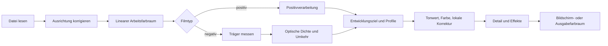

# Chroma Engine

[Dokumentationsstart](../README.md)

Die Chroma Engine kehrt Film um und entwickelt ihn. Der Code liegt im Modul `Chromabase`.
App und CLI nutzen dasselbe Modul, gleiche Eingabe läuft also durch dieselbe Schrittfolge.

| Auf einen Blick | Inhalt |
|---|---|
| Standardentwicklung | `MAIN`, manuelle Korrektur |
| Filmträger | Automatische Messung, Pipette, direkte RGB-Eingabe |
| Farbe intern | Linearer Farbraum in 32-Bit-Gleitkomma |
| Automatikfunktionen | Nur wirksam, wenn Sie sie ausführen |
| Ausgabefarbraum | sRGB, Display P3, Adobe RGB, eigenes RGB-ICC |

> [!IMPORTANT]
> Auto Tone, Auto White Balance, Auto Levels und Auto Color schleichen sich nie in die
> Standardentwicklung.

## Was zuerst gilt

1. Lässt sich der Filmträger messen, schlägt die Messung den über den Namen gewählten Standardwert.
2. Filmeigenschaften, Scanlichtquelle, Scannerstil und automatische Szenenkorrektur bleiben getrennt.
3. Funktionen wie Auto Tone und Auto White Balance greifen nur, wenn Sie sie ausführen.
4. Gleiche Quelle, gleiche Bearbeitungswerte und gleiches Profilpaket durchlaufen dieselbe Schrittfolge.
5. Synthetische Tests und Prüfungen an echten Geräten gelten nie als derselbe Nachweis.

## Schrittfolge



Das Arbeitsbild läuft in einem linearen Farbraum mit 32-Bit-Gleitkomma.
Nur Rechenschritte, die Gamma brauchen, wandeln an ihrer festen Stelle um.
Die Kodierung für Bildschirm oder Dateiformat kommt zuletzt.

Apples Core-Image-Dokumentation:

- [CIImage](https://developer.apple.com/documentation/coreimage/ciimage)
- [CIContext](https://developer.apple.com/documentation/coreimage/cicontext)
- [workingColorSpace](https://developer.apple.com/documentation/coreimage/cicontext/workingcolorspace)
- [Core-Image-Leistungsleitfaden](https://developer.apple.com/library/archive/documentation/GraphicsImaging/Conceptual/CoreImaging/ci_performance/ci_performance.html)

`CIContext` wird nicht für jeden Render neu gebaut, sondern nach Zweck getrennt wiederverwendet:
Anzeige, Analyse, Export.
Die Vorschau rechnet nur die nötige Größe und die neueste Bearbeitungsversion.
Der Export rendert erneut in Quellgröße.

## Filmträger

### Warum messen

Der unbelichtete Teil eines Negativs ist ein Bezugspunkt aus Film, Entwicklung und Scanlichtquelle.
Auch die Orangemaske des Farbnegativs steckt darin.
Ist der Träger falsch, verschieben sich danach alle Dichten und Kanalverhältnisse.

Auch Kodaks Daten zu Portra 400 halten Mindestdichte, Kennlinien und spektrale Farbstoffdichte
getrennt fest.

- [Kodak Professional Portra 400 technical data](https://www.kodakprofessional.com/sites/default/files/wysiwyg/pro/resources/e4050_portra_400.pdf)

### Automatische Messung

`FilmBaseEstimator` mittelt nicht einfach ein paar der hellsten Pixel.

- Ein Filmpixel kann nicht heller sein als der unbelichtete Träger.
- Deutlich Helleres kann Hintergrundlicht, Perforation oder außerhalb des Films sein.
- Ein echter Träger zieht sich meist als breites Band am Bildrand entlang.
- Liegen mehrere Filmstreifen auf einem Blatt, lassen sich getrennte Bereiche zusammen lesen.
- Einer Grenze, an der Halter und Film sich mischen, wird weniger getraut als dem Inneren.

Auf einem verkleinerten Analysebild wird die Helligkeitsverteilung gesucht, zusammenhängende
Bereiche werden gruppiert, danach fallen Kandidaten außerhalb des Films weg.
Bestehen mehrere Streifen die Bedingungen, werden sie gemeinsam gerechnet.
Das Ergebnis hält auch die gewählte Methode und die Konfidenz fest.

### Die Methode wählen

| Modus | Verhalten |
|---|---|
| `Manual` | Nutzt das eingegebene RGB als Dmin. Eine erfolgreiche Pipette landet ebenfalls hier. |
| `Film` | Nutzt die Messung als Dmin; der gewählte Film liefert vor allem `dmaxNorm`. Film- und Lichtquellenvorgaben greifen nur, wenn die Messung scheitert. |
| `Auto` | Nutzt die räumliche Analyse und fällt bei Fehlschlag auf die randbasierte Methode zurück. |

Ohne manuellen Wert oder mit falscher Film-ID geht es zur nächsten sicheren Methode.
Das hellste Objekt der Szene wird nie direkt als Filmträger genommen.

## Optische Dichte und Umkehr

Die Dichte ergibt sich aus der linearen Transmission `T` und dem Träger `Dmin` je Kanal.

```math
D = \log_{10}\left(\frac{D_{\min}}{T}\right)
```

`D = 0` heißt, die Eingabe entspricht dem unbelichteten Träger.
Perforation oder Hintergrundlicht können negativ werden.
Diese Werte bleiben endlich und werden nicht sofort beschnitten.

### Daten zu Filmtypen

Die aktuelle Tabelle führt 27 Filmnamen, darunter Farbnegative, Schwarzweiß und Kinonegative.

Wofür die Daten dienen:

- Der Dmin-Standardwert, wenn der Träger nicht messbar ist
- Der Dichtebereich je Kanal
- Ein sicherer Bereich, wenn geringer Kontrast die automatische Messung schwanken lässt

Manche Werte nähern Kurven aus öffentlichem Material an, manche sind bewusst konservativ gesetzt. 27
Namen bedeuten keine 27 geprüften Farbprofile.
Sobald der Träger gemessen ist, gilt die Messung.

### Feste Printantwort

`MAIN` überführt die um den Träger verringerte Dichte in eine monoton steigende Kurve.
Die Koeffizienten sind kein verstecktes Preset, sondern folgen aus vier Ankerpunkten.

- Der Schwarzpunkt des Trägers
- 18-%-Mittelgrau
- Weiß am gemessenen Dichtebereich
- Reserve für reflektiertes Licht

Die heutige Kurve ist eine gestreckte Exponentialfunktion und hat über den ganzen Bereich eine
Umkehrfunktion.
Der Hin-und-zurück-Test mit synthetischen Negativen nutzt genau diese.
Gleichungen und Zahlen stehen in [feste Printantwort](../reference/PRINT_RESPONSE.md).

Wo der Standardweg endet und die Automatik beginnt:

- Die feste Kurve verschiebt die Belichtung nicht anhand des Szenenhistogramms.
- `applySceneRanged` misst den genutzten Dichtebereich je Kanal, verschiebt aber die mittlere Belichtung nicht.
- Ein begrenztes `CIVibrance` greift nur bei wenig gesättigten Szenen.
- Auto Levels, Auto Color, Auto Tone und Auto White Balance führen Sie selbst aus.
- Es wird nicht behauptet, ein bestimmtes Papier oder Minilab exakt nachzubilden.

## Drei Arten von Profilen

| Art | Welche Frage sie beantwortet | Werte |
|---|---|---|
| Film stock | Wie sehen Träger und Dichtebereich dieses Films aus | Dmin/Dmax, Filmtyp |
| Light source | Wie wirkte die Scanlichtquelle auf jeden Kanal | Kanal-Gain, trägerbasierte Korrektur |
| Scanner target | Welchen Ton- und Farbstil hat das Ergebnis | Relative Statistik aus eigens erstellten Scans |

Diese Trennung verhindert den Fehler, einen Filmnamen zugleich für Emulsionseigenschaften,
Lichtquellenfarbe und den Ausgabestil eines Labors stehen zu lassen.
Liegt ein echter Träger vor, gilt die Messung vor den Vorgaben der Lichtquelle.
Auch Scannerstatistiken dienen nicht direkt als absolute Farbmatrix einer Szene.

Die Daten beschreibt [Filmprofile](FILM_PROFILES.md).

## Entwicklungsziele

### `MAIN`

Der Standard für gewöhnliche Entwicklung.
Weder ein nicht gewählter Scannerstil noch Auto Levels, Auto Color, Auto Tone oder Auto White
Balance fließen ein.
Die Messung von Träger und Dichtebereich sowie das begrenzte Vibrance bei wenig gesättigten Szenen
gehören zur Grundumkehrung.

### `PRINT`

Das Arbeitsbild entspricht `MAIN`.
Am Ende des Exports wird einmal ein gültiges RGB-Drucker-ICC angewendet.
Fehlt das Profil oder ist es ungültig, scheitert der Lauf, statt auf sRGB oder beliebige Papierwerte
auszuweichen.

### `HS`, `SP`

Zwei Stufen.

1. `documentedCharacter`: `SP` nutzt einen begrenzten Grundcharakter aus sechs Paaren desselben
Negativs über SP-3000 und negaflow MAIN.
`HS` baut Ton-, Neutral- und Farbcharakter aus veröffentlichter Richtung und den Entwurfswerten des
Projekts.
2. `scannerSignature`: Hinzu kommt nur die relative Differenz jener Gruppen, deren Filmnamen und
Bildzahlen auf beiden Maschinen übereinstimmen.

`HS` enthält eine Schärfung im Helligkeitskanal.
Radius und Stärke stammen nicht aus einer Messung an der echten Maschine. `SP` enthält sie nicht.

Alle heutigen Profile sind `realOnly`.

- Die relative Differenz entsteht nur, wenn Filmnamen und Bildzahlen hinreichend übereinstimmen.
- Werte, deren Richtung kippt, werden nicht angewendet.
- Bei Schwarzweiß entfallen die Farbanteile.
- Stimmt der SHA-256 einer Datei oder eines Manifests nicht, wird das ganze Profilpaket abgelehnt.

### `F135`, `HR`

Das sind zwei vom Projekt gebaute Minilab-Stile, keine vermessenen Maschinenklone.
`F135` nutzt eine printnahe S-Kurve mit warmen Mitten, `HR` tiefe Schwarztöne und eine ruhige
neutrale, bläuliche Richtung.
Es wird nicht behauptet, eine bestimmte Maschine geprüft und nachgebaut zu haben.

### `EXPIRED`

Ein Rettungsziel für alten Film.
Es entsättigt nicht pauschal und dehnt den Bereich nicht, sondern bleibt bei begrenzten Korrekturen
im Rahmen der vorhandenen Belege.

## Entwicklungsregler

| Gruppe | Elemente |
|---|---|
| Tonwert | Belichtung, Kontrast, Lichter, Schatten, Weiß, Schwarz, RGB- und kanalweise Punktkurven |
| Farbe | Temperatur, Tönung, Dynamik, Sättigung, HSL in 8 Farben, Colorgrading in drei Zonen, Kanalkorrektur, Schwarzweißumsetzung und Tonung |
| Detail und Effekte | Schärfe, Klarheit, Dunst entfernen, Filmkorn, Vignette, Halation, Rauschminderung |
| Lokale Korrektur | Radiale, lineare, polygonale und Pinselmasken sowie Abwedeln und Nachbelichten |

Diese Werte werden als schrittweiser Bearbeitungsverlauf gespeichert.
GrainMend und gewöhnliche lokale Korrektur unterscheiden sich in Zweck und Speicherform.

## Farbmanagement

Trägt die Eingabe ein gültiges ICC, wird dieser Farbraum gelesen.
Die interne Rechnung läuft im festgelegten linearen Arbeitsraum; der Wechsel in einen
Ausgabefarbraum geschieht bei Anzeige, Softproof und Export.

Wichtige unterstützte Ausgaben:

- sRGB
- Display P3
- Adobe RGB
- Ein vom Nutzer gewähltes RGB-Drucker-/Ausgabe-ICC

Name, Bytezahl und SHA-256 des Druckerprofils werden zu Beginn des Exports festgehalten. Ändert sich
die Datei während des Renderns, bricht der Lauf ab.

Es wird nicht behauptet, dass der heutige Weg über Core Image und ColorSync auf jedem macOS
Rendering Intent und Black Point Compensation bitgleich erzeugt.
Dafür bräuchte es zuerst einen eigenen ColorSync-Pufferweg und Speicherprüfungen für große
16-Bit-Bilder.

## Ausgabekodierung

Formateinstellungen liegen außerhalb der Farbpipeline, entscheiden aber darüber, was in der
ausgelieferten Datei übrig bleibt.

JPEG speichert Farbe mit geringerer Auflösung als Helligkeit, sofern der Encoder nicht über seine
Unterabtastungsschwelle hinaus geführt wird. Darunter wird die Chrominanz horizontal und vertikal
halbiert: Helligkeitsdetails bleiben erhalten, gesättigte Kanten werden weicher. Qualität ab 95 %
wird deshalb ohne Chroma-Unterabtastung kodiert. Niedrigere Einstellungen behalten den gewählten
Wert, denn wer sie wählt, will eine kleinere Datei.

PNG und TIFF sind verlustfrei und tasten nie unter. Ihr einziger Qualitätsregler ist die Bittiefe,
8 oder 16 Bit pro Kanal. Dithering wird nur bei 8 Bit angewendet, wo es Quantisierungsbanding verdeckt.

## Leistung und Sicherheit

- `CIContext` wird je Zweck wiederverwendet.
- Beim Regeln läuft eine Vorschau in geringerer Auflösung; der Export baut aus der Quelle neu auf.
- Ein Ergebnis, das lange gedauert hat, prüft kurz vor der Anwendung Bild-ID, Bearbeitungsversion und Sitzung erneut.
- Wird der Speicher knapp, fallen Caches wie Miniaturen und Vorschauen weg.
- Originale und Bearbeitungsverlauf bleiben von Caches getrennt.

## Prüfstufen

1. Formeltests: Monotonie der Kurve, Ankerpunkte, Umkehrfunktion
2. Synthetische Bilder: bekannte Ein- und Ausgabe, Beschnitt, Ausrichtung, Farbraum
3. Synthetisches IT8: der mathematische Hin- und Rückweg über 264 Felder
4. Statistik echter Aufnahmen: die `realOnly`-Profile
5. REAL/TARGET-Paare: eine Gerätequalitätsprüfung mit eigenem Prüfmaterial
6. Prüfung an echter Hardware: Scanner, Film, Display und Ausdruck

Ein gutes Ergebnis im synthetischen IT8 belegt keine absolute Genauigkeit an echten Negativen.
Für die Qualität von Scannerprofilen gelten
[Qualitätsprüfung der Scannerprofile](../reference/PROFILE_QUALITY_GATE.md) und
[IT8-Farbprüfung](../reference/IT8_COLOR_VALIDATION.md).

## Wo der Code liegt

- `Sources/Chromabase/Engine/`
- `Sources/Chromabase/Film/`
- `Sources/Chromabase/Develop/`
- `Sources/Chromabase/Adjustments/`
- `Sources/Chromabase/Profiles/`
- `Sources/Chromabase/Imaging/`
- `Sources/Chromabase/Export/`

Die aktuelle Produktversion ist `1.0.9`.
Bearbeitungsverlauf und Profilschemata werden auch künftig erst nach einem Prüfverfahren geändert.
