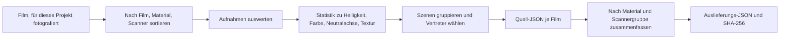

# Filmprofile

[Dokumentationsstart](../README.md)

Die mitgelieferten Scannerprofile sind keine heruntergeladenen LUTs und keine Presets mit einem
neuen Namen.
Der Autor des Projekts hat die Filmscans fotografiert und sortiert,
sie ausgewertet und das Ergebnis in JSON überführt.

| Posten | Aktueller Wert |
|---|---:|
| Standardwerte je Filmtyp | 27 |
| Kreative Looks | 6 |
| Scannerprofile | 15 |
| Filmbeobachtungen | 25 |
| Bildbeobachtungen | 928 |
| Prüfstand | alle `realOnly` |

> [!NOTE]
> `928` ist die Summe der Beobachtungen je Profil. Es sind nicht 928 verschiedene Fotografien.

## Drei getrennte Arten von Daten

| Daten | Format | Wofür | Anzahl |
|---|---|---|---:|
| Filmmaterial | Swift | Dmin/Dmax und Standardwerte des Filmtyps | 27 |
| Look-Preset | JSON | Die kreativen Looks, die Sie wählen | 6 |
| Scannerprofil | JSON | Relative Tonwert- und Farbstatistik aus echten Scans | 15 |

27 Filmnamen sind nicht 27 Profile für Farbgenauigkeit.
Die 6 Looks sind etwas anderes als Scannerprofile. Was folgt, betrifft nur die dritte Art.

## Was heute mitgeliefert wird

`Sources/Chromabase/ScannerProfiles/` enthält 15 davon.

<details>
<summary>Alle 15 Profile ansehen</summary>

| Scanner | Filmtyp | Film | Filmbeobachtungen | Bildbeobachtungen | Stand |
|---|---|---|---:|---:|---|
| NORITSU | Farbnegativ | Fuji C200 | 3 | 111 | `realOnly` |
| NORITSU | Farbnegativ | Kodak Ektar 100 | 2 | 76 | `realOnly` |
| NORITSU | Farbnegativ | Kodak Portra 160 | 1 | 37 | `realOnly` |
| NORITSU | Farbnegativ | Kodak Portra 400 | 2 | 75 | `realOnly` |
| NORITSU | Farbnegativ | Kodak Portra 800 | 1 | 38 | `realOnly` |
| NORITSU | Farbnegativ | Kodak Pro Image 100 | 1 | 37 | `realOnly` |
| NORITSU | Farbnegativ | Kodak UltraMax 400 | 1 | 38 | `realOnly` |
| NORITSU | Farbnegativ | Kodak Vision3 250D | 1 | 37 | `realOnly` |
| NORITSU | Farbnegativ | Kodak Vision3 50D | 1 | 38 | `realOnly` |
| NORITSU | Farbdia | Kodak Ektachrome 100 | 1 | 38 | `realOnly` |
| NORITSU | Farbdia | Kodak Ektachrome 100D | 5 | 181 | `realOnly` |
| SP-3000 | Farbnegativ | Kodak Ektar 100 | 2 | 76 | `realOnly` |
| SP-3000 | Farbnegativ | Kodak Portra 160 | 1 | 38 | `realOnly` |
| SP-3000 | Farbnegativ | Kodak Vision3 250D | 2 | 71 | `realOnly` |
| SP-3000 | Farbdia | Kodak Ektachrome 100D | 1 | 37 | `realOnly` |
| **Gesamt** |  |  | **25** | **928** | **15 `realOnly`** |

</details>

25 und 928 sind Summen der Beobachtungen je Profilgruppe.
Derselbe physische Film oder dieselbe Fotografie kann in zwei Scannergruppen landen.
Es sind nicht 25 verschiedene Filme oder 928 verschiedene Fotografien.

## Wie sie gebaut werden



### 1. Aufnehmen und sortieren

Die Quellen sind nach Scanner, Filmtyp, Materialname und Filmname getrennt.
Drehung und Einlesen der Dateien werden vor der Auswertung bestätigt.
Leere oder unlesbare Dateien zählen nicht.

### 2. Aufnahmen messen

Diese Werte werden an jeder Aufnahme gemessen.

- Helligkeitsperzentile und Beschnitt an beiden Enden
- Kanalverhältnisse in Schatten, Mitten und Lichtern
- Verteilung von Sättigung und Farbton
- Die Lab-Neutralachse gering gesättigter Pixel
- Gradient, Schärfe und ein Bezugswert für Korn

Das sind Beobachtungen an der Szene.
Belichtung oder Motiv einer einzelnen Aufnahme wird nie zur festen Eigenschaft des Scanners erklärt.

### 3. Szenen gruppieren

Szenen werden nach Helligkeit, Kontrast, Sättigung und Farbtonbereich gruppiert.
Anzahl und Verteilung je Gruppe werden festgehalten,
damit eine Art von Szene nicht das ganze Profil zieht.

### 4. Vertretende Aufnahmen

Diese Aufnahmen werden gesondert vermerkt, damit ein Mensch zur Quelle zurückfindet.

- Die Aufnahme mit dem höchsten Kontrast
- Die schärfste Aufnahme
- Die Aufnahme mit dem höchsten Korn-Bezugswert
- Die Aufnahmen, die den Helligkeits- und Sättigungsbereich vertreten

### 5. Zusammenfassen nach Film und Gruppe

`scripts/compile_scanner_profiles.py` fasst die Daten je Film zu Material- und Scannergruppen
zusammen.
Leere Klassen werden nicht als null Beobachtungen hübsch gemacht.
Das Skript bestätigt, dass jeder Wert endlich ist und die Stichprobenzahlen echt sind.

### 6. JSON und Hashes

Die endgültige Datei trägt Schema, ID, Quellzahlen, Quellpfade, zusammengefasste Statistik,
Prüfstand und `profileHash`.
Die Prüfung kontrolliert Felder, Zahlen, endliche Werte, Dateiname gegen ID,
Quellzahlen und den Hash.

## Form der JSON

<details>
<summary>Beispiel für ein Profil-JSON</summary>

```json
{
  "schemaVersion": 2,
  "id": "noritsu__color-nega__kodak-portra-400",
  "displayName": "NORITSU · color nega · Kodak Portra 400",
  "scanner": "NORITSU",
  "kind": "color nega",
  "filmKey": "kodak portra 400",
  "validationStatus": "realOnly",
  "rollCount": 2,
  "imageCount": 75,
  "singleRollLimited": false,
  "sourceProfiles": [],
  "tone": {},
  "color": {},
  "neutralAxis": {},
  "neutralAxisBins": [],
  "hueResponse": [],
  "texture": {},
  "sceneBuckets": [],
  "coverageCandidates": [],
  "profileHash": "sha256:..."
}
```

</details>

## Wichtigste Einträge

| Eintrag | Inhalt | Worauf zu achten ist |
|---|---|---|
| `tone` | Helligkeitsverteilung und Beschnitt an beiden Enden | Die Belichtung einer Aufnahme ist keine Eigenschaft der Maschine |
| `color` | Kanäle und Sättigung in Schatten, Mitten, Lichtern | Eine beobachtete Verteilung, keine absolute Farbmatrix |
| `neutralAxis` | Lab `a*` und `b*` gering gesättigter Pixel | Manche Szenen haben kein neutrales Objekt, darum stehen die Stichprobenzahlen dabei |
| `hueResponse` | Sättigungsänderung und Farbtondrehung je Klasse | Relativer Vergleich nur, wenn die Daten beider Maschinen zusammenpassen |
| `texture` | Gradient, Schärfe, Korn-Bezugswert | Nicht direkt als Schärfungswert der Maschine benutzt |
| `sceneBuckets` | Statistik je Szene und vertretende Aufnahmen | Damit ein Mensch die Quelle zurückverfolgen kann |

Die Schärfung des Helligkeitskanals im `HS` -Target ist keine aus `texture` gemessene
Maschinenkonstante.
Sie erzeugt auch kein neues Korn. `SP`, `MAIN` und `PRINT` enthalten diese Schärfung nicht.

## Stand der Belege

| Stand | Bedeutung | Wo er benutzt werden darf |
|---|---|---|
| `draft` | Daten oder Schema unfertig | Weder mitliefern noch automatisch benutzen |
| `realOnly` | Echte Scans vorhanden, aber ohne getrenntes Referenzmaterial | Nur manuelle Auswahl, keine Genauigkeitsaussage |
| `pairedSmoke` | Das Paarmaterial bestätigt nur den Verarbeitungsweg | Als Qualitätsbeleg unbrauchbar |
| `pairedValidated` | Kalibrier- und Prüfmaterial samt Regressionsprüfungen bestanden | Automatische Auswahl erlaubt, wenn die Regeln es zulassen |

Alle 15 sind heute `realOnly`.
Sie können bestätigen, dass sie aus Beobachtungen an echtem Material stammen, aber nicht,
dass sie dasselbe Ergebnis liefern wie die Maschine.

Wer Maschinengenauigkeit behaupten will, braucht mehr Material.

- Eine ID, die dieselbe physische Aufnahme bestätigt
- Prüfmaterial, das von der Kalibrierung getrennt bleibt
- Die Bedingungen, unter denen die Referenzbilder entstanden sind
- Scannereinstellungen und Entscheidungen der Bedienung
- Target-Charge, Beleuchtung, Messverfahren
- Ein Bestehenskriterium je Bild

## Wie die App sie benutzt

### Manuelle Auswahl

Heute wird nichts automatisch aus einem Modellnamen oder aus Dateiangaben ausgewählt.
Sie wählen das `HS`- oder `SP`-Target und das Profil selbst.
Automatische Zuordnung ist nur für `pairedValidated` erlaubt und gilt damit nicht für das aktuelle
Paket.

### Der relative Unterschied zwischen zwei Scannern

Absolute Szenenstatistik wird nicht so übernommen, wie sie ist.
Benutzt wird nur der Unterschied zwischen einander entsprechenden Gruppen der beiden Maschinen,
und das eingeschränkt.

- Der bereinigte Satz der Filmnamen muss übereinstimmen.
- Die Bildzahl darf sich um höchstens 15 % unterscheiden.
- Eine Farbtonklasse braucht auf beiden Seiten Stichprobenzahlen über dem Schwellenwert.
- Werte, deren Richtung kippt, werden nicht angewandt.
- Werte zwischen gegenläufigen Verstärkungen werden im logarithmischen Bereich gerechnet.
- Der Tonwert wird einmal auf die Rec.709-Gammahelligkeit angewandt, die Lab-Farbanteile bleiben
erhalten.

Die Quellprofile führen kein SHA-256 je Aufnahme. Übereinstimmende Filmnamen sind kein Beleg dafür,
dass genau dieselben Aufnahmen gepaart wurden.

### Schwarzweiß und Positiv

Bei Schwarzweiß fallen die Farbanteile weg, und nur der relative Tonwert wird benutzt.
Beim Positiv wird die absolute Helligkeit eines Films nicht auf eine andere Fotografie übertragen.
Allerdings wirken die Grundstile von `HS` und `SP` auch auf Positive, mit halber Stärke,
sodass das Ergebnis nicht immer dasselbe ist wie `MAIN`.

### Textur

Ohne Paarmaterial aus derselben Aufnahme wird `texture` nicht als maschinenspezifischer Schärfungs-
oder Kornwert benutzt.
Schärfe, Motiv,
JPEG-Verarbeitung und die Entscheidungen der Laborbedienung stecken alle mit in diesen Zahlen.

## Dateiintegrität

`ScannerProfileRegistry` öffnet nie nur einen Teil der 15.

1. Das Schema des Manifests lesen.
2. Bestätigen, dass jede Datei vorhanden ist, und ihr SHA-256 prüfen.
3. `profileHash` in jeder JSON neu berechnen.
4. ID, Dateiname, Schema, Stand, Zahlen und endliche Werte prüfen.
5. Stimmt irgendetwas nicht, das ganze Paket ablehnen.
6. Nur einen schreibgeschützten Schnappschuss zwischenspeichern, bei dem alles zusammenpasste.

Das Exportprotokoll behält ID und SHA-256 des tatsächlich benutzten Profils.

## Befehle zum Prüfen

Profilvertrag prüfen:

```bash
python3 scripts/validate_scanner_profiles.py \
  --mode profile-contract \
  --profiles Sources/Chromabase/ScannerProfiles
```

Neu bauen:

```bash
python3 scripts/compile_scanner_profiles.py \
  --source LUT_target/SOURCE \
  --out LUT_target/PROFILES \
  --resource-out Sources/Chromabase/ScannerProfiles
```

REAL/TARGET-Qualitätsprüfung:

```bash
python3 scripts/evaluate_profile_quality.py \
  --manifest LUT_target/quality/corpus-v1.json \
  --candidate-summary LUT_target/SOURCE/summary.json \
  --baseline-summary LUT_target/quality/accepted-summary-v1.json \
  --data-root LUT_target \
  --verify-files all \
  --report build/profile-quality-report.json
```

Das Repository hat derzeit weder ein REAL/TARGET-Manifest noch eine angenommene Basis,
die eine Aussage zur Auslieferung stützen könnte.
Die synthetischen Tests bestätigen nur die Fehlerbedingungen des Prüfcodes;
sie belegen keine Profilgenauigkeit.

## Quellen

- [Kodak Professional Portra 400 technical data](https://www.kodakprofessional.com/sites/default/files/wysiwyg/pro/resources/e4050_portra_400.pdf)
- [darktable negadoctor](https://docs.darktable.org/usermanual/4.6/en/module-reference/processing-modules/negadoctor/)

Aus diesen Quellen stammen keine Profilzahlen. Sie wurden als Hintergrund gelesen, warum Filmbasis,
Szenentonwert und Maschinenstil getrennt behandelt werden müssen.
Die Werte in der JSON kommen aus dem für dieses Projekt fotografierten Material und dem
Auswertungscode im Repository.

## Code und verwandte Dokumente

- `Sources/Chromabase/ScannerProfiles/`
- `Sources/Chromabase/Profiles/ScannerProfile/`
- `Sources/Chromabase/Profiles/ScannerTargetGrade/`
- `scripts/compile_scanner_profiles.py`
- `scripts/validate_scanner_profiles.py`
- `scripts/evaluate_profile_quality.py`
- [Qualitätsprüfung der Scannerprofile](../reference/PROFILE_QUALITY_GATE.md)
- [IT8-Farbprüfung](../reference/IT8_COLOR_VALIDATION.md)
- [Chroma Engine](CHROMA_ENGINE.md)
