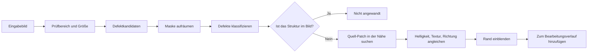

# GrainMend

[Dokumentationsstart](../README.md)

GrainMend repariert Staub, Pinholes, Kratzer und Emulsionsschäden auf Film.
Nichts wird ins Original eingebrannt; das Ergebnis bleibt ein geordneter Bearbeitungsverlauf.

| Werkzeug | Wo es hinschaut | Wie es repariert |
|---|---|---|
| Automatisch | Das ganze Bild | Zurückhaltend, nur Defekte, bei denen es sicher ist |
| Geführt | Der Bereich, den Sie wählen | Schaut genau hin, bis zu kleinen Punkten und blassen Defekten |
| Pinsel | Die Stelle, die Sie malen | Führt umgebende Struktur und Textur weiter |
| Klonstempel | Der Quellpunkt, den Sie wählen | Kopiert echte Originalpixel mit festem Versatz |
| IR | Der Infrarotkanal des Scanners | IR findet die Stelle, RGB baut die Pixel neu auf |

Der Entwicklungsbildschirm hat automatisch, geführt, Pinsel und Klonstempel.
IR lässt sich im Scan-Schritt einschalten, wenn das Plugin die Funktion meldet.
Ist der Scan fertig, kommt sein Ergebnis in dieselbe GrainMend-Ebenenliste.

> [!CAUTION]
> GrainMend RGB arbeitet anders als eine IR-Reinigung in Hardware. GrainMend IR ist auch keine
> Umsetzung von Digital ICE, iSRD oder SRDx und kein Kompatibilitätsmodus dazu.

## Warum das schwierig ist

Filmdefekte und die Struktur des Bildes sitzen in denselben Pixeln.

- Staub zeigt sich als kleine, unregelmäßige helle oder dunkle Flecken.
- Ein Pinhole kann wie ein einzelner, kräftiger Punkt aussehen.
- Kratzer sind lang und dünn, Kabel, Fensterrahmen und Schrift aber auch.
- Emulsionsschäden verändern Farbe und Textur zugleich.
- In hoher Auflösung ist Filmkorn so groß wie ein kleiner Defekt.

Wer hohe Frequenzen im Ganzen wegnimmt, nimmt Korn und Kanten gleich mit.
GrainMend trennt Erkennung, Klassifizierung, Reparatur und Speicherung.

## Reihenfolge der Arbeit



Erkennungsmaske und repariertes Ergebnis bleiben getrennt.
Genau das erlaubt es, die Maske zu prüfen,
nur einen Teil der Defekte anzuwenden oder die Reparatur neu aufzubauen.

## Werkzeuge

### Automatisch

Über das ganze Bild findet es nur Defekte, bei denen es sicher ist.
Einen kleinen Defekt zu übersehen ist besser, als eine große Struktur fälschlich wegzuputzen.
Es schleicht sich nie in die Standardentwicklung; Sie müssen es ausführen,
bevor irgendetwas hinzukommt.

### Geführt

Sie wählen ein Rechteck, und nur dieser Bereich und seine Umgebung werden analysiert.
Da Sie schon auf den Defekt gezeigt haben, geht es beherzter an kleine Punkte,
blasse Defekte und dichte Nester als die Automatik.

Es liest weiter, als das Ergebnis reicht,
damit die umgebenden Pixel für die Reparatur nicht am Rand des Bereichs abgeschnitten werden.
Der aktuelle maximale Kontextradius liegt bei 264 Pixeln.

### Pinsel

Sie malen die zu reparierende Stelle selbst. Das Gemalte wird nicht mit einer Farbe zugedeckt.
Nahe der Maske wird ein passender Quell-Patch gesucht, und Struktur und Textur werden weitergeführt.
Wenn kein Patch passt, kann eingeschränkt auf den erkennungsbasierten Weg zurückgegriffen werden.

### Klonstempel

`⌥` Klick wählt den Quellpunkt, dann malen Sie auf das Ziel.
Ohne automatische Erkennung: der Versatz zwischen beiden Punkten bleibt erhalten,
und die echten Pixel werden kopiert.

Der Bearbeitungsverlauf hält Durchmesser, Härte, Koordinaten und Versatz fest.
Das gilt nach Drehung, Spiegelung oder Beschnitt weiterhin für dieselben Originalkoordinaten.
Versätze rasten auf ganze Pixel ein, und außerhalb des Bildes wird nichts angewandt.

### IR

Nur dann benutzt,
wenn das Plugin einen echten IR-Kanal liefert und Größe und Bereich zum RGB passen.
IR ist das Material, das den Defekt lokalisiert.
Die endgültigen Pixel kommen aus demselben Reparierer wie bei RGB.

## Defekte im RGB finden

### Unterschied zur Umgebung

Die Helligkeit wechselt von Bild zu Bild, deshalb gibt es keinen einzelnen globalen Schwellenwert.
Der Unterschied zur umgebenden Helligkeit,
die lokale Varianz und die Richtung ergeben Kandidaten für hellen Staub und dunkle Defekte.

### Maske aufräumen

Vereinzeltes Rauschen fällt weg, unterbrochene Defekte werden verbunden, dann werden Pixel,
die sich in einer von 8 Richtungen berühren, zu einem Klumpen.
Eine große Fläche kann in Kacheln zerlegt werden,
aber ein Klumpen über einer Kachelgrenze wird in Gesamtkoordinaten wieder zusammengeführt.

### Unterschiede in der Auflösung

Dasselbe Staubkorn hat bei 1200 dpi und bei 7200 dpi nicht dieselbe Pixelgröße.
Wenn die Auflösungsangabe verlässlich ist, richten sich die Grenzen nach der echten Größe.
Ohne sie wird das Scannermodell nicht geraten, sondern eine zurückhaltende Pixelregel verwendet.

### Klassifizierung

An jedem Klumpen wird gemessen:

- Fläche und umschließendes Rechteck
- Verhältnis von langer zu kurzer Achse
- Waagerechte, senkrechte, diagonale Richtung
- Linearität, Dichte, Kontrast zur Umgebung
- Ob er in eine nahe Kante übergeht
- Sein Verhältnis zu anderen Klumpen

Das Ergebnis teilt sich in Staub, Pinhole, Kratzer nach Richtung,
Emulsionsschaden und Mikropartikel, jeweils mit einer Konfidenz.

### Linien, die zum Bild gehören, nicht wegputzen

Kabel, Geländer, Gebäudekanten, Fensterrahmen und Schrift dürfen nicht als Kratzer gelesen werden.
Parallelen, Raster, die Fortsetzung von Kanten und Linien, die an der Szenenstruktur hängen,
bekommen eine eigene Prüfung.
Die Automatik blockt Fehltreffer härter ab; das geführte Werkzeug wiegt zudem mit,
dass Sie die Stelle gewählt haben.

## Reparatur

1. Nahe dem Defekt einen Quell-Patch finden, der die Maske nicht überlappt und dessen Struktur passt.
2. Den niederfrequenten Unterschied in Helligkeit und Farbe zwischen Patch und Ziel angleichen.
3. Die hochfrequente Textur des Patches erhalten, damit das Filmkorn mitgeht.
4. Bei einem langen Kratzer zuerst die Richtung ansehen, die von beiden Enden weiterläuft.
5. Am Maskenrand Original und reparierten Patch weich mischen.

Die Stärke ist das Mischungsverhältnis zwischen fertigem Patch und Original.

Manchmal kann eine automatische Reparatur nicht wissen, was darunter lag.
Fehlt brauchbare Textur in der Umgebung, oder hat der Defekt eine ganze wichtige Struktur verdeckt,
braucht es Pinsel, Klonstempel oder eine eigene, genaue Nacharbeit.

## IR-Verarbeitung

### Eingabebedingungen

- Das Plugin meldet die IR-Funktion ausdrücklich.
- RGB und IR gehören zur selben Scan-Sitzung.
- Beide Bilder haben dieselbe Pixelgröße und denselben erwarteten Bereich.
- Die Dateien sind lesbar und bestehen die Prüfung der Original-ID.

Auch wenn ein Modellname als IR-fähig bekannt ist,
wird IR weder im Bildschirm noch in einer Anfrage benutzt, solange das Plugin es nicht meldet.

### Ausrichtung

Optik und Sensorauslesung können RGB und IR um einige Pixel auseinanderrücken.
Erst läuft eine weite Suche, dann eine enge, um den Versatz festzulegen.
Die Konfidenz des Maximums und ob es am Rand des Suchbereichs landete, werden beide festgehalten.

Eine niedrige Konfidenz oder ein bestes Ergebnis, das am Ende der Suche klebt,
gilt nicht als Erfolg.

### Das Szenenmuster abziehen

Filmfarbstoffe und Dichte können bis ins IR durchschlagen.
Die logarithmische Helligkeit des roten Kanals wird in 64 Klassen geteilt,
und in jeder Klasse wird der Mittelwert gebildet,
nachdem die oberen und unteren 10 % der IR-Werte wegfallen.
Leere Klassen werden aus den Nachbarn interpoliert und mit einem kurzen symmetrischen Kern
geglättet.
Das Abziehen dieser nichtparametrischen Kurve mindert das Szenenmuster,
und spärlicher dunkler Staub bleibt aus der Klassenstatistik heraus.

Was übrig bleibt, wird in Kontrast relativ zum lokalen Mittel umgerechnet.
Damit ein großer Defekt den Rauschboden um sich herum nicht anhebt,
wird die Rauscheingabe am minimalen Erkennungskontrast beschnitten,
bevor die adaptive Schwelle berechnet wird.
Zusammenhängende dunkle Bereiche an Halter und Filmrand kommen aus der Maske heraus.

### Sicherheitsbedingungen

- Eine ungewöhnlich große Maske wird nicht angewandt.
- Eine Ausrichtung, die nicht bestätigt werden konnte, wird nicht angewandt.
- Auf Silber-Schwarzweiß wird es nicht automatisch angewandt.
- Farbpositive und besondere Emulsionen gelten ohne Messung nicht als sicher.

Auch kommerzielle IR-Werkzeuge setzen eigene Grenzen bei gewöhnlichem Schwarzweiß und bei
Kodachrome.

- [SilverFast: iSRD dust and scratch removal](https://www.silverfast.com/about-silverfast-why-scanning-basics-of-scanning/why-silverfast/silverfast-feature-highlights/isrd-dust-scratches-removal-eliminate-defects-with-infrared-channel/)

GrainMend IR ist weder eine Kopie dieser kommerziellen Werkzeuge noch ein Kompatibilitätsmodus.

## Bearbeitungsverlauf und Speicherung

Automatisch, geführt, Pinsel, Klonstempel und IR teilen sich eine geordnete Bearbeitungsliste.

Was jeder Eintrag trägt:

- ID und Art
- Reihenfolge der Anwendung
- Ob er aktiv ist, und seine Stärke
- Bereich, Maske, Versatz der Klonquelle
- Defektklassifizierung und Diagnosewerte
- Originalbild und Bearbeitungsversion
- Der reparierte Patch, oder die Werte, um ihn neu aufzubauen

Eine frühere Reparatur verändert die Eingabe einer späteren,
deshalb gehört auch die Reihenfolge der Liste zum Bearbeitungsverlauf.

Das Original wird nicht verändert.
Der GrainMend-Verlauf liegt in einem Sidecar, das die App verwaltet. SHA-256 des Originals,
Bearbeitungsversion und ein Fingerabdruck des Verlaufs binden die Eingabe zusammen.
Fehlt das Sidecar oder ist es beschädigt, wird der Cache nicht wie ein Original behandelt.

Der GrainMend-Cache ist eine abgeleitete Datei für schnelle Anzeige und erneutes Rendern.
Fehlt er oder besteht er seine Prüfung nicht,
wird er aus Original und Bearbeitungsverlauf neu aufgebaut.
Lässt sich das Ergebnis, das ein Export braucht, nicht erzeugen, scheitert der Export,
statt das Original unterzuschieben.

## Leistung

- Eine kleine Korrektur berechnet nur den Defekt und seinen näheren Kontext neu.
- Eine große Fläche wird in überlappende Kacheln geteilt, mit Rand für die Grenze.
- Ergebnisse werden nur aus den überlappungsfreien Kachelmitten eingesammelt.
- Höchstens 4 Kacheln laufen gleichzeitig.
- `CleanedRawCanvas` kopiert nur das geänderte Rechteck.
- Kopien für das Widerrufen teilen sich den Speicher, bis sich wirklich etwas ändert.
- Bei Speicherdruck werden neu aufbaubare Bilder und der Patch-Cache freigegeben.

Die echten Zeiten hängen von Auflösung, Defektzahl, Flächengröße und Mac ab.

Gemessen am 25.07.2026 auf einem Release-Build, Mac14,3, arm64, 24 GiB Speicher, macOS 26.5.

| Weg | Eingabe | Ergebnis |
|---|---|---:|
| Geführte Erkennung | 1600×1600, 25 Staubkörner | 0,35 s, 25 erkannt |
| Teilweise ROI-Erkennung | 1600×1600 | 0,38 s |
| Geführter Dichtestress | 1280×960, 8 Bilder × 3 Durchläufe | Median 0,423 s, p95 0,488 s, max 0,526 s |
| IR-Erkennung | 6000×4000, 24 MP | 1,042 s, Speicherspitze +249,2 MiB |

Über 24 Dichtestress-Durchläufe lag die geringste Maskenabdeckung an Defektstellen bei 99, 80 %,
der höchste mittlere Restfehler bei 2, 70/255.
Das sind Regressionsmessungen auf synthetischer Eingabe.
Sie versprechen keine Verarbeitungszeiten auf einem anderen Mac oder auf echtem Film.

## Benchmark

`defect-bench` kann diese Dateien und Werte erzeugen.

- before, after, diff, mask
- 100-%-Ausschnitte
- Zahl der Erkennungen und Konfidenz
- Verarbeitungszeit
- PSNR und absoluter Fehler, wenn Referenzbilder vorliegen

```bash
swift run -c release negaflow defect-bench <input-dir> \
  --reference-dir <reference-dir> \
  --out <report-dir>
```

Die RGB-Regression nutzt die 44 Paare aus beschädigt und fachmännisch restauriert von FILM-R v2.

- DOI: <https://doi.org/10.6084/m9.figshare.21803304.v2>
- Lizenz: CC BY 4.0
- Paare: 44
- Gesamtgröße: 437.570.872 Bytes

Der am 25.07.2026 ausgelieferte automatische Weg arbeitet mit Empfindlichkeit 0,
7 und einer Sicherheitslinie gegen Übererkennung.
Gegenüber der vorherigen Basis 3.0 stiegen von den 44 FILM-R-Bildern die verbesserten von 11 auf 34,
und die verschlechterten fielen von 33 auf 6.
Die mittlere PSNR-Änderung ging von -1, 688 dB auf +0, 466 dB, der schlechteste Fall von -18,
952 dB auf
-1,338 dB. Gewichtete verschlechterte Pixel fielen von 0,792 % auf 0,017 %.

Trifft die Automatik auf eine hohe Kandidatendichte,
hört sie auf anzuwenden und verweist auf das geführte Werkzeug.
Diese Sicherheitslinie gilt weder für das geführte Werkzeug, bei dem Sie den Bereich setzen,
noch für Pinsel, Klonstempel oder IR.
Auch mit besseren Ergebnissen haben 6 Bilder weiterhin ein niedrigeres PSNR als die fachmännische
Restaurierung.
Nichts davon beweist, dass jedes Bild besser wird, dass RGB und IR gleichwertig sind,
oder irgendetwas über die IR-Qualität eines echten Scanners.

Die vollständige Tabelle und die Befehle stehen in
[GrainMend-Vergleich an echten Scans](../validation/GRAINMEND_CORPUS.md) .

Die IR-Grenzen je Film und die Bedingungen, unter denen die Ausrichtung scheitert, sind in
[Filme, die GrainMend IR meidet](../reference/INFRARED_LIMITS.md) gesammelt.

## Testabdeckung

- 8-Richtungs-Zusammenhang und Masken
- Morphologische Operationen
- Erkennung von Staub, Kratzern und Mikropartikeln
- Linien und Raster als Fehltreffer abweisen
- Kachelgrenzen in einer großen Fläche
- Kratzerreparatur nach Richtung
- Angleich von umgebender Textur und Helligkeit
- Pinselmasken
- Versatz, Härte und Patch-Zusammensetzung des Klonstempels
- IR-Ausrichtung, Ankerpunkte, Klumpen, Speichergrenzen
- Anwenden auf der Originalstufe und Rendern des Bearbeitungsverlaufs der App
- Wiederholtes Hinzufügen und Widerrufen
- Bildzugehörigkeit während der Bewegung im Bildschirm

Manche Leistungstests laufen nur mit gesetzter Umgebungsvariable.
Dass eine Testdatei vorhanden ist, behauptet nicht, dass sie in jeder Umgebung gelaufen ist.

## Namen und Marken

`GrainMend` ist negaflows eigener Funktionsname.

- `Digital ICE` kann eine Marke der Eastman Kodak Company oder eines verbundenen Rechteinhabers sein.
- `iSRD`, `SRDx` und `SilverFast` sind Marken von LaserSoft Imaging.
- Diese Namen dienen nur dem technischen Vergleich und der Produktkennzeichnung.
- GrainMend behauptet weder Verbindung noch Kompatibilität noch Gleichwertigkeit mit fremder
Technik.

## Wo der Code liegt

- `Sources/Chromabase/DefectRemoval/`
- `Sources/negaflowApp/Features/Defects/`
- `Sources/negaflowApp/Features/Develop/Inspector/Tools/DefectControlsSection.swift`
- `Sources/negaflowCLI/Commands/CLI+DefectBenchCommand.swift`
- `Tests/ChromabaseTests/Defect*.swift`
- `Tests/negaflowAppTests/Defect*.swift`
- `Config/defect-corpus-film-r-v2.json`
- `scripts/defect-corpus/`
