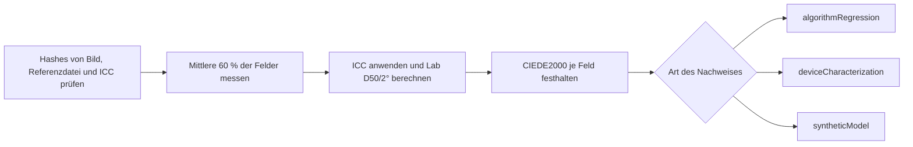

# IT8-Farbprüfung

[Dokumentationsstart](../README.md)

Farbtreue wird nicht am Bildschirm freigegeben.
Ein IT8-Bild und die Referenzdatei zu seinem physischen Target werden als Paar festgelegt,
und jedes Feld wird als Zahl festgehalten.

> [!IMPORTANT]
> Öffentliches IT8-Material zeigt Rückschritte in Prüfprogramm und Farbrechnung. Die Genauigkeit
> eines echten Scanners oder eines Farbnegativs belegt es nicht. Für ein Urteil über ein Gerät
> braucht es ein bestätigtes physisches Target und echte Messungen an diesem Gerät.

## Arten von Nachweis

| Name | Was er bestätigt | Was nicht |
|---|---|---|
| `algorithmRegression` | Dateiauswertung, ICC-Umrechnung, Feldbereiche, Lab, CIEDE2000 | Genauigkeit eines echten Scanners |
| `deviceCharacterization` | Ein bestätigtes physisches Target, an einem echten Gerät gemessen | Genauigkeit anderer Targets oder Geräte |
| `syntheticModel` | Den mathematischen Hin- und Rückweg eines unabhängigen synthetischen Modells | Genauigkeit von echtem Film oder Gerät |

`deviceCharacterization` braucht Hersteller, Material,
Seriennummer und Charge des physischen Targets.
Weicht auch nur eine Angabe vom Kopf der Referenzdatei ab, wird nichts bewertet.

Die Durchlicht-Targets IT8.7/1 und ISO 12641-1 gelten für positive Durchlichtvorlagen.
Aus diesen Ergebnissen folgt nichts über die Orangemaske von Farbnegativen,
Farbstoffwechselwirkungen, C-41-Streuung oder die Ausgabegenauigkeit von NORITSU/FUJI.
Solche Aussagen brauchen Paarmaterial desselben Farbnegativs über beide Wege und einen eigenen
Prüfsatz.

## Öffentliches Regressionsmaterial

Diese zwei Dateien von FADGI/OpenDICE bilden ein Paar.

- Anleitung: <https://www.digitizationguidelines.gov/guidelines/digitize-OpenDice.html>
- Bild: <https://www.digitizationguidelines.gov/guidelines/OpenDICE/IT8-7.1.tif>
  - SHA-256: `c62ee73f26390a2ad90e7e28280cbd1efb4f18834425bb7112ff1f8016832ffd`
  - Größe: `6255 x 4170`
  - Format: 16-Bit-RGB mit eingebettetem `Adobe RGB (1998)`
- Referenzdatei: <https://www.digitizationguidelines.gov/guidelines/OpenDICE/Profile_IT8-7.1.txt>
  - SHA-256: `19337b85f213eb4397e91c91298201f421ef3ca33b0ef6da3d752a0880491840`
  - Felder: 264 Lab-Werte von `A1` bis `L22`
  - Spalte 16: density

Die Rechte zur Weitergabe sind nicht geklärt,
deshalb liegen die Dateien weder im Repository noch in der App.
Sie laden sie selbst herunter und verbinden sie über das
[Beispielmanifest](../../reference/IT8_FADGI_OPENDICE.example.json) .
Die Stufe in diesem Beispiel ist `algorithmRegression`.
Wer sie in `deviceCharacterization` umbenennt, wird vom Prüfprogramm abgewiesen.

```bash
swift run negaflow it8-bench docs/reference/IT8_FADGI_OPENDICE.example.json \
  --image /path/to/IT8-7.1.tif \
  --reference /path/to/Profile_IT8-7.1.txt \
  --out /path/to/it8-report.json
```

## Messregeln

- Weicht der SHA-256 von Bild, Referenzdatei oder gewähltem ICC vom Manifest ab, bricht es ab.
- Bericht v2 hält auch den SHA-256 des Manifesttexts fest.
- `A01` und `A1` lesen dieselben Koordinaten, die ursprüngliche ID bleibt im Bericht.
- Die mittleren 60 % jedes Feldes im Raster 22 mal 12 werden in Gleitkomma bei Quellauflösung gelesen.
- Die Feldreihenfolge läuft über Zeilen `A`–`L` und Spalten `1`–`22`.
- Das eingebettete ICC wird beachtet.
- Gerechnet wird von linearem sRGB D65 nach XYZ, Bradford-D50-Anpassung, dann Lab D50/2°.
- Je Feld werden Bereich, Pixelzahl, RGB-Mittel und -Streuung, Beschnittanteil an beiden Enden, Zahl nicht endlicher Werte, Referenz- und Mess-Lab, L/a/b-Differenzen und CIEDE2000 festgehalten.
- Median, p95 und Max sind Beobachtungen, keine Bestehensgrenze.
- Ohne Grundlage wird keine Durchschnittsschwelle erfunden, und `qualityDecision` bleibt `notEvaluated`.
- Ein Target, das zur Profilanpassung diente, wird nicht erneut zur unabhängigen Prüfung genutzt.

### Angaben zum physischen Target

Für eine Messung am echten Gerät liest die bedienende Person diese Angaben vom Target-Etikett ab und
trägt sie ein.

<details>
<summary>Beispiel für den Messblock</summary>

```json
{
  "measurement": {
    "samplerVersion": "center-mean-v1",
    "renderingIntent": "relativeColorimetric",
    "physicalTargetIdentity": {
      "manufacturer": "target label manufacturer",
      "material": "target label material",
      "serial": "target label serial",
      "batchMetadataKey": "PROD_DATE",
      "batchValue": "reference header production date"
    }
  }
}
```

</details>

`MANUFACTURER`, `MATERIAL`, `SERIAL` und der Chargenkopf (eines von `BATCH`, `BATCH_ID`,
`PROD_DATE`) müssen zeichengenau mit der Referenzdatei übereinstimmen.
Die oberste `targetID` muss `serial` entsprechen, `batchID` dem `batchValue`.

Dieser Eintrag zeigt nur, dass Eingabe und Referenzdatei zusammenpassen.
Er liest das Etikett nicht aus dem Bild und beglaubigt die Eingabe nicht unabhängig. Fehlen Angaben,
tritt weder das nächstgelegene Datum noch eine allgemeine Referenzdatei an ihre Stelle.

Enthält die Referenzdatei Angaben zu Lichtart oder Beobachter,
werden sie gegen den D50/2°-Vertrag geprüft. Ein Widerspruch bricht ab.
`measurement.renderingIntent` kann die Core-Image-Umrechnung derzeit nicht direkt festlegen,
deshalb steht im Bericht `manifestDeclarationNotControlledByEvaluator`.

## `PRINT`-Ausgabe

IT8.7/1 gilt für Eingabegeräte. Für die Druckerausgabe braucht es ein RGB-Drucker-ICC,
das aus echten Messungen der Kombination
`printer + paper + ink/chemistry + driver/process condition` entstanden ist.

Reihenfolge von Prüfung und Anwendung:

1. Größe des ICC, Geräteklasse `prtr`, Datenraum `RGB `, Lab/XYZ-PCS und die `acsp`-Kennung prüfen.
2. Prüfen, ob ColorSync in beide Richtungen umrechnen kann.
3. Bei der Auswahl Profilname, Bytes und SHA-256 festhalten.
4. Erst nach dem `MAIN`-Arbeitsbild und dem Seitenlayout genau einmal auf die Endausgabe anwenden.
5. Nicht auf `rawScanTIFF` und `-main-flat` anwenden.
6. Fehlt das Profil oder passt es nicht, scheitert der Lauf vor jeder temporären Ausgabe. sRGB springt nicht ein.

Es wird nicht behauptet,
dass der heutige Weg über Core Image und ColorSync Rendering Intent und Black Point Compensation auf
jedem macOS bitgenau festlegt.

## `MAIN`-Regression mit synthetischen Feldern

Der Standardweg für Farbnegative nutzt `shoulder-print-response-v4`.

```math
\log_{10}(P) =
y_{\mathrm{ceil}} -
\mathrm{amplitude}\,
\exp\left(-(\mathrm{rate}\,d)^{\mathrm{shape}}\right)
```

`d` ist die optische Dichte nach Abzug von Dmin, danach normiert.
Die Koeffizienten sind keine gespeicherten Presets,
sondern werden aus diesen vier Ankerpunkten berechnet.

| Ankerpunkt | Wert |
|---|---:|
| Trägerschwarzpunkt | `0.001` |
| Mittelgrau | `0.18` |
| Weiß der gemessenen dichtesten Stelle | `0.70` |
| Reserve für reflektiertes Licht | `0.90` |

Auf dieser Kurve ist `0D` linear `0.001`, `0.6D` gleich `0.18` und `3D` gleich `0.882836683855`.
Die Ausgabe bleibt in einem offenen Intervall,
sodass Schwarz und Weiß im normalen Bereich nicht direkt auf 8-Bit `0/255` kleben.

Es ist keine automatische Belichtungsanpassung nach Szenenhistogramm und steht für die Genauigkeit
keines bestimmten Films und keiner bestimmten Maschine.
Die Gleichungen stehen in [feste Printantwort](PRINT_RESPONSE.md).

`MainSyntheticIT8RoundTripTests` macht aus den 264 Referenzfeldern über die Umkehrfunktion Negative
und führt sie durch den gesamten `MAIN` -Weg zurück.
Lab D50/2° und `DeltaE00` werden je Feld geprüft. Das ist eine `syntheticModel`-Regression.

## Regression des relativen NORITSU/FUJI-Stils

Eine Referenzdatei mit 264 Lab-D50-Feldern von `A1` bis `L22` wird per SHA-256 festgelegt.
Jedes Feld wird zu einem synthetischen Negativ, danach laufen die Wege `MAIN`,
`NORITSU` und `FUJI` je zweimal.

```bash
swift run negaflow scanner-relative-it8-bench \
  /path/to/Profile_IT8-7.1.txt \
  --sha256 sha256:19337b85f213eb4397e91c91298201f421ef3ca33b0ef6da3d752a0880491840 \
  --out /path/to/scanner-relative-it8-report.json
```

Der Bericht führt RGB und Lab je Feld, `DeltaE00` gegen die Referenz,
relatives `DeltaE00` zwischen den Zielen sowie Hinweise auf Beschnitt und nicht endliche Werte.
Die Monotonie des neutralen Verlaufs liest man aus der Dichtespalte `A16...L16`.

Farben, die nach der Umrechnung in lineares sRGB außerhalb von 0...1 liegen,
lassen sich als synthetisches Negativ nicht exakt erzeugen und werden auf den darstellbaren Bereich
begrenzt.
Statistiken über den weiten Bereich sind daher Beobachtungen und keine Bestehensgrenze.

Die Nachweisstufe ist immer `syntheticModel`, die Entscheidung immer `notEvaluated`.
Stimmt das Profilmanifest oder der SHA-256 einer Datei nicht, bricht der Lauf ab.
Für die Genauigkeit echter Maschinen braucht es Scans desselben physischen Negativs auf beiden
Maschinen und eigenes Prüfmaterial.

D50/2° wurde nicht aus dem Kopf der Referenzdatei bestätigt.
Lab als D50/2° zu lesen ist der eigene Vertrag der Bench,
deshalb lautet `colorimetryInterpretationProvenance`
`benchmarkContractNotVerifiedFromReferenceHeader` .

Ergebnisse von vor `shoulder-print-response-v4` werden nicht als Ergebnisse des heutigen Algorithmus
weiterverwendet.

## Ablauf der Messung


