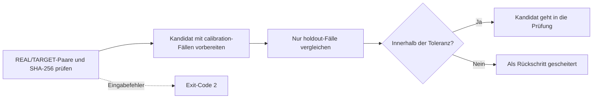

# Qualitätsprüfung der Scannerprofile

[Dokumentationsstart](../README.md)

`scripts/evaluate_profile_quality.py` prüft, ob eine Änderung an einem Scannerprofil schlechter ausgefallen ist als die freigegebene Basis. Es vergleicht zwei von `LUT_target/analyze_lut_target.py` erzeugte `SOURCE/summary.json` und lässt nur die Prüffälle in die Entscheidung einfließen, die bei der Profilabstimmung außen vor blieben.

Was „gute Farbe“ ist, legt dieses Werkzeug nicht fest. Welche Werte sinken und welche steigen sollen und wie viel Bewegung zulässig ist, trägt ein Mensch in das Korpusmanifest ein. Voreingestellte Bestehenswerte gibt es nicht.

Im Repository liegt derzeit kein REAL/TARGET-Bildpaar. Damit gibt es weder ein echtes Korpusmanifest noch eine freigegebene Basis noch ein Bestehen an einem echten Gerät. Die synthetischen Tests prüfen allein den Code des Prüfprogramms.

> [!WARNING]
> Aus diesem Repository allein lässt sich die Farbgenauigkeit eines Scanners nicht freigeben. Eine echte Auslieferungsentscheidung braucht festgelegte REAL/TARGET-Paare, Prüffälle, die nicht zur Abstimmung dienten, und von Menschen gesetzte Toleranzen.

## Wie weit die App die heutigen Profile nutzt

Nur wenn Sie das Ziel `NORITSU` oder `FUJI` selbst wählen, kann eine begrenzte relative Differenz aus der mitgelieferten `realOnly`-Gruppe zum Einsatz kommen.

Voraussetzungen:

- Filmtyp und Filmname stimmen überein.
- Der bereinigte Satz der Quell-Filmnamen stimmt überein.
- Die Bildanzahl weicht um höchstens 15 % ab.

Die Quellprofile führen weder eine Bild-ID noch einen SHA-256. Gleiche Filmnamen belegen nicht, dass genau dieselben Aufnahmen gepaart wurden. Von demselben Ergebnis wie bei der echten Maschine lässt sich also nicht sprechen.

Regeln für die Anwendung:

- Werte, die in beiden Gruppen in entgegengesetzte Richtungen zeigen, werden nicht angewendet.
- Bei Schwarzweiß entfallen alle Farbanteile, es bleibt nur der relative Tonwert.
- Auf ein Diaprofil ohne passenden Film wird die relative NORITSU/FUJI-Korrektur nicht angewendet.
- Ohne Paarmaterial von derselben Stelle werden Scannertextur und Schärfung nicht angewendet.
- Der Tonwert wird einmal auf die Helligkeit im Rec.709-Gamma angewendet, Lab `a*` und `b*` bleiben erhalten.
- Der Farb-Gain wird im logarithmischen Bereich interpoliert, damit die Beziehung zwischen gegenläufigen Ankerpunkten hält.
- Stimmt der SHA-256 einer Datei oder eines Manifests nicht, wird das gesamte Profilpaket abgelehnt.

## Was Herstellermaterial bestätigen kann

- Der [Leitfaden zu Fujifilm Frontier 570/SP-3000](https://www.photolabdigital.com/fuji_frontier570_en%5B1%5D.pdf) nennt Funktionen wie Flächen-CCD, Hyper-tone und Hyper-sharpness, veröffentlicht aber weder Übertragungsfunktion noch Einstellwerte.
- Die [Produktangaben zum Noritsu HS-1800](https://www.noritsu.eu/hardware/noritsu-film-scanner.html) nennen unterstützte Formate, Auflösung und Durchsatz, aber keine feste Farbübertragungsfunktion.
- Das [Noritsu-Patent US 7,589,863](https://patents.google.com/patent/US7589863/en) beschreibt den Minilab-Ablauf, bei dem eine bedienende Person Dichte, Gradation und Schärfung wählt.

Dieses Material zeigt, dass die Verarbeitung mit Szene und Bedienung wechselt. Konstanten zum Nachbau eines HS-1800 oder SP-3000 liefert es nicht. negaflow leitet solche Werte nicht aus einem Produktnamen ab.

## Korpusmanifest, Schema v1

Das Manifest liegt neben dem Eingangsmaterial, das es festlegt, etwa `LUT_target/quality/corpus-v1.json`. Pfade beziehen sich auf die Manifestdatei. Mit `--data-root` wird stattdessen jener Pfad zur Basis.

<details>
<summary>Beispielmanifest</summary>

```json
{
  "schemaVersion": 1,
  "corpusVersion": "scanner-corpus-2026-07-10.1",
  "acceptedBaselineSHA256": "sha256:<64 lowercase hex>",
  "cases": [
    {
      "role": "calibration",
      "stem": "NORITSU/color nega/Portra 400/calibration-01",
      "real": {
        "path": "REAL/NORITSU/color nega/Portra 400/calibration-01.tif",
        "sha256": "sha256:<64 lowercase hex>"
      },
      "target": {
        "path": "TARGET/NORITSU/color nega/Portra 400/calibration-01.tif",
        "sha256": "sha256:<64 lowercase hex>"
      }
    },
    {
      "role": "holdout",
      "stem": "NORITSU/color nega/Portra 400/holdout-01",
      "real": {
        "path": "REAL/NORITSU/color nega/Portra 400/holdout-01.tif",
        "sha256": "sha256:<64 lowercase hex>"
      },
      "target": {
        "path": "TARGET/NORITSU/color nega/Portra 400/holdout-01.tif",
        "sha256": "sha256:<64 lowercase hex>"
      }
    }
  ],
  "metrics": [
    {
      "name": "mean_delta_e2000",
      "direction": "lowerIsBetter",
      "allowedRegression": 0.0
    },
    {
      "name": "similarity_score_0_100",
      "direction": "higherIsBetter",
      "allowedRegression": 0.0
    },
    {
      "name": "neutral_a_shift",
      "direction": "absoluteLowerIsBetter",
      "allowedRegression": 0.0
    }
  ]
}
```

</details>

Die `0.0` im Beispiel ist keine Empfehlung. Legen Sie Einträge und Toleranzen passend zu Ihrer Messweise und Ihrer Auslieferungspolitik fest.

## Regeln für das Manifest

- `schemaVersion` muss exakt `1` sein.
- Unbekannte Versionen und unbekannte Felder werden abgelehnt.
- `corpusVersion` benennt eine festgelegte Auswahl und Aufteilung des Materials.
- `acceptedBaselineSHA256` legt die genauen Bytes der freigegebenen `summary.json` fest.
- Jeder Fall ist entweder `calibration` oder `holdout`.
- Namen dürfen sich nicht wiederholen.
- Das Material darf nicht leer sein, und beide Rollen brauchen mindestens einen Fall.
- REAL- und TARGET-Dateien werden beide als `sha256:<64 lowercase hex>` festgelegt.
- Kennzahlnamen dürfen sich nicht wiederholen.
- `allowedRegression` muss eine endliche Zahl ab null sein. Wahrheitswerte werden abgelehnt.
- Als Richtung gelten nur `lowerIsBetter`, `higherIsBetter` und `absoluteLowerIsBetter`.

`absoluteLowerIsBetter` vergleicht den Abstand zu null. Nur verwenden, wenn null die geprüfte Referenz ist.

## Kandidat und freigegebene Basis vorbereiten

```bash
python3 LUT_target/analyze_lut_target.py
```

Bewahren Sie vor der Freigabe die gesamte `SOURCE/summary.json` des Kandidaten als nächste freigegebene Basisdatei auf. Die vorhandene Freigabedatei wird nicht überschrieben, solange der Kandidat die Prüfung nicht bestanden hat. Tragen Sie den genauen SHA-256 der Freigabedatei in `acceptedBaselineSHA256` ein.

In den Zusammenfassungen von Kandidat und Basis muss jeder Fall des Manifests genau einmal vorkommen. Ein fehlender Fall, ein Duplikat, ein Verarbeitungsfehler oder ein Fall außerhalb des Manifests ist ein Eingabefehler.

`calibration`-Fälle dürfen zur Profilanpassung dienen. In die Entscheidung gehen sie nicht ein. `holdout`-Fälle bleiben aus Abstimmung und Auswahl heraus. Prüfwerte werden Fall für Fall verglichen, damit eine durchschnittliche Verbesserung kein einzelnes verschlechtertes Bild verdeckt.



## Ausführen

<details open>
<summary>Befehl der Qualitätsprüfung</summary>

```bash
python3 scripts/evaluate_profile_quality.py \
  --manifest LUT_target/quality/corpus-v1.json \
  --candidate-summary LUT_target/SOURCE/summary.json \
  --baseline-summary LUT_target/quality/accepted-summary-v1.json \
  --data-root LUT_target \
  --verify-files all \
  --report build/profile-quality-report.json
```

</details>

Modi der Dateiprüfung:

| Wert | Verhalten | Als Auslieferungsbeleg nutzbar |
|---|---|---|
| `all` | Prüft Pfad und SHA-256 aller REAL/TARGET-Dateien | Ja |
| `holdout` | Prüft nur die Prüfdateien | Für schnelle Diagnose |
| `none` | Prüft keine Bilddateien | Nein |

Standard ist `all`. Der Bericht hält den verwendeten Modus, die Hashes von Manifest und Zusammenfassungsdateien, das Ergebnis der Dateiprüfung sowie Vergleich und Anzahl je Prüffall fest. Dasselbe JSON geht nach stdout und in die `--report`-Datei. Die Datei wird atomar gespeichert.

Exit-Codes:

- `0`: Eingabe stimmt, nichts verschlechtert sich über die Toleranz hinaus
- `1`: Eingabe stimmt, aber mindestens ein Prüfwert liegt außerhalb des Bereichs
- `2`: Schema, Material, Hash, Pfad oder Kennzahl ist falsch oder fehlt

## Das Prüfprogramm testen

```bash
python3 -m unittest scripts/tests/test_evaluate_profile_quality.py
```

Die Tests decken mit temporären synthetischen Dateien einen normalen Vergleich, einen Rückschritt, einen geänderten Hash, ein falsches Schema und falsche Zahlen, doppelte, fehlende und fehlgeschlagene Fälle sowie leeres Material ab. Über die Qualität der Ausgabe eines echten Scanners sagen sie nichts.
