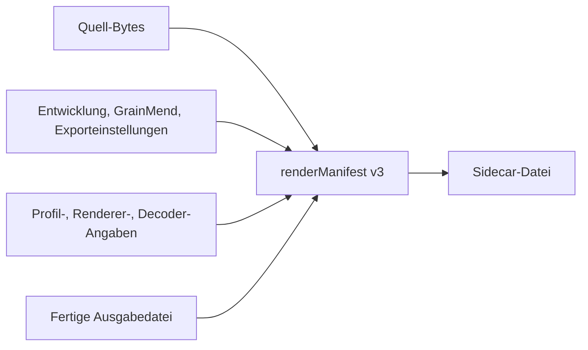

# Render-Protokoll

[Dokumentationsstart](../README.md)

Das `renderManifest` in der Sidecar-Datei verbindet Quelle, Bearbeitungswerte und Enddatei über
SHA-256.
Dateipfade werden nicht festgehalten.

> [!IMPORTANT]
> Das `renderManifest` hält Hash-Beziehungen zwischen Dateien und Einstellungen fest. Es gibt
> keine digitale Signatur und kein Zertifikat, deshalb heißt es nicht C2PA Content Credentials.

Was in v3 steht:

- Bytezahl der Quelle, SHA-256 und der Algorithmusname `sha-256`
- Welche Render-Eingabe tatsächlich verwendet wurde
- Der geprüfte Umfang der GrainMend-Cachedatei oder der Speichereingabe
- SHA-256 der Entwicklungs-, GrainMend- und Exporteinstellungen
- SHA-256 des Scannerprofils
- Herkunft des Decoders und Renderer-Version der Chroma-Engine
- SHA-256, Bytezahl, Pixelmaße und Format der Enddatei

Wenn der Encoder fertig geschrieben hat, wird die Datei mit ImageIO erneut geöffnet, um die
Pixelmaße zu bestätigen, und die ganze Datei wird gehasht.
Danach wird die Sidecar-Datei geschrieben.
Fällt die v3-Prüfung durch, erscheint das Ergebnis nicht als fertiger Ausgabesatz.

## GrainMend-Eingabe

- `cleanedMemory`: Für Pixel im Speicher gibt es keinen Standard-Hash, daher wird der geprüfte
Umfang als `sourceAndDevelopRecipe` notiert.
Der SHA-256 des GrainMend-Bearbeitungsverlaufs ist immer dabei.
- `cleanedFile`: Die gesamte GrainMend-Cachedatei und der Bearbeitungsverlauf werden gehasht.

Alte v1- und v2-Dateien lassen sich weiter öffnen.
Ausgabe- oder Verlaufs-Hashes, die es damals nicht gab, werden nicht nachträglich geraten.

## Unterschied zu C2PA

Hier gibt es keine digitale Signatur, kein Zertifikat, keine Vertrauenskette und keinen
eingebetteten Claim Store.
Deshalb heißt es nicht C2PA Content Credentials.
Hard Binding und Verarbeitungshistorie aus C2PA sowie der Integritätsbegriff aus PREMIS dienten als
Vorbild, aufgenommen werden aber nur prüfbare SHA-256-Werte.

Quellen:

- [C2PA Content Credentials 2.2](https://spec.c2pa.org/specifications/specifications/2.2/specs/C2PA_Specification.html)
- [C2PA hard-binding guidance](https://spec.c2pa.org/specifications/specifications/2.4/guidance/Guidance.html)
- [PREMIS preservation metadata](https://www.loc.gov/standards/premis/)
- [Apple Image I/O orientation and image properties](https://developer.apple.com/documentation/imageio/cgimagepropertyorientation)
