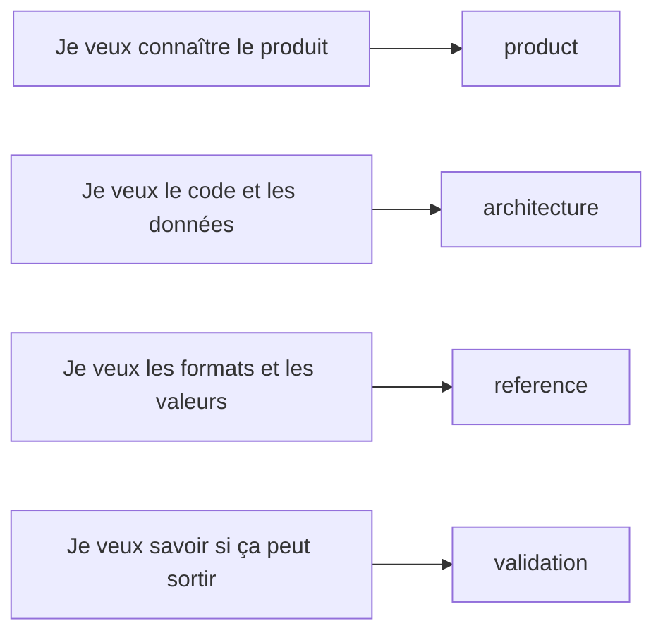

# Documentation negaflow

Classée par sujet pour ouvrir directement celle qu'il vous faut.

[English](../README.md) · [한국어](../ko/README.md) · [日本語](../ja/README.md) ·
[简体中文](../zh-Hans/README.md) · Français · [Deutsch](../de/README.md)

> [!NOTE]
> La version actuelle est `1.0.2`. Ce qui est fait et ce qui a été réellement vérifié
> est noté dans [État du projet](product/PROJECT_STATUS.md).

## Produit

| Document | À lire quand |
|---|---|
| [Chroma Engine](product/CHROMA_ENGINE.md) | Vous voulez l'inversion du film et l'ordre de développement |
| [GrainMend](product/GRAINMEND.md) | Vous voulez voir comment la réparation poussière et rayures fonctionne |
| [Profils de film](product/FILM_PROFILES.md) | Vous voulez l'origine des profils fournis et leurs limites |
| [État du projet](product/PROJECT_STATUS.md) | Vous voulez l'état d'implémentation, de mesure et de distribution |

## Architecture

| Document | Contenu |
|---|---|
| [Architecture produit](architecture/PRODUCT_ARCHITECTURE.md) | Flux de données entre application, moteur, stockage et export |
| [Stockage du catalogue](architecture/CATALOG_STORAGE.md) | Pourquoi SQLite, l'ancien format, les mesures |
| [Architecture des plugins scanner](architecture/SCANNER_PLUGINS.md) | Processus externe, approbation, fichiers de scan publiés |
| [Archive de bibliothèque](architecture/LIBRARY_ARCHIVE.md) | Comment originaux et historique d'édition sont conservés ensemble |

## Référence

| Document | Contenu |
|---|---|
| [JSON de la CLI scanner](reference/CLI_JSON.md) | Forme de sortie de `detect --json` et `capabilities --json` |
| [Manifeste de rendu](reference/RENDER_MANIFEST.md) | Liens SHA-256 entre source, valeurs d'édition et fichier de sortie |
| [Réponse de tirage fixe](reference/PRINT_RESPONSE.md) | Formule et points d'ancrage de `shoulder-print-response-v4` |
| [Contrôle qualité des profils scanner](reference/PROFILE_QUALITY_GATE.md) | Règles de publication du matériel REAL/TARGET |
| [Profils de bruit des scanners](reference/SCANNER_NOISE_PROFILES.md) | Mesure par scans répétés et conditions d'application automatique |
| [Films que GrainMend IR doit éviter](reference/INFRARED_LIMITS.md) | Noir et blanc, Kodachrome, limites d'alignement RVB/IR |
| [Validation colorimétrique IT8](reference/IT8_COLOR_VALIDATION.md) | Mesure des patchs, niveaux de preuve, régression synthétique |

## Validation

| Document | À utiliser quand |
|---|---|
| [Checklist QA sur matériel réel](validation/REAL_QA_CHECKLIST.md) | Vous vérifiez un Mac, un écran, un scanner et un film réels |
| [Comparaison GrainMend sur scans réels](validation/GRAINMEND_CORPUS.md) | Vous remesurez les 44 paires FILM-R v2 |

## Provenance et distribution

| Document | À utiliser quand |
|---|---|
| [Provenance du code et des ressources](legal/PROVENANCE.md) | Vous vérifiez la frontière Apache/GPL et les empreintes des ressources |
| [`TRADEMARKS.md`](../../TRADEMARKS.md) | Vous vérifiez l'usage des noms de films, scanners et produits |

## Comment c'est écrit

- Les documents produit ne décrivent que ce que l'utilisateur voit aujourd'hui.
- Les documents d'architecture décrivent les responsabilités et le déplacement des données.
- Les valeurs de code, noms de champs et empreintes restent tels quels.
- Les documents de validation séparent ce qui est passé de ce qui reste à vérifier.
