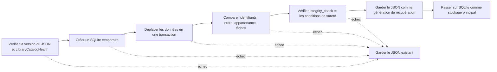

# Stockage du catalogue

[Accueil de la documentation](../README.md)

Le stockage principal est `library.sqlite`.
L'ancien `library.json` ne sert plus qu'à reprendre d'anciens éléments ou à écrire un fichier de
diagnostic.
Rien ne met à jour les deux fichiers en même temps, donc pas de `dual-write`.

Les sauvegardes et les archives de conservation contiennent une forme JSON qui se déplace d'une
machine à l'autre.
Le fichier SQLite en cours d'utilisation n'y entre pas.

| Type | Format | Sert à |
|---|---|---|
| Catalogue principal | SQLite | Exécution de l'application, recherche, enregistrement, récupération |
| Anciens éléments | JSON | Import d'un catalogue existant |
| Sauvegarde et archive de conservation | Forme JSON | Passer sur une autre machine, restaurer |

> [!IMPORTANT]
> Un catalogue absent ou endommagé ne lance pas une bibliothèque vide. Le catalogue d'origine et
> les fichiers photo restent intacts jusqu'à ce qu'une génération saine soit trouvée.

## Mesures

JSON et SQLite ont été comparés sur le même Mac avec ces commandes.

<details>
<summary>Commandes de mesure</summary>

```bash
DEVELOPER_DIR=/Applications/Xcode.app/Contents/Developer \
  NEGAFLOW_CATALOG_PERF_REPORT="$PWD/build/performance/catalog.json" \
  bash scripts/performance/run-catalog.sh

DEVELOPER_DIR=/Applications/Xcode.app/Contents/Developer \
  NEGAFLOW_LIBRARY_QUERY_PERF_REPORT="$PWD/build/performance/library-query.json" \
  bash scripts/run-library-query-performance.sh

DEVELOPER_DIR=/Applications/Xcode.app/Contents/Developer \
  NEGAFLOW_SQLITE_CATALOG_PERF_REPORT="$PWD/build/performance/catalog-sqlite.json" \
  bash scripts/performance/run-sqlite-catalog.sh
```

</details>

Mesuré le 2026-07-12 : Mac14,3, arm64, 8 cœurs, 24 Gio de mémoire, macOS 26.5, build Swift Release.
Ces chiffres ne disent rien d'un autre Mac.
Ils servent de référence pour repérer une régression dans le même environnement.

| Images | Taille JSON | Encodage p50 | Décodage p50 | Lecture fichier p50 |
|---:|---:|---:|---:|---:|
| 1 000 | 2 192 671 octets | 98 ms | 241 ms | 231 ms |
| 10 000 | 21 934 841 octets | 811 ms | 2 301 ms | 2 299 ms |
| 50 000 | 109 721 335 octets | 2 746 ms | 7 353 ms | 7 397 ms |

L'encodage JSON de 50 000 images a fait grimper la mémoire résidente d'environ 191 Mio et le max RSS
d'environ 107 Mio.
Sur le même matériel, préparer la recherche en mémoire a pris 32, 86 ms, trier tous les noms 86,
01 ms, et trier les noms après filtre 158, 37 ms.
Quatre projections de filtre d'affilée : p50 de 512,80 ms.

Magasin de lignes SQLite, 50 000 images, p95 en Release :

| Opération | p95 |
|---|---:|
| Nouveau commit | 3 714 ms |
| Lecture du fichier principal | 7 446 ms |
| Commit sans modification | 3 856 ms |
| Taille par image | environ 4 211 octets |

Une sauvegarde ne tire pas toute la base dans `Data`.
Elle fabrique une copie temporaire compatible avec la réplication, puis l'échange de façon atomique.
Le contrôle préalable ne décode pas toutes les images non plus :
il vérifie l'intégrité SQLite et le schéma.
Le p95 d'un commit sans modification est ainsi passé de 11 245 ms à 3 856 ms.

## Pourquoi SQLite

- Les modifications de plusieurs lignes tiennent dans une transaction.
- Lignes et index permettent de ne lire que les images utiles.
- L'API C SQLite de macOS évite un nouveau paquet.
- La règle de récupération actuelle tient : un magasin endommagé n'est jamais pris pour une bibliothèque vide.

Aujourd'hui, `journal_mode=DELETE` et `synchronous=FULL`.
WAL obligerait à traiter la base et le fichier `-wal` comme un tout.
La base en service n'est jamais copiée au hasard.
Seul le fichier principal, vérifié après fermeture de la connexion,
devient une copie de récupération.

## Qui fait quoi dans le code

- `CatalogStore` : connexion, transactions, version de schéma, contrôles d'intégrité
- `CatalogMigration` : import JSON en lecture seule et conversion par version
- Tables d'entités : images, originaux, ordre, films, dossiers, collections, recherche, tâches de numérisation
- `LibraryBackupStore` : sauvegarde JSON transférable, contrôles avant restauration, informations de récupération

Les valeurs de développement et l'historique d'édition versionné sont stockés en BLOB JSON par
entité. Pixels sources,
vignettes et caches GrainMend restent hors de la base.

Les colonnes et index de recherche et de tri ne suffisent pas encore,
donc tout le catalogue est chargé en mémoire au démarrage.
C'est pourquoi le temps de lecture SQLite ressemble à celui du JSON aujourd'hui.
Ensuite viendront des recherches par index limitées aux colonnes et images utiles.

## Reprendre l'ancien JSON



Si une étape échoue, le JSON existant reste tel quel. Rien ne démarre sur un catalogue vide.
Même avec des fichiers intermédiaires et des marqueurs restants,
on ne continue que si le SHA-256 source et les deux catalogues concordent.

Après le passage, aucun retour automatique au JSON.
Pour empêcher une ancienne version de l'application de modifier le JSON et de scinder le stockage,
la version de lecture minimale et le marqueur de migration sont vérifiés.

## Ce qui n'a pas été retenu

- **Tout le catalogue dans un fichier JSON :** simple, mais lire 50 000 images prend environ
7,4 secondes, et chaque enregistrement réécrit le fichier.
- **Un fichier JSON par image :** certaines écritures diminuent, mais il faut écrire soi-même le
code qui enregistre plusieurs entités d'un coup et valide leurs relations.
- **Passer à Core Data maintenant :** possible, mais cela veut dire refaire d'un coup la conversion
Codable et le contrat de récupération. À reconsidérer si un prototype réel mesure mieux que SQLite
brut.

## Sources

- [Apple: Tuning for Performance and Responsiveness](https://developer.apple.com/library/archive/documentation/General/Conceptual/MOSXAppProgrammingGuide/Performance/Performance.html)
- [Apple: Reducing disk writes](https://developer.apple.com/documentation/xcode/reducing-disk-writes)
- [SQLite: Atomic Commit](https://sqlite.org/atomiccommit.html)
- [SQLite: Write-Ahead Logging](https://sqlite.org/wal.html)
