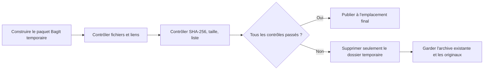

# Archive de bibliothèque

[Accueil de la documentation](../README.md)

Une sauvegarde de catalogue sert à relancer l'application, elle ne contient donc pas les photos
d'origine.
L'archive `.negaflowarchive` réunit les éléments suivants dans un seul paquet.

| Inclus | Laissé de côté |
|---|---|
| Catalogue JSON transférable | Le fichier SQLite en cours d'utilisation |
| Originaux référencés et originaux IR restants | Vignettes et aperçus |
| L'historique d'édition GrainMend encore utile | Caches GrainMend reconstructibles |
| Le lien entre copies virtuelles et originaux partagés | Fichiers exportés |

Le fichier SQLite en cours d'utilisation n'est pas inclus.
Tout ce qui peut être reconstruit est aussi écarté : vignettes, aperçus, caches GrainMend, fichiers
exportés.

> [!WARNING]
> Si l'archive échoue, l'archive existante n'est pas écrasée. Les originaux, les XMP tiers et
> le catalogue en cours ne sont pas touchés non plus.

## Structure du paquet et contrôles

Le paquet suit la structure de dossiers
[RFC 8493 BagIt](https://www.rfc-editor.org/rfc/rfc8493.html).
Les listes SHA-256 sont écrites séparément pour les fichiers de contenu et les fichiers
administratifs.
`negaflow-archive.json` relie les identifiants d'image aux identifiants de fichiers stockés.
Si plusieurs copies virtuelles utilisent le même original, ses octets ne sont stockés qu'une fois.

Le dossier temporaire rejoint son emplacement final seulement après ces contrôles.

1. L'application actuelle peut lire le catalogue sans risque.
2. Les originaux et les entrées IR sont des fichiers ordinaires, et leur taille et leur date ne changent pas pendant la copie.
3. Tous les enregistrements GrainMend nécessaires sont lisibles.
4. Les SHA-256, le nombre d'octets, la liste des fichiers et `Payload-Oxum` concordent.
5. Les liens des images vers leurs originaux, fichiers IR et enregistrements GrainMend correspondent au catalogue.

En cas d'échec, l'archive existante reste en place.
Seul le dossier temporaire inachevé est supprimé. Les originaux, les XMP tiers et le catalogue en
cours ne bougent pas.

## Limites

Les formats d'origine sont conservés tels quels.
Rien n'est converti au nom de la compatibilité à long terme.
Les événements de conservation et les agents PREMIS, ainsi que la migration vers des formats
recommandés, sortent du périmètre de la v1.

Une archive ne suffit pas à conserver dans la durée.
Gardez des copies sur d'autres supports et dans un autre lieu, et revérifiez les empreintes
régulièrement.

Sources :

- [RFC 8493: The BagIt File Packaging Format](https://www.rfc-editor.org/rfc/rfc8493.html)
- [Library of Congress PREMIS](https://www.loc.gov/standards/premis/)
- [Library of Congress Recommended Formats Statement](https://www.loc.gov/preservation/resources/rfs/)
