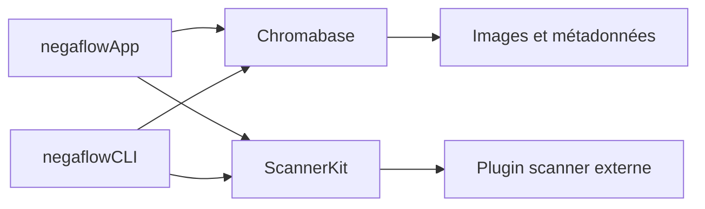
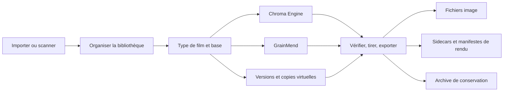

# Architecture produit

[Accueil de la documentation](../README.md)

negaflow est une application macOS.
Vous importez ou scannez des images de film, puis viennent l'inversion, le développement, GrainMend,
la sortie et la conservation.
Chaque modification est conservée à part de l'original.

> [!IMPORTANT]
> Originaux, historique d'édition, caches et fichiers de sortie sont des matériaux différents.
> Perdre un cache ne doit pas faire perdre l'original ni l'historique, et un export échoue plutôt
> que de livrer un résultat qu'il ne peut pas reconstruire.

## Règles de sécurité qui ne changent pas

1. Les images originales et les sidecars tiers ne sont jamais écrasés automatiquement.
2. Retirer de la bibliothèque et mettre l'original à la corbeille sont deux actions distinctes.
3. L'écran scanner n'affiche que ce que le plugin a déclaré.
4. Aucun faux scanner ne prend le relais si vous n'avez pas choisi la démo vous-même.
5. Si un résultat édité ne peut pas être reconstruit, l'original n'est pas exporté à sa place.
6. Une tâche longue revérifie l'image, la version d'édition et la session juste avant d'appliquer
son résultat.
7. Un cache doit pouvoir être reconstruit depuis l'original et l'historique d'édition.
8. Profils, lots de sortie et archives insuffisamment vérifiés ne sont pas publiés comme un
résultat abouti.

## Modules



### `Chromabase`

Le Chroma Engine et le cœur du traitement d'image.

- Lecture des images et gestion de l'orientation
- Mesure de la base du film
- Développement négatif et positif
- Tonalité, couleur et corrections locales
- Profils de film, de rendu et de scanner
- GrainMend RGB et IR
- Histogramme et mesure des couleurs
- Encodage de sortie et métadonnées

Plus de détail :

- [Chroma Engine](../product/CHROMA_ENGINE.md)
- [GrainMend](../product/GRAINMEND.md)

### `ScannerKit`

Ce n'est pas un pilote de scanner. Il porte le contrat qui relie un plugin externe.

- Identifiant et fonctions du scanner
- JSON de requête et de réponse
- Exécution du processus externe, délais, annulation
- Propriétaire du plugin, permissions, approbation, empreinte
- Contrôle de la sortie temporaire, puis publication du fichier final
- Sessions de scan et historique des travaux
- Le scanner de démonstration, que vous devez activer vous-même

L'implémentation SANE vit dans un projet GPL séparé,
[`negaflow-scanner-sane`](https://github.com/habinsong/negaflow-scanner-sane).
L'application et le plugin ne communiquent que par JSON et par la CLI.

### `negaflowCLI`

Utilise le même moteur et le même `ScannerKit` que l'interface graphique.

- Détection des scanners, contrôle des fonctions, numérisation
- Développement de plusieurs images
- Liste des profils de scanner
- `defect-bench` de GrainMend
- Comparaison IT8 et comparaison relative entre scanners
- Autocontrôles et automatisation en JSON

### `negaflowApp`

L'application que les gens utilisent, faite avec SwiftUI et AppKit.

- Bibliothèque, développement, tirage, canevas
- Numérisation, GrainMend, export
- Versions, réglages, raccourcis
- Catalogue, cache, sauvegarde, archive de conservation
- Fenêtre À propos localisée dont la version vient de la ressource commune

## Parcours utilisateur



Chaque étape ajoute au catalogue et à l'historique d'édition au lieu de changer l'original.

## Entrée et originaux

### Importer des fichiers

La voie d'entrée par défaut.
Elle prend en charge TIFF, JPEG, PNG et les RAW d'appareil photo que macOS Image I/O sait lire.
L'ICC embarqué et l'orientation sont lus, et l'identifiant de l'original entre dans le catalogue.

### Numériser

Un plugin installé peut déclarer les fonctions suivantes.

- Résolution et profondeur de bits
- Zone de scan et aperçu
- Exposition
- IR
- Comportement des lots et du passe-vues

L'application n'invente jamais une fonction à partir d'une table de noms de modèles.
Quand un scan se termine, les réglages réellement appliqués par le plugin et le fichier de sortie
sont revérifiés.

### Identifiant de l'original

Un chemin de fichier ne suffit pas à identifier un original.
Les valeurs exigées par le contrat actuel sont conservées : observations sur le fichier, nombre
d'octets, date de modification, SHA-256 et un bookmark persistant.

Si un fichier a bougé, le chemin ne change que lorsque vous le reliez vous-même ou que la
restauration du bookmark réussit.

## Catalogue

Le stockage principal est `library.sqlite`.
L'ancien `library.json` ne sert qu'à faire passer du matériel ancien vérifié, ou à écrire une
sauvegarde transportable.
Les deux stockages ne sont jamais mis à jour en même temps.

Ce qui va dans SQLite :

- Images et originaux
- Films, dossiers, collections, recherches
- Ordre et travaux de numérisation
- Valeurs de développement et historique d'édition par version

Ce qui n'y va pas :

- Les pixels d'origine
- Vignettes et aperçus
- Caches GrainMend

### Migration depuis JSON

1. Vérifier le schéma et l'état de santé du JSON existant.
2. Garder une copie de récupération.
3. Écrire dans un SQLite temporaire en une seule transaction.
4. Comparer le catalogue avant et après.
5. Vérifier l'intégrité SQLite et les conditions de sécurité de l'application.
6. Ne basculer le stockage principal que si tout concorde.

Un JSON en échec n'est pas traité comme un catalogue vide.
Les chiffres et la décision sont dans [Stockage du catalogue](CATALOG_STORAGE.md).

## Bibliothèque

Pour organiser :

- Dossiers, films, collections manuelles, collections intelligentes, recherches enregistrées, piles
- Notes en étoiles, retenu et rejeté, étiquettes de couleur
- Grille, comparaison, sélection
- Examen des doublons candidats

Dans la vue par dossier, chaque dossier porte un bandeau : triangle, dossier, nom, nombre,
procédé de développement, cible, appliquer. Le triangle replie les vignettes en dessous. Les
dossiers repliés le restent au lancement suivant, indépendamment du repli de la liste de fichiers
de la barre latérale.

La vue par dossier est **une seule** grille : chaque dossier est une section et son bandeau en est
l'en-tête. Il faut conserver cette structure. Donner une grille à chaque dossier puis les empiler
supprime la paresse. La pile doit connaître la hauteur entière d'un dossier, donc celui-ci
construit toutes ses cartes dès qu'il entre dans le champ. Avec une seule grille, l'unité de
paresse est une rangée, et c'est ce qui garde le défilement fluide sur plusieurs centaines de
photos.

Plusieurs copies virtuelles peuvent partager un même original.
Avant de supprimer un original, ses références sont vérifiées d'abord.
Retirer de la bibliothèque ne change que des références du catalogue.
La mise à la corbeille est une action séparée.

Les modifications survivent au débranchement d'un disque externe.
L'original est marqué hors ligne et vous le reliez par fichier ou par dossier.
Si l'identifiant n'est pas celui attendu, rien n'est remplacé automatiquement.

Chaque dossier source physique enregistré utilise un seul observateur du système de fichiers. Les
événements sont regroupés brièvement, puis seul le dossier modifié est relu. Le reliaison par
signet conserve l’identifiant du dossier de catalogue après un déplacement ou un renommage dans le
Finder, et les nouvelles images ajoutées directement au dossier sont importées sans sondage ni
nouvelle analyse de toute la bibliothèque.

## Développement et GrainMend

Chaque image porte :

- Identifiant de l'original et type de film
- Base du film
- Valeurs de développement
- Historique d'édition GrainMend
- Historique de versions
- État d'export

Pendant les réglages, un aperçu en basse résolution est utilisé. Un résultat terminé n'atteint
l'écran que si son identifiant d'image et sa version d'édition correspondent toujours à la sélection
en cours.

L'export n'enregistre pas le bitmap d'aperçu affiché. Il reconstruit l'image en pleine résolution à
partir de l'original et des valeurs d'édition figées.

GrainMend garde l'automatique, le guidé, la brosse, le tampon de duplication et l'IR dans une liste
ordonnée.
Les caches sont des fichiers dérivés.
Si un résultat ne peut pas être reconstruit depuis l'original et l'historique, l'export échoue.

Plus de détail dans [GrainMend](../product/GRAINMEND.md).

## Versions

- **History et Snapshot :** enregistrez vous-même un état de développement, puis comparez-le ou
revenez-y.
- **Virtual Copy :** une autre branche d'édition sans dupliquer le fichier original.
- **Copy/Paste :** collez une plage choisie, tonalité, couleur, détail ou géométrie. Les masques qui
ont besoin des coordonnées d'origine voient leurs conditions de sécurité vérifiées.

## Export

Au démarrage, ces valeurs sont figées en un seul lot.

- Identifiant de l'original
- Historique d'édition développement et GrainMend
- Octets et SHA-256 du profil de scanner
- Réglages de sortie et politique de métadonnées
- Nom de fichier et destination

Interrompre puis reprendre un export réutilise le même lot.

### Plusieurs fichiers de sortie

Un même export peut produire ensemble un JPEG/TIFF, un sidecar, un XMP et `-main-flat`.

1. Vérifier la destination et les conflits de noms en amont.
2. Écrire tous les fichiers dans un dossier temporaire.
3. Rouvrir l'image et vérifier sa taille en pixels.
4. Calculer le nombre d'octets et le SHA-256.
5. Écrire le sidecar et le manifeste de rendu.
6. Laisser une trace de validation.
7. Déplacer le lot entier vers son emplacement final.
8. En cas d'échec, revenir en arrière ou nettoyer à la prochaine exécution.

Un ensemble partiel de fichiers n'est jamais marqué comme réussi.

### Manifeste de rendu v3

Au lieu de chemins, il enregistre les relations SHA-256 entre :

- Les octets de l'original
- L'entrée de rendu réellement utilisée
- L'historique développement et GrainMend
- Le profil de scanner
- Les versions du décodeur et du moteur de rendu
- Les octets de sortie, la taille en pixels, le format

Il n'y a ni signature numérique ni certificat, donc ce n'est pas appelé C2PA Content Credentials.
Plus de détail dans [Manifeste de rendu](../reference/RENDER_MANIFEST.md).

## Tirage et épreuvage écran

Mises en page prises en charge :

- Image seule
- Planche contact
- Package d’images
- Package personnalisé
- Cyanotype
- Plaque de verre
- Gélatino-argentique

Image seule et les trois mises en page historiques créent une page verticale par photo
sélectionnée. Planche-contact, package d’images et package personnalisé affichent et exportent leur
nombre de pages terminées. Pour 39 photos : une page contact 6 × 7, 10 pages à quatre images, une
page de package personnalisé par défaut ou 39 fichiers individuels.

L’aperçu de package réutilise vignettes et images développées et ne matérialise un petit aperçu
rapide qu’en cas de manque. L’export calcule les emplacements à partir des métadonnées, ne développe
que les pixels requis, prépare deux à quatre sources uniques à la fois, conserve le graphe Core
Image jusqu’à l’écriture et impose un budget de 512 MiB de rasters source par page.

Chaque case d’un package observe l’image qui lui est assignée. L’ICC de sortie imprimante est
appliqué une seule fois à la page finale complète, après la mise en page : les packages qui répètent
une photo et ceux qui mélangent plusieurs photos suivent le même contrat. Il ne modifie ni la
Bibliothèque ni l’aperçu Développement.
Ni le TIFF de scan d'origine ni `-main-flat` ne reçoit de profil d'imprimante.

Sans ICC imprimante RVB valide, aucun autre profil n'est substitué. Les octets et le SHA-256 du
profil que vous avez choisi entrent dans le manifeste de sortie.

## Archive de conservation

Ce qui entre dans `.negaflowarchive` :

- Le JSON de catalogue transportable
- Les fichiers originaux
- Les originaux IR
- L'historique GrainMend nécessaire
- La relation entre les copies virtuelles et l'original qu'elles partagent

Vignettes, aperçus, caches GrainMend et fichiers exportés peuvent être reconstruits, donc ils
restent dehors.
La structure BagIt de la RFC 8493 est utilisée avec une liste SHA-256, et chaque fichier et chaque
relation sont vérifiés avant que le lot ne rejoigne son emplacement final.

- [Archive de bibliothèque](LIBRARY_ARCHIVE.md)
- [RFC 8493](https://www.rfc-editor.org/info/rfc8493/)
- [PREMIS](https://www.loc.gov/standards/premis/)

La conservation à long terme demande aussi un autre support, une copie hors site et des
vérifications d'empreintes régulières.

## Sécurité des plugins scanner

Quand un plugin est trouvé, ceci est vérifié.

- S'il appartient à l'utilisateur courant
- Si un groupe ou un autre utilisateur peut y écrire
- Si c'est un lien symbolique
- L'identifiant et le SHA-256 du manifeste et de l'exécutable
- Si l'identifiant que vous avez approuvé est toujours celui présent

Si le fichier a changé, l'approbation précédente n'est pas réutilisée.

Le protocole v2 utilise un identifiant de requête et un numéro de séquence, et exige exactement un
résultat final.
La taille de sortie a un plafond, et après un délai dépassé ou une annulation, le processus et ses
tubes sont nettoyés.

Un plugin ne publie jamais lui-même un fichier à l'emplacement final.
L'application lui donne un emplacement temporaire, vérifie le format, la taille, l'identifiant et
les réglages réellement appliqués, puis déplace le fichier dans son propre stockage.

Le contrat complet est dans [Architecture des plugins scanner](SCANNER_PLUGINS.md).

## Limites de performance

Images :

- Un `CIContext` partagé
- Un graphe d'image calculé au moment où il sert
- Réglage en basse résolution séparé de la sortie en pleine résolution
- Annulation, et rejet des résultats périmés
- GrainMend traité par région, tuile et patch
- Caches vidés sous pression mémoire

Catalogue :

- Transactions SQLite et lignes par entité
- Sauvegarde par réplication
- Contrôles d'intégrité
- Mesuré à 50 000 images

Aujourd'hui, tout le catalogue est chargé en mémoire au démarrage.
Sur le même Mac, la lecture SQLite a pris environ 7,4 secondes, proche du JSON.
Ne lire que les lignes utiles, via un index, est l'étape suivante.

Les limites de performance du dépôt sont des plafonds larges destinés à attraper une grosse
régression.
Ce ne sont pas une promesse de confort sur tous les Mac pris en charge.

## Ce qui est vérifié

```bash
DEVELOPER_DIR=/Applications/Xcode.app/Contents/Developer swift test
bash scripts/run-app.sh build
```

Ce que les contrôles automatiques ne règlent pas :

- Scanners et plugins réels
- Alignement RGB/IR réel et compatibilité des films
- La qualité GrainMend à 100 %
- L'interface, taille d'écran et accessibilité comprises
- Developer ID, notarisation, Gatekeeper
- L'installation sur un Mac vierge
- Les performances sur un autre Mac

## Guide des documents

| Ce que vous cherchez | Document |
|---|---|
| État actuel de l'implémentation et des vérifications | État du projet |
| Inversion et développement | [Chroma Engine](../product/CHROMA_ENGINE.md) |
| Réparation des défauts | [GrainMend](../product/GRAINMEND.md) |
| Profils de film | [Profils de film](../product/FILM_PROFILES.md) |
| Connecter un scanner | [Architecture des plugins scanner](SCANNER_PLUGINS.md) |
| Critères de publication des profils | [Contrôle qualité des profils scanner](../reference/PROFILE_QUALITY_GATE.md) |
| Vérifier matériel et écrans réels | Checklist QA sur matériel réel |
| Archive de conservation | [Archive de bibliothèque](LIBRARY_ARCHIVE.md) |
| Relations d'empreintes des fichiers de sortie | [Manifeste de rendu](../reference/RENDER_MANIFEST.md) |
