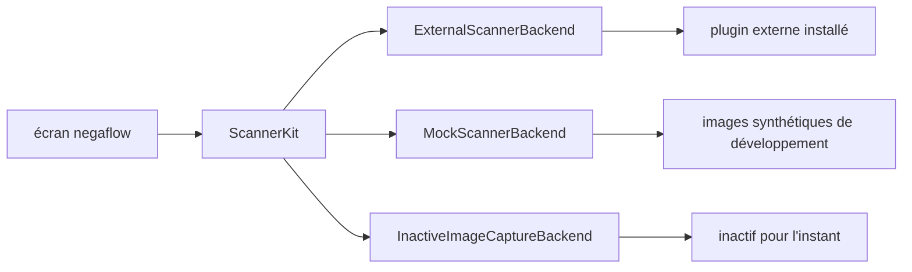
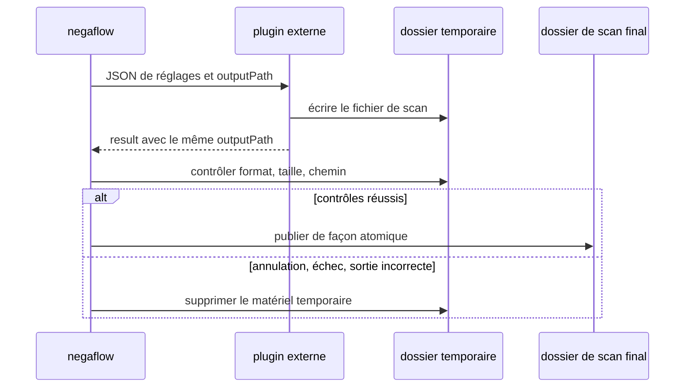

# Architecture des plugins scanner

[Accueil de la documentation](../README.md)

L'entrée par défaut de negaflow est l'import d'images.
Un scanner réel n'est branché que si un plugin externe est présent.

> [!IMPORTANT]
> L'application ne devine pas les capacités d'après le nom de modèle du scanner. Seul ce que le
> plugin signale alimente l'écran et les requêtes, et l'appareil de démonstration n'apparaît que
> si vous choisissez vous-même le mode démo.

## Composants

| Composant | Rôle |
|---|---|
| Import d'images | Envoie RAW, DNG, TIFF, PNG et JPEG vers le chemin de développement. |
| Plugin externe | Tourne dans son propre processus, pilote l'appareil réel, communique en JSON. |
| Scanner de démonstration | Fournit `negaflow Scanner` et `negaflow Flatbed Scanner` pour le développement. Il faut choisir la démo pour s'en servir. |
| Lien ImageCaptureCore | Code de compatibilité inactif pour les appareils macOS Image Capture. |

Il n'y a pas d'implémentation SANE dans ce dépôt. Ce code vit dans un projet GPL séparé.

- <https://github.com/habinsong/negaflow-scanner-sane>

## Comment ça se relie

L'écran ne voit que `ScannerBackend`.
L'identifiant d'appareil d'un plugin apparaît dans l'application comme
`plugin:<pluginId>:<deviceId>`.

Au lancement du plugin, `plugin:<pluginId>:` est retiré et seul l'identifiant d'appareil propre au
plugin est envoyé.

## Trouver les plugins

Le dossier par défaut est `~/Library/Application Support/negaflow/Plugins/<id>/manifest.json`.

Pour les tests et le développement local, `NEGAFLOW_PLUGINS_DIR` désigne un autre dossier.

| Champ | Règle |
|---|---|
| `schemaVersion` | Exactement `1` aujourd'hui |
| `protocolVersion` | `1` si omis, `1` et `2` pris en charge |
| `id` | Identifiant unique du plugin |
| `name` | Nom affiché à l'écran |
| `kind` | Type de plugin |
| `license` | Licence de distribution |
| `homepage` | Adresse du projet |
| `executable` | Chemin de l'exécutable |

`id` fait 1 à 64 caractères ASCII.
Le premier est une lettre ou un chiffre, les suivants des lettres, des chiffres, `.`, `_` ou `-`.
`:` sert de séparateur d'identifiant d'appareil, donc il est interdit.

Un plugin ne s'ouvre que si le manifeste et l'exécutable passent tous les deux.
Les schémas plus anciens ou futurs et les protocoles inconnus ne sont pas lus au jugé.

### Contrôles de sûreté des fichiers

> [!WARNING]
> Si les octets du manifeste ou de l'exécutable changent, l'approbation précédente est jetée.
> Juste avant l'exécution, propriétaire, droits, présence de lien symbolique et SHA-256 sont
> revérifiés.

- Le dossier du plugin, le manifeste et l'exécutable doivent appartenir à l'utilisateur courant.
- Une écriture possible par le groupe ou les autres est refusée.
- Les liens symboliques sont refusés.
- Le SHA-256 du manifeste et de l'exécutable est consigné.
- La première utilisation demande l'approbation de l'utilisateur.
- Des octets modifiés annulent l'approbation.
- Les identifiants sont recalculés juste avant l'exécution.

## Commandes

Le plugin tourne dans son propre processus.

| Commande | Résultat |
|---|---|
| `detect` | Liste d'appareils en JSON |
| `capabilities <deviceId>` | Liste de capacités en JSON. Peut recevoir sur stdin le JSON d'identifiant, de fabricant et de modèle signalé par `detect` |
| `scan` | JSON de réglages sur stdin ; NDJSON de progression et résultat final sur stdout |

## Protocole de scan

### Version 1

L'ancienne spécification de compatibilité. Les requêtes et le NDJSON n'ont ni `protocolVersion`, ni
`requestID`, ni `sequence`.
Elle ne peut pas signaler les réglages réellement appliqués, donc le résultat est consigné comme
`.unknownLegacy(protocolVersion: 1)`.
Les valeurs demandées ne sont pas recopiées comme si elles avaient été vérifiées.

### Version 2

Utilisée seulement quand le manifeste porte `"protocolVersion": 2`.

Ce qui entre dans une requête :

- `protocolVersion: 2`
- Un `requestID` UUID créé par l'application

Une réponse `capabilities` peut renvoyer le champ facultatif `capabilityToken`.
L'application ne l'interprète pas : elle le transmet tel quel à la prochaine requête `scan` v2 du
même appareil, et nulle part ailleurs.
Il n'entre pas dans les requêtes v1, et les jetons ne se mélangent jamais entre appareils.
C'est au plugin de contrôler le format et la validité du jeton.

Pour éviter une reconnexion erronée à un autre modèle du même backend, l'application renvoie les
`deviceID`, `vendor` et `model` du dernier `detect` en JSON facultatif sur stdin de `capabilities`.
Les plugins existants peuvent ignorer cette entrée.
Un plugin dont l'adresse d'appareil peut changer devrait lier cette identité à l'instantané de
capacités et la revérifier au `scan` suivant.

Chaque événement NDJSON répète la même version et le même identifiant de requête, et porte une
`sequence` supérieure ou égale à zéro, plus grande que la précédente.
Seuls `progress`, `result` et `error` sont admis.

`result` et `error` sont des événements finaux. Tout ce qui suit fait échouer.
Un scan qui ne s'est pas terminé en erreur contient exactement un `result`.

Tous ces cas échouent en position fermée.

- Un événement illisible
- Une version ou un identifiant de requête manquant ou différent
- Une séquence répétée ou en désordre
- Un événement inconnu
- Un résultat en double
- De la sortie après l'événement final
- De l'UTF-8 invalide

Une violation de la spécification v2 termine le plugin tout de suite, sans attendre la limite de
temps habituelle.

### Réglages réellement appliqués

Un `result` v2 doit porter `appliedOptions`.

- `deviceID`, `resolutionDPI`, `bitDepth`, `colorMode`, `filmType`
- `scanArea` : `originXMM`, `originYMM`, `widthMM`, `heightMM`
- `infrared`, `multiExposure`
- `hardwareExposureTime`, `brightnessAdjustment`, `contrastAdjustment`
- `outputRawTIFF`

Ces trois derniers réglages doivent avoir leur clé présente même à `null`.

`resolutionDPI: 0` signifie aperçu.
Un aperçu différent de 0, ou un scan complet à 0, est refusé. Les valeurs inconnues, un autre
appareil, et une résolution, une profondeur de bits ou un état IR qui divergent entre l'en-tête du
résultat et `appliedOptions` sont refusés aussi.

Une fois les contrôles passés, l'application consigne son propre identifiant de scanner et
l'identifiant de requête à la place de celui du plugin, et garde le chemin de sortie final.
C'est seulement là qu'elle marque `.verified(options)`.

`ScanResult.resolution` et `bitDepth` peuvent retomber sur les valeurs demandées en v1.
Les champs qui indiquent l'origine, `reportedResolution` et `reportedBitDepth`, ne reçoivent que des
valeurs correctes signalées par le résultat lui-même.

## Zone de scan positionnée à plat

Un scan à plat avec position choisie ne s'active que si le plugin signale tout ceci.

- Aperçu
- `supportsPositionedScanArea`
- `scanOriginXRange` et `scanOriginYRange` en mm
- `scanWidthRange` et `scanHeightRange` en mm

L'application élargit la zone choisie vers l'extérieur au pas du plugin et crée une tâche de scan
complet par zone.
Elle ne devine jamais cette possibilité d'après un nom de modèle.
Les plugins plus anciens, sans ces champs facultatifs, gardent le flux à cadre fixe.

## Limites de processus et annulation

- Plafond stdout : 4 Mio
- Plafond stderr : 1 Mio

Au-delà du plafond, le processus est terminé et l'opération échoue.
Au nettoyage, seuls les octets déjà arrivés sont lus.
Même si un processus enfant a hérité du tube, rien n'attend l'EOF.

`cancelScan()` ne revient qu'une fois le plugin terminé, les gestionnaires de tubes fermés et la
place libérée pour la tâche suivante.

## Publication du fichier de scan

Le plugin écrit l'image source exactement à l'`outputPath` fourni par l'application et renvoie le
même chemin dans le résultat.
Ce chemin est un emplacement temporaire sur le même disque que le dossier final.

L'application vérifie :

- Un fichier ordinaire non vide
- Une image qu'ImageIO peut lire
- Le format et la taille en pixels attendus
- Le même chemin dans la requête et dans le résultat

Le déplacement vers l'emplacement final n'a lieu qu'ensuite.
En cas d'annulation, d'expiration, de sortie incorrecte ou d'échec du plugin, le dossier temporaire
est supprimé et aucun scan partiel n'est publié.

Un fichier IR v2 doit lui aussi se trouver dans le dossier temporaire fourni.
Type de fichier, lecture et taille en pixels sont contrôlés.
La v1 peut accepter un chemin IR externe, pour rester compatible avec les plugins déjà diffusés.

## La frontière SANE

L'implémentation SANE, ses dépendances, sa configuration, le traitement propre aux appareils, les
tests et la documentation de distribution vivent tous dans le dépôt séparé
[`negaflow-scanner-sane`](https://github.com/habinsong/negaflow-scanner-sane).

Ce dépôt documente et contrôle uniquement la spécification de processus externe indépendante des
appareils.
Qui importe seulement des fichiers image n'a pas besoin de plugin scanner.

L'application negaflow ne lie pas l'implémentation SANE et ne la place pas dans sa distribution.
Le plugin a son dépôt, son exécutable, sa distribution source et sa licence GPL.
Ce document consigne la structure ; il ne tranche pas la question de l'œuvre dérivée.
Avant une publication réelle, les fichiers présents dans les deux artefacts et le contrat de
communication sont recontrôlés.

## Vérifications

Les tests de l'application lancent un faux plugin externe comme un vrai processus et confirment :

- La découverte des plugins
- La découverte des appareils
- Le raccordement des capacités
- Les événements de progression
- Le résultat final
- Le nettoyage après annulation et après échec

L'implémentation SANE est vérifiée à part, dans les tests SwiftPM et le build Release du dépôt du
plugin.
