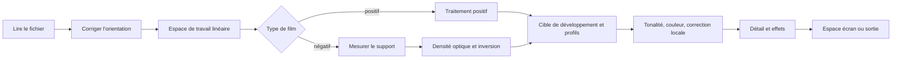

# Chroma Engine

[Accueil de la documentation](../README.md)

Chroma Engine inverse et développe le film. Le code se trouve dans le module `Chromabase`.
L'application et la CLI utilisent le même module : à entrée identique, même suite d'étapes.

| En bref | Détail |
|---|---|
| Développement par défaut | `MAIN`, correction manuelle |
| Support du film | Mesure automatique, pipette, saisie RVB directe |
| Couleur en interne | Espace colorimétrique linéaire en virgule flottante 32 bits |
| Fonctions automatiques | Appliquées seulement quand vous les lancez |
| Espace de sortie | sRGB, Display P3, Adobe RGB, ICC RVB personnalisé |

> [!IMPORTANT]
> Auto Tone, Auto White Balance, Auto Levels et Auto Color ne se glissent jamais dans le
> développement par défaut.

## Ce qui prime

1. Si le support du film peut être mesuré, la mesure passe avant la valeur par défaut choisie par nom.
2. Propriétés du film, source lumineuse du scan, style de scanner et correction automatique de scène restent séparés.
3. Des fonctions comme Auto Tone et Auto White Balance ne s'activent que si vous les lancez.
4. Même source, mêmes valeurs d'édition et même lot de profils passent par la même suite d'étapes.
5. Tests synthétiques et validation sur appareil réel ne sont jamais présentés comme la même preuve.

## Suite des étapes



L'image de travail est traitée dans un espace linéaire en virgule flottante 32 bits.
Seules les opérations qui demandent du gamma convertissent, à leur étape fixée.
L'encodage pour un écran ou un format de fichier arrive en dernier.

Documentation Core Image d'Apple :

- [CIImage](https://developer.apple.com/documentation/coreimage/ciimage)
- [CIContext](https://developer.apple.com/documentation/coreimage/cicontext)
- [workingColorSpace](https://developer.apple.com/documentation/coreimage/cicontext/workingcolorspace)
- [Guide de performance Core Image](https://developer.apple.com/library/archive/documentation/GraphicsImaging/Conceptual/CoreImaging/ci_performance/ci_performance.html)

`CIContext` n'est pas recréé à chaque rendu.
Il est réutilisé, séparé par usage : affichage, analyse, export.
L'aperçu ne calcule que la taille nécessaire et la dernière version d'édition.
L'export refait le rendu à la taille source.

## Support du film

### Pourquoi le mesurer

La partie non exposée d'un négatif est un point de référence qui combine le film, le développement
et la source lumineuse du scan.
Le masque orange du négatif couleur s'y trouve aussi.
Un support faux fausse ensuite toutes les densités et tous les rapports entre canaux.

Les données Portra 400 de Kodak consignent elles aussi séparément la densité minimale, les courbes
caractéristiques et la densité spectrale des colorants.

- [Kodak Professional Portra 400 technical data](https://www.kodakprofessional.com/sites/default/files/wysiwyg/pro/resources/e4050_portra_400.pdf)

### Mesure automatique

`FilmBaseEstimator` ne se contente pas de moyenner quelques pixels très clairs.

- Un pixel de film ne peut pas être plus clair que le support non exposé.
- Bien plus clair, cela peut être le rétroéclairage, les perforations ou l'extérieur du film.
- Un vrai support forme plutôt une bande large le long du bord de la vue.
- Avec plusieurs bandes de film sur une même planche, des zones séparées se lisent ensemble.
- Une frontière où porte-film et film se mêlent inspire moins confiance que l'intérieur.

Il cherche la distribution de luminosité sur une image d'analyse réduite, regroupe les zones
connexes, puis écarte les candidats hors film.
Quand plusieurs bandes passent les conditions, elles sont calculées ensemble.
Le résultat consigne aussi la méthode retenue et la confiance.

### Choix de la méthode

| Mode | Comportement |
|---|---|
| `Manual` | Utilise le RVB saisi comme Dmin. Une pipette réussie mène ici aussi. |
| `Film` | Utilise la mesure comme Dmin, le film choisi fournissant surtout `dmaxNorm`. Les valeurs par défaut du film et de la source n'interviennent qu'en cas d'échec de mesure. |
| `Auto` | Utilise l'analyse spatiale, et retombe sur la méthode par les bords en cas d'échec. |

Sans valeur manuelle, ou avec un identifiant de film erroné, il passe à la méthode sûre suivante.
L'objet le plus clair de la scène n'est jamais pris tel quel comme support du film.

## Densité optique et inversion

La densité vient de la transmittance linéaire `T` et du support `Dmin` par canal.

```math
D = \log_{10}\left(\frac{D_{\min}}{T}\right)
```

`D = 0` signifie que l'entrée égale le support non exposé. Perforations et rétroéclairage peuvent
passer en négatif.
Ces valeurs restent finies et ne sont pas écrêtées sur place.

### Données par type de film

La table actuelle contient 27 noms de films : négatifs couleur, noir et blanc, négatifs cinéma.

À quoi servent ces données :

- La valeur Dmin par défaut quand le support n'est pas mesurable
- La plage de densité par canal
- Une plage sûre quand un faible contraste fait vaciller la mesure automatique

Certaines valeurs approchent des courbes lues dans des documents publics, d'autres ont été prises
prudemment. 27 noms ne signifient pas 27 profils couleur validés.
Dès que le support est mesuré, la mesure prime.

### Réponse de tirage fixe

`MAIN` transforme la densité, support soustrait, en une courbe strictement croissante.
Les coefficients ne sont pas un préréglage caché : ils viennent de quatre points d'ancrage.

- Le point noir du support
- Le gris moyen 18 %
- Le blanc de la plage de densité mesurée
- La marge pour la lumière réfléchie

La courbe actuelle est une exponentielle étirée et possède une réciproque sur toute la plage.
Le test aller-retour sur négatifs synthétiques utilise cette réciproque. Équations et valeurs sont
dans [réponse de tirage fixe](../reference/PRINT_RESPONSE.md).

Où s'arrête le chemin par défaut et où commencent les fonctions automatiques :

- La courbe fixe ne déplace pas l'exposition d'après l'histogramme de la scène.
- `applySceneRanged` mesure la plage de densité utilisée par canal, sans déplacer l'exposition moyenne.
- Un `CIVibrance` limité n'intervient que sur les scènes peu saturées.
- Auto Levels, Auto Color, Auto Tone et Auto White Balance sont des fonctions que vous lancez.
- Aucune prétention à reproduire exactement un papier ou un minilab donné.

## Trois sortes de profils

| Sorte | La question à laquelle il répond | Valeurs |
|---|---|---|
| Film stock | Quels sont le support et la plage de densité de ce film | Dmin/Dmax, type de film |
| Light source | Comment la source lumineuse du scan a agi sur chaque canal | Gain par canal, correction basée sur le support |
| Scanner target | Quel style de tonalité et de couleur a le résultat | Statistiques relatives de scans réalisés pour ce projet |

Séparer ces trois évite l'erreur qui consiste à faire porter à un seul nom de film les propriétés de
l'émulsion, la couleur de la source et le style de rendu d'un laboratoire.
Quand un support réel existe, la mesure passe avant les valeurs par défaut de la source.
Les statistiques de scanner ne servent pas directement de matrice couleur absolue pour une scène.

Les données sont décrites dans [profils de film](FILM_PROFILES.md).

## Cibles de développement

### `MAIN`

La valeur par défaut du développement courant.
Elle n'intègre ni style de scanner non choisi, ni Auto Levels, Auto Color, Auto Tone ou Auto White
Balance.
La mesure du support et de la plage de densité, ainsi que le vibrance limité des scènes peu
saturées, font partie de l'inversion de base.

### `PRINT`

L'image de travail est celle de `MAIN`.
Un ICC imprimante RVB valide est appliqué une seule fois, à la fin de l'export.
Un profil absent ou invalide fait échouer, sans repli sur le sRGB ni sur des valeurs de papier
arbitraires.

### `HS`, `SP`

Deux étapes.

1. `documentedCharacter` : `SP` utilise un caractère de base limité, tiré de six paires du même
négatif passées par SP-3000 et par negaflow MAIN.
`HS` construit son caractère de tonalité, de neutre et de couleur à partir d'orientations publiées
et des valeurs de conception du projet.
2. `scannerSignature` : seule la différence relative des groupes dont les noms de films et le
nombre d'images concordent sur les deux machines s'ajoute.

`HS` comprend une accentuation sur le canal de luminosité. Ce rayon et cette intensité n'ont pas été
mesurés sur la machine réelle.
`SP` ne l'inclut pas.

Tous les profils actuels sont `realOnly`.

- La différence relative n'est calculée que si noms de films et nombres d'images concordent assez.
- Les valeurs dont le sens s'inverse ne sont pas appliquées.
- En noir et blanc, les composantes de couleur sont retirées.
- Si le SHA-256 d'un fichier ou d'un manifeste ne concorde pas, tout le lot est refusé.

### `F135`, `HR`

Ce sont deux styles de minilab construits par le projet, pas des clones de machines mesurées.
`F135` emploie une courbe en S proche du tirage avec des tons moyens chauds ; `HR` des noirs
profonds et une direction neutre et bleue plus calme.
Aucune prétention à avoir validé et cloné une machine précise.

### `EXPIRED`

Une cible de récupération pour les films anciens.
Elle ne désature pas systématiquement et n'étire pas la plage : elle s'en tient à des corrections
limitées, dans les limites des preuves actuelles.

## Réglages de développement

| Groupe | Éléments |
|---|---|
| Tonalité | Exposition, contraste, hautes lumières, ombres, blancs, noirs, courbes par points RVB et par canal |
| Couleur | Température, teinte, vibrance, saturation, TSL 8 couleurs, étalonnage en trois zones, correction par canal, conversion noir et blanc et virage |
| Détail et effets | Netteté, clarté, correction de voile, grain, vignetage, halation, réduction de bruit |
| Correction locale | Masques radial, linéaire, polygonal, pinceau, plus densité plus et densité moins |

Ces valeurs sont enregistrées comme un historique d'édition par étapes.
GrainMend et la correction locale ordinaire diffèrent par leur but et par leur mode
d'enregistrement.

## Gestion des couleurs

Si l'entrée porte un ICC valide, cet espace est lu.
Les calculs internes se font dans l'espace de travail linéaire retenu, et le passage à un espace de
sortie a lieu à l'affichage, à l'épreuvage écran et à l'export.

Principales sorties prises en charge :

- sRGB
- Display P3
- Adobe RGB
- Un ICC imprimante/sortie RVB choisi par l'utilisateur

Le nom, la taille en octets et le SHA-256 du profil imprimante sont figés au démarrage de l'export.
Si le fichier change pendant le rendu, tout s'arrête.

Rien n'affirme que le chemin actuel Core Image et ColorSync donne une intention de rendu et une
black-point compensation identiques bit à bit sur toutes les versions de macOS.
Une telle garantie demanderait d'abord un chemin de tampon ColorSync distinct et des contrôles
mémoire sur les grandes images 16 bits.

## Encodage de sortie

Les réglages de format sont en dehors du pipeline colorimétrique, mais ils décident de ce qui
subsiste dans le fichier livré.

Le JPEG enregistre la couleur à une résolution inférieure à la luminance, sauf si l'encodeur dépasse
son seuil de sous-échantillonnage. En dessous, la chrominance est divisée par deux horizontalement
et verticalement : le détail de luminance reste intact, mais les bords saturés s'adoucissent. Une
qualité de 95 % ou plus est donc encodée sans sous-échantillonnage de chrominance. Les réglages
inférieurs conservent la valeur choisie, puisque les choisir revient à demander un fichier plus petit.

Le PNG et le TIFF sont sans perte et ne sous-échantillonnent jamais. Leur seul réglage de qualité est
la profondeur de bits, 8 ou 16 bits par canal. Le tramage n'est appliqué qu'en 8 bits, où il masque
les bandes de quantification.

## Performance et sûreté

- `CIContext` est réutilisé par usage.
- Les réglages passent par un aperçu en basse résolution ; l'export repart de la source.
- Un résultat qui a pris du temps revérifie l'identifiant d'image, la version d'édition et la session juste avant application.
- Quand la mémoire manque, les caches comme les vignettes et les aperçus sont libérés.
- Originaux et historique d'édition sont conservés à l'écart des caches.

## Niveaux de validation

1. Tests de formules : monotonie de la courbe, points d'ancrage, réciproque
2. Images synthétiques : entrées et sorties connues, écrêtage, orientation, espace colorimétrique
3. IT8 synthétique : l'aller-retour mathématique sur 264 patchs
4. Statistiques de prises de vue réelles : les profils `realOnly`
5. Paires REAL/TARGET : un contrôle qualité d'appareil avec du matériel de validation distinct
6. Vérification sur matériel réel : scanner, film, écran et tirage

Un bon résultat sur IT8 synthétique ne prouve pas la justesse absolue sur des négatifs réels.
Le jugement de qualité des profils scanner suit
[contrôle qualité des profils scanner](../reference/PROFILE_QUALITY_GATE.md) et
[validation colorimétrique IT8](../reference/IT8_COLOR_VALIDATION.md).

## Où se trouve le code

- `Sources/Chromabase/Engine/`
- `Sources/Chromabase/Film/`
- `Sources/Chromabase/Develop/`
- `Sources/Chromabase/Adjustments/`
- `Sources/Chromabase/Profiles/`
- `Sources/Chromabase/Imaging/`
- `Sources/Chromabase/Export/`

La version produit actuelle est `1.0.9`.
L'historique d'édition et les schémas de profils continueront de passer par une procédure de
validation avant de changer.
