# Profils de film

[Accueil de la documentation](../README.md)

Les profils de scanner fournis ne sont pas des LUT téléchargées ni des préréglages rebaptisés.
L'auteur du projet a photographié et trié les scans de film, les a analysés,
et a transformé le résultat en JSON.

| Élément | Valeur actuelle |
|---|---:|
| Réglages par défaut par type de film | 27 |
| Rendus créatifs | 6 |
| Profils de scanner | 15 |
| Observations de films | 25 |
| Observations d'images | 928 |
| État de validation | tous `realOnly` |

> [!NOTE]
> `928` est la somme des observations par profil. Cela ne veut pas dire 928 photographies
> différentes.

## Trois sortes de données distinctes

| Donnée | Format | Sert à | Nombre |
|---|---|---|---:|
| Émulsion | Swift | Dmin/Dmax et réglages par défaut du type de film | 27 |
| Préréglage de rendu | JSON | Les rendus créatifs que vous choisissez | 6 |
| Profil de scanner | JSON | Statistiques relatives de tonalité et de couleur vues sur de vrais scans | 15 |

27 noms de films ne font pas 27 profils de précision colorimétrique.
Les 6 rendus sont autre chose que les profils de scanner.
Ce qui suit ne concerne que la troisième sorte.

## Ce qui est fourni aujourd'hui

`Sources/Chromabase/ScannerProfiles/` en contient 15.

<details>
<summary>Voir les 15 profils</summary>

| Scanner | Type de film | Film | Observations de films | Observations d'images | État |
|---|---|---|---:|---:|---|
| NORITSU | négatif couleur | Fuji C200 | 3 | 111 | `realOnly` |
| NORITSU | négatif couleur | Kodak Ektar 100 | 2 | 76 | `realOnly` |
| NORITSU | négatif couleur | Kodak Portra 160 | 1 | 37 | `realOnly` |
| NORITSU | négatif couleur | Kodak Portra 400 | 2 | 75 | `realOnly` |
| NORITSU | négatif couleur | Kodak Portra 800 | 1 | 38 | `realOnly` |
| NORITSU | négatif couleur | Kodak Pro Image 100 | 1 | 37 | `realOnly` |
| NORITSU | négatif couleur | Kodak UltraMax 400 | 1 | 38 | `realOnly` |
| NORITSU | négatif couleur | Kodak Vision3 250D | 1 | 37 | `realOnly` |
| NORITSU | négatif couleur | Kodak Vision3 50D | 1 | 38 | `realOnly` |
| NORITSU | diapositive couleur | Kodak Ektachrome 100 | 1 | 38 | `realOnly` |
| NORITSU | diapositive couleur | Kodak Ektachrome 100D | 5 | 181 | `realOnly` |
| SP-3000 | négatif couleur | Kodak Ektar 100 | 2 | 76 | `realOnly` |
| SP-3000 | négatif couleur | Kodak Portra 160 | 1 | 38 | `realOnly` |
| SP-3000 | négatif couleur | Kodak Vision3 250D | 2 | 71 | `realOnly` |
| SP-3000 | diapositive couleur | Kodak Ektachrome 100D | 1 | 37 | `realOnly` |
| **Total** |  |  | **25** | **928** | **15 `realOnly`** |

</details>

25 et 928 sont des sommes d'observations par groupe de profils.
Un même film physique ou une même photographie peut tomber dans deux groupes de scanner.
Cela ne veut pas dire 25 films uniques ni 928 photographies uniques.

## Comment ils sont construits

```mermaid
flowchart LR
    A["Film photographié pour ce projet"] --> B["Trier par film, émulsion, scanner"]
    B --> C["Analyser les vues"]
    C --> D["Statistiques de luminosité, couleur, axe neutre, texture"]
    D --> E["Regroupement des scènes et vues représentatives"]
    E --> F["JSON source par film"]
    F --> G["Agréger par émulsion et groupe de scanner"]
    G --> H["JSON de distribution et SHA-256"]
```



### 1. Prise de vue et tri

Les sources sont séparées par scanner, type de film, nom d'émulsion et nom de film.
La rotation et la lecture des fichiers sont confirmées avant l'analyse.
Les fichiers vides ou illisibles ne comptent pas.

### 2. Mesure des vues

Ces valeurs sont mesurées sur chaque vue.

- Percentiles de luminosité et écrêtage aux deux extrémités
- Relations entre canaux dans les ombres, les tons moyens et les hautes lumières
- Distribution de saturation et de teinte
- L'axe neutre Lab des pixels peu saturés
- Gradient, netteté et une valeur de référence de grain

Ce sont des observations de scène.
L'exposition ou le sujet d'une vue n'est jamais déclaré propriété fixe du scanner.

### 3. Regroupement des scènes

Les scènes sont groupées par luminosité, contraste, saturation et plage de teinte.
Le nombre et la distribution par groupe sont notés pour qu'une seule sorte de scène ne tire pas tout
le profil.

### 4. Vues représentatives

Ces vues sont notées à part pour qu'une personne puisse remonter à la source.

- La vue au contraste le plus élevé
- La vue la plus nette
- La vue à la plus forte valeur de référence de grain
- Les vues qui représentent la plage de luminosité et de saturation

### 5. Agrégation par film et par groupe

`scripts/compile_scanner_profiles.py` regroupe les données par film en groupes d'émulsion et de
scanner.
Les casiers vides ne sont pas déguisés en zéro observation.
Le script confirme que chaque valeur est finie et que les comptes d'échantillons sont réels.

### 6. JSON et empreintes

Le fichier final porte le schéma, l'identifiant, les comptes et chemins des sources,
les statistiques agrégées, l'état de validation et `profileHash`.
Le contrôleur vérifie les champs, les comptes, les valeurs finies,
le nom de fichier face à l'identifiant, les comptes de sources et l'empreinte.

## Forme du JSON

<details>
<summary>Exemple de profil JSON</summary>

```json
{
  "schemaVersion": 2,
  "id": "noritsu__color-nega__kodak-portra-400",
  "displayName": "NORITSU · color nega · Kodak Portra 400",
  "scanner": "NORITSU",
  "kind": "color nega",
  "filmKey": "kodak portra 400",
  "validationStatus": "realOnly",
  "rollCount": 2,
  "imageCount": 75,
  "singleRollLimited": false,
  "sourceProfiles": [],
  "tone": {},
  "color": {},
  "neutralAxis": {},
  "neutralAxisBins": [],
  "hueResponse": [],
  "texture": {},
  "sceneBuckets": [],
  "coverageCandidates": [],
  "profileHash": "sha256:..."
}
```

</details>

## Entrées principales

| Entrée | Contenu | À surveiller |
|---|---|---|
| `tone` | Distribution de luminosité et écrêtage aux deux bouts | L'exposition d'une vue n'est pas une propriété de la machine |
| `color` | Canaux et saturation dans les ombres, tons moyens, hautes lumières | Une distribution observée, pas une matrice couleur absolue |
| `neutralAxis` | `a*` et `b*` Lab des pixels peu saturés | Certaines scènes n'ont aucun objet neutre, d'où les comptes d'échantillons joints |
| `hueResponse` | Variation de saturation et rotation de teinte par intervalle | Comparaison relative seulement quand les données des deux machines concordent |
| `texture` | Gradient, netteté, valeur de référence de grain | Pas utilisé directement comme valeur d'accentuation de la machine |
| `sceneBuckets` | Statistiques par scène et vues représentatives | Permet à une personne de retracer la source |

L'accentuation du canal de luminosité dans la cible `HS` n'est pas une constante machine mesurée
depuis `texture` .
Elle ne synthétise pas non plus de nouveau grain.
`SP`, `MAIN` et `PRINT` n'incluent pas cette accentuation.

## État des preuves

| État | Signification | Où il peut servir |
|---|---|---|
| `draft` | Données ou schéma inachevés | Ni fourniture ni usage automatique |
| `realOnly` | De vrais scans existent, mais sans matériel de référence séparé | Sélection manuelle seulement, aucune revendication de précision |
| `pairedSmoke` | Le matériel apparié ne confirme que le chemin de traitement | Inutilisable comme preuve de qualité |
| `pairedValidated` | A passé le matériel de calibration et de validation, plus les contrôles de régression | Sélection automatique permise si la politique l'autorise |

Les 15 profils actuels sont tous `realOnly`.
Vous pouvez confirmer qu'ils viennent d'observations de matériel réel,
mais pas qu'ils produisent le même résultat que la machine.

Revendiquer la précision de la machine demande plus de matériel.

- Un identifiant qui confirme la même vue physique
- Du matériel de validation tenu à l'écart de la calibration
- Les conditions dans lesquelles les images de référence ont été produites
- Les réglages du scanner et les choix de l'opérateur
- Le lot de mires, l'éclairage, la méthode de mesure
- Un critère de réussite par image

## Comment l'application s'en sert

### Sélection manuelle

Rien n'est sélectionné automatiquement aujourd'hui à partir d'un nom de modèle ou d'informations de
fichier.
Vous choisissez vous-même la cible `HS` ou `SP` et le profil.
L'appariement automatique n'est permis que pour `pairedValidated`,
donc il ne s'applique pas au lot actuel.

### La différence relative entre deux scanners

Les statistiques de scène absolues ne sont pas reprises telles quelles.
Seule la différence entre groupes correspondants des deux machines est utilisée,
et de façon limitée.

- L'ensemble nettoyé des noms de films doit concorder.
- Le nombre d'images ne doit pas différer de plus de 15 %.
- Un intervalle de teinte a besoin de comptes d'échantillons au-dessus du seuil des deux côtés.
- Les valeurs dont le sens s'inverse ne sont pas appliquées.
- Les valeurs entre gains opposés sont calculées dans le domaine logarithmique.
- La tonalité est appliquée une fois à la luminosité gamma Rec.709, et les composantes Lab de
couleur sont préservées.

Les profils sources ne portent pas de SHA-256 par vue.
Des noms de films qui concordent ne prouvent pas que ce sont exactement les mêmes vues qui ont été
appariées.

### Noir et blanc, et positif

Pour le noir et blanc,
les composantes de couleur sont écartées et seule la tonalité relative est utilisée.
Pour le positif, la luminosité absolue d'un film n'est pas reportée sur une autre photographie.
Cela dit, les styles de base de `HS` et `SP` s'appliquent bien aux positifs à demi intensité,
donc le résultat n'est pas toujours le même que `MAIN`.

### Texture

Sans matériel apparié issu de la même vue,
`texture` n'est pas utilisé comme valeur d'accentuation ou de grain propre à une machine.
La mise au point, le sujet,
le traitement JPEG et les choix de l'opérateur du labo sont tous mêlés dans ces chiffres.

## Intégrité des fichiers

`ScannerProfileRegistry` n'ouvre jamais seulement une partie des 15.

1. Lire le schéma du manifeste.
2. Confirmer que chaque fichier existe et vérifier son SHA-256.
3. Recalculer `profileHash` dans chaque JSON.
4. Vérifier l'identifiant, le nom de fichier, le schéma, l'état, les comptes et les valeurs finies.
5. Si quoi que ce soit cloche, refuser le lot entier.
6. Ne mettre en cache qu'un instantané en lecture seule où tout concordait.

Le manifeste d'export garde l'identifiant et le SHA-256 du profil réellement utilisé.

## Commandes de vérification

Contrôle du contrat de profil :

```bash
python3 scripts/validate_scanner_profiles.py \
  --mode profile-contract \
  --profiles Sources/Chromabase/ScannerProfiles
```

Reconstruction :

```bash
python3 scripts/compile_scanner_profiles.py \
  --source LUT_target/SOURCE \
  --out LUT_target/PROFILES \
  --resource-out Sources/Chromabase/ScannerProfiles
```

Contrôle qualité REAL/TARGET :

```bash
python3 scripts/evaluate_profile_quality.py \
  --manifest LUT_target/quality/corpus-v1.json \
  --candidate-summary LUT_target/SOURCE/summary.json \
  --baseline-summary LUT_target/quality/accepted-summary-v1.json \
  --data-root LUT_target \
  --verify-files all \
  --report build/profile-quality-report.json
```

Le dépôt n'a aujourd'hui ni manifeste REAL/TARGET ni référence acceptée pour appuyer une
revendication de publication.
Les tests synthétiques ne confirment que les conditions d'échec du code de contrôle ;
ils ne prouvent pas la précision des profils.

## Références

- [Kodak Professional Portra 400 technical data](https://www.kodakprofessional.com/sites/default/files/wysiwyg/pro/resources/e4050_portra_400.pdf)
- [darktable negadoctor](https://docs.darktable.org/usermanual/4.6/en/module-reference/processing-modules/negadoctor/)

Aucun chiffre de profil ne vient de ces sources.
Elles ont été lues comme contexte pour comprendre pourquoi la base du film,
la tonalité de la scène et le style de la machine doivent être traités séparément.
Les valeurs du JSON viennent du matériel photographié pour ce projet et du code d'analyse du dépôt.

## Code et documents liés

- `Sources/Chromabase/ScannerProfiles/`
- `Sources/Chromabase/Profiles/ScannerProfile/`
- `Sources/Chromabase/Profiles/ScannerTargetGrade/`
- `scripts/compile_scanner_profiles.py`
- `scripts/validate_scanner_profiles.py`
- `scripts/evaluate_profile_quality.py`
- [Contrôle qualité des profils scanner](../reference/PROFILE_QUALITY_GATE.md)
- [Validation couleur IT8](../reference/IT8_COLOR_VALIDATION.md)
- [Chroma Engine](CHROMA_ENGINE.md)
