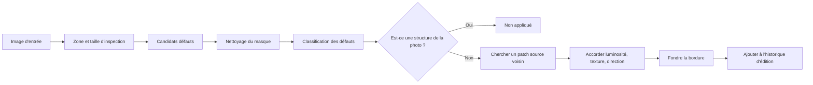

# GrainMend

[Accueil de la documentation](../README.md)

GrainMend répare la poussière, les micro-trous, les rayures et les dégâts d'émulsion sur le film.
Rien n'est figé dans l'original : le résultat est gardé comme un historique d'édition ordonné.

| Outil | Où il regarde | Comment il répare |
|---|---|---|
| Automatique | Toute la photo | Prudent, seulement les défauts dont il est sûr |
| Guidé | La zone que vous choisissez | Regarde de près, jusqu'aux petits points et défauts pâles |
| Brosse | L'endroit que vous peignez | Prolonge la structure et la texture voisines |
| Tampon de duplication | Le point source que vous choisissez | Copie de vrais pixels d'origine à décalage constant |
| IR | Le canal infrarouge du scanner | L'IR trouve l'endroit, le RGB reconstruit les pixels |

L'écran de développement propose l'automatique, le guidé, la brosse et le tampon.
L'IR peut être activé à l'étape de numérisation quand le plugin déclare la fonction.
Une fois le scan terminé, son résultat rejoint la même liste de calques GrainMend.

> [!CAUTION]
> GrainMend RGB ne fonctionne pas comme un nettoyage IR matériel. GrainMend IR n'est pas non plus
> une implémentation de Digital ICE, iSRD ou SRDx, ni un mode compatible.

## Où est la difficulté

Les défauts du film et la structure de la photo occupent les mêmes pixels.

- La poussière apparaît en petites taches irrégulières, claires ou sombres.
- Un micro-trou peut ressembler à un point isolé et fort.
- Les rayures sont longues et fines, mais les câbles, les cadres de fenêtre et les lettres aussi.
- Les dégâts d'émulsion changent la couleur et la texture ensemble.
- En haute résolution, le grain du film a la taille d'un petit défaut.

Effacer les hautes fréquences en bloc emporte le grain et les contours avec la poussière.
GrainMend sépare détection, classification, réparation et stockage.

## Ordre du traitement



Le masque de détection et le résultat réparé restent séparés.
C'est ce qui permet d'inspecter le masque, de n'appliquer qu'une partie des défauts ou de refaire la
réparation.

## Outils

### Automatique

Sur toute la photo, il ne trouve que les défauts dont il est sûr.
Manquer un petit défaut vaut mieux qu'effacer à tort une grande structure.
Il ne se glisse jamais dans le développement par défaut : vous devez le lancer pour que quoi que ce
soit s'ajoute.

### Guidé

Vous choisissez un rectangle, et seuls cet espace et ses abords sont analysés.
Comme vous avez déjà désigné le défaut, il va chercher les petits points, les défauts pâles et les
amas denses plus franchement que l'automatique.

Il lit plus large que le résultat qu'il produit, pour que les pixels voisins servant à la réparation
ne soient pas coupés au bord de la zone.
Le rayon de contexte maximal actuel est de 264 pixels.

### Brosse

Vous peignez vous-même l'endroit à réparer.
Il ne recouvre pas ce que vous avez peint par une couleur.
Il cherche près du masque un patch source qui convient et prolonge la structure et la texture.
Quand aucun patch ne convient, il peut retomber de façon limitée sur la voie de détection.

### Tampon de duplication

`⌥` clic choisit le point source, puis vous dessinez sur la cible.
Aucune détection automatique : il garde le décalage entre les deux points et copie les vrais pixels.

L'historique d'édition retient le diamètre, la dureté, les coordonnées et le décalage.
Cela s'applique encore aux mêmes coordonnées d'origine après une rotation, un miroir ou un
recadrage.
Les décalages s'alignent sur des pixels entiers, et rien hors de l'image n'est appliqué.

### IR

Utilisé seulement quand le plugin fournit un vrai canal IR et que la taille et la zone concordent
avec le RGB.
L'IR est le matériau qui localise le défaut.
Les pixels finaux sortent du même réparateur que pour le RGB.

## Trouver les défauts dans le RGB

### Différence avec le voisinage

La luminosité change d'une photo à l'autre, donc pas de seuil global unique.
L'écart avec la luminosité voisine, la variance locale et la direction produisent les candidats
poussière claire et défaut sombre.

### Nettoyage du masque

Le bruit isolé est retiré, les défauts interrompus sont reliés, puis les pixels qui se touchent dans
l'une des 8 directions forment un même bloc.
Une grande zone peut être découpée en tuiles, mais un bloc à cheval sur une bordure est refusionné
en coordonnées d'image entière.

### Différences de résolution

Le même grain de poussière ne fait pas le même nombre de pixels à 1200 dpi et à 7200 dpi.
Quand l'information de résolution est fiable, les limites suivent la taille réelle.
Sans elle, le modèle de scanner n'est pas deviné et une règle prudente en pixels est utilisée.

### Classification

Chaque bloc est mesuré sur :

- Aire et boîte englobante
- Rapport entre grand axe et petit axe
- Direction horizontale, verticale, diagonale
- Linéarité, densité, contraste avec le voisinage
- S'il se prolonge dans un contour proche
- Sa relation avec les autres blocs

Le résultat se répartit en poussière, micro-trou, rayures par direction, dégât d'émulsion et
micro-particules, chacun avec une confiance.

### Ne pas effacer les lignes qui appartiennent à la photo

Câbles, rambardes, angles de bâtiment, cadres de fenêtre et lettres ne doivent pas être lus comme
des rayures.
Lignes parallèles, grilles, continuité des contours et lignes rattachées à la structure de la scène
ont leur propre contrôle.
L'automatique bloque plus fort les faux positifs ; le guidé tient compte aussi du fait que vous avez
choisi l'endroit.

## Réparation

1. Trouver près du défaut un patch source qui ne chevauche pas le masque et dont la structure
concorde.
2. Accorder la différence basse fréquence de luminosité et de couleur entre le patch et la cible.
3. Garder la texture haute fréquence du patch pour transporter le grain du film.
4. Pour une longue rayure, regarder d'abord la direction qui se prolonge des deux côtés.
5. Au bord du masque, fondre doucement l'original et le patch réparé.

L'intensité est le rapport de mélange entre le patch terminé et l'original.

Parfois une réparation automatique ne peut pas savoir ce qu'il y avait dessous.
S'il n'y a pas de texture voisine utilisable, ou si le défaut couvrait une structure importante
entière, il faut la brosse, le tampon ou un travail de précision à part.

## Traitement IR

### Conditions d'entrée

- Le plugin déclare explicitement la fonction IR.
- RGB et IR appartiennent à la même session de scan.
- Les deux images ont la même taille en pixels et la même zone attendue.
- Les fichiers sont lisibles et passent le contrôle d'identifiant de l'original.

Même si un nom de modèle est connu pour avoir l'IR, il n'est utilisé ni à l'écran ni dans une
requête tant que le plugin ne le déclare pas.

### Alignement

L'optique et la lecture du capteur peuvent décaler RGB et IR de quelques pixels.
Une recherche large passe d'abord, puis une recherche étroite, pour fixer le décalage.
La confiance du pic, et le fait qu'il ait atterri en bord de plage de recherche, sont tous deux
consignés.

Une confiance faible, ou un meilleur point collé au bout de la recherche, ne compte pas comme une
réussite.

### Soustraire le motif de la scène

Les colorants et la densité du film peuvent transparaître dans l'IR.
La luminosité logarithmique du canal rouge est répartie en 64 intervalles, et dans chacun la moyenne
est prise après avoir écarté les 10 % supérieurs et inférieurs des valeurs IR.
Les intervalles vides sont interpolés depuis leurs voisins et lissés par un court noyau symétrique.
Soustraire cette courbe non paramétrique réduit le motif de la scène, et la poussière sombre éparse
reste hors des statistiques d'intervalle.

Ce qui reste est converti en contraste relatif à la moyenne locale.
Pour qu'un grand défaut ne relève pas le plancher de bruit autour de lui, l'entrée de bruit est
écrêtée au contraste de détection minimal avant de calculer le seuil adaptatif.
Les régions sombres connexes au passe-vues et au bord du film sont retirées du masque.

### Conditions de sécurité

- Un masque anormalement large n'est pas appliqué.
- Un alignement qui n'a pas pu être confirmé n'est pas appliqué.
- Ce n'est pas appliqué automatiquement au noir et blanc argentique.
- Les positifs couleur et les émulsions particulières ne sont pas supposés sûrs sans mesure.

Les outils IR commerciaux posent aussi leurs propres limites sur le noir et blanc ordinaire et sur
le Kodachrome.

- [SilverFast: iSRD dust and scratch removal](https://www.silverfast.com/about-silverfast-why-scanning-basics-of-scanning/why-silverfast/silverfast-feature-highlights/isrd-dust-scratches-removal-eliminate-defects-with-infrared-channel/)

GrainMend IR n'est ni une copie de ces outils commerciaux ni un mode compatible.

## Historique d'édition et stockage

Automatique, guidé, brosse, tampon et IR partagent une seule liste d'édition ordonnée.

Ce que porte chaque entrée :

- Identifiant et type
- Ordre d'application
- S'il est actif, et son intensité
- Zone, masque, décalage de la source du tampon
- Classification du défaut et valeurs de diagnostic
- Image d'origine et version d'édition
- Le patch réparé, ou les valeurs nécessaires pour le reconstruire

Une réparation antérieure change l'entrée de la suivante, donc l'ordre de la liste fait aussi partie
de l'historique d'édition.

L'original n'est pas modifié. L'historique GrainMend est stocké dans un sidecar géré par
l'application.
SHA-256 de l'original, version d'édition et empreinte de l'historique lient l'entrée ensemble.
Si le sidecar manque ou est cassé, le cache n'est pas traité comme un original.

Le cache GrainMend est un fichier dérivé, là pour l'affichage rapide et le rendu à nouveau.
S'il manque ou échoue à son contrôle, il est reconstruit depuis l'original et l'historique
d'édition.
Si le résultat dont un export a besoin ne peut pas être produit, l'export échoue au lieu de
substituer l'original.

## Performance

- Une petite retouche ne recalcule que le défaut et son contexte proche.
- Une grande zone est découpée en tuiles qui se recouvrent, avec une marge de bordure.
- Les résultats ne sont collectés qu'au centre non recouvert des tuiles.
- Au plus 4 tuiles sont traitées à la fois.
- `CleanedRawCanvas` ne copie que le rectangle qui a changé.
- Les copies pour l'annulation partagent le stockage jusqu'à ce que quelque chose change vraiment.
- Sous pression mémoire, les images reconstructibles et le cache de patchs sont libérés.

Les temps réels dépendent de la résolution, du nombre de défauts, de la taille de la zone et du Mac.

Mesuré le 25/07/2026 sur une build Release, Mac14,3, arm64, 24 Gio de mémoire, macOS 26.5.

| Chemin | Entrée | Résultat |
|---|---|---:|
| Détection guidée | 1600×1600, 25 poussières | 0,35 s, 25 détectées |
| Détection ROI partielle | 1600×1600 | 0,38 s |
| Stress guidé dense | 1280×960, 8 images × 3 passes | médiane 0,423 s, p95 0,488 s, max 0,526 s |
| Détection IR | 6000×4000, 24 Mpx | 1,042 s, pic de mémoire +249,2 Mio |

Sur 24 passes de stress dense, la couverture minimale du masque aux emplacements de défaut était de
99,80 %, et l'erreur résiduelle moyenne maximale de 2,70/255.
Ce sont des mesures de régression sur entrées synthétiques.
Elles ne promettent pas des temps de traitement sur un autre Mac ni sur du film réel.

## Banc d'essai

`defect-bench` peut produire ces fichiers et ces valeurs.

- before, after, diff, mask
- Recadrages à 100 %
- Nombre de détections et confiance
- Temps de traitement
- PSNR et erreur absolue quand des images de référence existent

```bash
swift run -c release negaflow defect-bench <input-dir> \
  --reference-dir <reference-dir> \
  --out <report-dir>
```

La régression RGB utilise les 44 paires endommagé/restauré par un expert de FILM-R v2.

- DOI : <https://doi.org/10.6084/m9.figshare.21803304.v2>
- Licence : CC BY 4.0
- Paires : 44
- Taille totale : 437 570 872 octets

La voie automatique livrée le 25/07/2026 applique une sensibilité de 0,7 et une ligne de sécurité
contre la surdétection.
Face à la base 3.0 précédente, sur les 44 images FILM-R celles qui s'améliorent passent de 11 à 34,
et celles qui se dégradent de 33 à 6.
La variation moyenne de PSNR passe de -1,688 dB à +0,466 dB, et le pire cas de -18,952 dB à -1,338
dB.
Les pixels dégradés pondérés tombent de 0,792 % à 0,017 %.

Quand l'automatique rencontre une forte densité de candidats, il arrête d'appliquer et vous oriente
vers le guidé. Cette ligne de sécurité ne s'applique ni au guidé, où vous fixez la plage, ni à la
brosse, ni au tampon, ni à l'IR.
Même avec de meilleurs résultats, 6 images gardent un PSNR inférieur à la restauration experte.
Rien de tout cela ne prouve que chaque photo s'améliore, que RGB et IR se valent, ni quoi que ce
soit sur la qualité IR d'un scanner réel.

Le tableau complet et les commandes sont dans
Comparaison GrainMend sur scans réels.

Les limites IR par film et les conditions d'échec de l'alignement sont réunies dans
[Films que GrainMend IR doit éviter](../reference/INFRARED_LIMITS.md).

## Couverture des tests

- Connexité 8 directions et masques
- Opérations morphologiques
- Détection poussière, rayures et micro-particules
- Rejet des lignes et des grilles comme faux positifs
- Bordures de tuiles sur une grande zone
- Réparation de rayures par direction
- Accord de la texture et de la luminosité voisines
- Masques de brosse
- Décalage, dureté et composition de patch du tampon
- Alignement IR, points d'ancrage, blocs, limites mémoire
- Application à l'étape original et rendu de l'historique d'édition de l'application
- Ajouts successifs et annulation
- Propriété de l'image pendant les déplacements à l'écran

Certains tests de performance ne s'exécutent qu'avec une variable d'environnement activée.
La présence d'un fichier de test n'est pas une affirmation qu'il a tourné dans tous les
environnements.

## Noms et marques

`GrainMend` est le nom de fonction propre à negaflow.

- `Digital ICE` peut être une marque d'Eastman Kodak Company ou d'un ayant droit lié.
- `iSRD`, `SRDx` et `SilverFast` sont des marques de LaserSoft Imaging.
- Ces noms ne servent qu'à la comparaison technique et à l'identification des produits.
- GrainMend ne revendique ni affiliation, ni compatibilité, ni équivalence avec une technologie
tierce.

## Où est le code

- `Sources/Chromabase/DefectRemoval/`
- `Sources/negaflowApp/Features/Defects/`
- `Sources/negaflowApp/Features/Develop/Inspector/Tools/DefectControlsSection.swift`
- `Sources/negaflowCLI/Commands/CLI+DefectBenchCommand.swift`
- `Tests/ChromabaseTests/Defect*.swift`
- `Tests/negaflowAppTests/Defect*.swift`
- `Config/defect-corpus-film-r-v2.json`
- `scripts/defect-corpus/`
