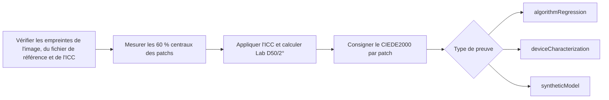

# Validation colorimétrique IT8

[Accueil de la documentation](../README.md)

La justesse des couleurs ne se valide pas à l'écran. Une image IT8 et le fichier de référence correspondant à sa mire physique sont figés en paire, et chaque patch est consigné en chiffres.

> [!IMPORTANT]
> Le matériel IT8 public permet de vérifier les régressions du contrôleur et des calculs colorimétriques. Il ne prouve pas la justesse d'un scanner réel ni celle d'un négatif couleur. Juger un appareil demande une mire physique confirmée et des mesures réelles sur cet appareil.

## Types de preuve

| Nom | Ce qu'il confirme | Ce qu'il ne confirme pas |
|---|---|---|
| `algorithmRegression` | Lecture des fichiers, conversion ICC, zones de patchs, Lab, CIEDE2000 | La justesse d'un scanner réel |
| `deviceCharacterization` | Une mire physique confirmée, mesurée sur un appareil réel | La justesse d'une autre mire ou d'un autre appareil |
| `syntheticModel` | L'aller-retour mathématique d'un modèle synthétique indépendant | La justesse d'un film ou d'un appareil réel |

`deviceCharacterization` demande le fabricant, la matière, le numéro de série et le lot de la mire physique. Si un seul de ces éléments diffère de l'en-tête du fichier de référence, rien n'est évalué.

Les mires transmissives IT8.7/1 et ISO 12641-1 visent les originaux transmissifs positifs. Ces résultats ne disent rien du masque orange du négatif couleur, des interactions de colorants, des écarts C-41 ou de la justesse de sortie NORITSU/FUJI. Ces affirmations demandent du matériel apparié du même négatif couleur traité par les deux chemins, plus un jeu de validation distinct.

## Matériel public de régression

Ces deux fichiers FADGI/OpenDICE s'utilisent en paire.

- Guide : <https://www.digitizationguidelines.gov/guidelines/digitize-OpenDice.html>
- Image : <https://www.digitizationguidelines.gov/guidelines/OpenDICE/IT8-7.1.tif>
  - SHA-256 : `c62ee73f26390a2ad90e7e28280cbd1efb4f18834425bb7112ff1f8016832ffd`
  - Taille : `6255 x 4170`
  - Format : RVB 16 bits, `Adobe RGB (1998)` embarqué
- Fichier de référence : <https://www.digitizationguidelines.gov/guidelines/OpenDICE/Profile_IT8-7.1.txt>
  - SHA-256 : `19337b85f213eb4397e91c91298201f421ef3ca33b0ef6da3d752a0880491840`
  - Patchs : 264 valeurs Lab de `A1` à `L22`
  - Colonne 16 : density

Les droits de redistribution n'étant pas confirmés, les fichiers ne sont ni dans le dépôt ni dans l'application. Vous les téléchargez vous-même et vous les reliez au [manifeste d'exemple](../../reference/IT8_FADGI_OPENDICE.example.json). Le niveau de cet exemple est `algorithmRegression`. Le renommer en `deviceCharacterization` le fait refuser par le contrôleur.

```bash
swift run negaflow it8-bench docs/reference/IT8_FADGI_OPENDICE.example.json \
  --image /path/to/IT8-7.1.tif \
  --reference /path/to/Profile_IT8-7.1.txt \
  --out /path/to/it8-report.json
```

## Règles de mesure

- Si le SHA-256 de l'image, du fichier de référence ou de l'ICC choisi diffère du manifeste, tout s'arrête.
- Le rapport v2 consigne aussi le SHA-256 du texte du manifeste.
- `A01` et `A1` lisent les mêmes coordonnées, et l'identifiant d'origine reste dans le rapport.
- Les 60 % centraux de chaque patch de la grille 22 par 12 sont lus en virgule flottante à la résolution source.
- L'ordre des patchs suit les lignes `A`–`L` et les colonnes `1`–`22`.
- L'ICC embarqué est respecté.
- Le calcul va du sRVB linéaire D65 vers XYZ, adaptation Bradford D50, puis Lab D50/2°.
- Chaque patch consigne sa zone, son nombre de pixels, la moyenne et l'écart-type RVB, le taux d'écrêtage aux deux bouts, le nombre de valeurs non finies, le Lab de référence et mesuré, les écarts L/a/b et le CIEDE2000.
- Médiane, p95 et max sont des observations, pas un seuil de réussite.
- Aucun seuil moyen n'est inventé sans fondement, et `qualityDecision` reste `notEvaluated`.
- Une mire ayant servi à ajuster un profil n'est pas réutilisée pour une validation indépendante.

### Informations sur la mire physique

Pour une mesure sur appareil réel, l'opérateur relève ces informations sur l'étiquette de la mire.

<details>
<summary>Exemple de bloc de mesure</summary>

```json
{
  "measurement": {
    "samplerVersion": "center-mean-v1",
    "renderingIntent": "relativeColorimetric",
    "physicalTargetIdentity": {
      "manufacturer": "target label manufacturer",
      "material": "target label material",
      "serial": "target label serial",
      "batchMetadataKey": "PROD_DATE",
      "batchValue": "reference header production date"
    }
  }
}
```

</details>

`MANUFACTURER`, `MATERIAL`, `SERIAL` et l'en-tête de lot (`BATCH`, `BATCH_ID` ou `PROD_DATE`) doivent correspondre au fichier de référence caractère pour caractère. Le `targetID` de premier niveau doit valoir `serial`, et `batchID` doit valoir `batchValue`.

Cet enregistrement montre seulement que ce qu'a écrit l'opérateur et le fichier de référence concordent. Il ne lit pas l'étiquette dans l'image et ne certifie pas la saisie de l'opérateur. Si l'information manque, ni la date la plus proche ni un fichier de référence générique ne viennent la remplacer.

Si le fichier de référence porte une information d'illuminant ou d'observateur, elle est confrontée au contrat D50/2°. Une contradiction arrête le traitement. `measurement.renderingIntent` ne peut pas figer directement la conversion Core Image aujourd'hui, donc le rapport indique `manifestDeclarationNotControlledByEvaluator`.

## Sortie `PRINT`

IT8.7/1 s'adresse aux périphériques d'entrée. Une sortie imprimante demande un ICC imprimante RVB construit à partir de mesures réelles de la combinaison `printer + paper + ink/chemistry + driver/process condition`.

Ordre des contrôles et de l'application :

1. Confirmer la taille de l'ICC, la classe `prtr`, l'espace de données `RGB `, le PCS Lab/XYZ et la signature `acsp`.
2. Confirmer que ColorSync convertit dans les deux sens.
3. À la sélection, figer le nom du profil, ses octets et son SHA-256.
4. L'appliquer une seule fois, à la sortie finale, après l'image de travail `MAIN` et la mise en page.
5. Ne pas l'appliquer à `rawScanTIFF` ni à `-main-flat`.
6. Un profil absent ou incorrect fait échouer avant toute sortie temporaire. Le sRVB ne le remplace pas.

Rien n'affirme que le chemin actuel Core Image et ColorSync fige l'intention de rendu et la black-point compensation bit à bit sur toutes les versions de macOS.

## Régression sur patchs synthétiques `MAIN`

Le chemin par défaut du négatif couleur utilise `shoulder-print-response-v4`.

```math
\log_{10}(P) =
y_{\mathrm{ceil}} -
\mathrm{amplitude}\,
\exp\left(-(\mathrm{rate}\,d)^{\mathrm{shape}}\right)
```

`d` est la densité optique après retrait de Dmin, puis normalisée. Les coefficients ne sont pas des préréglages stockés : ils se calculent à partir de ces quatre points d'ancrage.

| Point d'ancrage | Valeur |
|---|---:|
| Point noir du support | `0.001` |
| Gris moyen | `0.18` |
| Blanc de la zone la plus dense mesurée | `0.70` |
| Marge de lumière réfléchie | `0.90` |

Sur cette courbe, `0D` vaut `0.001` en linéaire, `0.6D` vaut `0.18` et `3D` vaut `0.882836683855`. La sortie reste dans un intervalle ouvert, si bien que le noir et le blanc de la plage normale ne s'écrasent pas directement sur `0/255` en 8 bits.

Ce n'est pas une formule d'auto-exposition basée sur l'histogramme de la scène, et cela ne représente la justesse d'aucun film ni d'aucune machine en particulier. Les équations sont dans [réponse de tirage fixe](PRINT_RESPONSE.md).

`MainSyntheticIT8RoundTripTests` transforme les 264 patchs de référence en négatifs par la fonction réciproque, puis les ramène par tout le chemin `MAIN`. Lab D50/2° et `DeltaE00` sont contrôlés patch par patch. C'est une régression `syntheticModel`.

## Régression de style relatif NORITSU/FUJI

Un fichier de référence contenant 264 patchs Lab D50 de `A1` à `L22` est figé par SHA-256. Chaque patch devient un négatif synthétique, puis les chemins `MAIN`, `NORITSU` et `FUJI` tournent deux fois chacun.

```bash
swift run negaflow scanner-relative-it8-bench \
  /path/to/Profile_IT8-7.1.txt \
  --sha256 sha256:19337b85f213eb4397e91c91298201f421ef3ca33b0ef6da3d752a0880491840 \
  --out /path/to/scanner-relative-it8-report.json
```

Le rapport contient le RVB et le Lab par patch, le `DeltaE00` face à la référence, le `DeltaE00` relatif entre cibles, et les indicateurs d'écrêtage et de valeurs non finies. La monotonie de la rampe neutre se lit dans la colonne de densité `A16...L16`.

Les couleurs qui sortent de 0...1 une fois converties en sRVB linéaire ne peuvent pas être fabriquées exactement en négatif synthétique : elles sont ramenées dans la plage affichable. Les statistiques sur une large plage sont donc des observations, pas un critère de réussite.

Le niveau de preuve est toujours `syntheticModel` et la décision toujours `notEvaluated`. Si le manifeste de profil ou le SHA-256 d'un fichier ne concorde pas, tout s'arrête. La justesse d'une machine réelle demande des scans du même négatif physique sur les deux machines, plus un matériel de validation distinct.

Le D50/2° n'a pas été confirmé depuis l'en-tête du fichier de référence. Lire le Lab comme D50/2° est le contrat propre du banc, donc `colorimetryInterpretationProvenance` vaut `benchmarkContractNotVerifiedFromReferenceHeader`.

Les résultats antérieurs à `shoulder-print-response-v4` ne sont pas réutilisés comme résultats de l'algorithme actuel.

## Déroulé de la mesure


