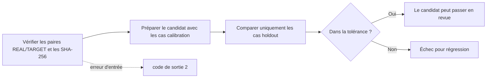

# Contrôle qualité des profils scanner

[Accueil de la documentation](../README.md)

`scripts/evaluate_profile_quality.py` vérifie qu'une modification de profil scanner n'est pas sortie
moins bonne que la référence acceptée.
Il compare deux `SOURCE/summary.json` produits par `LUT_target/analyze_lut_target.py`,
et seuls les cas de validation tenus à l'écart du réglage comptent dans la décision.

Cet outil ne décide pas ce qu'est une « bonne couleur ». Quels chiffres doivent baisser,
lesquels doivent monter et quelle variation reste acceptable,
c'est une personne qui l'écrit dans le manifeste du corpus.
Aucune valeur de réussite par défaut n'est fournie.

Il n'y a aujourd'hui aucune paire d'images REAL/TARGET dans ce dépôt.
Donc pas de vrai manifeste de corpus, pas de référence acceptée,
et pas de résultat de réussite sur un appareil réel non plus.
Les tests synthétiques ne vérifient que le code du contrôleur.

> [!WARNING]
> La justesse colorimétrique d'un scanner ne peut pas être approuvée à partir de ce seul dépôt.
> Une vraie décision de publication demande des paires REAL/TARGET figées, des cas de validation
> non utilisés pour le réglage et des tolérances fixées par une personne.

## Jusqu'où l'application utilise les profils actuels

Quand vous choisissez vous-même la cible `NORITSU` ou `FUJI`,
une différence relative limitée issue du groupe `realOnly` fourni peut servir.

Conditions :

- Le type de film et le nom du film correspondent.
- L'ensemble des noms de films sources, une fois nettoyé, correspond.
- L'écart de nombre d'images est de 15 % ou moins.

Les profils sources n'ont ni identifiant par image ni SHA-256.
Des noms de films identiques ne prouvent pas que ce sont exactement les mêmes vues qui ont été
appariées.
On ne peut donc pas parler du même résultat que la machine réelle.

Règles d'application :

- Les valeurs dont le sens s'oppose entre les deux groupes ne sont pas appliquées.
- En noir et blanc, toutes les composantes de couleur sont retirées et seule la tonalité relative reste.
- La correction relative NORITSU/FUJI ne s'applique pas à un profil de diapositive sans film correspondant.
- Sans matériel apparié pris au même endroit, ni la texture scanner ni l'accentuation ne s'appliquent.
- La tonalité s'applique une fois à la luminosité en gamma Rec.709, et les `a*` et `b*` Lab sont préservés.
- Le gain couleur est interpolé dans le domaine logarithmique pour respecter la relation entre points d'ancrage opposés.
- Si le SHA-256 d'un fichier ou d'un manifeste ne correspond pas, tout le lot de profils est refusé.

## Ce que le matériel constructeur permet de confirmer

- Le [guide Fujifilm Frontier 570/SP-3000](https://www.photolabdigital.com/fuji_frontier570_en%5B1%5D.pdf)
cite des fonctions comme le CCD matriciel, Hyper-tone et Hyper-sharpness,
mais ne publie ni fonction de transfert ni valeurs de réglage.
- Les [informations produit Noritsu HS-1800](https://www.noritsu.eu/hardware/noritsu-film-scanner.html)
donnent les formats pris en charge, la résolution et le débit,
mais aucune fonction de transfert colorimétrique fixe.
- Le [brevet Noritsu US 7,589,863](https://patents.google.com/patent/US7589863/en) décrit le flux
de minilab où un opérateur choisit densité, gradation et accentuation.

Ce matériel montre que le traitement change avec la scène et l'opérateur.
Il ne fournit pas de constantes pour reproduire un HS-1800 ou un SP-3000. negaflow ne devine pas ces
valeurs à partir d'un nom de produit.

## Schéma v1 du manifeste de corpus

Le manifeste se place à côté du matériel d'entrée qu'il fige,
par exemple `LUT_target/quality/corpus-v1.json`. Les chemins sont relatifs au fichier de manifeste.
Avec `--data-root`, c'est ce chemin qui sert de base.

<details>
<summary>Exemple de manifeste</summary>

```json
{
  "schemaVersion": 1,
  "corpusVersion": "scanner-corpus-2026-07-10.1",
  "acceptedBaselineSHA256": "sha256:<64 lowercase hex>",
  "cases": [
    {
      "role": "calibration",
      "stem": "NORITSU/color nega/Portra 400/calibration-01",
      "real": {
        "path": "REAL/NORITSU/color nega/Portra 400/calibration-01.tif",
        "sha256": "sha256:<64 lowercase hex>"
      },
      "target": {
        "path": "TARGET/NORITSU/color nega/Portra 400/calibration-01.tif",
        "sha256": "sha256:<64 lowercase hex>"
      }
    },
    {
      "role": "holdout",
      "stem": "NORITSU/color nega/Portra 400/holdout-01",
      "real": {
        "path": "REAL/NORITSU/color nega/Portra 400/holdout-01.tif",
        "sha256": "sha256:<64 lowercase hex>"
      },
      "target": {
        "path": "TARGET/NORITSU/color nega/Portra 400/holdout-01.tif",
        "sha256": "sha256:<64 lowercase hex>"
      }
    }
  ],
  "metrics": [
    {
      "name": "mean_delta_e2000",
      "direction": "lowerIsBetter",
      "allowedRegression": 0.0
    },
    {
      "name": "similarity_score_0_100",
      "direction": "higherIsBetter",
      "allowedRegression": 0.0
    },
    {
      "name": "neutral_a_shift",
      "direction": "absoluteLowerIsBetter",
      "allowedRegression": 0.0
    }
  ]
}
```

</details>

Le `0.0` de l'exemple n'est pas une recommandation.
Définissez les entrées et les tolérances selon votre méthode de mesure et votre politique de
publication.

## Règles du manifeste

- `schemaVersion` doit valoir exactement `1`.
- Les versions et les champs inconnus sont refusés.
- `corpusVersion` désigne une sélection et une répartition figées du matériel.
- `acceptedBaselineSHA256` fige les octets exacts du `summary.json` accepté.
- Chaque cas est soit `calibration`, soit `holdout`.
- Les noms ne peuvent pas se répéter.
- Le matériel ne peut pas être vide, et chaque rôle demande au moins un cas.
- Les fichiers REAL et TARGET sont figés en `sha256:<64 lowercase hex>`.
- Les noms de métriques ne peuvent pas se répéter.
- `allowedRegression` doit être un nombre fini supérieur ou égal à zéro. Les booléens sont refusés.
- Seules les directions `lowerIsBetter`, `higherIsBetter` et `absoluteLowerIsBetter` sont admises.

`absoluteLowerIsBetter` compare la distance à zéro. À n'utiliser que si zéro est la référence
examinée.

## Préparer le candidat et la référence acceptée

```bash
python3 LUT_target/analyze_lut_target.py
```

Avant d'approuver une publication,
conservez tout le `SOURCE/summary.json` du candidat comme prochain fichier de référence accepté. Le
fichier accepté existant n'est pas écrasé tant que le candidat n'a pas passé la revue.
Mettez le SHA-256 exact du fichier accepté dans `acceptedBaselineSHA256`.

Les résumés du candidat et de la référence doivent contenir chaque cas du manifeste exactement une
fois.
Un cas manquant, un doublon,
un échec de traitement ou un cas hors manifeste est une erreur d'entrée.

Les cas `calibration` peuvent servir à ajuster le profil. Ils ne comptent pas dans la décision.
Les cas `holdout` restent hors du réglage et de la sélection.
Les valeurs de validation sont comparées cas par cas,
donc une amélioration moyenne ne peut pas masquer une image dégradée.



## Exécution

<details open>
<summary>Commande du contrôle qualité</summary>

```bash
python3 scripts/evaluate_profile_quality.py \
  --manifest LUT_target/quality/corpus-v1.json \
  --candidate-summary LUT_target/SOURCE/summary.json \
  --baseline-summary LUT_target/quality/accepted-summary-v1.json \
  --data-root LUT_target \
  --verify-files all \
  --report build/profile-quality-report.json
```

</details>

Modes de vérification des fichiers :

| Valeur | Ce qu'il fait | Utilisable comme preuve de publication |
|---|---|---|
| `all` | Vérifie chemin et SHA-256 de tous les fichiers REAL/TARGET | Oui |
| `holdout` | Vérifie seulement les fichiers de validation | Pour un diagnostic rapide |
| `none` | Ne vérifie pas les fichiers image | Non |

Le défaut est `all`.
Le rapport consigne le mode utilisé, les empreintes du manifeste et des fichiers de résumé,
le résultat de la vérification des fichiers,
ainsi que la comparaison et les comptes par cas de validation.
Le même JSON part sur stdout et dans le fichier `--report`.
Le fichier est enregistré de façon atomique.

Codes de sortie :

- `0` : entrée valide, aucune régression au-delà de la tolérance
- `1` : entrée valide, mais au moins une valeur de validation sort de la plage
- `2` : schéma, matériel, empreinte, chemin ou métrique incorrect ou manquant

## Tester le contrôleur

```bash
python3 -m unittest scripts/tests/test_evaluate_profile_quality.py
```

Les tests utilisent des fichiers synthétiques temporaires pour couvrir une comparaison normale,
une régression, une empreinte modifiée, un schéma et des nombres invalides, des cas en double,
manquants et en échec, et du matériel vide.
Ils ne prouvent pas la qualité de la sortie d'un scanner réel.
