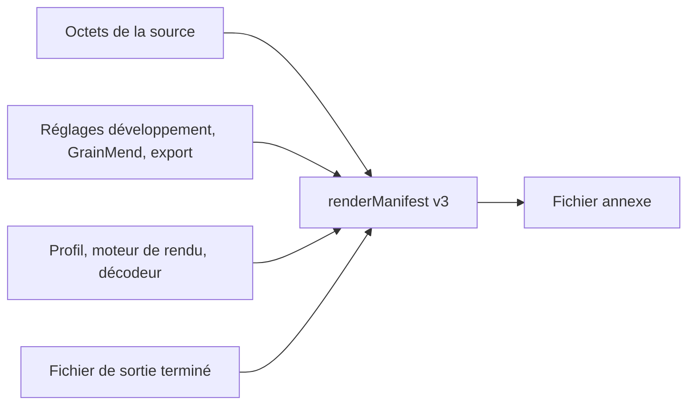

# Manifeste de rendu

[Accueil de la documentation](../README.md)

Le `renderManifest` du fichier annexe relie la source, les valeurs d'édition et le fichier
final par des SHA-256. Les chemins de fichiers ne sont pas enregistrés.

> [!IMPORTANT]
> Le `renderManifest` note les relations de hachage entre fichiers et réglages. Il n'y a ni
> signature numérique ni certificat, donc on ne parle pas de C2PA Content Credentials.

Ce que contient la v3 :

- Nombre d'octets de la source, SHA-256 et nom d'algorithme `sha-256`
- Le type d'entrée de rendu réellement utilisé
- La portée vérifiée du cache GrainMend ou de l'entrée en mémoire
- SHA-256 des réglages de développement, GrainMend et export
- SHA-256 du profil de scanner
- Origine du décodeur et version du moteur de rendu chroma
- SHA-256, nombre d'octets, taille en pixels et format du fichier final

Quand l'encodeur a fini d'écrire, le fichier est rouvert avec ImageIO pour confirmer la taille
en pixels, puis l'ensemble du fichier est haché. Le fichier annexe est écrit après. Si le
contrôle v3 échoue, le résultat n'est pas publié comme ensemble de sortie terminé.

## Entrée GrainMend

- `cleanedMemory` : les pixels en mémoire n'ont pas de hachage standard, la portée vérifiée est
  donc notée `sourceAndDevelopRecipe`. Le SHA-256 de l'historique d'édition GrainMend y figure
  toujours.
- `cleanedFile` : le fichier de cache GrainMend entier et l'historique d'édition sont hachés.

Les anciens fichiers v1 et v2 s'ouvrent encore. Les hachages de sortie ou d'historique GrainMend
qui n'existaient pas alors ne sont pas complétés après coup au jugé.

## Différence avec C2PA

Ici, pas de signature numérique, pas de certificat, pas de chaîne de confiance, pas de claim
store intégré. C'est pourquoi on ne parle pas de C2PA Content Credentials. Le hard binding et
l'historique de traitement de C2PA, ainsi que la notion d'intégrité de PREMIS, ont servi de
références, mais seuls des SHA-256 vérifiables sont consignés.

Sources :

- [C2PA Content Credentials 2.2](https://spec.c2pa.org/specifications/specifications/2.2/specs/C2PA_Specification.html)
- [C2PA hard-binding guidance](https://spec.c2pa.org/specifications/specifications/2.4/guidance/Guidance.html)
- [PREMIS preservation metadata](https://www.loc.gov/standards/premis/)
- [Apple Image I/O orientation and image properties](https://developer.apple.com/documentation/imageio/cgimagepropertyorientation)
