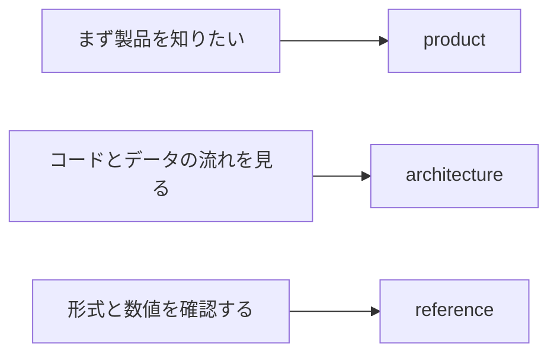

# negaflowドキュメント

必要なドキュメントからすぐ開けるよう、内容ごとに分けています。

[English](../README.md) · [한국어](../ko/README.md) · 日本語 · [简体中文](../zh-Hans/README.md) · [Français](../fr/README.md) · [Deutsch](../de/README.md)

> [!NOTE]
> negaflow 1.1.0 は macOS と Windows で動きます。二つのアプリはそれぞれのプラットフォーム向けに別々に作られ、同じファイルからは同じ絵が出ます。

## プラットフォーム

| ドキュメント | 見るとき |
|---|---|
| [macOS と Windows の違い](platform/PLATFORM_DIFFERENCES.md) | 両方で同じところと違うところを知りたいとき |
| [macOS のドキュメント](../../negaflow-mac/docs/README_ja.md) | macOS でインストール、ビルド、CLI を使うとき |
| [Windows のドキュメント](../../negaflow-windows/docs/README_ja.md) | Windows でインストール、ビルド、エンジンを確かめるとき |

## 製品

| ドキュメント | 読むとき |
|---|---|
| [ライブラリからプリントまで](product/WORKFLOW.md) | 読み込み、フォルダー現像、コピー・ペースト、プリントの流れを見るとき |
| [クロマエンジン](product/CHROMA_ENGINE.md) | フィルム反転と現像順序を知りたいとき |
| [GrainMend](product/GRAINMEND.md) | ホコリとキズの復元がどう動くか見るとき |
| [フィルムプロファイル](product/FILM_PROFILES.md) | 同梱プロファイルの出どころと限界を確認するとき |

## 構造

| ドキュメント | 内容 |
|---|---|
| [製品構造](architecture/PRODUCT_ARCHITECTURE.md) | アプリ、エンジン、保存、書き出しの間のデータの流れ |
| [カタログ保存構造](architecture/CATALOG_STORAGE.md) | SQLiteを選んだ理由、以前の形式、計測値 |
| [スキャナープラグイン構造](architecture/SCANNER_PLUGINS.md) | 外部プロセス、承認、スキャンファイルの公開 |
| [ライブラリ保存アーカイブ](architecture/LIBRARY_ARCHIVE.md) | 原本と編集履歴をまとめて保管する方法 |

## 規格

| ドキュメント | 内容 |
|---|---|
| [スキャナーCLI JSON](reference/CLI_JSON.md) | `detect --json`と`capabilities --json`の出力形式 |
| [レンダー記録](reference/RENDER_MANIFEST.md) | 原本、編集値、出力ファイルのSHA-256の関係 |
| [プリントレイアウトとC-printプレビュー](reference/C_PRINT.md) | 7レイアウト、完成ページ出力、レンダリング最適化、プルーフ専用ICCと精度の限界 |
| [固定プリント応答](reference/PRINT_RESPONSE.md) | `shoulder-print-response-v4`の式と基準点 |
| [スキャナープロファイル品質判定](reference/PROFILE_QUALITY_GATE.md) | REAL/TARGETペア資料の出荷判定 |
| [スキャナーノイズプロファイル](reference/SCANNER_NOISE_PROFILES.md) | 繰り返しスキャンの計測と自動適用の条件 |
| [GrainMend IRが避けるフィルム](reference/INFRARED_LIMITS.md) | 白黒、Kodachrome、RGB/IR整列の限界 |
| [フラットベッドの自動フレーム検出](reference/FRAME_DETECTION.md) | フィルムと空のホルダーの見分け方、コマ境界の測り方 |
| [IT8色検査](reference/IT8_COLOR_VALIDATION.md) | パッチ計測、証拠等級、合成回帰 |

## 出所と配布

| ドキュメント | 使うとき |
|---|---|
| [コードとリソースの出所](legal/PROVENANCE.md) | Apache/GPLの境界と同梱リソースのハッシュを確認するとき |
| [`TRADEMARKS.md`](../../TRADEMARKS.md) | フィルム・スキャナー・製品名の使い方を確認するとき |

## 書き方

- 製品の説明には、今ユーザーが見る動作だけを書きます。
- 構造のドキュメントには、担当範囲とデータの移動を書きます。
- 規格のコード値、フィールド名、ハッシュはそのまま残します。
- 検証のドキュメントは、通ったものとまだ確認していないものを分けて書きます。
- 平たい文で書きます。宣伝用の形容詞、締めのまとめ段落、否定の対句は使いません。
- ある言語にある節は六言語すべてにあります。規則は [`AGENTS.md`](../../AGENTS.md) にあります。
