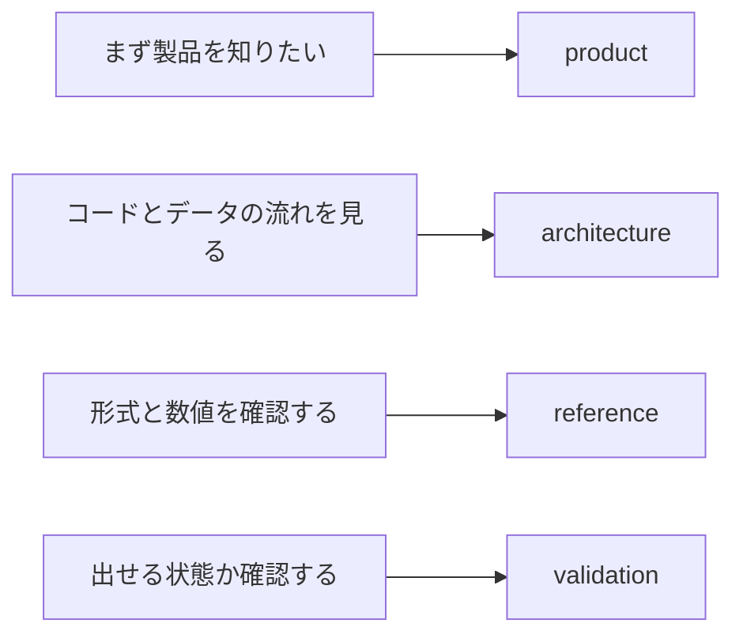

# negaflowドキュメント

必要なドキュメントからすぐ開けるよう、内容ごとに分けています。

[English](../README.md) · [한국어](../ko/README.md) · 日本語 · [简体中文](../zh-Hans/README.md)
· [Français](../fr/README.md) · [Deutsch](../de/README.md)

> [!NOTE]
> 現在のバージョンは`1.0.0`です。作ったものと実際に確認した範囲は
> [プロジェクトの状態](product/PROJECT_STATUS.md)に書いています。

## 製品

| ドキュメント | 読むとき |
|---|---|
| [クロマエンジン](product/CHROMA_ENGINE.md) | フィルム反転と現像順序を知りたいとき |
| [GrainMend](product/GRAINMEND.md) | ホコリとキズの復元がどう動くか見るとき |
| [フィルムプロファイル](product/FILM_PROFILES.md) | 同梱プロファイルの出どころと限界を確認するとき |
| [プロジェクトの状態](product/PROJECT_STATUS.md) | 実装、計測、配布の状態を確認するとき |

## 構造

| ドキュメント | 内容 |
|---|---|
| [製品構造](architecture/PRODUCT_ARCHITECTURE.md) | アプリ、エンジン、保存、書き出しの間のデータの流れ |
| [カタログ保存構造](architecture/CATALOG_STORAGE.md) | SQLiteを選んだ理由、以前の形式、計測値 |
| [スキャナープラグイン構造](architecture/SCANNER_PLUGINS.md) | 外部プロセス、承認、スキャンファイルの公開 |
| [ライブラリ保存アーカイブ](architecture/LIBRARY_ARCHIVE.md) | 原本と編集履歴をまとめて保管する方法 |

## 規格

| ドキュメント | 内容 |
|---|---|
| [スキャナーCLI JSON](reference/CLI_JSON.md) | `detect --json`と`capabilities --json`の出力形式 |
| [レンダー記録](reference/RENDER_MANIFEST.md) | 原本、編集値、出力ファイルのSHA-256の関係 |
| [固定プリント応答](reference/PRINT_RESPONSE.md) | `shoulder-print-response-v4`の式と基準点 |
| [スキャナープロファイル品質判定](reference/PROFILE_QUALITY_GATE.md) | REAL/TARGETペア資料の出荷判定 |
| [スキャナーノイズプロファイル](reference/SCANNER_NOISE_PROFILES.md) | 繰り返しスキャンの計測と自動適用の条件 |
| [GrainMend IRが避けるフィルム](reference/INFRARED_LIMITS.md) | 白黒、Kodachrome、RGB/IR整列の限界 |
| [IT8色検査](reference/IT8_COLOR_VALIDATION.md) | パッチ計測、証拠等級、合成回帰 |

## 検証

| ドキュメント | 使うとき |
|---|---|
| [実機点検リスト](validation/REAL_QA_CHECKLIST.md) | 実機のMac、画面、スキャナー、フィルムを確認するとき |
| [GrainMend実スキャン比較](validation/GRAINMEND_CORPUS.md) | FILM-R v2の44ペアを測り直すとき |

## 出所と配布

| ドキュメント | 使うとき |
|---|---|
| [コードとリソースの出所](legal/PROVENANCE.md) | Apache/GPLの境界と同梱リソースのハッシュを確認するとき |
| [`TRADEMARKS.md`](../../TRADEMARKS.md) | フィルム・スキャナー・製品名の使い方を確認するとき |

## 書き方

- 製品の説明には、今ユーザーが見る動作だけを書きます。
- 構造のドキュメントには、担当範囲とデータの移動を書きます。
- 規格のコード値、フィールド名、ハッシュはそのまま残します。
- 検証のドキュメントは、通ったものとまだ確認していないものを分けて書きます。
