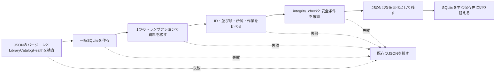

# カタログ保存構造

[ドキュメントホーム](../README.md)

主な保存先は`library.sqlite`です。以前の`library.json`は、古い資料を移すときと診断用ファイルを
作るときにだけ使います。2つのファイルを同時に更新することはないので、`dual-write`はありません。

バックアップと保存アーカイブには、機器間で移せるJSON表現を入れます。実行中のSQLiteファイルは
入れません。

| 区分 | 形式 | 用途 |
|---|---|---|
| 主カタログ | SQLite | アプリの実行、検索、保存、復旧 |
| 古い資料 | JSON | 既存カタログの取り込み |
| バックアップ・保存アーカイブ | JSON表現 | 別の機器への移動、復元 |

> [!IMPORTANT]
> カタログがない、または壊れているときに空のライブラリで始めることはありません。正常な世代が
> 見つかるまで、元のカタログと写真ファイルはそのままにします。

## 実測

同じMacで、次のコマンドを使ってJSONとSQLiteを比べました。

<details>
<summary>測定コマンド</summary>

```bash
DEVELOPER_DIR=/Applications/Xcode.app/Contents/Developer \
  NEGAFLOW_CATALOG_PERF_REPORT="$PWD/build/performance/catalog.json" \
  bash scripts/performance/run-catalog.sh

DEVELOPER_DIR=/Applications/Xcode.app/Contents/Developer \
  NEGAFLOW_LIBRARY_QUERY_PERF_REPORT="$PWD/build/performance/library-query.json" \
  bash scripts/run-library-query-performance.sh

DEVELOPER_DIR=/Applications/Xcode.app/Contents/Developer \
  NEGAFLOW_SQLITE_CATALOG_PERF_REPORT="$PWD/build/performance/catalog-sqlite.json" \
  bash scripts/performance/run-sqlite-catalog.sh
```

</details>

測定は2026-07-12、Mac14,3、arm64、8コア、メモリ24 GiB、macOS 26.5、Swift Releaseビルドです。
他のMacの速度を保証する数値ではありません。同じ環境で退行を見つけるための基準値です。

| フレーム | JSONサイズ | エンコードp50 | デコードp50 | ファイル読み込みp50 |
|---:|---:|---:|---:|---:|
| 1,000 | 2,192,671バイト | 98 ms | 241 ms | 231 ms |
| 10,000 | 21,934,841バイト | 811 ms | 2,301 ms | 2,299 ms |
| 50,000 | 109,721,335バイト | 2,746 ms | 7,353 ms | 7,397 ms |

50,000フレームのJSONエンコードでは、resident memoryが約191 MiB、max RSSが約107 MiB増えました。
同じ資料でメモリ検索の準備は32.86 ms、全体の名前並べ替えは86.01 ms、フィルター後の名前並べ替えは
158.37 msでした。フィルター投影を4回続けたp50は512.80 msです。

現在のSQLite行ストア、50,000フレームのRelease p95:

| 操作 | p95 |
|---|---:|
| 新規コミット | 3,714 ms |
| 主ファイルの読み込み | 7,446 ms |
| 変更なしのコミット | 3,856 ms |
| フレームあたりのサイズ | 約4,211バイト |

バックアップはデータベース全体を`Data`に読み込みません。複製に対応した一時コピーを作り、原子的に
入れ替えます。バックアップ前の検査も全フレームをデコードせず、SQLiteの整合性とスキーマを見ます。
これで変更なしのコミットのp95は11,245 msから3,856 msになりました。

## SQLiteにした理由

- 複数行の変更を1つのトランザクションに収められます。
- 行とインデックスで、必要なフレームだけ読めます。
- macOSのSQLite C APIを使うので、新しいパッケージが要りません。
- 壊れた保存先を空のライブラリとして扱わない、という今の復旧の決まりを保てます。

いまは`journal_mode=DELETE`、`synchronous=FULL`です。WALだとデータベースと`-wal`ファイルを
ひとまとまりで扱う必要があります。実行中のデータベースを勝手にコピーはしません。接続を閉じてから
確認した主ファイルだけを復旧用コピーにします。

## コードの担当

- `CatalogStore`: 接続、トランザクション、スキーマバージョン、整合性検査
- `CatalogMigration`: 読み取り専用のJSON取り込みとバージョン別変換
- エンティティテーブル: フレーム、原本、並び順、ロール、フォルダー、コレクション、検索、スキャン作業
- `LibraryBackupStore`: 移動できるJSONバックアップ、復元前の検査、復旧情報

現像値とバージョン別の編集履歴は、エンティティごとにJSON BLOBで保存します。原本のピクセル、
サムネイル、GrainMendキャッシュはデータベースに入れません。

検索と並べ替え用の列とインデックスがまだ足りないので、起動時にカタログ全体をメモリへ読み込み
ます。今のSQLiteの読み込み時間がJSONと似ているのはそのためです。次は、必要な列とフレームだけを
読むインデックス照会です。

## 古いJSONを移す手順



どこかで失敗したら、既存のJSONをそのまま残します。空のカタログで始めることはありません。途中の
ファイルや目印が残っていても、元のSHA-256と2つのカタログが一致したときだけ続けます。

移したあとにJSONへ自動で戻ることはありません。以前のアプリがJSONを直して保存先が2つに割れるのを
防ぐため、最小読み取りバージョンと移行の目印を確認します。

## 選ばなかったもの

- **カタログ全体を1つのJSONに置く:** 単純ですが、50,000フレームの読み込みに約7.4秒かかり、保存の
  たびにファイルを書き直します。
- **フレームごとにJSONを分ける:** 一部の書き込みは減りますが、複数のエンティティを一度に保存して
  関係を検証するコードを自分で書くことになります。
- **いまCore Dataに替える:** できますが、今のCodable変換と復旧の約束事を一度に作り直すことに
  なります。試作がraw SQLiteより良いと測れたら考え直します。

## 参考

- [Apple: Tuning for Performance and Responsiveness](https://developer.apple.com/library/archive/documentation/General/Conceptual/MOSXAppProgrammingGuide/Performance/Performance.html)
- [Apple: Reducing disk writes](https://developer.apple.com/documentation/xcode/reducing-disk-writes)
- [SQLite: Atomic Commit](https://sqlite.org/atomiccommit.html)
- [SQLite: Write-Ahead Logging](https://sqlite.org/wal.html)
