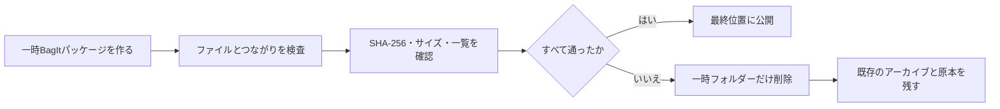

# ライブラリ保存アーカイブ

[ドキュメントホーム](../README.md)

カタログのバックアップはアプリを早く復旧するためのファイルなので、元の写真は入れません。
`.negaflowarchive`アーカイブは次の資料を1つにまとめます。

| 入れるもの | 入れないもの |
|---|---|
| 移動できるカタログJSON | 実行中のSQLiteファイル |
| 参照中の原本と残っているIR原本 | サムネイルとプレビュー |
| 必要なGrainMend編集履歴 | 作り直せるGrainMendキャッシュ |
| 仮想コピーと共有原本の関係 | 書き出したファイル |

実行中のSQLiteファイルは入れません。
サムネイル、プレビュー、GrainMendキャッシュ、書き出したファイルのように作り直せるものも外します
。

> [!WARNING]
> アーカイブの作成に失敗しても、既存のアーカイブは上書きしません。原本、他社のXMP、実行中の
> カタログにも触れません。

## ファイル構成と検査

パッケージは[RFC 8493 BagIt](https://www.rfc-editor.org/rfc/rfc8493.html)のフォルダー構成に従い
ます。
内容ファイルと管理ファイルのSHA-256一覧を別々に書きます。
`negaflow-archive.json`がフレームIDと保管ファイルIDをつなぎます。
複数の仮想コピーが同じ原本を使う場合、原本のバイト列は一度だけ保存します。

次の検査をすべて通ってから、一時フォルダーを最終位置に移します。

1. 今のアプリがカタログを安全に読める。
2. 原本とIR入力が通常のファイルで、コピー中にサイズと更新時刻が変わらない。
3. 必要なGrainMendの記録をすべて読める。
4. SHA-256、バイト数、ファイル一覧、`Payload-Oxum`が合う。
5. フレームと原本、IR、GrainMend記録のつながりがカタログと合う。

失敗した場合、既存のアーカイブはそのまま残ります。作りかけの一時フォルダーだけを消します。
原本、他社のXMP、実行中のカタログには手を付けません。

## 制限

原本の形式はそのまま保存します。長期互換性を理由に形式を変換することはありません。
PREMISの保存イベントと担当者の記録、推奨形式への移行はv1の範囲外です。

アーカイブ1つで長期保存が終わるわけではありません。
別の媒体と別の場所に複製を置き、定期的にハッシュを確認してください。

参考:

- [RFC 8493: The BagIt File Packaging Format](https://www.rfc-editor.org/rfc/rfc8493.html)
- [Library of Congress PREMIS](https://www.loc.gov/standards/premis/)
- [Library of Congress Recommended Formats Statement](https://www.loc.gov/preservation/resources/rfs/)
