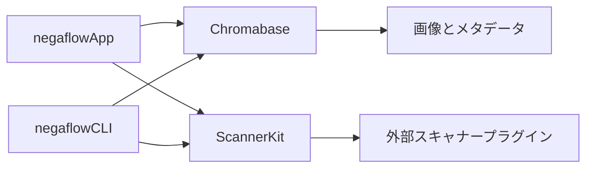
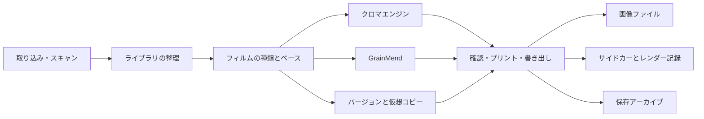

# 製品構造

[ドキュメントホーム](../README.md)

negaflowは、フィルム画像を取り込むかスキャンしたあと、反転、現像、 GrainMend、出力、
保存へとつながるmacOSアプリです。すべての編集は原本とは別に保存します。

> [!IMPORTANT]
> 原本、編集記録、キャッシュ、出力ファイルはそれぞれ別の資料です。キャッシュが消えても原本と
> 編集記録は残らなければならず、必要な結果を作り直せないときは書き出しを失敗させます。

## 変えない安全ルール

1. 原本画像と第三者のサイドカーを自動で上書きしません。
2. ライブラリから外すことと、原本をゴミ箱へ送ることを分けます。
3. スキャナー画面は、プラグインが報告した機能だけを見せます。
4. デモを自分で選ばないかぎり、偽のスキャナーで代用しません。
5. 編集結果を作り直せないとき、原本を代わりに書き出しません。
6. 長くかかった処理は、結果を適用する直前にフレーム、編集バージョン、セッションを確認し直します。
7. キャッシュは原本と編集記録から作り直せなければなりません。
8. 検証が足りないプロファイル、出力一式、アーカイブを成功した結果として公開しません。

## モジュール



### `Chromabase`

クロマエンジンと画像処理のコアです。

- 画像の読み込みと向きの処理
- フィルムベースの測定
- ネガとポジの現像
- トーン、色、部分補正
- フィルム、ルック、スキャナープロファイル
- GrainMend RGBとIR
- ヒストグラムと色の測定
- 出力エンコードとメタデータ

詳しくは:

- [クロマエンジン](../product/CHROMA_ENGINE.md)
- [GrainMend](../product/GRAINMEND.md)

### `ScannerKit`

実際のスキャナードライバーではなく、外部プラグインをつなぐ規格を担当します。

- スキャナーIDと機能
- リクエストとレスポンスのJSON
- 外部プロセスの実行、時間制限、キャンセル
- プラグインの所有者、権限、承認、ハッシュ
- 一時出力の検査と、最終ファイルの公開
- スキャンセッションと作業記録
- 自分で有効にするデモスキャナー

SANEの実装は別のGPLプロジェクト [`negaflow-scanner-sane`](https:
//github.com/habinsong/negaflow-scanner-sane)にあります。
本体とプラグインはJSONとCLIだけでやり取りします。

### `negaflowCLI`

GUIと同じエンジンと`ScannerKit`を使います。

- スキャナーの検出、機能の確認、スキャン
- 複数画像の現像
- スキャナープロファイルの一覧
- GrainMendの`defect-bench`
- IT8とスキャナー間の相対比較
- 自己点検とJSONによる自動化

### `negaflowApp`

SwiftUIとAppKitで作ったユーザー向けアプリです。

- ライブラリ、現像、プリント、キャンバス
- スキャン、GrainMend、書き出し
- バージョン、設定、ショートカット
- カタログ、キャッシュ、バックアップ、保存アーカイブ

## ユーザーの流れ



どの段階も原本を変えるのではなく、カタログと編集記録を足していきます。

## 入力と原本

### ファイルの取り込み

基本の入力方法です。 TIFF、JPEG、PNGと、macOS Image I/Oが読めるカメラRAWを扱います。
埋め込みの ICCと向きの情報を読み、原本IDをカタログに残します。

### スキャン

インストールされたプラグインは、次の機能を報告できます。

- 解像度とビット深度
- スキャン範囲とプレビュー
- 露出
- IR
- バッチとホルダーの動作

アプリはモデル名の表を見て機能を作りません。
スキャンが終わったら、プラグインが実際に適用した設定と出力ファイルも確認し直します。

### 原本ID

ファイルパスだけで原本を判断しません。
ファイルの観測値、バイト数、更新時刻、 SHA-256、 persistent bookmarkのように、
いまの規格に必要な値を残します。

ファイルが移動していたら、ユーザーがつなぎ直したときか、
bookmarkの復旧が成功したときだけパスを変えます。

## カタログ

主な保存先は`library.sqlite`です。以前の`library.json`は、確認済みの古い資料を移すときと、
持ち運べるバックアップを作るときに使います。 2つの保存先を同時に更新することはありません。

SQLiteに入れるもの:

- フレームと原本
- ロール、フォルダー、コレクション、検索
- 並び順とスキャン作業
- 現像値とバージョンごとの編集記録

SQLiteに入れないもの:

- 原本のピクセル
- サムネイルとプレビュー
- GrainMendのキャッシュ

### JSONからの移行

1. 既存JSONのスキーマと健全性を確認します。
2. 復旧用のコピーを残します。
3. 一時的なSQLiteに1つのトランザクションで書き込みます。
4. 移行の前後でカタログを比べます。
5. SQLiteの整合性と、アプリの安全条件を確認します。
6. すべて合っているときだけ、主な保存先を切り替えます。

失敗したJSONを空のカタログとして扱いません。
詳しい数値と判断は [カタログ保存構造](CATALOG_STORAGE.md)にあります。

## ライブラリ

整理の機能:

- フォルダー、ロール、手動コレクション、スマートコレクション、保存した検索、スタック
- 星の評価、採用・除外、カラーラベル
- グリッド、比較、サーベイ
- 重複候補の確認

複数の仮想コピーが1つの原本を共有できます。原本を消す前に、参照関係を先に確認します。
ライブラリから外す操作はカタログの参照だけを変えます。ゴミ箱への移動は別に実行します。

外付けディスクが外れても編集は残ります。
原本をオフラインとして表示し、ファイル単位またはフォルダー単位でつなぎ直します。
想定したIDと違えば、自動で入れ替えません。

## 現像とGrainMend

各フレームには次の値があります。

- 原本IDとフィルムの種類
- フィルムベース
- 現像値
- GrainMendの編集記録
- バージョンの記録
- 書き出しの状態

調整中は低い解像度のプレビューを使います。
結果ができあがったら、フレームIDと編集バージョンがいまの選択と同じときだけ画面に表示します。

書き出しは画面のプレビュービットマップを保存しません。
原本と、固定した編集値から、フル解像度の画像を作り直します。

GrainMendは自動、ガイド、ブラシ、クローンスタンプ、IRを順序のあるリストとして保存します。
キャッシュは派生ファイルです。原本と編集記録から作り直せないときは書き出しを失敗させます。

詳しくは[GrainMend](../product/GRAINMEND.md)にあります。

## バージョン

- **HistoryとSnapshot:** 現像の状態を自分で記録し、比べたり戻したりします。
- **Virtual Copy:** 原本ファイルを複製せずに、別の編集の枝を作ります。
- **Copy/Paste:** トーン、色、ディテール、ジオメトリのように範囲を選んで貼り付けます。原本の
座標が必要なマスクは、安全条件を確認します。

## 書き出し

開始するとき、次の値を1つのまとまりとして固定します。

- 原本ID
- 現像とGrainMendの編集記録
- スキャナープロファイルのバイトとSHA-256
- 出力設定とメタデータの方針
- ファイル名と保存先

中断して再開するときも、同じまとまりを使います。

### 複数の出力ファイル

1回の書き出しで、JPEG/TIFF、サイドカー、XMP、`-main-flat`などが一緒にできることがあります。

1. 保存先と名前の衝突を先に確認します。
2. 一時フォルダーにすべてのファイルを書きます。
3. 画像を開き直してピクセルサイズを確認します。
4. バイト数とSHA-256を計算します。
5. サイドカーとレンダー記録を作ります。
6. コミットの記録を残します。
7. まとまり全体を最終的な場所へ移します。
8. 失敗したら巻き戻すか、次の実行で片づけます。

一部のファイルだけ残したまま成功とは表示しません。

### レンダー記録v3

パスの代わりに、次の値のSHA-256の関係を残します。

- 原本のバイト
- 実際のレンダー入力
- 現像とGrainMendの記録
- スキャナープロファイル
- デコーダーとレンダラーのバージョン
- 出力のバイト、ピクセルサイズ、形式

電子署名と証明書はないので、C2PA Content Credentialsとは呼びません。
詳しくは [レンダー記録](../reference/RENDER_MANIFEST.md)にあります。

## プリントとソフトプルーフ

対応する配置:

- 1枚
- コンタクトシート
- 複数サイズのまとまり
- ユーザー配置

ページの配置を終えたあと、最終出力にICCを1回だけ適用します。
元のスキャンTIFFと`-main-flat`にはプリンタープロファイルを入れません。

有効なRGBプリンターICCがないときは、別のプロファイルで代用しません。
選んだプロファイルのバイトと SHA-256を出力の記録に残します。

## 保存アーカイブ

`.negaflowarchive`に入れるもの:

- 持ち運べるカタログJSON
- 原本ファイル
- IRの原本
- 必要なGrainMendの記録
- 仮想コピーと共有する原本の関係

作り直せるサムネイル、プレビュー、GrainMendキャッシュ、書き出したファイルは入れません。
RFC 8493の BagIt構造とSHA-256の一覧を使い、
すべてのファイルと関係を確認してから最終的な場所へ移します。

- [ライブラリ保存アーカイブ](LIBRARY_ARCHIVE.md)
- [RFC 8493](https://www.rfc-editor.org/info/rfc8493/)
- [PREMIS](https://www.loc.gov/standards/premis/)

長期保存には、別の媒体、外部の場所のコピー、定期的なハッシュ確認も必要です。

## スキャナープラグインの安全性

プラグインを見つけたら、次を確認します。

- いまのユーザーの所有かどうか
- グループや他のユーザーが書き込めるファイルかどうか
- シンボリックリンクかどうか
- 一覧と実行ファイルのIDとSHA-256
- ユーザーが承認したIDと、いまのIDが同じかどうか

ファイルが変わっていたら、前の承認を使い回しません。

プロトコルv2はリクエストIDと順序番号を使い、最後の結果をちょうど1つ要求します。
出力サイズには上限があり、タイムアウトやキャンセルのあとはプロセスとパイプを片づけます。

プラグインが最終的な場所へ直接ファイルを公開することはありません。
アプリが一時的な場所を渡し、形式、サイズ、 ID、実際に適用された設定を確認してから、
アプリの保存先へ移します。

詳しい規格は[スキャナープラグイン構造](SCANNER_PLUGINS.md)にあります。

## 性能の境界

画像:

- 共有の`CIContext`
- 必要になったときに計算する画像グラフ
- 低い解像度での調整と、原寸出力の分離
- キャンセルと、古い結果の拒否
- GrainMendの領域・タイル・パッチ処理
- メモリ逼迫時のキャッシュ解放

カタログ:

- SQLiteのトランザクションとエンティティ行の保存
- 複製を使ったバックアップ
- 整合性の検査
- 50,000フレームでの測定

いまは起動時にカタログ全体をメモリに載せます。
同じMacでSQLiteの読み込みはJSONと近い約7.4秒でした。
必要な行だけを読むインデックス参照は次の段階です。

リポジトリの性能の上限値は、大きな後退を捕まえるための広い上限です。
対応するすべてのMacで快適さを保証する値ではありません。

## 確認の範囲

```bash
DEVELOPER_DIR=/Applications/Xcode.app/Contents/Developer swift test
bash scripts/run-app.sh build
```

自動の検査だけでは終わらない項目:

- 実際のスキャナーとプラグイン
- 実際のRGB/IRの位置合わせとフィルムの相性
- 100%表示でのGrainMendの画質
- 画面サイズとアクセシビリティを含むUI
- Developer ID、公証、Gatekeeper
- きれいなMacへのインストール
- 別のMacでの性能

## ドキュメント案内

| 知りたいこと | ドキュメント |
|---|---|
| いまの実装と確認の状態 | [プロジェクトの状態](../product/PROJECT_STATUS.md) |
| 反転と現像 | [クロマエンジン](../product/CHROMA_ENGINE.md) |
| 欠陥の復元 | [GrainMend](../product/GRAINMEND.md) |
| フィルムプロファイル | [フィルムプロファイル](../product/FILM_PROFILES.md) |
| スキャナーの接続 | [スキャナープラグイン構造](SCANNER_PLUGINS.md) |
| プロファイルの公開基準 | [スキャナープロファイル品質判定](../reference/PROFILE_QUALITY_GATE.md) |
| 実機と画面の確認 | [実機点検リスト](../validation/REAL_QA_CHECKLIST.md) |
| 保存アーカイブ | [ライブラリ保存アーカイブ](LIBRARY_ARCHIVE.md) |
| 出力ファイルのハッシュ関係 | [レンダー記録](../reference/RENDER_MANIFEST.md) |
