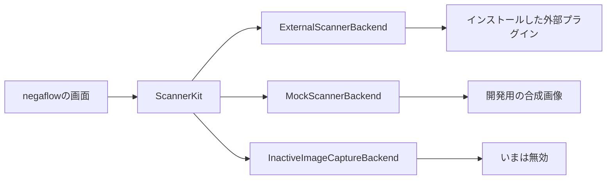
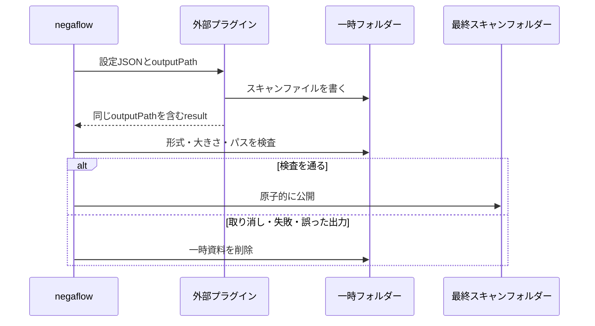

# スキャナープラグイン構造

[ドキュメントホーム](../README.md)

negaflowの既定の入力は画像の取り込みです。
実機のスキャナーは、外部プラグインがあるときだけつなぎます。

> [!IMPORTANT]
> アプリはスキャナーのモデル名から機能を推測しません。プラグインが報告した機能だけを画面と
> 要求に使い、デモ装置はユーザーが自分でデモモードを選んだときにだけ出ます。

## 構成

| 構成 | 役割 |
|---|---|
| 画像の取り込み | RAW、DNG、TIFF、PNG、JPEGを現像経路へ渡します。 |
| 外部プラグイン | 別プロセスで実機を扱い、JSONでやり取りします。 |
| デモスキャナー | 開発用の`negaflow Scanner`と`negaflow Flatbed Scanner`を出します。自分でデモを選んだときだけ使います。 |
| ImageCaptureCore連携 | macOS Image Capture装置向けの、いまは動かない互換コードです。 |

このリポジトリにSANEの実装はありません。SANEのコードは別のGPLプロジェクトにあります。

- <https://github.com/habinsong/negaflow-scanner-sane>

## つながり方

画面は`ScannerBackend`だけを見ます。
プラグインの装置IDは、アプリでは `plugin:<pluginId>:<deviceId>`と表示します。

プラグインを実行するときは`plugin:<pluginId>:`を外し、プラグイン自身の装置IDだけを送ります。

## プラグインを探す

既定のフォルダーは`~/Library/Application Support/negaflow/Plugins/<id>/manifest.json`です。

テストとローカル開発では、`NEGAFLOW_PLUGINS_DIR`で別のフォルダーを指定できます。

| フィールド | 決まり |
|---|---|
| `schemaVersion` | 今はちょうど`1` |
| `protocolVersion` | 省略すると`1`、対応は`1`と`2` |
| `id` | プラグイン固有のID |
| `name` | 画面に出す名前 |
| `kind` | プラグインの種類 |
| `license` | 配布ライセンス |
| `homepage` | プロジェクトのアドレス |
| `executable` | 実行ファイルのパス |

`id`は1〜64文字のASCIIです。先頭は英字か数字、残りは英字、数字、`.`、`_`、`-`だけ使えます。
`:`は装置IDの区切りなので使えません。

目録と実行ファイルの両方が通ったときだけプラグインを開きます。
古い・未来のスキーマや、知らないプロトコルを推測で読むことはしません。

### ファイルの安全検査

> [!WARNING]
> 目録や実行ファイルのバイトが変わると、以前の承認は捨てます。実行の直前にも、所有権、権限、
> シンボリックリンクかどうか、SHA-256をもう一度確認します。

- プラグインのフォルダー、目録、実行ファイルは現在のユーザーの所有であること。
- グループや他のユーザーが書けるなら拒否します。
- シンボリックリンクは拒否します。
- 目録と実行ファイルのSHA-256を記録します。
- 最初に使うときはユーザーの承認が要ります。
- ファイルのバイトが変われば承認は無効になります。
- 実行の直前にIDを計算し直します。

## コマンド

プラグインは別プロセスで動かします。

| コマンド | 結果 |
|---|---|
| `detect` | JSONの装置一覧 |
| `capabilities <deviceId>` | JSONの機能一覧。`detect`が報告した装置ID・製造元・モデルのJSONをstdinで受け取れる |
| `scan` | stdinで設定JSON、stdoutで進捗NDJSONと最後の結果 |

## スキャンのプロトコル

### バージョン1

以前からの互換規格です。要求とNDJSONに`protocolVersion`、`requestID`、`sequence`がありません。
実際に適用した設定を報告できないので、結果は`.unknownLegacy(protocolVersion: 1)`として記録します
。
要求値を検証済みの適用値のように写すことはしません。

### バージョン2

目録に`"protocolVersion": 2`があるときだけ使います。

要求に入る値:

- `protocolVersion: 2`
- アプリが作ったUUIDの`requestID`

`capabilities`の応答は、任意フィールドの`capabilityToken`を返せます。
アプリはこの値を解釈せず、同じ装置の次のv2 `scan`要求にだけそのまま渡します。
v1の要求には入れず、別の装置のトークンを混ぜません。
トークンの形式と有効性は、プラグインが自分で確認します。

同じbackendの別モデルへ誤って再接続するのを防ぐため、アプリは直前の`detect`が報告した `deviceID`
、`vendor`、`model`を、`capabilities`の任意のstdin JSONとして渡し直します。
既存のプラグインはこの入力を無視できます。
装置アドレスが変わり得るプラグインは、この同一性をcapability のスナップショットに結び付け、次の
`scan`でも確認してください。

各NDJSONイベントは、同じバージョンと要求IDを繰り返し、前より大きい0以上の`sequence`を持ちます。
イベントは`progress`、`result`、`error`だけです。

`result`と`error`は最後のイベントです。あとに何か来れば失敗です。
エラーで終わらなかったスキャンには`result`がちょうど1つあります。

次はすべて閉じた状態で失敗します。

- 読めないイベント
- 抜けている、または違うバージョン・要求ID
- 重複した、または逆順の順序
- 知らないイベント
- 結果の重複
- 最後のイベントのあとの追加出力
- 不正なUTF-8

v2規格の違反は、通常の時間制限を待たずにプラグインをすぐ終了させます。

### 実際に適用した設定

v2の`result`には`appliedOptions`が必ず要ります。

- `deviceID`、`resolutionDPI`、`bitDepth`、`colorMode`、`filmType`
- `scanArea`: `originXMM`、`originYMM`、`widthMM`、`heightMM` — 要求のコピーではなく、
  プラグインが実際にバックエンドへ送った領域。スキャンサイズを誤計算するバックエンドを
  回避するため1mm未満で調整されることがある。アプリは返却されたピクセルサイズをこの領域と
  照合するため、要求をそのまま複製すると検査が無意味になる。
- `infrared`、`multiExposure`
- `hardwareExposureTime`、`brightnessAdjustment`、`contrastAdjustment`
- `outputRawTIFF`

最後の3つの調整値は、`null`でもキーが必要です。

`resolutionDPI: 0`はプレビューという意味です。
プレビューが0でない、または本スキャンが0のときは拒否します。
知らない値、別の装置、結果の先頭と`appliedOptions`で食い違う解像度・ビット深度・IR の状態も拒否
します。

検査を通ると、プラグインIDではなくアプリのスキャナーIDと要求IDを記録し、最終の出力パスを残します
。
このときだけ`.verified(options)`と表示します。

`ScanResult.resolution`と`bitDepth`は、v1では要求値を一時的な動作値として使えます。
出どころを示す`reportedResolution`、`reportedBitDepth`には、結果が自分で報告した正しい値だけを入
れます。

## 平面スキャンの領域

このフローのプレビューは解像度を装置任せにせず、300 dpiに最も近い対応値を明示して要求します。装置の既定値は25 dpiまで低いことがあり、その大きさではフレームを配置して選ぶことも検出することもできません。解像度を伴うプレビューは通常のスキャンなので、プラグインのプレビュー経路は使いません。

次の機能をプラグインがそろって報告したときだけ、位置を選ぶ平面スキャンを有効にします。

- プレビュー
- `supportsPositionedScanArea`
- mm単位の`scanOriginXRange`、`scanOriginYRange`
- mm単位の`scanWidthRange`、`scanHeightRange`

アプリは選んだ領域をプラグインの刻みに合わせて外側へ広げ、領域ごとに本スキャンの作業を1つ作りま
す。
モデル名からこの機能を推測することはありません。
任意フィールドがない以前のプラグインは、固定フレームの流れのままです。

## プロセスの上限と取り消し

- stdoutの累積上限: 4 MiB
- stderrの累積上限: 1 MiB

上限を超えるとプロセスを終わらせて失敗します。片付けのときは、すでに届いたバイトだけを読みます。
子プロセスがパイプを引き継いでいても、EOFは待ちません。

`cancelScan()`は、プラグインが終わり、パイプの処理が閉じ、次の作業の枠が空いてから戻ります。

## スキャンファイルの公開

プラグインは、アプリが渡した正確な`outputPath`に元画像を書き、結果にも同じパスを返します。
このパスは、最終フォルダーと同じディスク上の一時的な場所です。

アプリが確認すること:

- 空でない通常のファイル
- ImageIOで読める画像
- 想定した形式とピクセルの大きさ
- 要求と結果のパスが同じ

すべて合ったときだけ最終位置へ移します。
取り消し、時間切れ、誤った出力、プラグインの失敗のときは一時フォルダーを消し、途中までのスキャン
は公開しません。

v2のIRファイルも、アプリが渡した一時フォルダーの中にある必要があります。
ファイルの種類、読み込み、ピクセルの大きさを確認します。
v1は、すでに出回っているプラグインとの互換のために外部の IRパスを受け取れます。

## SANEの境界

SANEの実装、依存、設定、機種ごとの処理、テスト、配布のドキュメントは、すべて別リポジトリの
[`negaflow-scanner-sane`](https://github.com/habinsong/negaflow-scanner-sane)に置きます。

そのプロジェクトは、Homebrew標準SANEを使うmacOS 14以降の標準版と、公式SANE 1.4.0に
upstreamの`coolscan2`/`coolscan3`割り当て修正だけを適用するmacOS 26以降のCoolscan版を
別々に配布します。標準版はCoolscanを強制的にブロックしませんが、この修正は含みません。

このリポジトリは、装置に依存しない外部プロセスの規格だけを記録し、検査します。
画像ファイルだけ取り込むユーザーには、スキャナープラグインは要りません。

negaflow本体はSANEの実装をリンクせず、アプリの配布物にも入れません。
プラグインは自分のリポジトリ、実行ファイル、ソース配布物、GPLライセンスを持ちます。
この文書は構造を記録するもので、派生著作物かどうかを断定しません。
実際の配布の前に、両方の成果物に入るファイルと通信の契約をもう一度検査します。

## 確認

本体のテストは、偽の外部プラグインを実際のプロセスとして動かし、次を確認します。

- プラグインを探す
- 装置を探す
- 機能のつなぎ込み
- 進捗イベント
- 最後の結果
- 取り消しと失敗の後片付け

SANEの実装は、プラグインのリポジトリのSwiftPMテストとReleaseビルドで別に確認します。
