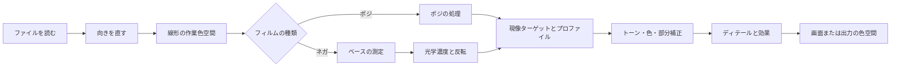

# クロマエンジン

[ドキュメントホーム](../README.md)

クロマエンジンはフィルムを反転して現像します。コードは`Chromabase`モジュールにあります。
アプリとCLIが同じモジュールを使うので、入力が同じなら同じ処理順を通ります。

| ひと目で | 内容 |
|---|---|
| 既定の現像 | `MAIN`、手動補正 |
| フィルムベース | 自動測定、スポイト、RGBの直接入力 |
| 内部の色処理 | 32-bit浮動小数点の線形色空間 |
| 自動機能 | 実行したときだけ適用 |
| 出力の色空間 | sRGB、Display P3、Adobe RGB、ユーザーのRGB ICC |

> [!IMPORTANT]
> 自動トーン、自動ホワイトバランス、自動レベル、自動カラーが既定の現像に紛れ込むことはありません。

## 先に守ること

1. フィルムベースを測れるなら、名前で選んだ既定値より測定値を先に使います。
2. フィルムの物性、スキャンの光源、スキャナーのスタイル、場面の自動補正を混ぜません。
3. 自動トーンや自動ホワイトバランスのような機能は、実行したときだけ効かせます。
4. 同じ原本、編集値、プロファイル一式には同じ処理順を使います。
5. 合成テストと実機での検証を同じ証拠として語りません。

## 処理の順序



作業画像は32-bit浮動小数点の線形色空間で処理します。
ガンマが要る演算だけ、決められた段階で変換します。
画面やファイル形式に合わせたエンコードは最後です。

AppleのCore Imageの説明:

- [CIImage](https://developer.apple.com/documentation/coreimage/ciimage)
- [CIContext](https://developer.apple.com/documentation/coreimage/cicontext)
- [workingColorSpace](https://developer.apple.com/documentation/coreimage/cicontext/workingcolorspace)
- [Core Imageの性能指針](https://developer.apple.com/library/archive/documentation/GraphicsImaging/Conceptual/CoreImaging/ci_performance/ci_performance.html)

`CIContext`はレンダーのたびに作り直しません。表示、解析、書き出しの用途に分けて使い回します。
プレビューは必要な大きさと最新の編集バージョンだけ計算します。書き出しは原寸で作り直します。

## フィルムベース

### なぜ測るのか

ネガの未露光部分は、フィルム、現像工程、スキャンの光源が合わさった基準点です。
カラーネガのオレンジマスクもここに入っています。
ベースを間違えると、その後の濃度とチャンネルの関係が全部ずれます。

Kodak Portra 400の資料も、最小濃度、特性曲線、色素の分光濃度を別々に記録しています。

- [Kodak Professional Portra 400 technical data](https://www.kodakprofessional.com/sites/default/files/wysiwyg/pro/resources/e4050_portra_400.pdf)

### 自動測定

`FilmBaseEstimator`は、いちばん明るいピクセルを数個平均するだけではありません。

- フィルムのピクセルは未露光ベースより明るくなれません。
- はるかに明るい場所は、バックライト、パーフォレーション、フィルムの外かもしれません。
- 実際のベースは、フレームの縁に幅広く続く傾向があります。
- 1枚にフィルムストリップが複数あれば、離れた領域も一緒に見られます。
- ホルダーとフィルムが混じる境界は、内側より信用しません。

縮小した解析画像で明るさの分布を探し、つながった領域をまとめ、フィルム外の候補を外します。
条件を通ったストリップが複数あれば一緒に計算します。結果には、選んだ方法と信頼度も残します。

### 方法の選び方

| モード | 動き |
|---|---|
| `Manual` | 入力したRGBをDminとして使います。スポイトが成功したときもこのモードになります。 |
| `Film` | 測定値をDminにして、選んだフィルムは主に`dmaxNorm`を出します。フィルムと光源の既定値は測定に失敗したときだけ使います。 |
| `Auto` | 空間解析を使い、失敗したら縁を基準にした方法へ下がります。 |

手動の値がない、またはフィルムIDが誤っていれば、次の安全な方法へ移ります。
場面でいちばん明るい被写体を、そのままフィルムベースにすることはありません。

## 光学濃度と反転

線形の透過率`T`とチャンネルごとのベース`Dmin`から濃度を出します。

```math
D = \log_{10}\left(\frac{D_{\min}}{T}\right)
```

`D = 0`は、入力が未露光ベースと同じという意味です。
パーフォレーションやバックライトは負になり得ます。
その値も有限のまま扱い、その場で切り捨てません。

### フィルム種別の資料

いまの表には、カラーネガ、白黒、映画用ネガなど27のフィルム名があります。

この資料の使いどころ:

- ベースを測れないときのDminの既定値
- チャンネルごとの濃度範囲
- コントラストが低く自動測定が揺れるときの安全な範囲

一部の値は公開資料の曲線を読んで近似し、一部は保守的に取りました。
27の名前が、検証済みの色プロファイル27個を意味するわけではありません。
ベースを測ったなら、実測値が優先です。

### 固定プリント応答

`MAIN`は、ベースを引いた濃度を単調に増える曲線へ変えます。
係数は隠したプリセットではなく、4つの基準点から計算します。

- ベースの黒点
- 18%の中間グレー
- 測定した濃度範囲の白
- 反射光の余裕

いまの曲線はstretched exponentialの形で、全区間に逆関数があります。
合成ネガの往復テストもこの逆関数を使います。
式と数値は[固定プリント応答](../reference/PRINT_RESPONSE.md)にあります。

既定の経路と自動機能の境目:

- 固定の曲線は、場面のヒストグラムで露出を動かしません。
- `applySceneRanged`はチャンネルごとの使用濃度範囲を測りますが、中間の露出は動かしません。
- 彩度の低い場面にだけ、制限された`CIVibrance`が入ります。
- Auto Levels、Auto Color、Auto Tone、Auto White Balanceは、自分で実行する機能です。
- 特定の印画紙やミニラボを正確に再現する、とは言いません。

## プロファイルは3種類

| 種類 | 答える問い | 値 |
|---|---|---|
| Film stock | そのフィルムのベースと濃度範囲は | Dmin/Dmax、フィルム種別 |
| Light source | スキャンの光源が各チャンネルにどう効いたか | チャンネルのgain、ベース基準の補正 |
| Scanner target | 結果のトーンと色のスタイルは | 自分で撮ったスキャンの相対統計 |

この3つを分けておけば、フィルム名1つが乳剤の物性、光源の色、ラボの仕上がりを全部表すという誤りを
避けられます。
実測のベースがあれば、光源の既定値より測定値を使います。
スキャナーの統計も、場面の絶対的な色行列としてそのまま使うことはしません。

データの詳細は[フィルムプロファイル](FILM_PROFILES.md)にあります。

## 現像ターゲット

### `MAIN`

一般的な現像の既定値です。
選んでいないスキャナースタイル、自動レベル、自動カラー、自動トーン、自動ホワイトバランスは入れま
せん。
ベースと濃度範囲の測定、制限された低彩度場面のvibranceは、基本の反転に含まれます。

### `PRINT`

作業画像は`MAIN`と同じです。書き出しの最後に、有効なRGBのprinter ICCを一度だけ当てます。
プロファイルがない、または不正なときは、sRGBや適当な紙の値で代用せず失敗させます。

### `HS`、`SP`

2段階で処理します。

1. `documentedCharacter`: `SP`は、SP-3000とnegaflow MAINで同じネガを処理した6組から得た、限られた
基本性格を使います。
`HS`は、公開されている方向とプロジェクトの設計値でトーン、中立、色の性格を作ります。
2. `scannerSignature`: 両方の機材でロール名と画像数が合うグループの相対差だけを足します。

`HS`には明るさチャンネルのシャープニングが入ります。実機の半径と強さを測った値ではありません。
`SP`には入れません。

いまのプロファイルはすべて`realOnly`です。

- ロール名と画像数が十分に合うときだけ相対差を計算します。
- 向きが反転する値は当てません。
- 白黒では色成分を外します。
- ファイルや目録のSHA-256が1つでも違えば、プロファイル一式を拒否します。

### `F135`、`HR`

実測で機材を複製したプロファイルではなく、プロジェクトが作った2つのミニラボ風スタイルです。
`F135`は印画寄りのS字カーブと暖かい中間調、`HR`は深い黒と落ち着いた中立・青方向を使います。
特定の機材を検証して複製したとは主張しません。

### `EXPIRED`

古いフィルム向けの復旧ターゲットです。
無条件に彩度を落としたり範囲を伸ばしたりせず、いまの根拠の範囲で限られた補正だけを行います。

## 現像の調整

| まとまり | 項目 |
|---|---|
| トーン | 露出、コントラスト、明部、暗部、白、黒、RGBとチャンネル別のポイントカーブ |
| 色 | 色温度、色かぶり、自然な彩度、彩度、HSL 8色、3領域のカラーグレーディング、チャンネル補正、白黒変換とトーニング |
| ディテール・効果 | シャープネス、明瞭度、かすみ除去、フィルムグレイン、周辺光量、ハレーション、ノイズ除去 |
| 部分補正 | 円形、線形、多角形、ブラシのマスクと覆い焼き・焼き込み |

これらの値は段階ごとの編集履歴として保存します。
GrainMendと普通の部分補正は、目的も保存の仕方も違います。

## カラーマネジメント

入力に有効なICCがあれば、その色空間を読みます。
内部の計算は決めた線形の作業色空間で行い、画面、ソフトプルーフ、書き出しの段階で出力の色空間へ移
します。

主な対応出力:

- sRGB
- Display P3
- Adobe RGB
- ユーザーが選んだRGBのprinter/output ICC

プリンタープロファイルの名前、バイト数、SHA-256は、書き出しの開始時に固定します。
レンダー中にファイルが変わったら中断します。

いまのCore ImageとColorSyncの経路が、すべてのmacOSでレンダリングインテントとblack-point
compensationをビット単位で同じにする、とは主張しません。
その保証が要るなら、別のColorSync バッファ経路と、大きな16-bit画像のメモリ検査が先に必要です。

## 性能と安全

- `CIContext`は用途ごとに使い回します。
- 調整中は低い解像度のプレビューを使い、書き出しは原本から作り直します。
- 時間のかかった結果は、適用の直前にフレームID、編集バージョン、セッションを確認し直します。
- メモリが足りないときは、サムネイルやプレビューなどのキャッシュを空けます。
- 原本と編集履歴は、キャッシュと分けて保存します。

## 検証の段階

1. 数式のテスト: 曲線の単調性、基準点、逆関数
2. 合成画像: 既知の入出力、クリッピング、向き、色空間
3. 合成IT8: 264パッチの数学的な往復
4. 実撮影の統計: `realOnly`のプロファイル
5. REAL/TARGETのペア: 別の検証資料を伴う装置の品質検査
6. 実機の確認: 実際のスキャナー、フィルム、画面、出力物

合成IT8の結果が良くても、実際のネガの絶対的な正確さを示すわけではありません。
スキャナープロファイルの品質判断は[プロファイル品質判定](../reference/PROFILE_QUALITY_GATE.md)と
[IT8色検査](../reference/IT8_COLOR_VALIDATION.md)に従います。

## コードの場所

- `Sources/Chromabase/Engine/`
- `Sources/Chromabase/Film/`
- `Sources/Chromabase/Develop/`
- `Sources/Chromabase/Adjustments/`
- `Sources/Chromabase/Profiles/`
- `Sources/Chromabase/Imaging/`
- `Sources/Chromabase/Export/`

いまの製品バージョンは`1.0.4`です。
編集履歴とプロファイルのスキーマは、以降のバージョンでも検証の手順を経てから変えます。
