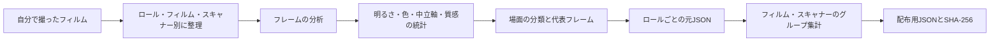

# フィルムプロファイル

[ドキュメントホーム](../README.md)

同梱のスキャナープロファイルは、拾ってきたLUTでも、名前だけ付けたプリセットでもありません。
プロジェクトの作者が自分で撮って整理したフィルムスキャンを分析し、JSONにしたものです。

| 項目 | 現在の値 |
|---|---:|
| フィルム種別の既定値 | 27 |
| 創作ルック | 6 |
| スキャナープロファイル | 15 |
| ロール観測 | 25 |
| 画像観測 | 928 |
| 検証状態 | すべて`realOnly` |

> [!NOTE]
> `928`はプロファイルごとの観測を足した値です。異なる写真が928枚という意味ではありません。

## 別々の3つの資料

| 資料 | 形式 | 用途 | 数 |
|---|---|---|---:|
| Film stock | Swift | Dmin/Dmaxとフィルム種別の既定値 | 27 |
| Look preset | JSON | ユーザーが選ぶ創作ルック | 6 |
| Scanner profile | JSON | 実際のスキャンで見た相対的なトーン・色の統計 | 15 |

フィルム名27個は、色の正確さのプロファイル27個という意味ではありません。
ルック6個もスキャナープロファイルとは別物です。以下は3つ目の資料の話だけです。

## いまの同梱内容

`Sources/Chromabase/ScannerProfiles/`に15個あります。

<details>
<summary>15個すべてを見る</summary>

| スキャナー | フィルム種別 | フィルム | ロール観測 | 画像観測 | 状態 |
|---|---|---|---:|---:|---|
| NORITSU | color nega | Fuji C200 | 3 | 111 | `realOnly` |
| NORITSU | color nega | Kodak Ektar 100 | 2 | 76 | `realOnly` |
| NORITSU | color nega | Kodak Portra 160 | 1 | 37 | `realOnly` |
| NORITSU | color nega | Kodak Portra 400 | 2 | 75 | `realOnly` |
| NORITSU | color nega | Kodak Portra 800 | 1 | 38 | `realOnly` |
| NORITSU | color nega | Kodak Pro Image 100 | 1 | 37 | `realOnly` |
| NORITSU | color nega | Kodak UltraMax 400 | 1 | 38 | `realOnly` |
| NORITSU | color nega | Kodak Vision3 250D | 1 | 37 | `realOnly` |
| NORITSU | color nega | Kodak Vision3 50D | 1 | 38 | `realOnly` |
| NORITSU | color slide | Kodak Ektachrome 100 | 1 | 38 | `realOnly` |
| NORITSU | color slide | Kodak Ektachrome 100D | 5 | 181 | `realOnly` |
| SP-3000 | color nega | Kodak Ektar 100 | 2 | 76 | `realOnly` |
| SP-3000 | color nega | Kodak Portra 160 | 1 | 38 | `realOnly` |
| SP-3000 | color nega | Kodak Vision3 250D | 2 | 71 | `realOnly` |
| SP-3000 | color slide | Kodak Ektachrome 100D | 1 | 37 | `realOnly` |
| **合計** |  |  | **25** | **928** | **15個が`realOnly`** |

</details>

25と928は、プロファイルのグループごとの観測値の合計です。
同じ物理ロールや写真が2つのスキャナーグループに入ることがあります。
固有のロール25本、固有の写真928枚という意味ではありません。

## 作る順序



### 1. 撮影と分類

原本はスキャナー、フィルム種別、フィルム名、ロール名で分けます。
分析の前に回転とファイルの解釈を確認します。空のファイルや読めないファイルは数に入れません。

### 2. フレームの測定

各フレームで次を測ります。

- 明るさの百分位と両端の切り捨て
- 暗部・中間・明部のチャンネル関係
- 彩度と色相の分布
- 低彩度ピクセルのLab中立軸
- 勾配、鮮鋭度、グレインの参考値

これは場面の観測です。1枚の露出や被写体を、スキャナーの固定の性質と決めつけません。

### 3. 場面の分類

明るさ、コントラスト、彩度、色相の範囲で場面を分けます。
ひとつの種類の場面が全体を引っ張らないよう、グループごとの数と分布を残します。

### 4. 代表フレーム

人が原本を見返せるよう、次のフレームを別に記録します。

- いちばんコントラストが高いフレーム
- いちばん鮮鋭なフレーム
- グレインの参考値がいちばん高いフレーム
- 明るさと彩度の範囲を代表するフレーム

### 5. ロールとグループの集計

`scripts/compile_scanner_profiles.py`が、ロールごとの資料をフィルム・スキャナーのグループにまと
めます。
空の区間を観測値0として飾ることはしません。すべての値が有限か、標本数が本物かを確認します。

### 6. JSONとハッシュ

最終ファイルには、スキーマ、ID、原本数、原本のパス、集計統計、検証状態、`profileHash`が入ります
。
検査器はフィールド、数、有限値、ファイル名とID、原本数、ハッシュを確認します。

## JSONの形

<details>
<summary>プロファイルJSONの例</summary>

```json
{
  "schemaVersion": 2,
  "id": "noritsu__color-nega__kodak-portra-400",
  "displayName": "NORITSU · color nega · Kodak Portra 400",
  "scanner": "NORITSU",
  "kind": "color nega",
  "filmKey": "kodak portra 400",
  "validationStatus": "realOnly",
  "rollCount": 2,
  "imageCount": 75,
  "singleRollLimited": false,
  "sourceProfiles": [],
  "tone": {},
  "color": {},
  "neutralAxis": {},
  "neutralAxisBins": [],
  "hueResponse": [],
  "texture": {},
  "sceneBuckets": [],
  "coverageCandidates": [],
  "profileHash": "sha256:..."
}
```

</details>

## 主な項目

| 項目 | 内容 | 注意 |
|---|---|---|
| `tone` | 明るさの分布と両端の切り捨て | 1枚の露出を装置の特性と見ない |
| `color` | 暗部・中間・明部のチャンネルと彩度 | 絶対的な色行列ではなく観測の分布 |
| `neutralAxis` | 低彩度ピクセルのLab `a*`、`b*` | 中立な物体がない場面もあるので標本数も併記 |
| `hueResponse` | 色相区間ごとの彩度変化と色相回転 | 両装置の資料が十分に合うときだけ相対比較 |
| `texture` | 勾配、鮮鋭度、グレインの参考値 | 装置のシャープニング値としてそのまま使わない |
| `sceneBuckets` | 場面ごとの統計と代表フレーム | 人が出どころを確認し直せるようにする |

`HS`ターゲットの明るさチャンネルのシャープニングは、`texture`から測った装置の定数ではありません
。
実際のグレインを新しく作ることもしません。
`SP`、`MAIN`、`PRINT`にはこのシャープニングを入れません。

## 証拠の状態

| 状態 | 意味 | 使える範囲 |
|---|---|---|
| `draft` | 資料やスキーマが未完成 | 同梱・自動使用は不可 |
| `realOnly` | 実際のスキャンはあるが、別の基準資料がない | 手動選択のみ、正確さの主張は不可 |
| `pairedSmoke` | ペア資料で処理経路だけ確認 | 品質の証拠には使えない |
| `pairedValidated` | 校正・検証資料と回帰検査を通過 | 方針が許せば自動選択も可 |

いまの15個はすべて`realOnly`です。
実際の資料から出た観測だとは確認できますが、装置と同じ結果を出すとは言えません。

装置の正確さを語るには、次の資料が要ります。

- 同じ物理フレームを確認できるID
- 校正資料と分けた検証資料
- 基準画像を作った条件
- スキャナーの設定と作業者の選択
- ターゲットのbatch、照明、測定方法
- 画像ごとの合格基準

## アプリでの使い方

### 手動選択

いまはモデル名やファイル情報だけで自動選択することはありません。
ユーザーが`HS`か`SP`のターゲットとプロファイルを自分で選びます。
自動一致は`pairedValidated`だけに許されるので、いまの同梱内容には当てはまりません。

### 2つのスキャナーの相対差

場面の絶対的な統計をそのままは使わず、2つの装置で対応するグループの差だけを限定的に使います。

- 整理したロール名のまとまりが同じであること。
- 画像数の差が15%以下であること。
- 色相区間は、両方の標本数が基準を超えていること。
- 向きが反転する値は当てないこと。
- 互いに反対のgainの間の値は対数領域で計算すること。
- トーンはRec.709ガンマの明るさに一度だけ当て、Labの色成分は保つこと。

元のプロファイルにはフレームごとのSHA-256がありません。
ロール名が同じでも、まったく同じフレームを組み合わせた証拠にはなりません。

### 白黒とポジ

白黒では色成分を外し、相対的なトーンだけ使います。
ポジでは、あるロールの絶対的な明るさを別の写真へ持ち込みません。
ただし`HS`と`SP`の基本スタイルはポジに半分の強さで入るので、いつも`MAIN`と同じ結果になるわけでは
ありません。

### 質感

同じフレームのペア資料がなければ、`texture`を装置固有のシャープニングやグレインの値として使いま
せん。
ピント、被写体、JPEG処理、ラボの作業者の選択が値に混ざっているからです。

## ファイルの整合性

`ScannerProfileRegistry`は、15個のうち一部だけを開くことはしません。

1. 目録のスキーマを読みます。
2. すべてのファイルの存在とSHA-256を確認します。
3. 各JSONの`profileHash`を計算し直します。
4. ID、ファイル名、スキーマ、状態、数、有限値を確認します。
5. 1つでも違えば一式を拒否します。
6. すべて合った読み取り専用のスナップショットだけをキャッシュします。

書き出しの記録には、実際に使ったプロファイルIDとSHA-256を残します。

## 確認のコマンド

プロファイル規格の検査:

```bash
python3 scripts/validate_scanner_profiles.py \
  --mode profile-contract \
  --profiles Sources/Chromabase/ScannerProfiles
```

作り直し:

```bash
python3 scripts/compile_scanner_profiles.py \
  --source LUT_target/SOURCE \
  --out LUT_target/PROFILES \
  --resource-out Sources/Chromabase/ScannerProfiles
```

REAL/TARGETの品質検査:

```bash
python3 scripts/evaluate_profile_quality.py \
  --manifest LUT_target/quality/corpus-v1.json \
  --candidate-summary LUT_target/SOURCE/summary.json \
  --baseline-summary LUT_target/quality/accepted-summary-v1.json \
  --data-root LUT_target \
  --verify-files all \
  --report build/profile-quality-report.json
```

いまのリポジトリには、出荷の主張に使えるREAL/TARGETの目録と承認基準がありません。
合成テストは検査コードの失敗条件を確認するだけで、プロファイルの正確さを示しません。

## 参考資料

- [Kodak Professional Portra 400 technical data](https://www.kodakprofessional.com/sites/default/files/wysiwyg/pro/resources/e4050_portra_400.pdf)
- [darktable negadoctor](https://docs.darktable.org/usermanual/4.6/en/module-reference/processing-modules/negadoctor/)

これらからプロファイルの数値を取ってはいません。
フィルムベース、場面のトーン、装置のスタイルを分けて扱う必要がある、という背景を確認するために読
みました。
JSONの値は、自分で撮った原本とリポジトリの分析コードから作ります。

## コードと関連ドキュメント

- `Sources/Chromabase/ScannerProfiles/`
- `Sources/Chromabase/Profiles/ScannerProfile/`
- `Sources/Chromabase/Profiles/ScannerTargetGrade/`
- `scripts/compile_scanner_profiles.py`
- `scripts/validate_scanner_profiles.py`
- `scripts/evaluate_profile_quality.py`
- [スキャナープロファイル品質判定](../reference/PROFILE_QUALITY_GATE.md)
- [IT8色検査](../reference/IT8_COLOR_VALIDATION.md)
- [クロマエンジン](CHROMA_ENGINE.md)
