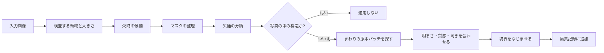

# GrainMend

[ドキュメントホーム](../README.md)

GrainMendはフィルムのホコリ、ピンホール、キズと乳剤の傷みを復元します。
結果は元のファイルに直接書き込まず、順序のある編集記録として残します。

| ツール | どこを見るか | 復元のしかた |
|---|---|---|
| 自動 | 写真全体 | 確度の高い欠陥だけを保守的に復元 |
| ガイド | ユーザーが選んだ領域 | 小さな点や薄い欠陥まで細かく検査 |
| ブラシ | 自分で塗った場所 | まわりの構造と質感をつなぐ |
| クローンスタンプ | 自分で選んだ複製元 | 実際の元ピクセルを一定のオフセットで複製 |
| IR | スキャナーの赤外チャンネル | IRで位置を見つけ、RGBでピクセルを復元 |

現像画面には自動、ガイド、ブラシ、クローンスタンプが出ます。
IRはプラグインが機能を報告したときにスキャンの段階で有効にできます。
スキャンが終わると、結果は同じGrainMendレイヤーの一覧に入ります。

> [!CAUTION]
> GrainMend RGBはハードウェアのIRクリーニングとは方式が違います。GrainMend IRも、Digital ICE、
> iSRD、SRDxの実装や互換モードではありません。

## どこが難しいか

フィルムの欠陥と写真の中の構造は、同じピクセルにあります。

- ホコリは小さく不規則な、明るいか暗いしみとして見えます。
- ピンホールは孤立した強い点に見えることがあります。
- キズは細長いですが、電線、窓枠、文字も似ています。
- 乳剤の傷みは色と質感をいっしょに変えます。
- 高解像度のフィルムグレインは、小さな欠陥と同じくらいの大きさです。

高周波をまとめて消すと、ホコリといっしょにグレインと輪郭も消えます。
GrainMendは検出、分類、復元、保存を分けて処理します。

## 処理の順序



検出マスクと復元結果は別に持ちます。
だからマスクを確認したり、一部の欠陥だけ適用したり、復元を作り直したりできます。

## ツール

### 自動

写真全体から、確度の高い欠陥だけを探します。
大きな構造を誤って消すより、小さな欠陥を見逃すほうを選びます。
基本の現像にこっそり入ることはなく、ユーザーが実行してはじめて結果が追加されます。

### ガイド

ユーザーが四角い領域を選ぶと、その中とまわりだけを解析します。
欠陥の位置を教えてもらった状態なので、自動より小さな点、薄い欠陥、
密集した欠陥まで積極的に見ます。

復元に使うまわりのピクセルが領域の端で切れないように、実際の結果より広く読みます。
いまの最大の周辺半径は264ピクセルです。

### ブラシ

復元する場所をユーザーが自分で塗ります。塗った色でおおう方式ではありません。
マスクのまわりから合う原本パッチを探し、構造と質感をつなぎます。
合うパッチがないときは、検出ベースの経路を限定的に使うことがあります。

### クローンスタンプ

`⌥`クリックで複製元を選び、対象に描きます。
自動検出は使わず、2つの地点のあいだのオフセットを保って実際のピクセルを複製します。

編集記録には直径、硬さ、座標、オフセットが入ります。
回転、反転、切り抜きのあとも、同じ原本座標に適用できます。
オフセットは整数ピクセルに合わせ、画像の外には適用しません。

### IR

プラグインが実際のIRチャンネルを渡し、
RGBと大きさ・範囲が合っていることを確認できたときだけ使います。
IRは欠陥の位置を見つけるための資料です。最終的なピクセルはRGBと同じ復元器で作ります。

## RGBで欠陥を見つける方法

### まわりとの差

写真ごとに明るさが違うので、全体で1つのしきい値は使いません。
まわりの明るさとの差、局所の分散、向きを見て、明るいホコリと暗い欠陥の候補を作ります。

### マスクの整理

孤立したノイズを除き、途切れた欠陥をつないでから、8方向で接するピクセルを1つのかたまりにします。
大きな領域をタイルに分けても、境界にまたがるかたまりは全体の座標で合わせ直します。

### 解像度の違い

同じホコリでも、1200dpiと7200dpiではピクセルの大きさが違います。
信頼できる解像度の情報があれば、実際の大きさに合わせて限界を調整します。
情報がないときはスキャナーのモデルを推測せず、保守的なピクセル基準を使います。

### 分類

それぞれのかたまりで、次の値を見ます。

- 面積とバウンディングボックス
- 長い軸と短い軸の比
- 水平、垂直、斜めの向き
- 直線性、密集度、まわりとのコントラスト
- まわりの輪郭とつながるかどうか
- 他のかたまりとの関係

結果はホコリ、ピンホール、向きごとのキズ、乳剤の傷み、微細な異物に分かれ、信頼度を持ちます。

### 写真の中の線を消さない

電線、手すり、建物の角、窓枠、文字をキズと見てはいけません。
平行線、格子、輪郭の連続性、場面の構造につながる線は別に検査します。
自動は誤検出をより強く止め、ガイドはユーザーが位置を選んだ事実もいっしょに見ます。

## 復元

1. 欠陥のまわりから、マスクと重ならず構造の合う原本パッチを探します。
2. 原本パッチと対象の、低い周波数の明るさ・色の差を合わせます。
3. 原本パッチの高周波の質感を残し、フィルムグレインを移します。
4. 長いキズは、両側からつながる向きを先に見ます。
5. マスクの縁では、原本と復元パッチをなめらかに混ぜます。

強さは、できあがった復元パッチと原本のあいだの混合比です。

自動の復元では、もとの内容が分からない場合もあります。
使えるまわりの質感がないときや、欠陥が重要な構造全体をおおっていたときは、ブラシ、
クローンスタンプ、別の精密な補正が必要です。

## IRの処理

### 入力の条件

- プラグインがIR機能をはっきり報告している。
- RGBとIRが同じスキャンセッションに属している。
- 2つの画像のピクセルサイズと想定する範囲が同じ。
- ファイルが読めて、原本IDの検査を通る。

モデル名でIR機能が知られていても、プラグインが報告しなければ画面でもリクエストでも使いません。

### 位置合わせ

光学系とセンサーの読み出しの違いで、RGBとIRが数ピクセルずれることがあります。
まず広く探し、次に狭く探してオフセットを決めます。
最高点の信頼度と、探索の境界に達したかどうかを記録します。

信頼度が低いときや、最適点が探索の端に張りついたときは、成功と見なしません。

### 場面の模様を引く

フィルムの染料と濃度は、IRにも一部が見えることがあります。
赤チャンネルの対数の明るさを64個の区間に分け、
それぞれの区間でIR値の上下10%を除いた平均を求めます。
空の区間は隣の値で補間し、短い対称のカーネルで平滑にします。
このノンパラメトリックな曲線を引いて場面の模様を減らし、
まばらな暗いホコリは区間の統計に入らないようにします。

残った値は、まわりの平均に対する相対コントラストに変えます。
大きな欠陥が自分のまわりのノイズ基準を押し上げないように、
ノイズの入力を最小検出コントラストで切ってから適応しきい値を計算します。
ホルダーとフィルムの縁でつながった暗い部分は、マスクから除きます。

### 安全条件

- マスクが異常に広いときは適用しません。
- 位置合わせを確認できないときは適用しません。
- 銀塩の白黒には自動で適用しません。
- カラーポジと特殊な乳剤は、実測なしに安全とは見なしません。

商用のIRツールも、一般的な白黒とKodachromeには別の制限を置いています。

- [SilverFast: iSRD dust and scratch removal](https://www.silverfast.com/about-silverfast-why-scanning-basics-of-scanning/why-silverfast/silverfast-feature-highlights/isrd-dust-scratches-removal-eliminate-defects-with-infrared-channel/)

GrainMend IRは、この商用ツールの複製でも互換モードでもありません。

## 編集記録と保存

自動、ガイド、ブラシ、クローンスタンプ、IRは、順序のある編集リストをいっしょに使います。

それぞれの項目に入る値:

- IDと種類
- 適用の順序
- 有効かどうかと強さ
- 領域、マスク、複製元のオフセット
- 欠陥の分類と診断値
- 原本フレームと編集バージョン
- 復元パッチ、または作り直すのに必要な値

前の復元が後ろの入力を変えるので、リストの順序も編集記録の一部です。

原本は変更しません。 GrainMendの記録は、アプリが管理するサイドカーに保存します。
原本のSHA-256、編集バージョン、記録の指紋で入力を結びます。
サイドカーがないか壊れているときは、キャッシュを原本のようには使いません。

GrainMendのキャッシュは、速い表示と再レンダリングのための派生ファイルです。
なかったり検査に失敗したりしたら、原本と編集記録から作り直します。
書き出しに必要な結果を作れないときは、原本で代用せずに失敗させます。

## 性能

- 小さな修正は、欠陥とそのまわりの文脈だけを計算し直します。
- 大きな領域は重なるタイルに分け、境界用の余白を置きます。
- 結果は、重ならないタイルの中心部からだけ集めます。
- 同時に処理するタイルは最大4つです。
- `CleanedRawCanvas`は、変えた四角だけをコピーします。
- 取り消し用のコピーは、実際に変わるまで保存領域を共有します。
- メモリが足りないときは、作り直せる画像と復元パッチのキャッシュを解放します。

実際の時間は、解像度、欠陥の数、領域の大きさ、Macによって変わります。

2026-07-25、Mac14,3、arm64、メモリ24 GiB、macOS 26.5のReleaseビルドで測った値です。

| 経路 | 入力 | 結果 |
|---|---|---:|
| ガイド検出 | 1600×1600、ホコリ25個 | 0.35秒、25個検出 |
| 部分ROI検出 | 1600×1600 | 0.38秒 |
| ガイド密集ストレス | 1280×960、8枚×3回 | 中央値0.423秒、p95 0.488秒、最大0.526秒 |
| IR検出 | 6000×4000、24MP | 1.042秒、最大メモリ増加249.2 MiB |

密集ストレス24回で、欠陥地点のマスク範囲の最低値は99.80%、平均残差の最大値は2.70/255でした。
これは合成入力での後退測定であり、
別のMacや実際のフィルムでの処理時間を保証するものではありません。

## ベンチマーク

`defect-bench`は、次のファイルと値を作れます。

- before、after、diff、mask
- 100%クロップ
- 検出数と信頼度
- 処理時間
- 基準画像があるときのPSNRと絶対誤差

```bash
swift run -c release negaflow defect-bench <input-dir> \
  --reference-dir <reference-dir> \
  --out <report-dir>
```

RGBの後退測定には、FILM-R v2の破損版と専門家による復元版44ペアを使います。

- DOI: <https://doi.org/10.6084/m9.figshare.21803304.v2>
- ライセンス: CC BY 4.0
- ペア: 44
- 全体のサイズ: 437,570,872バイト

2026-07-25に出した自動の経路は、感度0.7と過検出の安全線を適用しました。
直前の3.0基準と比べると、 FILM-Rの44枚のうち良くなった写真は11枚から34枚に増え、
悪くなった写真は33枚から6枚に減りました。
平均PSNRの変化は-1.688 dBから+0.466 dBへ、最悪の事例は-18.952 dBから-1.338 dBへ変わりました。
重みづけした悪化ピクセルは0.792%から0.017%に減りました。

自動は高密度の候補に出会うと適用を止め、ガイドの利用を案内します。
この安全線は、ユーザーが範囲を決めるガイド、自分で塗るブラシ、クローンスタンプ、
IRには適用しません。結果が良くなっても、6枚は専門家の復元版よりPSNRが低いままです。
すべての写真の改善、RGBとIRの同等さ、実際のスキャナーのIR 品質を証明するものではありません。

すべての表とコマンドは[GrainMend実スキャン比較](../validation/GRAINMEND_CORPUS.md)にあります。

フィルムごとのIRの制限と位置合わせの失敗条件は、
[GrainMend IRが避けるフィルム](../reference/INFRARED_LIMITS.md)にまとめました。

## テストの範囲

- 8方向の連結とマスク
- モルフォロジー演算
- ホコリ、キズ、微細な異物の検出
- 線と格子の誤検出の拒否
- 大きな領域のタイル境界
- 向きごとのキズの復元
- まわりの質感と明るさの一致
- ブラシのマスク
- クローンスタンプのオフセット、硬さ、パッチ合成
- IRの位置合わせ、基準点、かたまり、メモリ制限
- 原本段階での適用と、アプリの編集記録のレンダリング
- 続けて追加することと取り消し
- 画面を移動しているあいだのフレームの所有権

一部の性能テストは、環境変数を有効にしないと実行されません。
テストファイルがあるというだけで、すべての環境で実行したとは言いません。

## 名前と商標

`GrainMend`はnegaflow独自の機能名です。

- `Digital ICE`は、Eastman Kodak Companyまたは関連する権利者の商標である可能性があります。
- `iSRD`、`SRDx`、`SilverFast`はLaserSoft Imagingの商標です。
- これらの名前は、技術の比較と製品の識別にだけ使います。
- GrainMendは、第三者の技術との提携、互換、同等性を主張しません。

## コードの場所

- `Sources/Chromabase/DefectRemoval/`
- `Sources/negaflowApp/Features/Defects/`
- `Sources/negaflowApp/Features/Develop/Inspector/Tools/DefectControlsSection.swift`
- `Sources/negaflowCLI/Commands/CLI+DefectBenchCommand.swift`
- `Tests/ChromabaseTests/Defect*.swift`
- `Tests/negaflowAppTests/Defect*.swift`
- `Config/defect-corpus-film-r-v2.json`
- `scripts/defect-corpus/`
