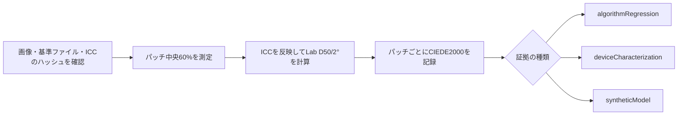

# IT8色検査

[ドキュメントホーム](../README.md)

画面を見て色の正確さを合格にすることはしません。 IT8の画像と、その物理ターゲットに対応する基準ファイルを1組で固定し、パッチごとに数値を記録します 。

> [!IMPORTANT]
> 公開のIT8資料で確認できるのは、検査器と色計算の退行までです。実機のスキャナーやカラーネガの正確さを示すことはできません。装置の判定には、確認済みの物理ターゲットとその装置での実測が必要です。

## 証拠の種類

| 名前 | 確認できること | 確認できないこと |
|---|---|---|
| `algorithmRegression` | ファイルの解釈、ICC変換、パッチ領域、Lab、CIEDE2000の計算 | 実機スキャナーの正確さ |
| `deviceCharacterization` | 確認済みの物理ターゲットと実機での測定 | 別のターゲットや装置の正確さ |
| `syntheticModel` | 独立した合成モデルの数学的な往復 | 実際のフィルムや装置の正確さ |

`deviceCharacterization`には、物理ターゲットの製造元、材質、シリアル、バッチの情報が要ります。 基準ファイルの見出しと1つでも違えば評価しません。

IT8.7/1とISO 12641-1の透過ターゲットは、ポジ透過原稿向けです。 この結果からカラーネガのオレンジマスク、色素の干渉、C-41のばらつき、NORITSU/FUJIの出力の正確さを語ることはできません。 それを言うには、同じカラーネガを両方の経路で処理したペア資料と、別の検証一式が必要です。

## 公開されている回帰検査の資料

FADGI/OpenDICEの次の2ファイルを1組で使います。

- 案内: <https://www.digitizationguidelines.gov/guidelines/digitize-OpenDice.html>
- 画像: <https://www.digitizationguidelines.gov/guidelines/OpenDICE/IT8-7.1.tif>
  - SHA-256: `c62ee73f26390a2ad90e7e28280cbd1efb4f18834425bb7112ff1f8016832ffd`
  - 大きさ: `6255 x 4170`
  - 形式: 16-bit RGB、`Adobe RGB (1998)`を内蔵
- 基準ファイル: <https://www.digitizationguidelines.gov/guidelines/OpenDICE/Profile_IT8-7.1.txt>
  - SHA-256: `19337b85f213eb4397e91c91298201f421ef3ca33b0ef6da3d752a0880491840`
  - パッチ: `A1`から`L22`までのLab 264個
  - 16列: density

再配布の権利を確認できていないため、ファイルはリポジトリにもアプリにも入れません。 ユーザーが自分で受け取ったファイルを[例の目録](../../reference/IT8_FADGI_OPENDICE.example.json) に結び付けます。 この例の等級は`algorithmRegression`です。 名前だけ`deviceCharacterization`に変えると、検査器が拒否します。

```bash
swift run negaflow it8-bench docs/reference/IT8_FADGI_OPENDICE.example.json \
  --image /path/to/IT8-7.1.tif \
  --reference /path/to/Profile_IT8-7.1.txt \
  --out /path/to/it8-report.json
```

## 測定の決まり

- 画像、基準ファイル、選んだICCのSHA-256が目録と違えば中断します。
- レポートv2は、目録そのもののSHA-256も記録します。
- `A01`と`A1`は同じ座標として読み、元のIDはレポートに残します。
- 22列×12行のパッチの中央60%を、元の解像度の浮動小数点で読みます。
- パッチの順序は行`A`〜`L`、列`1`〜`22`です。
- 内蔵ICCを尊重します。
- linear sRGB D65からXYZ、Bradford D50適応、Lab D50/2°の順で計算します。
- パッチごとに領域、ピクセル数、RGBの平均と標準偏差、両端の比率、非有限値の数、基準と測定のLab、L/a/bの差、CIEDE2000を記録します。
- median、p95、maxは観測値であって合格線ではありません。
- 根拠のない平均のしきい値は作らず、`qualityDecision`は`notEvaluated`のままです。
- プロファイルを合わせるのに使ったターゲットを、独立した検証に使い回しません。

### 物理ターゲットの情報

実機での測定では、作業者がターゲットのラベルから次を読み取って書きます。

<details>
<summary>測定情報の例</summary>

```json
{
  "measurement": {
    "samplerVersion": "center-mean-v1",
    "renderingIntent": "relativeColorimetric",
    "physicalTargetIdentity": {
      "manufacturer": "target label manufacturer",
      "material": "target label material",
      "serial": "target label serial",
      "batchMetadataKey": "PROD_DATE",
      "batchValue": "reference header production date"
    }
  }
}
```

</details>

`MANUFACTURER`、`MATERIAL`、`SERIAL`、バッチの見出し(`BATCH`、`BATCH_ID`、`PROD_DATE`のいずれか) が、基準ファイルと文字まで同じである必要があります。 最上位の`targetID`は`serial`と、`batchID`は `batchValue`と一致していなければなりません。

この記録が示すのは、作業者が書いた値と基準ファイルが合っていることだけです。 画像からラベルを読み取るわけでも、作業者の入力を独立に認証するわけでもありません。 情報がないときに、いちばん近い日付や汎用の基準ファイルで代用することはしません。

基準ファイルに照明や観察者の情報があれば、D50/2°の契約と合うかを確認します。 矛盾すれば中断します。 `measurement.renderingIntent`は今のところCore Imageの変換を直接固定できないので、レポートには `manifestDeclarationNotControlledByEvaluator`と残します。

## `PRINT`出力

IT8.7/1は入力装置向けです。 プリンター出力には、`printer + paper + ink/chemistry + driver/process condition`の組み合わせを実際に測って作った RGBのprinter ICCが必要です。

検査と適用の順序:

1. ICCの大きさ、`prtr`の装置種別、`RGB `の資料空間、Lab/XYZのPCS、`acsp`の表示を確認します。
2. ColorSyncで双方向の変換ができるかを確認します。
3. 選んだ時点で、プロファイル名、バイト、SHA-256を固定します。
4. `MAIN`の作業画像とページ配置を終えたあと、最終出力に一度だけ適用します。
5. `rawScanTIFF`と`-main-flat`には適用しません。
6. プロファイルがない、または違うときは、一時出力の前に失敗させます。sRGBで代用しません。

今のCore ImageとColorSyncの経路が、レンダリングインテントとblack-point compensationをすべての macOSでビット単位に固定する、とは主張しません。

## `MAIN`の合成パッチ回帰

カラーネガの既定経路は`shoulder-print-response-v4`を使います。

```math
\log_{10}(P) =
y_{\mathrm{ceil}} -
\mathrm{amplitude}\,
\exp\left(-(\mathrm{rate}\,d)^{\mathrm{shape}}\right)
```

`d`はDminを引いたあとに正規化した光学濃度です。 係数は保存したプリセットではなく、次の4つの基準点から計算します。

| 基準点 | 値 |
|---|---:|
| ベース黒点 | `0.001` |
| 中間グレー | `0.18` |
| 測定した最高濃度部の白 | `0.70` |
| 反射光の余裕 | `0.90` |

この曲線では`0D`がlinear `0.001`、`0.6D`が`0.18`、`3D`が`0.882836683855`です。 出力が開いた区間に入るので、通常の範囲の黒と白が8-bitの`0/255`にそのまま張り付きません。

場面のヒストグラムから露出を自動調整する式ではなく、特定のフィルムや機材の正確さを表すものでもありません。 式は[固定プリント応答](PRINT_RESPONSE.md)にあります。

`MainSyntheticIT8RoundTripTests`は、264個の基準パッチを逆関数でネガにしてから、`MAIN`の経路全体で戻します。 Lab D50/2°と`DeltaE00`をパッチごとに検査します。これは`syntheticModel`の回帰です。

## NORITSU/FUJIの相対スタイル回帰

`A1`から`L22`までLab D50のパッチが264個ある基準ファイルを、SHA-256で固定します。 各パッチを合成ネガに変えたあと、`MAIN`、`NORITSU`、`FUJI`の経路をそれぞれ2回実行します。

```bash
swift run negaflow scanner-relative-it8-bench \
  /path/to/Profile_IT8-7.1.txt \
  --sha256 sha256:19337b85f213eb4397e91c91298201f421ef3ca33b0ef6da3d752a0880491840 \
  --out /path/to/scanner-relative-it8-report.json
```

レポートには、パッチごとのRGBとLab、基準に対する`DeltaE00`、ターゲット同士の相対`DeltaE00`、クリップと非有限値の表示を入れます。 中立階調の単調性は`A16...L16`の濃度列で見ます。

linear sRGBに変えたときに0...1の外へ出る色は、合成ネガとして正確に作れないので、表示できる範囲に制限します。 したがって広い範囲の統計は観測値であって、合格の基準ではありません。

証拠等級は常に`syntheticModel`、判定は常に`notEvaluated`です。 プロファイルの目録や各ファイルの SHA-256が1つでも違えば中断します。 実機の正確さには、同じ物理ネガを両方の機材でスキャンした資料と、別の検証資料が要ります。

基準ファイルの見出しでD50/2°を確認したわけではありません。 LabをD50/2°として読むのはベンチ自身の契約なので、`colorimetryInterpretationProvenance`は `benchmarkContractNotVerifiedFromReferenceHeader`です。

`shoulder-print-response-v4`より前の結果を、今のアルゴリズムの結果として使い回すことはしません。

## 測定の流れ


