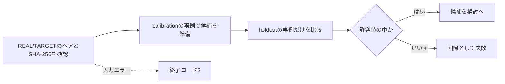

# スキャナープロファイル品質判定

[ドキュメントホーム](../README.md)

`scripts/evaluate_profile_quality.py`は、
スキャナープロファイルの変更が承認済みの基準より悪くなっていないかを検査します。
`LUT_target/analyze_lut_target.py`が作った`SOURCE/summary.json`を 2つ比べ、
プロファイルの調整に使っていない検証事例だけを判定に使います。

この道具が「良い色」を決めてくれるわけではありません。
どの数値を下げるか、上げるか、どこまでの変化を許すかは、人が資料の目録に書きます。
既定の合格値は用意しません。

いまのリポジトリにはREAL/TARGETの画像ペアがありません。
ですから実際の資料目録も、承認基準も、実機での合格結果もありません。
合成テストが確認するのは検査器のコードだけです。

> [!WARNING]
> いまのリポジトリだけでスキャナーの色の正確さを承認することはできません。実際の出荷判定には、
> 固定したREAL/TARGETのペア、調整に使っていない検証事例、人が決めた許容値が要ります。

## いまのプロファイルをアプリが使う範囲

ユーザーが`NORITSU`や`FUJI`のターゲットを自分で選んだときだけ、
同梱の`realOnly`グループから限られた相対差を使えます。

必要な条件:

- フィルムの種類と名前が同じ。
- 整理した元のロール名のまとまりが同じ。
- 画像数の差が15%以下。

元のプロファイルにはフレームごとのIDやSHA-256がありません。
ロール名が同じでも、まったく同じフレームを組み合わせた証拠にはなりません。
ですから実機と同じ結果だとは言えません。

適用の決まり:

- 2つのグループで向きが逆になる値は適用しません。
- 白黒は色成分をすべて外し、相対的なトーンだけ残します。
- 対応するロールがないスライドのプロファイルには、NORITSU/FUJIの相対補正を当てません。
- 同じ位置のペア資料がなければ、スキャナーの質感やシャープニングは当てません。
- トーンはRec.709ガンマの明るさに一度だけ当て、Labの`a*`と`b*`は保ちます。
- 色のgainは対数領域で補間し、向きが逆の基準点どうしの関係を守ります。
- ファイルや目録のSHA-256が1つでも違えば、プロファイル一式を拒否します。

## 製造元の資料で確認できる範囲

- [Fujifilm Frontier 570/SP-3000の案内](https://www.photolabdigital.com/fuji_frontier570_en%5B1%5D.pdf)は、
area CCDやHyper-tone、Hyper-sharpnessといった機能名を出しますが、伝達関数や設定値は出しません。
- [Noritsu HS-1800の製品情報](https://www.noritsu.eu/hardware/noritsu-film-scanner.html)は、
対応形式、解像度、処理量を出しますが、固定の色伝達関数は出しません。
- [Noritsuの特許US 7,589,863](https://patents.google.com/patent/US7589863/en)は、ミニラボで
作業者が濃度、階調、シャープニングを選ぶ流れを説明します。

これらは、場面と作業者によって処理が変わることを示します。
HS-1800やSP-3000を再現する固定の定数をくれるわけではありません。
negaflowは製品名からそうした値を推測しません。

## 資料目録のスキーマv1

目録は、固定する入力資料のそばに置きます。例: `LUT_target/quality/corpus-v1.json`。
パスは目録ファイルの位置が基準です。 `--data-root`を与えると、そのパスが基準になります。

<details>
<summary>資料目録の例</summary>

```json
{
  "schemaVersion": 1,
  "corpusVersion": "scanner-corpus-2026-07-10.1",
  "acceptedBaselineSHA256": "sha256:<64 lowercase hex>",
  "cases": [
    {
      "role": "calibration",
      "stem": "NORITSU/color nega/Portra 400/calibration-01",
      "real": {
        "path": "REAL/NORITSU/color nega/Portra 400/calibration-01.tif",
        "sha256": "sha256:<64 lowercase hex>"
      },
      "target": {
        "path": "TARGET/NORITSU/color nega/Portra 400/calibration-01.tif",
        "sha256": "sha256:<64 lowercase hex>"
      }
    },
    {
      "role": "holdout",
      "stem": "NORITSU/color nega/Portra 400/holdout-01",
      "real": {
        "path": "REAL/NORITSU/color nega/Portra 400/holdout-01.tif",
        "sha256": "sha256:<64 lowercase hex>"
      },
      "target": {
        "path": "TARGET/NORITSU/color nega/Portra 400/holdout-01.tif",
        "sha256": "sha256:<64 lowercase hex>"
      }
    }
  ],
  "metrics": [
    {
      "name": "mean_delta_e2000",
      "direction": "lowerIsBetter",
      "allowedRegression": 0.0
    },
    {
      "name": "similarity_score_0_100",
      "direction": "higherIsBetter",
      "allowedRegression": 0.0
    },
    {
      "name": "neutral_a_shift",
      "direction": "absoluteLowerIsBetter",
      "allowedRegression": 0.0
    }
  ]
}
```

</details>

例の`0.0`は推奨値ではありません。
実際の測り方と出荷方針に合わせて、項目と許容値を決めてください。

## 目録の決まり

- `schemaVersion`はちょうど`1`であること。
- 知らないバージョンと知らないフィールドは拒否します。
- `corpusVersion`は、固定した資料の選び方と分け方を指します。
- `acceptedBaselineSHA256`は、承認済み`summary.json`の正確なバイトを固定します。
- 各事例は`calibration`か`holdout`のどちらかです。
- 名前は重ねられません。
- 資料が空ではいけません。2つの役割に少なくとも1つずつ必要です。
- REALとTARGETのファイルは、どちらも`sha256:<64 lowercase hex>`で固定します。
- 数値の名前は重ねられません。
- `allowedRegression`は0以上の有限な数です。真偽値は受け取りません。
- 向きは`lowerIsBetter`、`higherIsBetter`、`absoluteLowerIsBetter`だけ受け取ります。

`absoluteLowerIsBetter`は0からの絶対値を比べます。 0が検討済みの基準のときにだけ使います。

## 候補と承認基準の準備

```bash
python3 LUT_target/analyze_lut_target.py
```

出荷を承認する前に、候補の`SOURCE/summary.json`全体を、次の承認基準ファイルとして残します。
候補が検討を通るまで、既存の承認ファイルは上書きしません。
承認ファイルの正確なSHA-256を `acceptedBaselineSHA256`に入れます。

候補と基準の要約には、目録に書いた事例がちょうど1回ずつ入っている必要があります。
抜け、重複、処理の失敗、目録の外の事例があれば入力エラーです。

`calibration`の事例はプロファイルを合わせるのに使えます。判定には使いません。
`holdout`の事例は調整と選択から外します。
検証の数値は事例ごとに比べるので、平均の改善で1枚の悪化を隠せません。



## 実行

<details open>
<summary>品質検査のコマンド</summary>

```bash
python3 scripts/evaluate_profile_quality.py \
  --manifest LUT_target/quality/corpus-v1.json \
  --candidate-summary LUT_target/SOURCE/summary.json \
  --baseline-summary LUT_target/quality/accepted-summary-v1.json \
  --data-root LUT_target \
  --verify-files all \
  --report build/profile-quality-report.json
```

</details>

ファイル確認のモード:

| 値 | 動き | 出荷の根拠に使えるか |
|---|---|---|
| `all` | すべてのREAL/TARGETファイルのパスとSHA-256を確認 | はい |
| `holdout` | 検証ファイルだけ確認 | 素早い診断用 |
| `none` | 画像ファイルを確認しない | いいえ |

既定は`all`です。レポートには、使ったモード、目録と要約ファイルのハッシュ、ファイル確認の結果、
検証事例ごとの比較と数を記録します。 stdoutと`--report`のファイルに同じJSONを書きます。
ファイルは原子的に保存します。

終了コード:

- `0`: 入力が正しく、許容値を超える悪化がない
- `1`: 入力は正しいが、検証の値が1つ以上許容範囲を超えた
- `2`: スキーマ、資料、ハッシュ、パス、数値が誤っている、または足りない

## 検査器のテスト

```bash
python3 -m unittest scripts/tests/test_evaluate_profile_quality.py
```

テストは一時的な合成ファイルで、正常な比較、悪化、ハッシュの変更、誤ったスキーマと数値、
重複・欠落・失敗の事例、空の資料を確認します。実機の出力の品質を示すものではありません。
