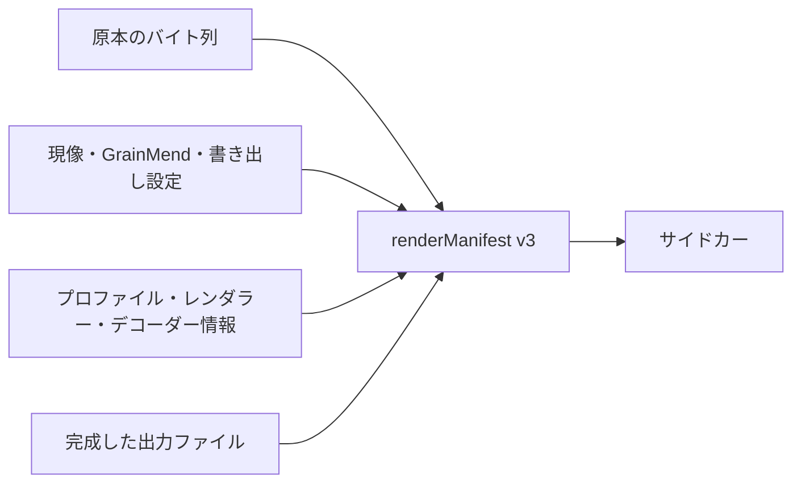

# レンダー記録

[ドキュメントホーム](../README.md)

サイドカーの`renderManifest`は、原本、編集値、最終ファイルをSHA-256でつなぎます。 ファイルパスは記録しません。

> [!IMPORTANT]
> `renderManifest`はファイルと設定のハッシュ関係を残す記録です。デジタル署名も証明書もないので、 C2PA Content Credentialsとは呼びません。

v3に入る値:

- 原本のバイト数、SHA-256、アルゴリズム名`sha-256`
- 実際に使ったレンダー入力の種類
- GrainMendキャッシュファイルまたはメモリ入力の確認範囲
- 現像、GrainMend、書き出し設定のSHA-256
- スキャナープロファイルのSHA-256
- デコーダーの出どころとクロマエンジンのレンダラーバージョン
- 最終ファイルのSHA-256、バイト数、ピクセルサイズ、形式

エンコーダーが書き込みを終えたら、ImageIOで開き直してピクセルサイズを確認し、ファイル全体のハッシュを計算します。 サイドカーはそのあとに書きます。v3の検査に落ちた場合、完成した出力一式としては公開しません。

## GrainMendの入力

- `cleanedMemory`: メモリ上のピクセルには標準のハッシュがないため、確認範囲を `sourceAndDevelopRecipe`として記録します。GrainMend編集履歴のSHA-256は必ず入れます。
- `cleanedFile`: GrainMendキャッシュファイル全体と編集履歴の両方をハッシュします。

以前のv1とv2のファイルも読めます。 当時なかった出力ハッシュやGrainMend履歴のハッシュを、あとから推測で埋めることはしません。

## C2PAとの違い

ここにはデジタル署名、証明書、信頼チェーン、埋め込みclaim storeがありません。 だからC2PA Content Credentialsとは呼びません。 C2PAのhard bindingと処理履歴の考え方、PREMISの完全性の考え方は参考にしましたが、入るのは確認できるSHA-256の値だけです。

参考:

- [C2PA Content Credentials 2.2](https://spec.c2pa.org/specifications/specifications/2.2/specs/C2PA_Specification.html)
- [C2PA hard-binding guidance](https://spec.c2pa.org/specifications/specifications/2.4/guidance/Guidance.html)
- [PREMIS preservation metadata](https://www.loc.gov/standards/premis/)
- [Apple Image I/O orientation and image properties](https://developer.apple.com/documentation/imageio/cgimagepropertyorientation)
