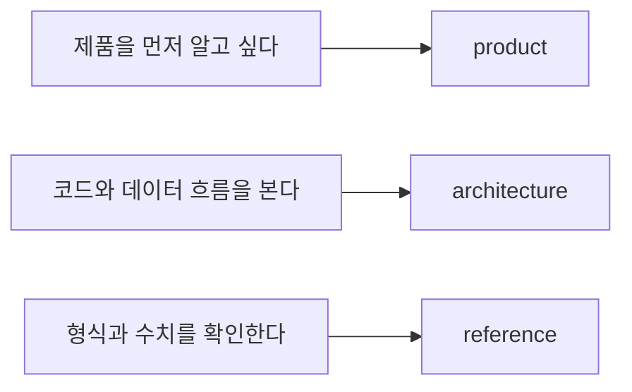

# negaflow 문서

필요한 문서부터 바로 찾을 수 있도록 내용별로 나눴습니다.

[English](../README.md) · 한국어 · [日本語](../ja/README.md) · [简体中文](../zh-Hans/README.md) · [Français](../fr/README.md) · [Deutsch](../de/README.md)

> [!NOTE]
> negaflow 1.1.0 은 macOS 와 Windows 에서 동작합니다. 두 앱은 각 플랫폼에 맞춰 따로 만들었고, 같은 파일을 넣으면 같은 결과가 나옵니다.

## 플랫폼

| 문서 | 언제 보나 |
|---|---|
| [macOS와 Windows의 차이](platform/PLATFORM_DIFFERENCES.md) | 두 쪽에서 같은 것과 다른 것을 알고 싶을 때 |
| [macOS 문서](../../negaflow-mac/docs/README_ko.md) | macOS에서 설치하거나 빌드하거나 CLI를 쓸 때 |
| [Windows 문서](../../negaflow-windows/docs/README_ko.md) | Windows에서 설치하거나 빌드하거나 엔진을 확인할 때 |

## 제품

| 문서 | 먼저 볼 때 |
|---|---|
| [라이브러리에서 인화까지](product/WORKFLOW.md) | 가져오기, 폴더 현상, 복사·붙여넣기와 인화 흐름을 볼 때 |
| [크로마 엔진](product/CHROMA_ENGINE.md) | 필름 반전과 현상 순서가 궁금할 때 |
| [GrainMend](product/GRAINMEND.md) | 먼지·스크래치 복원이 어떻게 작동하는지 볼 때 |
| [필름 프로파일](product/FILM_PROFILES.md) | 번들 프로파일의 출처와 한계를 확인할 때 |

## 구조

| 문서 | 다루는 내용 |
|---|---|
| [제품 구조](architecture/PRODUCT_ARCHITECTURE.md) | 앱, 엔진, 저장소, 출력 사이의 데이터 흐름 |
| [카탈로그 저장 구조](architecture/CATALOG_STORAGE.md) | SQLite 선택 이유, 이전 방식, 측정값 |
| [스캐너 플러그인 구조](architecture/SCANNER_PLUGINS.md) | 외부 프로세스, 승인, 스캔 파일 공개 |
| [라이브러리 보존 아카이브](architecture/LIBRARY_ARCHIVE.md) | 원본과 편집 기록을 묶어 보관하는 방식 |

## 규격

| 문서 | 다루는 내용 |
|---|---|
| [CLI 스캐너 JSON](reference/CLI_JSON.md) | `detect --json`, `capabilities --json` 출력 형식 |
| [렌더 기록](reference/RENDER_MANIFEST.md) | 원본, 편집 값, 출력 파일의 SHA-256 관계 |
| [인화 레이아웃과 C-print 미리보기](reference/C_PRINT.md) | 7개 레이아웃, 완성 페이지 출력, 렌더 최적화, 프루프 전용 ICC와 정확도 한계 |
| [고정 인화 응답](reference/PRINT_RESPONSE.md) | `shoulder-print-response-v4`의 식과 기준점 |
| [스캐너 프로파일 품질 검사](reference/PROFILE_QUALITY_GATE.md) | REAL/TARGET 쌍 자료의 출시 판정 규칙 |
| [스캐너 노이즈 프로파일](reference/SCANNER_NOISE_PROFILES.md) | 반복 스캔 측정과 자동 적용 조건 |
| [GrainMend IR이 피해야 할 필름](reference/INFRARED_LIMITS.md) | 흑백, Kodachrome, RGB/IR 정렬 한계 |
| [평판 프레임 자동 검출](reference/FRAME_DETECTION.md) | 필름과 빈 홀더를 어떻게 가르고 컷 경계를 어떻게 재는지 |
| [IT8 색 검사](reference/IT8_COLOR_VALIDATION.md) | 패치 측정, 증거 등급, 합성 회귀 |

## 출처와 배포

| 문서 | 쓰는 때 |
|---|---|
| [코드와 리소스 출처](legal/PROVENANCE.md) | Apache/GPL 경계와 번들 리소스 해시를 확인할 때 |
| [`TRADEMARKS.md`](../../TRADEMARKS.md) | 필름·스캐너·제품 이름의 식별 목적을 확인할 때 |

## 읽는 법

- 제품 설명에는 지금 사용자가 보는 동작만 적습니다.
- 구조 문서에는 책임과 데이터 이동을 적습니다.
- 규격 문서의 코드값, 필드명, 해시는 원문 그대로 둡니다.
- 검증 문서는 통과한 것과 아직 확인하지 않은 것을 나눠 적습니다.
- 담백한 문장으로 씁니다. 마케팅 형용사, 마무리 요약 문단, 부정 대구를 쓰지 않습니다.
- 한 언어에 있는 절은 여섯 언어에 다 있어야 합니다. 규칙은 [`AGENTS.md`](../../AGENTS.md)에 있습니다.
