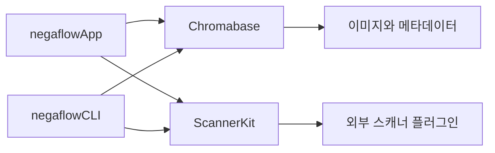
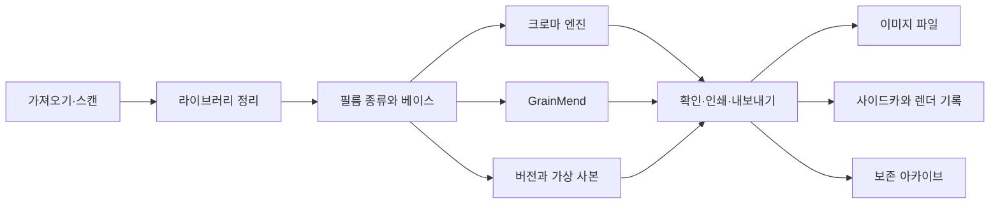

# 제품 구조

[문서 홈](../README.md)

negaflow는 필름 이미지를 가져오거나 스캔한 뒤 반전, 현상, GrainMend, 출력,
보존으로 이어지는 macOS 앱입니다. 모든 편집은 원본과 따로 저장합니다.

> [!IMPORTANT]
> 원본, 편집 기록, 캐시, 출력 파일은 서로 다른 자료입니다. 캐시가 없어져도 원본과 편집 기록은
> 남아야 하며, 필요한 결과를 다시 만들 수 없으면 내보내기를 실패시킵니다.

## 바꾸지 않는 안전 규칙

1. 원본 이미지와 제3자 사이드카를 자동으로 덮어쓰지 않습니다.
2. 라이브러리에서 제거하는 일과 원본을 휴지통으로 보내는 일을 나눕니다.
3. 스캐너 화면은 플러그인이 보고한 기능만 보여 줍니다.
4. 데모를 직접 고르지 않으면 가짜 스캐너로 대신하지 않습니다.
5. 편집 결과를 다시 만들 수 없으면 원본을 대신 내보내지 않습니다.
6. 오래 걸린 작업은 결과를 적용하기 직전에 프레임, 편집 버전, 세션을 다시 확인합니다.
7. 캐시는 원본과 편집 기록에서 다시 만들 수 있어야 합니다.
8. 덜 검증된 프로파일, 출력 묶음, 아카이브를 성공한 결과로 공개하지 않습니다.

## 모듈



### `Chromabase`

크로마 엔진과 이미지 처리 코어입니다.

- 이미지 읽기와 방향 처리
- 필름 베이스 측정
- 네거티브·포지티브 현상
- 톤, 색, 부분 보정
- 필름, 룩, 스캐너 프로파일
- GrainMend RGB와 IR
- 히스토그램과 색 측정
- 출력 인코딩과 메타데이터

자세한 내용:

- [크로마 엔진](../product/CHROMA_ENGINE.md)
- [GrainMend](../product/GRAINMEND.md)

### `ScannerKit`

실제 스캐너 드라이버가 아니라 외부 플러그인을 연결하는 규격을 맡습니다.

- 스캐너 ID와 기능
- 요청과 응답 JSON
- 외부 프로세스 실행, 시간 제한, 취소
- 플러그인 소유자, 권한, 승인, 해시
- 임시 출력 검사와 최종 파일 공개
- 스캔 세션과 작업 기록
- 직접 켜야 하는 데모 스캐너

SANE 구현은 별도 GPL 프로젝트 [`negaflow-scanner-sane`](https:
//github.com/habinsong/negaflow-scanner-sane)에 있습니다.
본체와 플러그인은 JSON과 CLI로만 통신합니다.

### `negaflowCLI`

GUI와 같은 엔진과 `ScannerKit`을 씁니다.

- 스캐너 찾기, 기능 확인, 스캔
- 여러 이미지 현상
- 스캐너 프로파일 목록
- GrainMend `defect-bench`
- IT8와 스캐너 상대 비교
- 자체 검사와 JSON 자동화

### `negaflowApp`

SwiftUI와 AppKit으로 만든 사용자 앱입니다.

- 라이브러리, 현상, 인쇄, 캔버스
- 스캔, GrainMend, 내보내기
- 버전, 설정, 단축키
- 카탈로그, 캐시, 백업, 보존 아카이브

## 사용자 흐름



각 단계는 원본을 바꾸는 대신 카탈로그와 편집 기록을 추가합니다.

## 입력과 원본

### 파일 가져오기

기본 입력 방법입니다. TIFF, JPEG, PNG와 macOS Image I/O가 읽는 카메라 RAW를 처리합니다.
내장 ICC와 방향 정보를 읽고 원본 ID를 카탈로그에 남깁니다.

### 스캔

설치된 플러그인이 다음 기능을 보고할 수 있습니다.

- 해상도와 비트 심도
- 스캔 영역과 미리보기
- 노출
- IR
- 배치와 홀더 동작

앱은 모델명 표를 보고 기능을 만들지 않습니다.
스캔이 끝나면 플러그인이 실제로 적용한 설정과 출력 파일도 다시 확인합니다.

### 원본 ID

파일 경로만으로 원본을 판단하지 않습니다. 파일 관측값, 바이트 수, 수정 시각, SHA-256,
persistent bookmark처럼 현재 규격에 필요한 값을 남깁니다.

파일이 옮겨졌다면 사용자가 다시 연결하거나 bookmark 복구가 성공했을 때만 경로를 바꿉니다.

## 카탈로그

기본 저장소는 `library.sqlite`입니다.
기존 `library.json`은 확인된 이전 자료를 옮기거나 이동 가능한 백업을 만들 때 씁니다.
두 저장소를 동시에 갱신하지 않습니다.

SQLite에 들어가는 것:

- 프레임과 원본
- 롤, 폴더, 컬렉션, 검색
- 순서와 스캔 작업
- 현상 값과 버전별 편집 기록

SQLite에 넣지 않는 것:

- 원본 픽셀
- 썸네일과 미리보기
- GrainMend 캐시

### JSON 이전

1. 기존 JSON의 스키마와 건강 상태를 확인합니다.
2. 복구 사본을 남깁니다.
3. 임시 SQLite에 한 트랜잭션으로 넣습니다.
4. 이전과 이후의 카탈로그를 비교합니다.
5. SQLite 무결성과 앱 안전 조건을 확인합니다.
6. 모두 맞을 때만 기본 저장소로 바꿉니다.

실패한 JSON을 빈 카탈로그로 취급하지 않습니다.
자세한 수치와 결정은 [카탈로그 저장 구조](CATALOG_STORAGE.md)에 있습니다.

## 라이브러리

정리 기능:

- 폴더, 롤, 수동 컬렉션, 스마트 컬렉션, 저장 검색, 스택
- 별점, 선택·제외, 색 라벨
- 격자, 비교, 설문
- 중복 후보 확인

여러 가상 사본은 한 원본을 함께 쓸 수 있습니다. 원본을 지울 때 참조 관계를 먼저 확인합니다.
라이브러리에서 제거하면 카탈로그 참조만 바뀝니다. 휴지통 이동은 따로 실행합니다.

외장 디스크가 끊겨도 편집은 남습니다.
원본을 오프라인으로 표시하고 파일이나 폴더 단위로 다시 연결합니다.
예상한 ID가 다르면 자동으로 바꾸지 않습니다.

## 현상과 GrainMend

각 프레임에는 다음 값이 있습니다.

- 원본 ID와 필름 종류
- 필름 베이스
- 현상 값
- GrainMend 편집 기록
- 버전 기록
- 내보내기 상태

조절 중에는 낮은 해상도 미리보기를 씁니다.
결과가 끝나면 프레임 ID와 편집 버전이 현재 선택과 같을 때만 화면에 표시합니다.

내보내기는 화면의 미리보기 비트맵을 저장하지 않습니다.
원본과 고정한 편집 값으로 전체 해상도 이미지를 다시 만듭니다.

GrainMend는 자동, 가이드, 브러시, 복제 도장, IR을 순서 있는 목록으로 저장합니다.
캐시는 파생 파일입니다. 원본과 편집 기록으로 다시 만들 수 없으면 내보내기를 실패시킵니다.

자세한 내용은 [GrainMend](../product/GRAINMEND.md)에 있습니다.

## 버전

- **History와 Snapshot:** 현상 상태를 직접 기록하고 비교하거나 되돌립니다.
- **Virtual Copy:** 원본 파일을 복제하지 않고 다른 편집 갈래를 만듭니다.
- **Copy/Paste:** 톤, 색, 디테일, 기하처럼 범위를 골라 붙입니다. 원본 좌표가 필요한 마스크는
안전 조건을 확인합니다.

## 내보내기

시작할 때 다음 값을 한 묶음으로 고정합니다.

- 원본 ID
- 현상과 GrainMend 편집 기록
- 스캐너 프로파일 바이트와 SHA-256
- 출력 설정과 메타데이터 정책
- 파일 이름과 저장 위치

중지했다 이어서 내보낼 때도 같은 묶음을 씁니다.

### 여러 출력 파일

한 번의 내보내기에서 JPEG/TIFF, 사이드카, XMP, `-main-flat` 등이 함께 생길 수 있습니다.

1. 저장 위치와 이름 충돌을 미리 확인합니다.
2. 임시 폴더에 모든 파일을 씁니다.
3. 이미지를 다시 열어 픽셀 크기를 확인합니다.
4. 바이트 수와 SHA-256을 계산합니다.
5. 사이드카와 렌더 기록을 만듭니다.
6. 커밋 기록을 남깁니다.
7. 전체 묶음을 최종 위치로 옮깁니다.
8. 실패하면 되돌리거나 다음 실행에서 정리합니다.

일부 파일만 남긴 채 성공으로 표시하지 않습니다.

### 렌더 기록 v3

경로 대신 다음 값의 SHA-256 관계를 남깁니다.

- 원본 바이트
- 실제 렌더 입력
- 현상과 GrainMend 기록
- 스캐너 프로파일
- 디코더와 렌더러 버전
- 출력 바이트, 픽셀 크기, 형식

디지털 서명과 인증서는 없으므로 C2PA Content Credentials라고 부르지 않습니다.
자세한 내용은 [렌더 기록](../reference/RENDER_MANIFEST.md)에 있습니다.

## 인쇄와 소프트 프루프

지원하는 배치:

- 한 장
- 컨택트 시트
- 여러 크기 묶음
- 사용자 배치

페이지 배치를 끝낸 뒤 최종 출력에 ICC를 한 번 적용합니다.
원본 스캔 TIFF와 `-main-flat`에는 프린터 프로파일을 넣지 않습니다.

유효한 RGB printer ICC가 없으면 다른 프로파일로 대신하지 않습니다.
선택한 프로파일의 바이트와 SHA-256을 출력 기록에 남깁니다.

## 보존 아카이브

`.negaflowarchive`에 넣는 것:

- 이동 가능한 카탈로그 JSON
- 원본 파일
- IR 원본
- 필요한 GrainMend 기록
- 가상 사본과 공유 원본의 관계

다시 만들 수 있는 썸네일, 미리보기, GrainMend 캐시, 내보낸 파일은 넣지 않습니다.
RFC 8493 BagIt 구조와 SHA-256 목록을 쓰며 모든 파일과 관계를 확인한 뒤 최종 위치로 옮깁니다.

- [라이브러리 보존 아카이브](LIBRARY_ARCHIVE.md)
- [RFC 8493](https://www.rfc-editor.org/info/rfc8493/)
- [PREMIS](https://www.loc.gov/standards/premis/)

장기 보존에는 다른 매체, 외부 장소 사본, 정기 해시 확인도 필요합니다.

## 스캐너 플러그인 안전

플러그인을 찾으면 다음을 확인합니다.

- 현재 사용자 소유인지
- 그룹이나 다른 사용자가 쓸 수 있는 파일인지
- 심볼릭 링크인지
- 목록과 실행 파일의 ID와 SHA-256
- 사용자가 승인한 ID와 현재 ID가 같은지

파일이 바뀌면 이전 승인을 다시 쓰지 않습니다.

프로토콜 v2는 요청 ID와 순서 번호를 사용하며 마지막 결과를 정확히 하나 요구합니다.
출력 크기에 상한이 있고 시간 초과와 취소 뒤에는 프로세스와 파이프를 정리합니다.

플러그인이 최종 위치에 직접 파일을 공개하지 않습니다.
앱이 임시 위치를 주고 형식, 크기, ID, 실제 적용 설정을 확인한 뒤 앱 저장소로 옮깁니다.

자세한 규격은 [스캐너 플러그인 구조](SCANNER_PLUGINS.md)에 있습니다.

## 성능 경계

이미지:

- 공유 `CIContext`
- 필요한 때 계산하는 이미지 그래프
- 낮은 해상도 조절과 원본 해상도 출력 분리
- 취소와 오래된 결과 거부
- GrainMend 영역·타일·조각 처리
- 메모리 압박 때 캐시 비우기

카탈로그:

- SQLite 트랜잭션과 엔티티 행 저장
- 복제를 활용한 백업
- 무결성 검사
- 50,000프레임 측정

현재 시작 때 전체 카탈로그를 메모리에 올립니다.
같은 Mac에서 SQLite 읽기는 JSON과 비슷한 약 7.4초였습니다.
필요한 행만 읽는 인덱스 조회는 다음 단계입니다.

저장소의 성능 제한값은 큰 회귀를 잡기 위한 넓은 상한입니다.
모든 지원 Mac에서 쾌적함을 보장하는 값은 아닙니다.

## 확인 범위

```bash
DEVELOPER_DIR=/Applications/Xcode.app/Contents/Developer swift test
bash scripts/run-app.sh build
```

자동 검사로 끝나지 않는 항목:

- 실제 스캐너와 플러그인
- 실제 RGB/IR 정렬과 필름 호환성
- 100% 확대 GrainMend 화질
- 화면 크기와 손쉬운 사용을 포함한 UI
- Developer ID, 공증, Gatekeeper
- 깨끗한 Mac 설치
- 다른 Mac의 성능

## 문서 안내

| 궁금한 내용 | 문서 |
|---|---|
| 현재 구현과 확인 상태 | [지금 어디까지 됐나](../product/PROJECT_STATUS.md) |
| 반전과 현상 | [크로마 엔진](../product/CHROMA_ENGINE.md) |
| 결함 복원 | [GrainMend](../product/GRAINMEND.md) |
| 필름 프로파일 | [필름 프로파일](../product/FILM_PROFILES.md) |
| 스캐너 연결 | [스캐너 플러그인 구조](SCANNER_PLUGINS.md) |
| 프로파일 출시 기준 | [스캐너 프로파일 품질 검사](../reference/PROFILE_QUALITY_GATE.md) |
| 실제 장비와 화면 확인 | [출시 전 실기기 점검표](../validation/REAL_QA_CHECKLIST.md) |
| 보존 아카이브 | [라이브러리 보존 아카이브](LIBRARY_ARCHIVE.md) |
| 출력 파일의 해시 관계 | [렌더 기록](../reference/RENDER_MANIFEST.md) |
